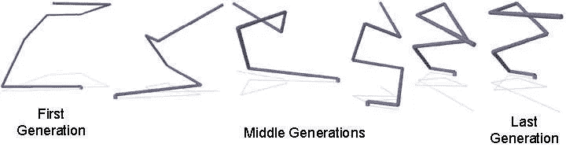
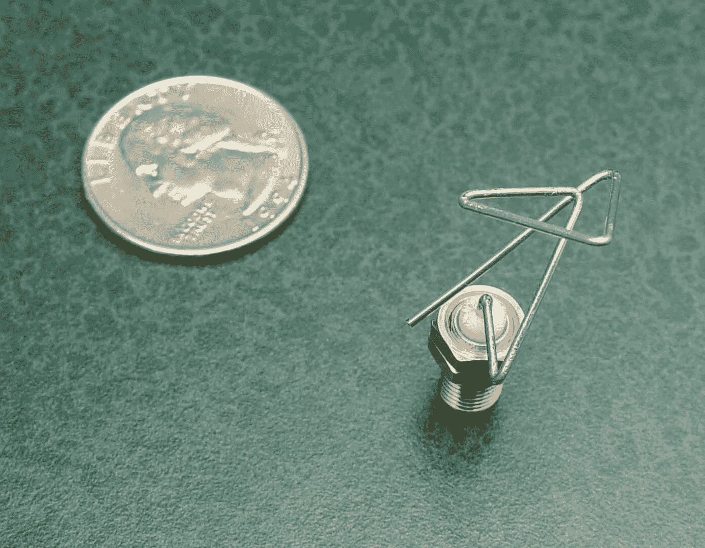

# 进化方法

> 原文：<https://pub.towardsai.net/%D9%8Devolutionary-approach-8cc3768f7f23?source=collection_archive---------5----------------------->

## [优化](https://towardsai.net/p/category/optimization)

## 寻找适者的合理算法

由[维达尔·诺德里-马西森](https://unsplash.com/@vidarnm?utm_source=medium&utm_medium=referral)在 [Unsplash](https://unsplash.com?utm_source=medium&utm_medium=referral) 上拍摄的照片

优化在管理中是一项重要且决定性的活动，当系统分析师能够通过优化方法节省时间和成本时，他们将能够设计出更好的系统。工程和科学中的许多优化问题自然比常规优化方法(如数学规划)更复杂和困难。

有许多应用的优化问题的一个重要类别是混合优化，即寻找具有离散变量的函数的最优点。由于与完全计数方法相关的问题，它总是强调创建更有效和高效的算法。

算法是一组指令，按照特定的顺序执行以解决问题。当我们提出一个解决问题的算法，也就是用一定数量和顺序的指令，问题就解决了。为解决问题而执行的指令越多，程序执行的时间就越长，实际上，算法就越复杂。

一个算法的复杂度就是估计它消耗的内存量和算法解决一个问题所需要的时间，事实上数值越高，算法越复杂。例如，如果一个算法有一个值为 n 的循环，我们说该算法的复杂度是 n 阶。然后，如果一个具有两个独立循环的算法被执行 n 次，则该算法的阶数是 2n，如果这些循环是嵌套的，则该算法的执行阶数将是 n * n。在最坏的情况下，解决一个问题需要几年时间，有时甚至是一辈子！

进化算法是使用遗传工程和自然选择的随机搜索过程。对进化算法历史的回顾表明，所有这些类型的算法的主要思想都是相同的，并且可以追溯到一个假设，即环境压力迫使它们做出自然选择。遗传算法是一种特殊类型的进化算法，它使用遗传和变异等生物技术。

遗传算法通常被实现为计算机模拟器，其中优化问题的候选解的抽象染色体群体导致更好的解。传统上，解决方案是以 0 和 1 的字符串形式出现的，但是今天它们也以其他方式实现。

该假设始于一个完全独特的随机群体，并延续几代。在每一代中，评估整个群体的能力，基于能力从当前代中随机选择几个个体，并对其进行修改以形成新一代，扣除或重组，并在下一次迭代中，将算法转换到当前代。

作为进化算法(EA)在无线电通信领域的应用，进化天线是完全由计算机程序设计的一种特殊形式的天线，基于进化算法来创建最佳辐射图。

[https://www . NASA . gov/centers/Ames/images/content/75303 main _ st5-104-10 . jpg](https://www.nasa.gov/centers/ames/images/content/75303main_st5-104-10.jpg)

许多进化算法受到物理学或生物和动物行为的启发。分配给各种 ea 的名称是基于算法派生的原始模式。比如遗传算法，鲸鱼，灰狼都是受大自然启发的算法。在接下来的故事中，我们将尝试研究每一种进化算法及其在解决实际问题中的应用。

# 参考

[*Siadati，Saman。(2012).算法、语言和逻辑的第一课。10.13140/rg . 2 . 2 . 16954 . 21440 .*](https://www.researchgate.net/publication/342065769_First_lessons_of_Algorithms_Languages_and_Logic)

[*西亚达提，萨曼。(2013).进化计算. 10 . 13140/rg . 2 . 2 . 36143 . 15526 .*](https://www.researchgate.net/publication/342068614_Evolutionary_Computation)

*罗恩、杰森&霍恩比、格雷格&林登、德里克。(2006).Nasa 空间技术 5 任务的 X 波段天线的快速再发展。10.1007/0–387–28111–8_5.*