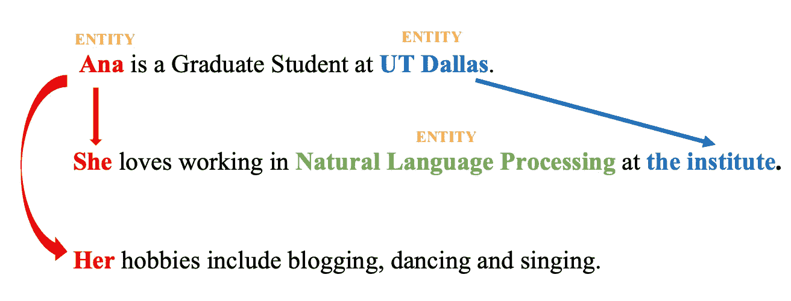
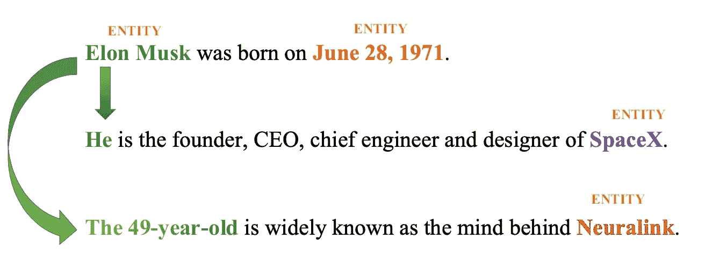
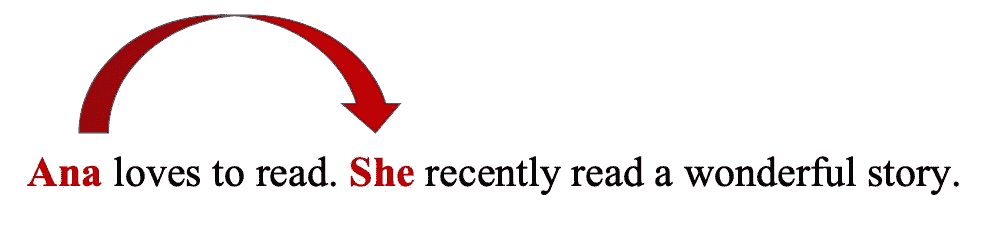
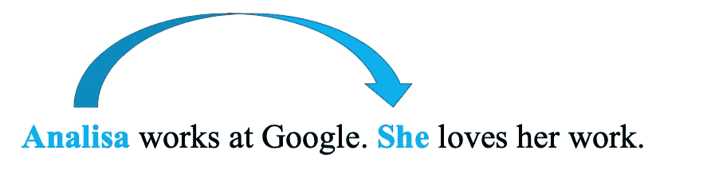
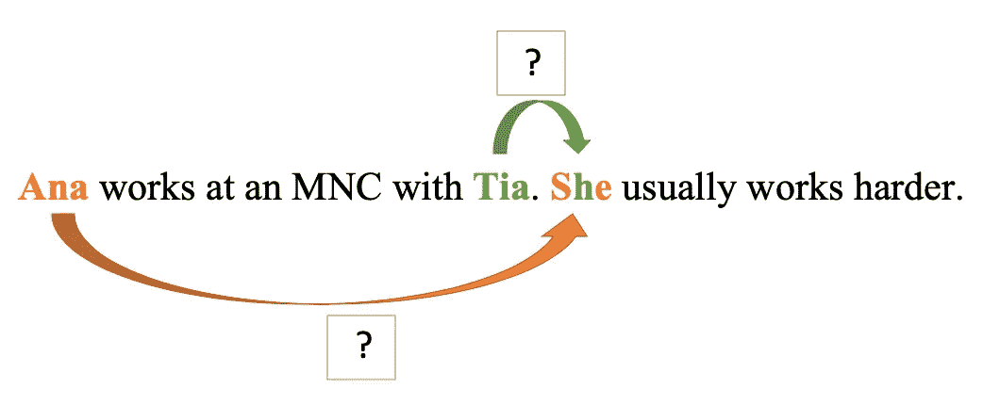
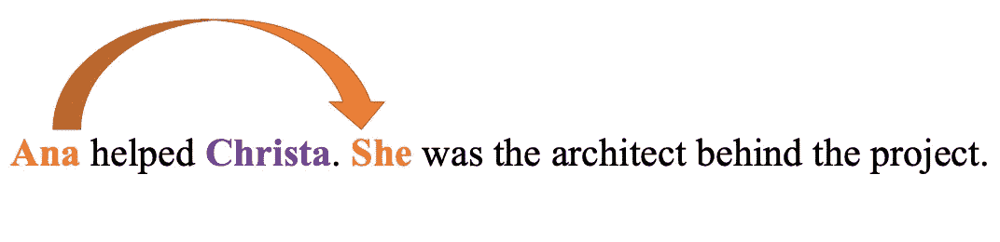
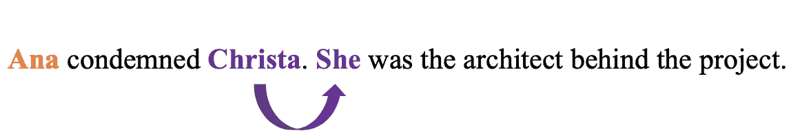
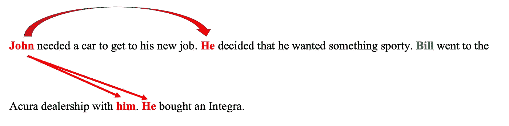
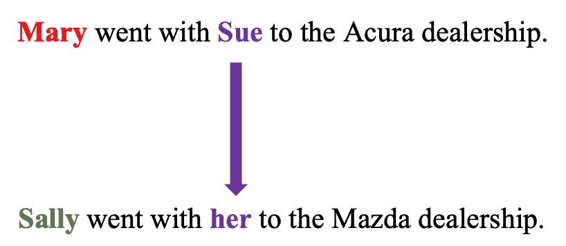

# 解开 NLP 中的共指消解！

> 原文：<https://pub.towardsai.net/%E2%84%82-%E2%84%9D-62efb53acc8a?source=collection_archive---------5----------------------->

## [自然语言处理](https://towardsai.net/p/category/nlp)

共指消解

指代消解是最基本的自然语言处理任务之一。但是，在我们开始理解共指消解之前，有必要理解话语的定义。

***语篇*** 在自然语言处理的语境中是指一个接一个出现的句子序列。很明显，会有一些被谈论的实体，并且在话语中可能会提到这些实体。我们用“提及”一词来指代这些参考文献。

> **话语的例子:**
> 
> 安娜是德州大学达拉斯分校的研究生。她喜欢在研究所从事自然语言处理的工作。她的爱好包括写博客、跳舞和唱歌。

> 在这里，“Ana”、“自然语言处理”和“UT Dallas”是可能的实体。
> 
> “她”和“她的”是对实体“Ana”的引用，“学院”是对实体“UT Dallas”的引用。

***指称，*** 在自然语言处理中，是句子或话语中的一个词可以指称另一个词或实体的语言学过程。解析这种引用的任务称为 ***引用解析。*** 上例中，指代实体*的*她*和*她*“Ana”和指代实体“UT Dallas”的“the institute”是引用解析的两个例子。*

> **我们来总结一下:**
> 
> **语篇**在自然语言处理的语境中是指一个接一个出现的句子序列
> 
> 指称是一个语言过程，其中句子或话语中的一个词指代另一个词或实体
> 
> 解析此类引用的任务称为**引用解析。**

***共指消解*** 特别是就是对代词进行消解的过程，以识别它们所指的是哪些实体。也是一种参考分辨率。解析的实体可以是人、地点、组织或事件。

> ***指称对象*** *是被指称的对象。例如，“Ana”就是上面例子中的所指对象。*
> 
> ***所指表达*** *是话语中给出的提及或语言表达。*
> 
> 两个或两个以上指称同一话语实体的指称表达式称为**指称** [1]。

现在，让我们看另一个例子来更好地理解这一点。

> **例句话语:**
> 
> **埃隆·马斯克**出生于 1971 年 6 月 28 日。**何**是 SpaceX 的创始人、CEO、总工程师、设计师。49 岁的被广泛认为是 Neuralink 背后的大脑。

> ***所指表情:*** 埃隆·马斯克，现年 49 岁
> 
> ***所指:*** *埃隆马斯克*
> 
> ***相关表达:***{埃隆·马斯克，何}，{埃隆·马斯克，49 岁}

现在，我们已经了解了共指消解的基础，理解文本中可能存在哪种引用是非常重要的。了解这种类型的引用有助于我们设计策略来解决它们。

参照物通常有两种: *Exaphor* 和 *Endophor。* *内指*指出现在语篇中的实体。而 Exaphor 指的是语篇中没有出现的实体。

> **内切酶的例子**
> 
> **句子:**“安娜爱读书。她最近读了一个精彩的故事。”

> 这里的“她”指的是“安娜”，它作为一个可能的指称出现在话语中。
> 
> **Exaphor 示例**
> 
> 句子:“捡起来。”(指向一个物体)

> 这里的“that”指的是一个对象，它可能是语篇中没有明确提到的对象的指称

内照应主要有两种:回指和照应。*回指*是指语篇中指称实体或所指对象出现在其指称代词之前的情况。

> **回指的例子**
> 
> **句子:**“Ana 买了一件衣服。她喜欢它。”

> 这里的“她”指的是“安娜”,它在语篇中先于其指代代词“她”出现。

而照应指的是实体或所指对象在语篇中出现的时间晚于其指代代词的情况。

> **弹射器的例子**
> 
> **句子:**“安娜买这件衣服的时候，不知道它被撕破了。”

> 在这里,“她”出现在语篇中它的指称实体或指称对象“Ana”之前。因此，这是 cataphor 的一个例子。

指代表达式的集合也被称为**指代链**或**簇**。既然我们已经了解了文学中普遍存在的指称类型，那么也有必要掌握它的语言学特性。

理解共指关系的这些语言属性有助于我们理解如何最好地执行共指消解，并最小化过程中的错误率[1]。需要记住的重要一点是，根据不同的语言规则，这些属性可能会有所不同。因此，在尝试执行共指解析之前，请确保您精通一种语言的语法规则。为了清楚起见，在这篇文章中，我们将认为英语是我们的主要语言。

> 我们将要讨论的一些语言特性是:
> 
> 数量和性别协议
> 
> 崭新
> 
> 语法角色
> 
> 动词语义学
> 
> 选择限制
> 
> 反复提及
> 
> 平行

现在，让我逐一解释这些属性。 ***数量一致*** 基本上是指所引用的表达式在数量上要一致。而 ***性别一致*** 则暗示所指表达性别一致。让我们来看一个例子。

> **性别和编号协议示例:**
> 
> “Analisa 在谷歌工作。她热爱自己的工作。”

性别协议

> 在这里，“Analisa”和“She”在性别和数量上一致，即只有一个人“Analisa”在谷歌工作，因此我们使用“She”来指代她，而不是使用其他代词，如“he”、“they”等。这是性别和数字的一致。

数字协议

> 在这里，“马”是复数。因此，为了指代实体“马”,所用的指称对象是“他们”。因此，他们在数字上达成一致。这是数字协议。

另一个需要记住的属性是 ***语法角色*** 。这一特性利用了句子固有的语法性质，与宾语实体相比，主语实体具有更多的显著性值。换句话说，我们假设作为主体的实体通常比客体实体更重要。

> **语法角色示例**
> 
> “Ana 在 Tia 的一家跨国公司工作。她平时工作比较努力。”

语法角色

> 在这个句子中，我们将“Ana”和“Tia”作为单词“She”的候选指代物。这里“Ana”是主语，“Tia”是宾语。因此，牢记显著性，我们认为“Ana”是指“She”而不是“Tia”。

下一个要考虑的因素是**动词语义**。在进行语义分析时，一些动词倾向于赋予它们的一个论点比其他论点更多的含义。

> **动词语义的例子**
> 
> “安娜帮助了克里斯塔。她是这个项目背后的建筑师。”

> “安娜谴责了克里斯塔。她是这个项目背后的建筑师。”

> 这里，在第一句话中，动词“helped”的用法暗示 Ana 是项目背后的建筑师的概率高于 Christa。于是，第一句中的“她”指的是“安娜”。
> 
> 然而，在第二句中，动词“谴责”的用法暗示了克里斯塔是项目背后的建筑师的概率高于安娜。因此，第二句中的“她”指的是“克里斯塔”。

接下来要理解的是**选择限制**。这利用了关于句子的语义知识来确定所指对象的偏好。

> **选择限制的例子**
> 
> "在烤箱里烤了三个小时后，我穿着睡衣吃了烤鸡。"

选择限制

> 在这里，“它”的两个可能的指称是“睡衣”和“鸡”。动词“吃”的用法(“吃”是“吃”的过去式)暗示所指实体必须是可食用的，从而选择“鸡”作为“它”的所指。

另一个需要理解的重要特征是**重复提到**。这一特征或性质表明，如果一个实体或一组实体在话语中被重复提及，那么它们成为可能的所指对象的概率呈指数增长。

> **重复提及的例子【2】**
> 
> “约翰需要一辆车去他的新工作。他决定要运动的东西。比尔和他一起去了讴歌经销店。他买了一台 Integra。”

反复提及

> 在这里，反复提到“约翰”而不是“比尔”作为焦点意味着“他”指的是“约翰”而不是“比尔”。

最后但同样重要的是，我们讨论一下**并行性。如果所指对象可以从另一个句子的句法和语义信息方面得出类似的属性，那么这个属性对所指对象更重要。**

> **并行的例子【2】**
> 
> 玛丽和苏去了讴歌经销商处。
> 
> 莎莉和她一起去了马自达经销店。

平行

> 在这里，“她”指的是苏，因为这两个句子暗示着相似的句法和语义结构，我们可以在它们之间找到相似之处。

请注意，与其他形式的指代消解相比，这些因素在进行指代消解时更加有效。特别是，对共指的抽象解决通常更难处理，需要完全不同的策略。

现在，您已经了解了什么是共指解析以及如何在出现歧义的情况下解析引用，让我简单介绍两个众所周知的可用于共指解析的库。第一个是 [StanfordCoreNLP](https://stanfordnlp.github.io/CoreNLP/coref.html) 和[neural oref by hugging face](https://github.com/huggingface/neuralcoref)。您可以使用它们中的任何一个来帮助简化您的共指解决之旅。你也可以在线测试这些共指系统，不需要任何下载，[这里](http://corenlp.run/)和[这里](https://huggingface.co/coref/?text=The%20quick%20brown%20fox%20got%20lazy.%20He%20was%20fat.)。

在机器翻译、文本或自然语言理解任务(如信息提取、问题回答、摘要等)中可以找到共指消解的一些最著名的应用。

我希望这篇文章能帮助您更好地理解共指消解背后的基本概念。

感谢您的阅读！

## **参考文献:**

1.  语音和语言处理，第三版，作者 [Dan Jurafsky](http://web.stanford.edu/people/jurafsky/) 和 [James H. Martin](http://www.cs.colorado.edu/~martin/)
2.  共指消解和语篇连贯