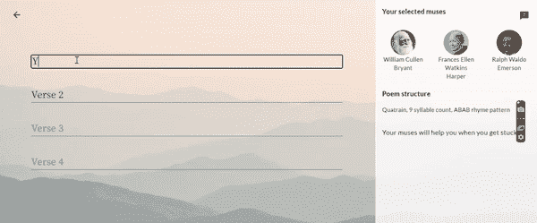
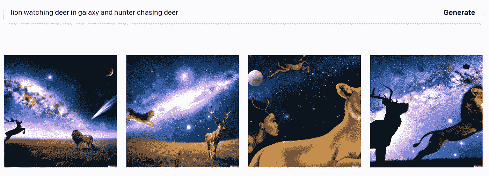
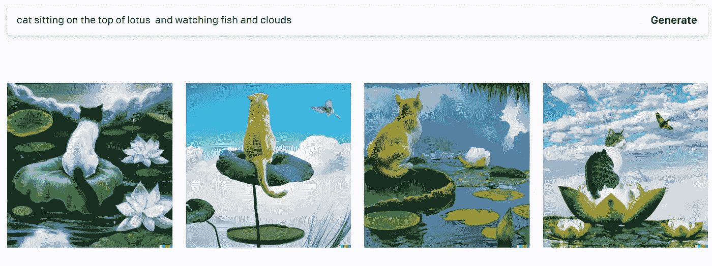
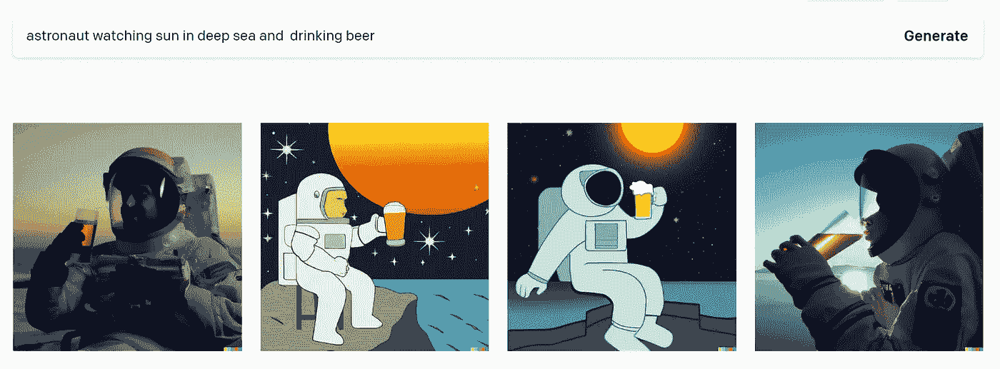
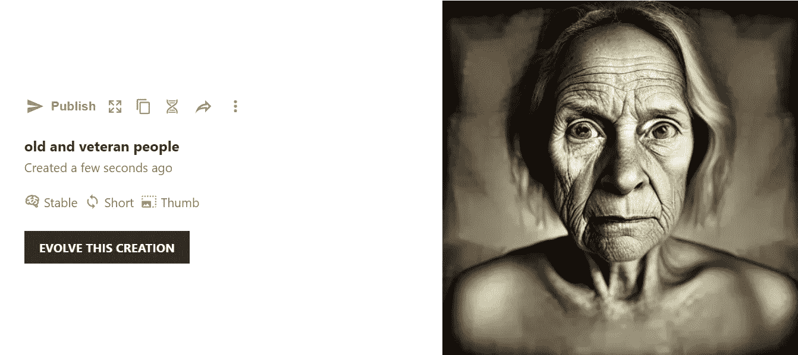
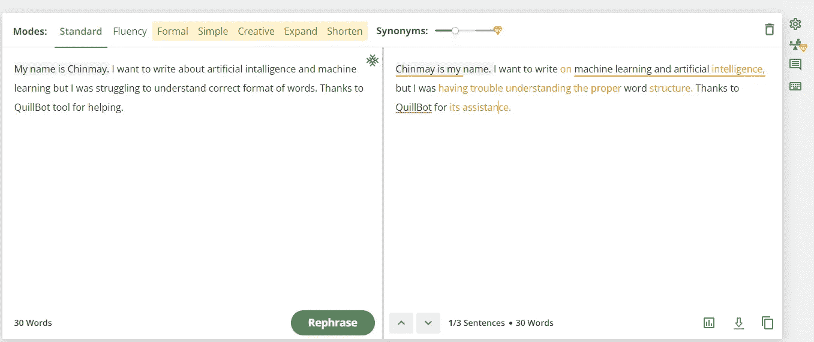
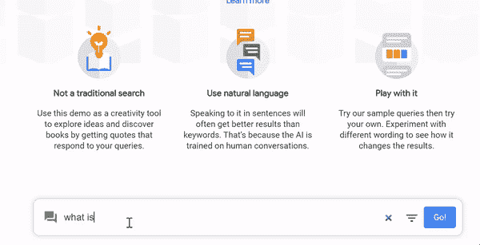
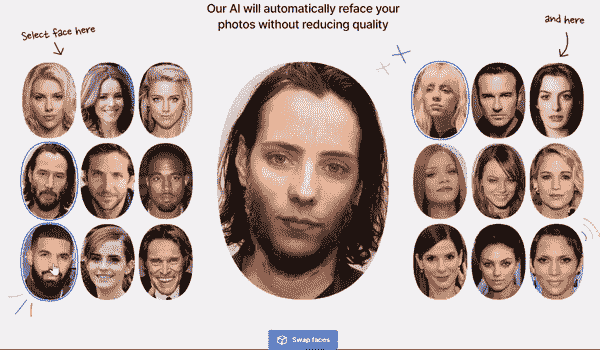
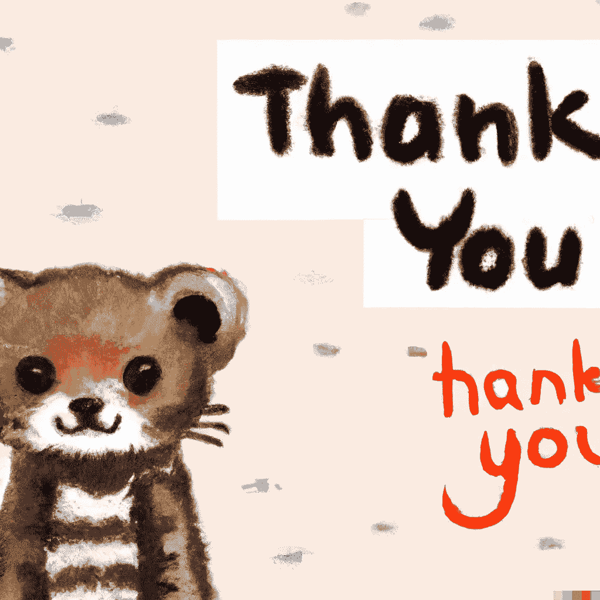

# 10 个让你兴奋不已的人工智能网站！

> 原文：<https://pub.towardsai.net/10-ai-websites-that-will-excite-you-to-the-core-3b08a3b9868b?source=collection_archive---------0----------------------->

## 有趣的基于人工智能的网站及其工作方式

作者在 DALL E 2 上创建的图像

# 1.一首接一首

你在为给女朋友/男朋友或者你爱的人写一首**好听的诗**而纠结吗？放心吧！！**一首接一首**将完全帮助你为自己写诗。

作者一段一段的屏幕录制

在一首接一首的帮助下，你可以用一些美国最著名的诗人的想法创作一首诗，包括**狄金森、惠特曼、坡、惠特利、朗费罗**等人。他们训练人工智能系统在你写自己的诗时充当你的缪斯，以每个诗人的方式提供建议，使这成为可能。下面是链接！在传奇诗人的帮助下享受和发挥你的创造力！

 [## 一首接一首

### 一段接一段地，用户可以与人工智能合作创作诗歌。

网站.研究.谷歌](https://sites.research.google/versebyverse/) 

# 2.达尔第二季

如果有关于 AI 中惊人网站的讨论，那么怎么会有人忘记 **DALL E 2** ？你想为你复杂的想法画一幅肖像或图画或创造一个形象吗？但是你把它画在纸上很难吗？如果你可以用文字/文本描述你的想法，并创建图像/绘图，会怎么样？不要担心，DALL E 2 会以同样的方式帮助你！

连线想象由作者以文字形式给出[作者截图]

连线想象由作者以文字形式给出[作者截图]

连线想象由作者以文字形式给出[作者截图]

根据 [**openAI**](https://openai.com/) 的博客文章， *OpenAI 的 DALL E 2 是 GPT 3 的 120 亿参数版本，经过训练，可以使用文本-图像对的数据集从文本描述中生成图像。我们发现它具有多种多样的功能，包括创建动物和物体的拟人化版本，以看似合理的方式组合不相关的概念，渲染文本，以及对现有图像进行转换。*

以前它有一个等候名单。注册后，你必须等待轮到你，但最近它是免费的，你可以直接登录并从文本中创建图像。注册后您将获得 50 个信用点，每个月 15 个积分。每次搜索将等于 1 分。

 [## 达尔第二季

### 感谢那些对此版本提供帮助和反馈的人:Sandhini Agarwal，Sam Altman，Chester Cho，Peter…

openai.com](https://openai.com/dall-e-2/) 

# 3.睡前咖啡

作者在 nightcafe 使用 B/W 时尚创建的图像，输入“老年人和退伍军人”

它工作于一个 [**稳定扩散模型**](https://en.wikipedia.org/wiki/Stable_Diffusion) ，将于 2022 年发布。虽然它可以用于各种任务，包括修补、补涂和根据文本提示创建图像到图像的翻译，但它的主要用途是根据文本描述生成详细的视觉效果。

**它是如何工作的？**

根据 [**stability.ai 博客**](https://stability.ai/blog) ，*的说法，该模型本身建立在 CompVis 和 Runway 团队广泛使用的潜在扩散模型的基础上，结合了我们的首席生成人工智能开发者 Katherine Crowson、Open AI 的 Dall-E 2、Google Brain 的 Imagen 和许多其他人从条件扩散模型中获得的见解。我们很高兴 AI media generation 是一个合作领域，并希望它能继续以这种方式将创造力的礼物带给所有人。*

 [## 创造惊人的东西

### 艺术算法是原始的文本到图像的 AI 艺术算法。它的技术名称是“VQGAN+CLIP”。的…

creator.nightcafe.studio](https://creator.nightcafe.studio/create) 

# 4.让我们增强

想让自己扭曲模糊的照片变美？你可以用让我们增强！它使用尖端的图像处理算法，将低分辨率图像变成清晰锐利的照片，令人自豪。

 [## 让我们提高-图像质量在线应用和免费照片放大器

### 为创造性任务节省时间-让 AI 在几秒钟内增强低质量图像。从老照片到…

letsenhance.io](https://letsenhance.io/) 

# 5.QuillBot AI

如果你无法用词遣词，难以下笔，你可以使用 QuillBot AI 的释义工具。

Quillbot 的释义工具的作者截图

其他重组工具的区别在于，它使用最先进的人工智能来预测、表达和重写你的想法。它还为我们提供了许多选项，包括同义词分析、语法检查等。对于想写作却不知道什么是完美的遣词造句的新写手来说非常有用！

[https://quillbot.com/](https://quillbot.com/)

# 6.和书说话

与书对话是我发现的最神奇的网站之一！你可以像和人类说话一样和一本书说话。您可以在对话框中询问任何问题，它将返回提取的最符合您问题的答案的语义片段。

作者的屏幕录制

**它是如何工作的？**

正如 [**研究谷歌博客**](https://research.google.com/semanticexperiences/about.html) 所说，*的方法是使用数十亿行对话来教会人工智能真实的人类对话是如何进行的。一旦人工智能从这些数据中学习，它就能够预测一个声明作为回应跟随另一个声明的可能性。在这些演示中，人工智能只是考虑你键入的是一个开场白，并在许多可能的回答中寻找最有可能的答案。*

 [## 和书说话

### 与书籍对话是一种探索思想和发现书籍的新方式。做一个陈述或问一个问题来浏览段落…

books.google.com](https://books.google.com/talktobooks/) 

# 7.可教机器

模特培训挺贵的吧？AI-ML-DL 模型需要训练，这种训练一定会更快更便宜。如果我们有一个在线网站可以帮助你训练图像、声音和姿势数据，会怎么样？那实际上很酷！

 [## 可教机器

### 训练计算机识别你自己的图像、声音和姿势。为…创建机器学习模型的快速、简单的方法

teachablemachine.withgoogle.com](https://teachablemachine.withgoogle.com/) 

# 8.这个人不存在

它太酷了，AI 可以生成不活着的、世界上从未存在过的人的图像。它利用****(生成对抗网络**)生成真实的“假人”。检查网站并刷新页面。它能在 5 秒内生成一个不存在的人的假图像。**

** [## 此人不存在

### 此人不存在

这个人不是 Existwww.thispersondoesnotexist.com](https://www.thispersondoesnotexist.com/) 

# 9.like . ai

like 的人工智能语音生成器可以让你在几秒钟内创建类似人类的画外音。情绪-在没有任何新数据的情况下，给你的声音添加无限量的情绪。快乐，悲伤，愤怒，全部预装，开箱即用。语音转换通过实时语音转换将您的声音转换成目标声音。对每个音调和语调的精细控制。

 [## 人工智能语音发生器和语音克隆的文本到语音-类似人工智能

### 听起来真实的人工智能语音发生器。创建语音到语音和文本到语音的人工智能语音与类似的实时…

www . like . ai](https://www.resemble.ai/) 

10. [**脸部对换**](https://icons8.com/swapper)

如果你想看看交换脸会是什么样子，那么这是一个非常棒的网站。你可以和名人交换面孔，也可以上传自己的照片并检查交换情况。

作者从《变脸者》中录制的屏幕

**它是如何工作的？**

据 Face swapper 博客报道， *Face Swapper 使用人工智能来检测照片上的人脸，并用你选择的其他人脸替换它们。对于替换，您可以使用您自己的照片或从我们的图库中选择您喜欢的任何照片。*

 [## 交换脸在线-人工智能脸交换

### 在不降低图像质量的情况下在线交换多张脸。改变面貌，创造新的模型，为您的项目使用人工智能…

icons8.com](https://icons8.com/swapper) 

# 如果你觉得这篇文章很有见地

如果你觉得这篇文章很有见地，请关注我的 [**Linkedin**](https://www.linkedin.com/in/chinmay-bhalerao-6b5284137/) 和 [**medium**](https://medium.com/@BH_Chinmay) 。你也可以 [**订阅**](https://medium.com/@BH_Chinmay) 在我发表文章的时候得到通知。让我们创建一个社区！感谢您的支持！

# 如果你想支持我:

作为你的关注和鼓掌是最重要的事情，但你也可以通过买咖啡来支持我。 [**咖啡**](https://www.buymeacoffee.com/chinmaybhalerao) **。**

# 你也可以阅读我的博客

 [## 数据的特征选择技术

### 启发式和进化特征选择技术

medium.com](https://medium.com/mlearning-ai/feature-selection-techniques-for-data-57f0eacd8fa8)  [## 代码行数最少的聊天机器人

### 最简单的聊天机器人和自然语言处理

pub.towardsai.net](/a-chatbot-with-the-least-number-of-lines-of-code-a42e3ba9d974)  [## 联邦学习简介

### 通过联合学习实现数据隐私和安全

pub.towardsai.net](/an-introduction-to-federated-learning-7bed7dfa34bd)  [## “更好地理解人类”:认知科学与人工智能

### “更好地了解人类”…。

medium.com](https://medium.com/3-minute-thoughts/to-understand-humans-better-cognitive-science-and-ai-40a709d3f891)  [## 遗传算法优化

### 进化和自然启发优化算法的详细解释

pub.towardsai.net](/genetic-algorithm-optimization-8299856949d3)  [## 光学字符识别:机器令人难以置信的阅读能力

### 如果您有数以千计的纸质文档和表格，并且希望以数字方式存储，该怎么办！键入每个单词会有所帮助…

medium.com](https://medium.com/mlearning-ai/ocr-the-incredible-reading-capability-of-machine-1bc120280ea9) 

【图片作者由 [Dall 创作。E](https://openai.com/dall-e-2/)**