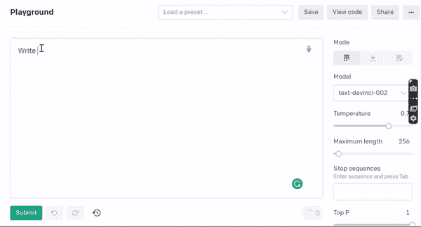
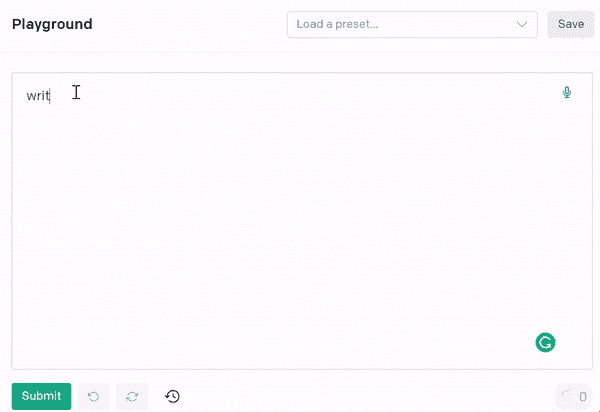
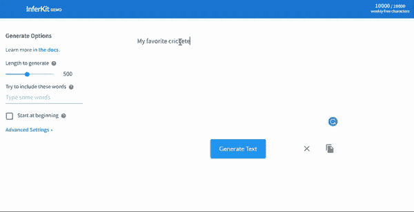
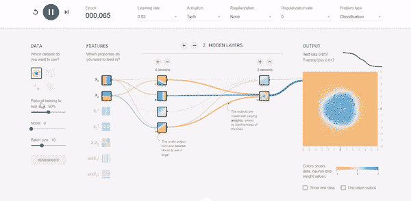
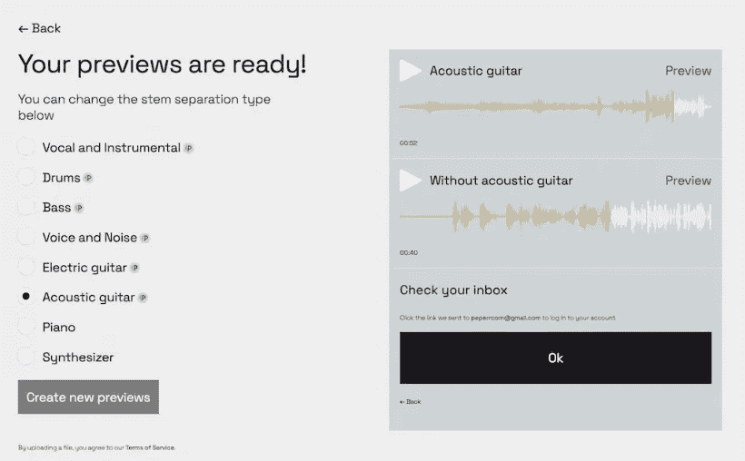
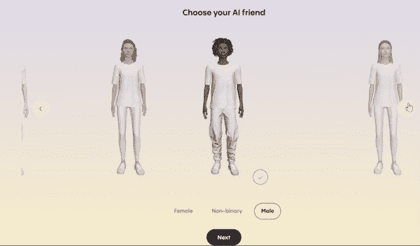
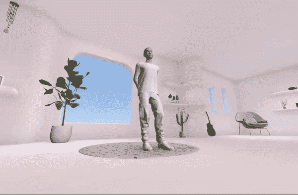
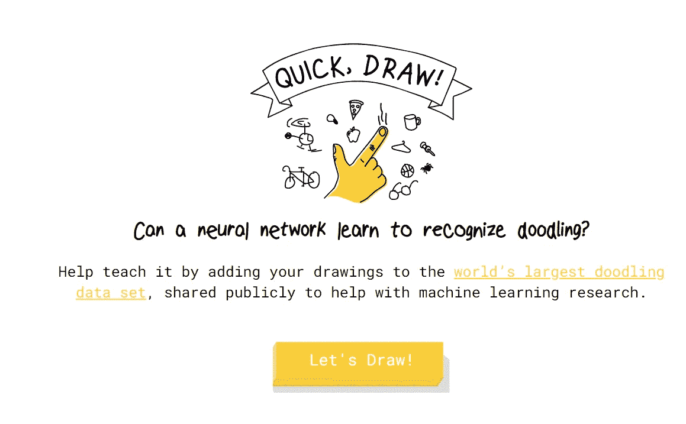
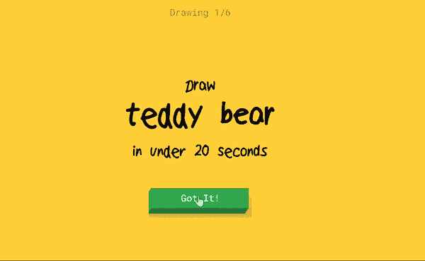

# 10 个让你兴奋不已的人工智能网站！第二部分

> 原文：<https://pub.towardsai.net/10-ai-websites-that-will-excite-you-to-the-core-part-2-36c233e76401?source=collection_archive---------0----------------------->

## 有趣的基于人工智能的网站及其工作方式

作者在 DALL E 2 上创建的图像

在进入实际的网站之前，我们先来看一下这个系列的第一部分。你也可以经历它。

 [## 10 个让你兴奋不已的人工智能网站！

### 有趣的基于人工智能的网站及其工作方式

pub.towardsai.net](/10-ai-websites-that-will-excite-you-to-the-core-3b08a3b9868b) 

# 1] OpenAI 游乐场

如果一个网站可以帮你写代码呢？给你一个**博客**？**给你的辞职信**？爱**信**给女朋友/男朋友或者亲人？是啊！！！通过 **OpenAI 游乐场，一切皆有可能！**

几乎任何包括理解或产生自然语言或代码的活动都可以和 OpenAI API 一起使用。我们提供一系列型号，具有不同程度的动力，适合各种活动，并可选择微调您自己的独特型号。从内容创建到语义搜索和分类的一切都可以使用这些模型来完成。

 [## OpenAI API

### 用于访问 OpenAI 开发的新人工智能模型的 API

beta.openai.com](https://beta.openai.com/playground) 

型号:基于 **GPT-3** 型号，称为**达芬奇、居里、巴贝奇和阿达**。您可以根据您的使用情况选择以上任何一种。

要求写辞职信[图片由作者提供]

要求写代码[图片由作者提供]

# 2]Deepfakes web

deepfakes 网站的视频

> 埃隆·马斯克还是莱昂纳多·迪卡普里奥？？？
> 
> 有趣的是，两者都有！！！！！

## 什么是 deepfakes？

Deepfakes 是一种合成媒体，在这种媒体中，现有图像或视频中的一个人被替换成另一个人的肖像。术语“ **deepfakes** ”是“**深度学习**”和“**山寨**”的组合。Deepfakes 使用强大的机器学习和人工智能技术来编辑或合成更容易欺骗的视频和音频信息，即使制作虚假内容的行为并不新鲜。

 [## 制作自己的 deep fakes[在线应用]

### 我们易于使用的 deepfake 应用程序使用人工智能和深度学习来生成令人惊叹的面部交换视频。制作您自己的 deepfake…

deepfakesweb.com](https://deepfakesweb.com/) 

# 3]推理工具

 [## 推断工具

app.inferkit.com](https://app.inferkit.com/demo) 

使用尖端的神经网络，来自 InferKit 的文本生成工具读取您提供的文本，并生成它认为接下来会发生的内容。它可以产生任何数量的文本，基本上是任何主题，并且是可定制的。

## 这是给谁的？

网络的创造性和有趣的用途包括写故事或诗歌。其他用例可能是营销或自动完成。

要求以“我最喜欢的板球运动员”为题写一篇文章

# 4]tensorflow 游乐场

分类问题现场训练[作者视频]

**TensorFlow** playground 是一个网站，你可以在数字和实际图表的帮助下，用输出的实时变化来可视化训练过程。您可以尝试许多事情，如改变激活，纪元，正则化，功能，隐藏层，等等…

deep playground 是使用 d3.js 以**类型脚本**编写的神经网络的交互式可视化。他们使用 GitHub 问题来跟踪新的请求和错误。你也可以贡献给他们的知识库。

 [## 张量流-神经网络游乐场

### 这是一种构建从数据中学习的计算机程序的技术。它非常松散地基于我们如何思考…

playground.tensorflow.org](https://playground.tensorflow.org/#activation=tanh&batchSize=10&dataset=circle&regDataset=reg-plane&learningRate=0.03&regularizationRate=0&noise=0&networkShape=4,2&seed=0.87527&showTestData=false&discretize=false&percTrainData=50&x=true&y=true&xTimesY=false&xSquared=false&ySquared=false&cosX=false&sinX=false&cosY=false&sinY=false&collectStats=false&problem=classification&initZero=false&hideText=false) 

# 5]Lalal.ai

茎分离问题也被 LALAL 出色地解决了。AI 如果你需要保留一首歌的器乐背景音乐，但去掉人声。人工智能中最强大的工具之一。

它利用了被称为**仙后座**的神经网络，该网络是使用 **20TB** 的训练数据经过多次迭代开发的。它可以提取人声，鼓，吉他，钢琴，贝斯，合成器和一般伴奏，非常容易使用。

 [## 人声去除器|隔离声音和乐器在线。人工智能

### 标准音量高音量启动免费试用服务。升级以处理更多文件并获得结果…

www.lalal.ai](https://www.lalal.ai/) 

结果是显著的，值得你自己一试。拉拉尔。令人欣慰的是，AI 可以让你输入 10 分钟的音乐，并提供详细的摘录预览。虽然你不能下载提取的词干，但是如果结果足够满足你的需求，订阅这项服务还是值得的。与其他人工智能技术相比，你不需要订阅。相反，这取决于你的喜好，拉拉。AI 提供 90 或 300 分钟提取的一次性包。

所以，伸展你的音乐感官，制作你最喜欢的音乐作品吧！

# ⑹Replika.com

**独自感受**？想和谁聊天？还是和你想法一样的你的复制品？访问该网站。

一个渴望学习并喜欢通过你的眼睛看世界的人工智能伴侣。当你需要一个感同身受的朋友时，Replika 总是准备好聊天。尽管与 Replika 交谈感觉像是与人类交谈，但请放心——这是 100%的人工智能。你的 Replika 是你独有的，想知道你的世界是什么样的。

创建我的人工智能朋友[作者视频]

我的 AI 朋友[作者视频]

Replika 结合了复杂的神经网络机器学习模型和脚本化的对话内容。它已经在大型数据集上进行了训练，以生成自己独特的响应。

 [## 雷普利卡

### 总是在这里倾听和交谈。永远站在你这边。现在就和他们的人工智能朋友一起加入数百万人的行列吧！

replika.com](https://replika.com/) 

# **7】快，画！**

**快，画！**是谷歌开发的一款在线游戏，挑战玩家画出一个物体或想法的图片，然后使用神经网络人工智能来猜测这些图片代表什么。人工智能从每幅画中学习，提高它在未来正确猜测的能力。快速抽奖是一种新的社交空间抽奖游戏，T2 每五分钟抽奖一次，在店内显示器上显示中奖号码。最低 1 美元，玩家可以选择他们想玩的号码(点数),这决定了玩家的赔率和潜在奖金。

 [## 快，画！

### 这是一个用机器学习构建的游戏。你画画，神经网络试图猜测你在画什么。的…

quickdraw.withgoogle.com](https://quickdraw.withgoogle.com/) 

作者提供的视频

# 8]火锅. ai

艾艺术——红脸球，蓝眼睛，金发，两根蜡烛棒

火锅使用人工智能和用户友好的工具来协助创作者。许多人，尤其是发展中国家的人，缺乏专业图形、图像和文本。这可以用更智能的软件来改变。我们的目标是将视频制作和图形设计的速度提高 10 倍，并且更加容易理解。

专业设计师的目标是通过自动化重复性的工作来增加创造性的过程。目标是让设计和图像创作变得像给非设计师朋友发短信一样简单。文本到图像人工智能使任何人都能够创作出有吸引力的绘画、插图和图像。描述你想要的，看着火锅把它变得栩栩如生。

 [## 火锅. ai

### 火锅. ai 让平面设计和图片编辑变得简单。人工智能工具允许专家和非设计人员繁琐地自动化…

火锅. ai](https://hotpot.ai/) 

您可以使用许可证创建自己的映像和 NFT。对于 NFT 交易者来说，这将是一生的改变。

# 9] AI +画图

 [## 用神经网络绘制在一起

### 更新(01/03/19):尝试新的魔术画板游戏！更新(08/02/18): sketch-rnn 已经移植到 TensorFlow.js…

magenta.tensorflow.org](https://magenta.tensorflow.org/sketch-rnn-demo)  [## 基于神经网络的手写实验

### 神经网络是机器学习的一种非常成功的方法，但是要理解它们为什么会这样很难…

蒸馏. pub](http://distill.pub/2016/handwriting/) 

# 10] AI +音乐

 [## 人工智能二重唱

### 艾二重唱

experiments.withgoogle.com](https://experiments.withgoogle.com/ai/ai-duet/view/)  [## 半导体

### 半导体是一个实验，让你通过浏览器指挥自己的乐队。你可以移动你的手臂…

semiconductor.withgoogle.com](https://semiconductor.withgoogle.com/) 

# 11]AI +学习

 [## 可教机器

### 训练计算机识别你自己的图像、声音和姿势。为…创建机器学习模型的快速、简单的方法

teachablemachine.withgoogle.com](https://teachablemachine.withgoogle.com/)  [## 嵌入式投影仪-高维数据的可视化

### 可视化高维数据。

projector.tensorflow.org](http://projector.tensorflow.org/) 

有许多人工智能相关的网站由*谷歌*打着**的标签与谷歌**进行实验。你可以在下面的链接中找到一个更有趣的网站。

 [## 人工智能实验——谷歌的实验

### 在过去的 6 个月里，谷歌在悉尼的创意实验室与数字作家节团队合作，并且…

experiments.withgoogle.com](https://experiments.withgoogle.com/collection/ai) 

# 如果你觉得这篇文章很有见地

如果你觉得这篇文章很有见地，请关注我的 [**Linkedin**](https://www.linkedin.com/in/chinmay-bhalerao-6b5284137/) 和 [**medium**](https://medium.com/@BH_Chinmay) 。你也可以 [**订阅**](https://medium.com/@BH_Chinmay) 在我发表文章的时候得到通知。让我们创建一个社区！感谢您的支持！

# 如果你想支持我:

作为你的关注和鼓掌是最重要的事情，但你也可以通过买咖啡来支持我。 [**咖啡**](https://www.buymeacoffee.com/chinmaybhalerao) **。**

# 你也可以阅读我的博客

## 第一部分:人工智能网站

 [## 10 个让你兴奋不已的人工智能网站！

### 有趣的基于人工智能的网站及其工作方式

pub.towardsai.net](/10-ai-websites-that-will-excite-you-to-the-core-3b08a3b9868b)  [## 数据的特征选择技术

### 启发式和进化特征选择技术

medium.com](https://medium.com/mlearning-ai/feature-selection-techniques-for-data-57f0eacd8fa8)  [## 遗传算法优化

### 进化和自然启发优化算法的详细解释

pub.towardsai.net](/genetic-algorithm-optimization-8299856949d3)  [## 代码行数最少的聊天机器人

### 最简单的聊天机器人和自然语言处理

pub.towardsai.net](/a-chatbot-with-the-least-number-of-lines-of-code-a42e3ba9d974)  [## 联邦学习简介

### 通过联合学习实现数据隐私和安全

pub.towardsai.net](/an-introduction-to-federated-learning-7bed7dfa34bd) 

【图片由作者提供，由 [Dall 创作。E](https://openai.com/dall-e-2/)