# 用 Python 代码解释的 10 个常用损失函数

> 原文：<https://pub.towardsai.net/10-commonly-used-loss-functions-explained-with-python-code-59967e1f3c8d?source=collection_archive---------2----------------------->

## 理解机器学习中的损失函数


麦克斯韦·尼尔森在 T2 的照片

```
**Table of contents:** What is a loss function?
Loss Functions vs Metrics
Why are loss functions applied while building the model?**Regression:** Mean Squared Error (MSE)
Mean Absolute Error (MAE)
Root Mean Squared Error (RMSE)
Mean Bias Error (MBE)
Huber Loss**Binary Classification:** Binary Cross Entropy (BCE)
Hing Loss and Squared Hing Loss (HL and SHL)
Likelihood Loss (LHL)**Multinomial Classification:** Categorical Cross Entropy (CCE)
Kullback-Leibler Divergence (KLD)
```

## 什么是损失函数？

损失函数是一种衡量模型与数据拟合程度的算法。损失函数测量实际测量值和预测值之间的距离。这样，损失函数的值越高，预测就越错误。相反，具有较低值的损失函数意味着预测更接近真实值。为每个单独的观察值(数据点)计算损失函数。平均所有损失函数的值的函数被称为 ***成本函数*** 。

**损失函数:**计算每个样本的误差。
**代价函数:**所有损失函数的平均值。

## 损失函数与度量

一些损失函数也被用作评估指标。然而，损失函数和度量具有不同的目的。虽然度量用于评估最终模型的性能并比较不同模型的性能，但是损失函数在模型构建阶段用作正在创建的模型的优化器。损失函数指导模型如何最小化误差。

**度量:**模型与数据的吻合程度
**损失函数:**模型与数据的吻合程度

## 为什么在构建模型时要应用损失函数？

由于损失函数测量预测值和实际值之间的距离，因此在构建模型时会使用损失函数，以便以一种改进的方式(通常是梯度下降，但我将在另一篇文章中讨论)来指导模型。这意味着，在构建模型的过程中，如果要素的权重发生变化，我们可以做出更好或更差的预测。损失函数用于告知模型应该更改的要素权重以及更改的方向。

> 我们可以在机器学习中使用多种损失函数，这取决于我们试图解决的问题类型、数据质量和分布以及我们使用的算法。

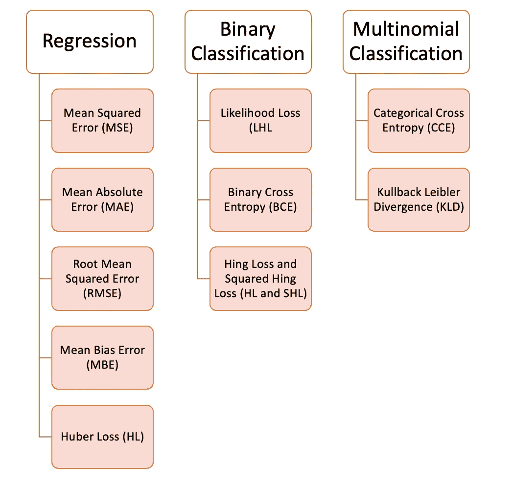

## **回归问题:**

**均方误差(MSE)** 均方误差求所有预测值与真实值的平方差，并将其全部平均。它用于回归问题。

```
**def *MSE*** (y, y_predicted):
   sq_error = (y_predicted - y) ** 2
   sum_sq_error = np.sum(sq_error)
   mse = sum_sq_error/y.size
   **return** mse
```

**平均绝对误差(MAE)** 该损失函数计算为预测值和真实值之间的绝对差值的平均值。当数据有异常值时，这是比均方误差更好的度量。

```
**def *MAE*** (y, y_predicted):
   error = y_predicted - y
   absolute_error = np.absolute(error)
   total_absolute_error = np.sum(absolute_error)
   mae = total_absolute_error/y.size
   **return** mae
```

**均方根误差【RMSE】** 是均方误差的平方根。如果我们不想惩罚更大的错误，这是一个理想的转换。

```
**def *RMSE*** (y, y_predicted):
   sq_error = (y_predicted - y) ** 2
   total_sq_error = np.sum(sq_error)
   mse = total_sq_error/y.size
   rmse = math.sqrt(mse)
   **return** rmse
```

**平均偏差误差(MBE)** 类似于平均绝对误差，但不使用绝对函数。缺点是负误差和正误差可以相互抵消，所以当研究者知道误差只有一个方向时更适用。

```
**def *MBE*** (y, y_predicted):
   error = y_predicted -  y
   total_error = np.sum(error)
   mbe = total_error/y.size
  ** return** mbe
```

**休伯损失** 休伯损失函数结合了平均绝对误差(MAE)和均方误差(MSE)的优势。这是因为哈伯损失是一个有两个分支的函数。一个分支应用于符合期望值的 MAE，另一个分支应用于异常值。哈伯损耗的一般函数是:

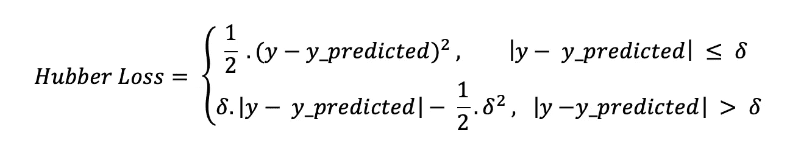

*其中:*

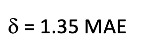

```
- We already know how to find MAE from previous code examples.**def** ***hubber_loss*** (y, y_predicted, delta)
   delta = 1.35 * MAE
   y_size = y.size
   total_error = 0
   **for** i **in** range (y_size):
      erro = np.absolute(y_predicted[i] - y[i])
      **if** error < delta:
         hubber_error = (error * error) / 2
      **else:**
         hubber_error = (delta * error) / (0.5 * (delta * delta))
      total_error += hubber_error
   total_hubber_error = total_error/y.size
   **return** total_hubber_error
```

**二元分类:**

**似然损失(LHL)** 该损失函数主要用于二分类问题。输出是地面真实标签的概率的乘积，并且相关联的成本函数是所有观察的平均值。下面举个二进制分类的例子，类别是[0]或者[1]。如果我们有一个输出概率等于或高于 0.5，那么预测的类是[1]，否则是[0]。示例输出概率为:

> [0.3 , 0.7 , 0.8 , 0.5 , 0.6 , 0.4]

相应的预测类别有:

> [0 , 1 , 1 , 1 , 1 , 0]

真正的类别包括:

> [0 , 1 , 1 , 0 , 1 , 0]

我们现在将使用真实类别和输出概率来计算可能性损失。如果真实类是***【1】***，我们用 ***输出概率。如果*** 真类是*，我们用***1-输出概率*** :*

> ***总成本**=((1–0.3)+0.7+0.8+(1–0.5)+0.6+(1–0.4))/6 =**0.65***

*您还可以使用以下代码来计算可能性损失:*

```
***def *LHL*** (y, y_predicted):
   likelihood_loss = (y * y_predicted) + ((1-y) * (y_predicted))
   total_likelihood_loss = np.sum(likelihood_loss)
   lhl = - total_likelihood_loss / y.size
   **return** lhl*
```

***二元交叉熵***

*这个函数是对数似然损失的一个修正。增加对数有能力惩罚非常自信和非常错误的预测。二元交叉熵损失函数的一般公式为:*

> *— (y . log (p) + (1 — y)。对数(1 — p))*

*让我们用上一个示例中的值来尝试一下:*

****输出概率****=【0.3，0.7，0.8，0.5，0.6，0.4】* ***真实类****=【0，1，1，0，1，0】**

*— (0 .log(0.3)+(1–0)。log(1–0.3))= 0.155
—(1。log(0.7)+(1–1)。log (0.3)) = 0.155
— (1。log(0.8)+(1–1)。log (0.2)) = 0.097
— (0。log(0.5)+(1–0)。log(1–0.5))= 0.301
—(1。log(0.6)+(1–1)。log (0.4)) = 0.222
— (0。log(0.4)+(1–0)。log(1–0.4))= 0.222*

**=(0.155+0.155+0.097+0.301+0.222+0.222)/6 =***0.192*****

```
****def *BCE*** (y, y_predicted):
   ce_loss = y*(np.log(y_predicted))+(1-y)*(np.log(1-y_predicted))
   total_ce = np.sum(ce_loss)
   bce = - total_ce/y.size
   **return** bce**
```

****铰链损失和平方兴损失(HL 和 SHL)** 铰链损失主要用于评估 SVM 模型。随着铰链的丢失，错误的预测和不太自信的正确预测会受到惩罚。一般损失函数是:**

> **l(y) = max (0，1 — t . y)**

**其中 ***t*** 为真实结局***【1】***或 ***[-1]。*****

**要应用铰链损耗，类别应该是[1]或[-1](不是[0])。为了在铰链损失函数中不被惩罚，观测值不仅需要被正确分类，而且到超平面的距离应该大于余量(有把握的正确预测)。如果我们想进一步惩罚更高的误差，我们可以用 MSE 中使用的类似方法计算铰链损耗值的平方。**

**记住，在 SVM，超平面的边缘越高，某个预测就越有把握。你可以在本文中重述 SVM 的概念:**

**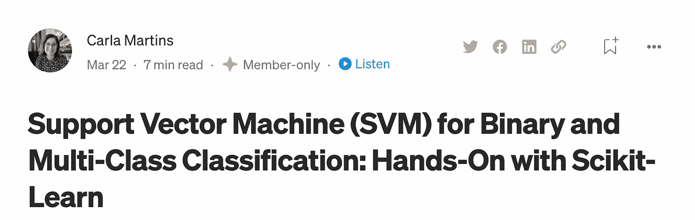**

**[https://pub . toward sai . net/support-vector-machine-SVM-for-binary-and-multi class-classification-hand-on-with-sci kit-learn-29 cdbe 5 CB 90 e](/support-vector-machine-svm-for-binary-and-multiclass-classification-hands-on-with-scikit-learn-29cdbe5cb90e)**

**现在让我们看一个可视化的例子:**

**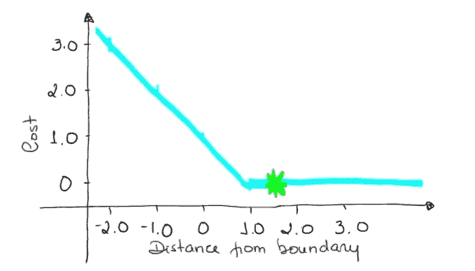**

**→如果预测的结果为 1.5，真实类别为[1]，则损失将为 0(零)，因为模型的可信度很高。**

> **损失=最大值(0，1–1 * 1.5)=最大值(0，-0.5) = 0**

**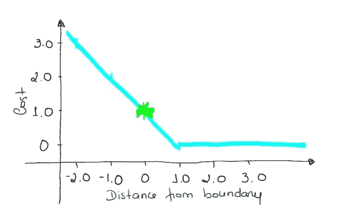**

**→如果一个观测的结果为 0(零)，说明该观测在边界内(超平面)，真类为[-1]。成本为 1，模型没有错也没有对，置信度非常低。**

> **loss = max (0，1-(-1)* 0)= max(0，1) = 1**

**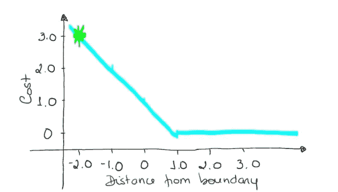**

**→如果一个观察的结果为 2，但被错误分类(乘以[-1])，我们的距离为-2。成本是 3(非常高)，因为我们的模型对一个错误的决策非常有信心。**

> **loss = max (0，1 — (-1)。2) = max (0，1+2) = max (0，3) = 3**

```
****#Hinge Loss
def *Hinge*** (y, y_predicted):
   hinge_loss = np.sum(max(0 , 1 - (y_predicted * y)))
   **return** hinge_loss**#Squared Hinge Loss**
**def *SqHinge*** (y, y_predicted):
   sq_hinge_loss = max (0 , 1 - (y_predicted * y)) ** 2
   total_sq_hinge_loss = np.sum(sq_hinge_loss)
   **return** total_sq_hinge_loss**
```

## ****多项分类:****

## ****范畴交叉熵(CCE)****

**在多项式分类中，我们使用与二元交叉熵相似的公式，但是多了一个步骤。w 首先需要计算每一对[y，y_predicted]的损耗，一般公式为:**

****

**如果我们有一个三类问题，其中单个[y，y_predicted]对的输出是:**

**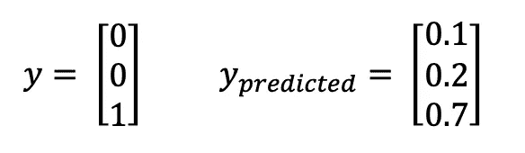**

**真实类是 3，我们的模型是 0.7 自信真实类是 3。要计算这一对的损耗:**

> ****损失** = 0。log (0.1) + 0。log (0.2) + 1。log (0.7) = **-0.155****

**要获得成本函数的值，我们需要计算所有单个对的损失，将它们相加，最后乘以[-1/样本数]。成本函数由以下公式给出:**

**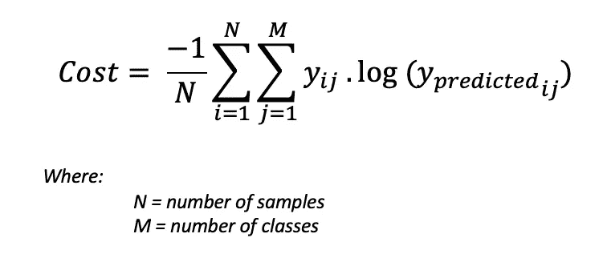**

**使用上面的例子，如果我们有第二对:**

****

> ****损耗** = 0。log (0.4) + 1。log (0.4) + 0。log (0.2) = **-0.40****

**成本函数的计算方法如下:**

**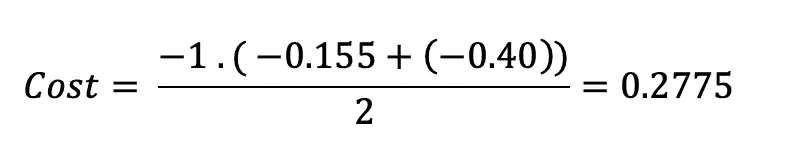**

**使用代码示例会更容易理解:**

```
****def *CCE*** (y, y_predicted):
   cce_class = y * (np.log(y_predicted))
   sum_totalpair_cce = np.sum(cce_class)
   cce = - sum_totalpair_cce / y.size
   **return** cce**
```

****Kullback-Leibler 散度(KLD)** 类似于范畴交叉熵，但也考虑到了观察值出现的概率。如果我们的班级不平衡，这一点特别有用。**

**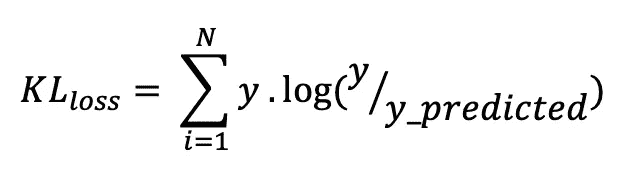**

**代码是:**

```
****def *KL*** (y, y_predicted):
   kl = y * (np.log(y / y_predicted))
   total_kl = np.sum(kl)
   **return** total_kl**
```

**感谢您的阅读！如果您有建议要添加到这个列表中，请告诉我，不要忘记订阅以接收关于我未来出版物的通知。**

**如果:你喜欢这篇文章，别忘了关注我，这样你就能收到所有关于新出版物的更新。**

**否则如果:你想了解更多，你可以通过[我的推荐链接](https://cdanielaam.medium.com/membership)订阅媒体会员。这不会花你更多的钱，但是你要付我一杯咖啡的钱。**

**Else:谢谢！**