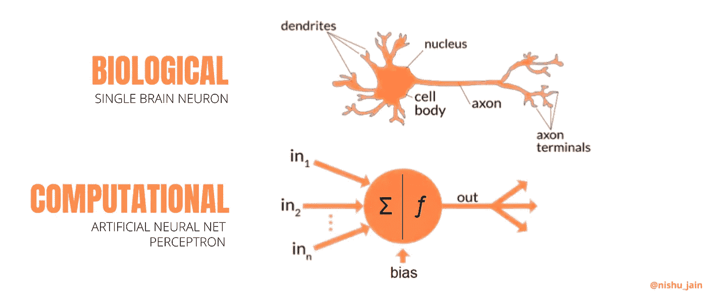
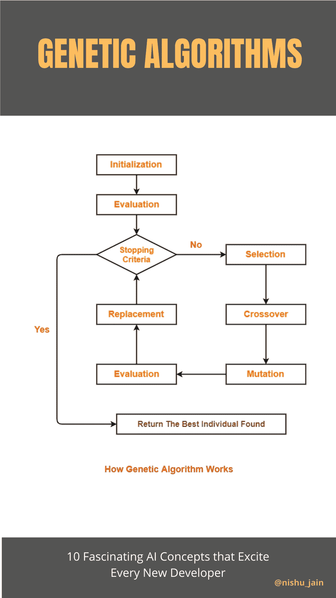
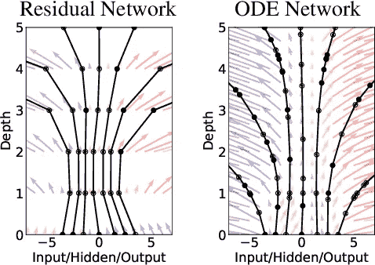
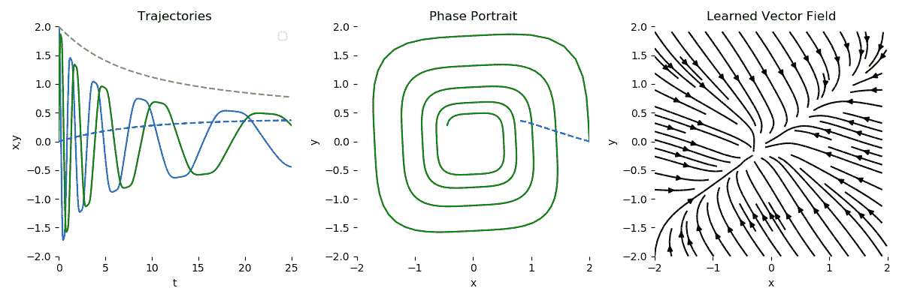
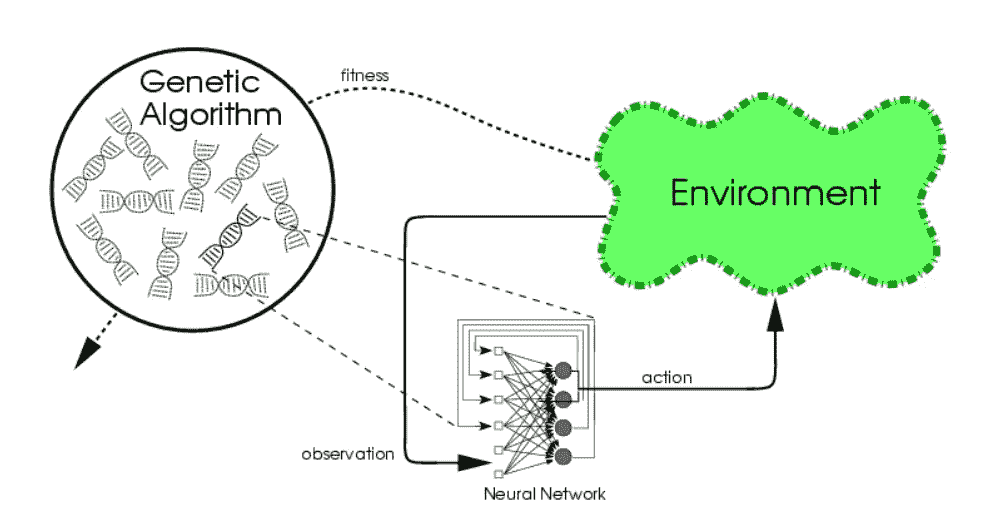
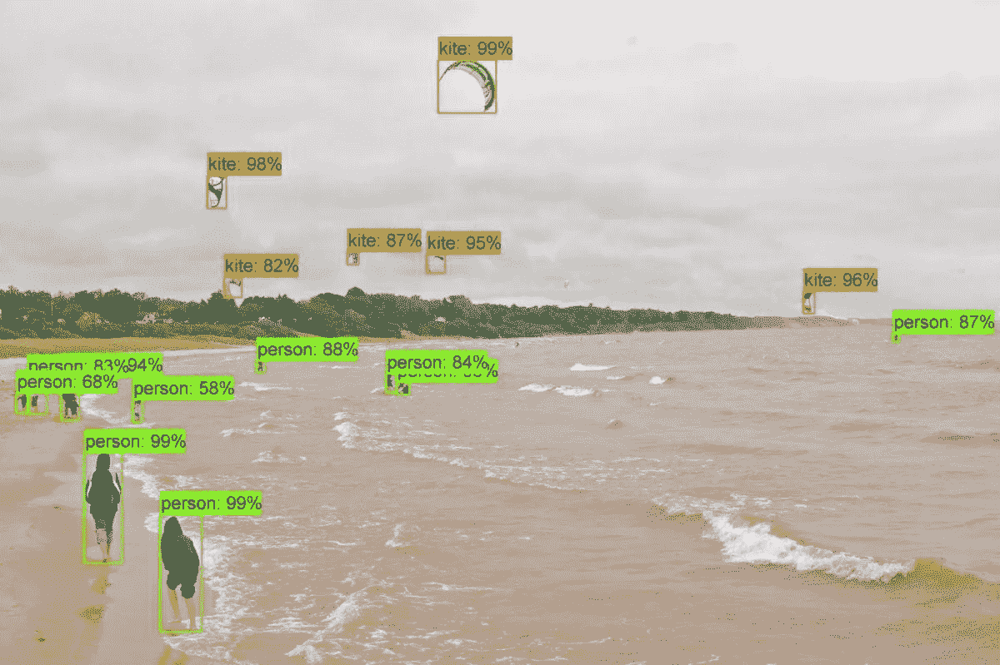
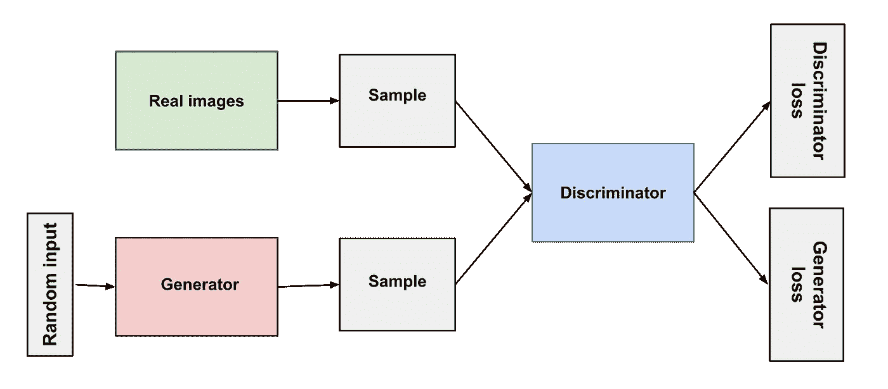
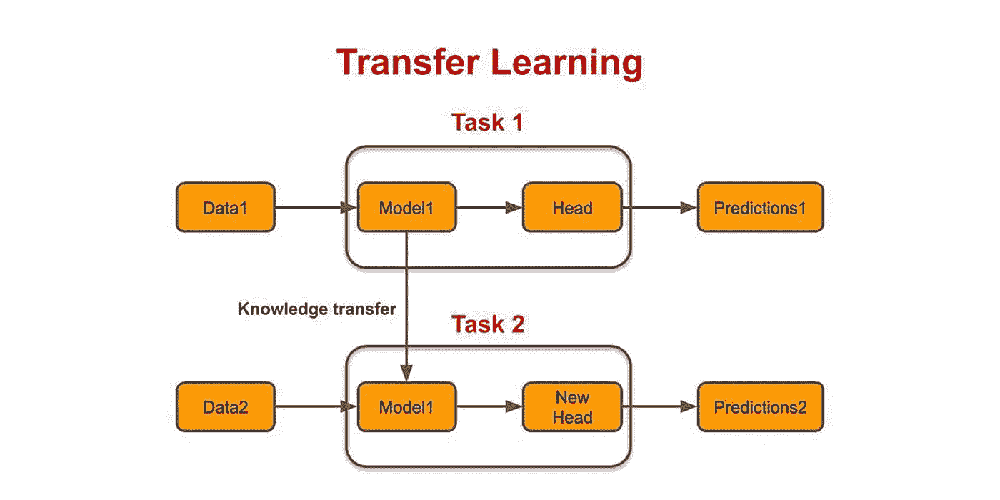
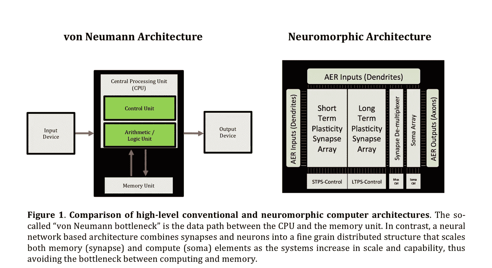

# 值得了解的 10 个改变游戏规则的人工智能突破

> 原文：<https://pub.towardsai.net/10-game-changing-ai-breakthroughs-worth-knowing-about-b2076afc4930?source=collection_archive---------0----------------------->

## [人工智能](https://towardsai.net/p/category/artificial-intelligence)

## 过去几十年中引人入胜的想法和概念


作者图片(GIF)

阅读和聆听——为了更好的体验

F 从我的 AI 之旅开始，我就发现了几个很有前途的想法和概念**无与伦比的潜力**；绝对令人兴奋的研发项目**；和突破，推动了这一领域的发展，在其辉煌的历史上留下了自己的印记。**

**此外，在过去的几年里，指向“*天网-终结者*”场景的人数呈指数级增长……^_^！**

**所以今天，我决定整理出一些最有趣的想法和概念(来自我自己的经历)，这些想法和概念让我坚持了这么多年。**

**我希望它们也能激励你，就像它们激励我一样。**

**一些目标、可能性和“新的思维方式”已经从这些想法中浮现出来，所以不要掉以轻心。我们永远不知道接下来会发生什么。**

> **在人工智能领域度过的一年足以让人相信上帝——艾伦·珀利斯**

**所以让我们从一个人工智能爱好者的初恋开始。**

# **#1.神经网络——“生物灵感”**

**每一个新的 ML 开发人员，当他/她第一次学习人工神经网络(ANN)时，都会体验到肾上腺素激增的感觉，他/她曾经使用过统计模型(如回归和所有的模型);在深度学习的门口。**

**这里的基本思想是 ***通过编程模仿生物神经元的工作，制作通用函数逼近器。*****

**神经科学和计算机科学这两个领域的融合本身就是一个令人兴奋的想法。我们将在未来进一步探索它的细节。**

> **数学上，突触和连接如何归结为巨大的矩阵乘法；神经元的放电如何类似于激活功能，像[s 形](https://en.wikipedia.org/wiki/Sigmoid_function)；大脑中的高级认知抽象和暗箱操作的人工神经网络，听起来既神秘又酷；所有这些给了新的 ML 开发者希望，这是不可思议的。**

****

**来源:图片由作者提供(使用 Canva 制作)**

**在这一点上，新手们认为，*字面上的* ***一切*** *都有可能借助这种仿生技术实现。毕竟，大自然会选择最好、最有效的方式来执行这些过程，不是吗？”***

**只是在后来的一堂课中，他们才知道人工神经网络是如何部分地受到 T2 的启发，因此有很大的局限性。**

***理论上，一切听起来都很好，但是，他们不切实际的雄心勃勃的梦想就像错误配置的神经网络训练课程中的梯度一样消失了*(你明白了吗？哈哈)。**

# **#2.遗传算法——“向达尔文问好”**

**另一套进入计算机科学领域的受自然启发的算法是 [***遗传算法(GAs)***](https://en.wikipedia.org/wiki/Genetic_algorithm) 。在这里，你会发现所有与进化相关的达尔文术语，如突变、繁殖、种群、交叉、适者生存等。**

**这些进化算法背后的想法是遵循自然选择的过程，其中最适合的个体被选择来繁殖。为了给种群增加一些多样性，每隔一段时间，最适合的个体的染色体会随机变异。**

> **在这里，“个人”意味着给定问题的潜在答案。**

**看看工作流程—**

****

**来源:图片由作者提供(使用 Canva 设计)**

**很整洁，不是吗？**

**这种看起来简单的算法在现实世界中有着巨大的应用，例如在优化、递归神经网络(RNN)的训练、某些问题解决任务的并行化、图像处理等领域。**

**在兑现了这么多承诺后，天然气不会很快消失。**

# **#3.自我修改程序——“当心编码者”**

**在遗传算法应用的延续中，这一个无疑是最令人兴奋的；它应该有自己独立的部分。**

**想象一个 ***人工智能程序访问自己的源代码。它一次又一次地、递归地改进自己，直到达到它的目标。许多人相信，*****

> **自我完善/修改代码+ AGI = AI 超级智能**

**显然，这一条的道路上有许多障碍，但考虑到 2013 年的这个[实验](http://www.primaryobjects.com/2013/01/27/using-artificial-intelligence-to-write-self-modifying-improving-programs/):***一种遗传算法被设计成在***[***brain fuck***](https://en.wikipedia.org/wiki/Brainfuck)**(一种编程语言)* ***中编写一个可以打印“你好”的程序******

***GA 的源代码中没有任何编程规则，只有简单的自然选择算法。在 ***29 分钟*** 内，它生成了这个——***

```
*+-+-+>-<[++++>+++++<+<>++]>[-[---.--[[-.++++[+++..].]]]]*
```

***当你在 Brainfuck 解释器中运行这个程序时，它会打印*‘你好。’*实验成功！***

***这证明了遗传算法的力量，如果有足够的时间和计算资源，它可以实现什么。***

# ***#4.神经常微分方程——“螺旋层”***

***几年前，在 neur IPS[提交的 4854 篇研究论文中，](https://nips.cc/About)[这篇名为“神经常微分方程”的](https://arxiv.org/pdf/1806.07366.pdf)论文名列前四。***

***为什么这么棒？因为它确实改变了我们对神经网络的看法。***

***传统上，神经网络具有谨慎的层数，并且依赖梯度下降和反向传播来进行优化(搜索全局最小值)。随着层数的增加，我们的内存消耗也会增加，但从理论上讲，我们不再需要这样做了。***

***我们可以从**离散层模型**转移到**连续层模型——无限层。*****

******

***资料来源:上述研究论文***

***不需要预先指定层数。取而代之的是，只需输入你想要的精确度，就可以看到在不变的内存成本下奇迹的发生。***

***根据研究论文，这种方法在时间序列数据上(特别是在**不规则**时间序列数据上)比传统的递归神经网络(RNN)和残差网络表现得更好。***

******

***资料来源:上述研究论文***

***在这种新技术中，我们可以使用任何常微分方程求解器(ODE Solver)，像[欧拉方法](https://en.wikipedia.org/wiki/Euler_method)而不是梯度下降，这样效率要高得多。***

***正如您所知，时间序列数据无处不在，从股票市场的金融数据到医疗保健行业。一旦这项技术成熟，它的应用将是巨大的。还不发达。***

***让我们抱最好的希望吧！***

# ***#5.神经进化——“再次模仿自然”***

***神经进化是一个[古老的想法](http://nn.cs.utexas.edu/downloads/papers/stanley.ec02.pdf)，可以追溯到 21 世纪初，与强化学习(RL)领域中著名的反向传播算法相比，它最近显示出了希望和进步。像在神经结构搜索、自动建模、超参数优化等中。***

***一行中，***“***[***神经进化***](https://en.wikipedia.org/wiki/Neuroevolution) ***是一种利用遗传算法进化神经网络的技术”；*** 而且不仅仅是权重和参数，还有网络的架构(拓扑结构)(更新的研究)。***

****这是一场* ***梯度下降优化和*** *进化优化之间的网络模型训练之战。****

******

***资料来源:https://blog.otoro.net***

******但是为什么要用这个呢？******

***因为，在优步(深度神经进化)最近的[研究中，他们发现这种技术比反向传播导致的模型收敛更快。在低端电脑上，数天的计算时间可以缩短到数小时。](https://eng.uber.com/deep-neuroevolution/)***

***如果你正在使用梯度下降训练一个神经网络，并且陷入了困境，比如在一些局部最小值或由于饱和，那么神经进化可以帮助你获得更好的结果。***

***在这种选择中没有权衡取舍。在每一个使用神经网络的地方，这种技术都可以应用于它们的优化和训练。***

> ***"三个臭皮匠胜过一个诸葛亮，不是因为两个人都不会犯错，而是因为他们不太可能在同一个方向上出错。"刘易斯***

# ***#6.谷歌的人工智能孩子——“人工智能创造人工智能”***

***超参数调优是一项非常繁琐的工作，每个数据科学家都讨厌这项工作。由于神经网络的黑盒性质，我们实际上不知道我们的变化如何影响网络的学习。***

***2018 年，谷歌通过建立一个名为 NASNet 的模型，在自动机器学习(AutoML)领域取得了突破。该物体识别模型具有最高的准确度，*(即，比计算机视觉领域中的任何其他模型高 1.2%)82.7%，同时效率高 4%。****

****而最棒的是，**是另一个 AI，**用强化学习开发的。****

********

****来源:谷歌研究****

****“神经网络来设计神经网络”……多么不可思议的概念，你不觉得吗？****

****这里，父 AI 被称为 ***控制器网络，*** ，其通过数千次迭代开发子 AI。在每次迭代中，它计算 it 的性能，并在下一次迭代中使用该信息来构建更好的模型。****

****这种类似于盗梦空间的方法促进了“学会学习”(或元学习)的概念，它在准确性和效率方面都优于地球上所有人类设计的神经网络。****

****想象一下它在计算机视觉领域之外能做什么。难怪这引发了 AI 超智能霸主们的最大恐惧。LOL！****

# ****#7.GANs —“神经网络与神经网络”****

****GAN 代表生成性对抗网络，它们可以学习模仿任何数据分布。****

*****这是什么意思？*****

****在 GANs 之前，机器学习算法专注于寻找输入和输出之间的**相关性**。这些被称为鉴别算法。比如区分苹果和橘子的图像分类器。****

> ****当你给这个网络输入一个图像时，它要么返回 0(比如苹果)，要么返回 1(橘子)。你可以把它想象成分配标签。它在内部创建了一个什么特征对应苹果，什么特征对应橙子的模型。然后以一定的概率吐出标签..****
> 
> ****但是…它们不能生成苹果或橘子的图像。尽管它们可能有一些内部的表示来进行比较。****

****这就是甘斯介入的原因。GAN 由两个网络组成——一个发生器和一个鉴别器。****

****继续前面的例子，如果我想生成一个苹果的图像，那么我将使用一个解卷积网络作为生成器，一个卷积网络作为鉴别器。****

****生成器将从一个随机噪声图像开始，并试图使它看起来像一个苹果。然而，鉴别器将试图识别输入图像是真的还是假的(由生成器生成)。****

****如果鉴别器正确地识别出图像，那么发生器就试图改进自己以产生更真实的图像。否则鉴别器试图改进其预测。这意味着，无论如何，改进是不可避免的，无论是鉴别器还是发生器。****

****这有点像双反馈回路。****

********

****资料来源:https://developers.google.com****

****gan 的复杂性使得它们很难训练，最近，在 Nvidia 发表的一篇研究论文[中，他们描述了我们如何通过逐步增加生成器和鉴别器来训练 gan(有趣的阅读！).](https://research.nvidia.com/publication/2017-10_Progressive-Growing-of)****

*****甘的力学讲的够多了。我们如何使用它？*****

****氮化镓的一些很酷的应用:****

*   ****面部老化****
*   ****超分辨率****
*   ****照片混合****
*   ****服装翻译****
*   ****3D 对象生成等。****

****请看这篇[文章](https://machinelearningmastery.com/impressive-applications-of-generative-adversarial-networks/)了解更多信息。****

# ****#8.迁移学习——“使用预训练网络”****

****从头开始训练一个神经网络在计算上极其昂贵，有时会变得超级混乱。但是，如果我们能够 ***获得一个网络*** 的知识，这些知识是通过先前在一些其他数据集上训练获得的，并且能够 ***重用它来在我们新的目标数据集上训练*** 会怎么样呢？****

****这样，我们可以加快新领域的学习过程，并减少大量的计算能力和资源。想象一下，在其他人之前开始比赛。****

> ****不要浪费你的时间去重新发明轮子****

****显然，你**不能**在两个完全不相关的领域使用这种技术，但是，有几个领域使用预训练网络是新的规范——**(NLP)***和* ***计算机视觉*** 。******

********

****资料来源:https://www.topbots.com/****

****在计算机视觉、物体检测、物体识别、图像分类等领域，人们使用预先训练好的网络如[**【VGG】**](https://en.everybodywiki.com/VGG_Net)**conv net、**[**Alex net**](https://en.wikipedia.org/wiki/AlexNet)**、ResNet-50、InceptionV3、EfficientNet** 等。为了抢先一步。****

****即使是像[神经风格转移](https://en.wikipedia.org/wiki/Neural_Style_Transfer) (NST)这样的任务，为了快速获得内部表示，也可以使用 VGG19 来节省时间。****

****在情感分类和语言翻译等自然语言处理任务中，不同类型的单词嵌入，如**斯坦福的 GloVe** (单词表示的全局向量)或**谷歌的 Word2Vec** 都是非常标准的。****

****而且不要让我从最新的语言模型(大男孩)开始，如 [**谷歌的 BERT**](https://en.wikipedia.org/wiki/BERT_(language_model))**[**open ai 的 GPT-2**](https://openai.com/blog/better-language-models/) (生成式预训练变形金刚)**和全能的**[**GPT-3**](https://en.wikipedia.org/wiki/OpenAI#GPT-3)。这些都是在如此大量的数据上训练出来的，我们这些普通人连想都不敢想。他们实际上放弃了大部分互联网作为他们的输入数据集，并花费了数百万美元来训练它们。**********

******在这一点上，预训练网络似乎是未来。******

# ******#9.神经形态建筑——“下一代的东西”******

******看完了软件世界的所有进步，我们再来看看硬件部门。******

******但在此之前，先看看这个可笑的对比…******

******人类大脑平均由 860 亿个神经元和大约 1000 亿个突触组成。换个角度来看， ***你可以毫不夸张地解开你的大脑到达月球(用 40 万公里长的神经纤维)。*********

******如果你想模仿你的大脑，你将需要巨大的计算能力(一万亿次)，这在我们目前的技术下是不可能的。******

******即使是最强大的超级计算机也比不上这么大的功率，然而我们的大脑仅用 20 瓦的电就能做到这一点(比点亮一个灯泡还少)。******

> *********为什么？*** *因有* ***【建筑】*** *。*******

************

******资料来源:https://randommathgenerator.com/******

******你知道吗，你今天使用的每一台计算机都是基于一个有 75 年历史的架构，叫做 [**冯诺依曼架构**](https://en.wikipedia.org/wiki/Von_Neumann_architecture) 。在这里，内存和处理器是分开的，这在执行大型计算任务(如大型矩阵乘法)时会产生瓶颈。******

******这种冯诺依曼瓶颈是由于一组指令发送输入和接收输出的顺序性质造成的。但是在我们的生物大脑中， ***内存&处理单元本质上是相同的*** ，这使得它能够以闪电般的速度在无限小的功率上处理大量的数据。在这里，连接本身就是记忆。******

******像 IBM 和 Intel 这样的公司正试图模仿与我们的生物大脑完全相同的架构(在硬件层面上)。而且它最终会催生一种新的计算， ***神经形态计算。*********

*******多 GPU 和 TPU 的时代已经一去不复返了。我真的等不及了！！！*******

******发展: [IBM 的 TrueNorth 芯片](https://www.research.ibm.com/articles/brain-chip.shtml)和[英特尔的神经形态芯片](https://www.intel.com/content/www/us/en/research/neuromorphic-computing.html)。******

# ******#10.人工通用智能(AGI)——“我们的最终目标”******

******当你听到有人尖叫*“有一天，AI 会杀了我们所有人”*那么人工通用智能(AGI)将是最有可能的原因。******

*******为什么？*******

******因为目前，我们正在玩**“人工狭义智能”，**意味着我们当前的模型不能在它们特定的领域之外执行太多。但是，全球各地的科学家和研究人员正在研究一种能够执行各种任务的智能；或者可以学习完成几乎任何给定的任务。******

******如果他们成功，预言是，这将导致*智能爆炸*，远远超过人类的智能，从而诞生**超级智能**。******

******当它发生时，那种超级智慧将成为一种*【存在】*，具有意识、自我意识和更高的认知能力。******

************

******来源:https://www.theverge.com(忍不住放了这张图片)******

******接下来会发生什么？天知道。******

******但是这有一个术语。*一个* *假设的时间点，在这个时间点上，技术增长将变得不可控制和不可逆转，导致人类文明发生不可预见的变化，称为* ***奇点*** *—维基百科*******

******难道我们不能阻止它的发展吗？没有。******

******人工智能就是今天的电。我们严重依赖它，停止它的发展就像回到黑暗时代。除此之外，没有一个国家会因为同样的心态——“如果我们不愿意，他们就会愿意”——而停止发展，就像我们制造大规模杀伤性核武器一样。******

******埃隆不会杞人忧天。他是认真的。******

# ******结束语—******

******我有一种强烈的感觉，我已经泄露了制作一个完美的人工智能霸主的配方。但是谁在乎呢？只要我们能和他们共生共存，我就很好。******

******我希望在 [Neuralink](https://neuralink.com/) 的人在世界末日之前完成他们的脑机接口。埃隆成功地实现了这一点，而没有将我们的大脑暴露给新时代的黑客。(我不太擅长闲聊)******

******为了一个乌托邦式的未来，我们可以就此打住。最后，我想说，我非常喜欢写这篇文章，希望你也喜欢。******

******感谢您的阅读&祝您度过美好而富有成效的一天！******

> ******机器智能是人类需要创造的最后一项发明——尼克·博斯特罗姆******

*******如果你喜欢阅读这些故事，那么我敢肯定你会喜欢成为* [***中等付费会员***](https://nishu-jain.medium.com/membership) ***。每月只需 5 美元，你就可以无限制地接触成千上万的故事和作家。你可以通过* [***使用此链接***](https://nishu-jain.medium.com/membership) 、*注册来支持我，我将赚取一点佣金，这将帮助我成长并出版更多这样的故事。*********

******您可能喜欢的其他文章—******

****[](https://medium.com/geekculture/medium-api-documentation-90a01549d8db) [## 中等 API —文档

### 中型 API 入门

medium.com](https://medium.com/geekculture/medium-api-documentation-90a01549d8db) [](https://towardsdatascience.com/how-i-won-a-national-level-ml-competition-with-my-unique-informal-approach-e86fd95532fd) [## 我是如何用我独特的“非正式方法”赢得国家级 ML 比赛的

### 像数据科学黑客一样思考——你不需要遵守规则就能获胜

towardsdatascience.com](https://towardsdatascience.com/how-i-won-a-national-level-ml-competition-with-my-unique-informal-approach-e86fd95532fd) [](https://medium.com/towards-artificial-intelligence/why-its-super-hard-to-be-an-ml-researcher-or-developer-67fa62fc1971) [## 为什么做一个 ML 研究员或者开发者超级难？

### 这一认识彻底改变了我的生活

medium.com](https://medium.com/towards-artificial-intelligence/why-its-super-hard-to-be-an-ml-researcher-or-developer-67fa62fc1971)****