# 单行代码中包含 10 多种健康相关数据

> 原文：<https://pub.towardsai.net/10-health-related-data-visuals-in-a-single-line-of-code-94d8978af97c?source=collection_archive---------7----------------------->

## 当你需要一个快速的即时视频来进行测试、演示或培训时，可以使用这些工具

# 介绍

自本世纪初以来，医疗保健和数据分析已经开始携手并进。毕竟，医疗行业的决策者和政策制定者已经认识到“数据驱动”不仅仅是一句毫无意义的口号，而是一种实际的需要。

不幸的是，尽管公开的医疗保健数据越来越多，但找到灵感和独特的角度来看待这些数据可能很难。

记住这一点，在本文中，我将向您展示 10 多个与健康相关的数据图像，作为您在处理医疗保健数据并需要一些想法时的快速参考。

可操作并可转移到您可能正在使用的任何其他数据集。我们将遵守一条规则，即本文中介绍的所有数据可视化只需要一行代码。


图片鸣谢:碧玉 AI 艺术生成的作者插画。

所以请记住，这篇文章的目标不是制作漂亮的可伸缩代码，而是作为您自己项目的快速参考。

为了获取这些数据，请看这里。

[](https://coaching.adamrossnelson.com/blog/20-health-related-data-sets-in-a-single-line-of-code) [## 单行代码中的 20 多个健康相关数据集

### TLDR:这里有 20 多个有趣且易于下载的健康相关数据集，你可以马上开始探索…

coaching.adamrossnelson.com](https://coaching.adamrossnelson.com/blog/20-health-related-data-sets-in-a-single-line-of-code) 

这种方法的一些其他限制将在最后讨论，所以请花一些时间阅读它。

# 标准进口

首先，我们将加载用于分析数据的常用 python 库:

Pandas:存储表格数据的首选 python 包；

Matplotlib:创建和编辑数据可视化；

Seaborn:又一个创建数据可视化的包。Seaborn 是建立在 matplotlib 之上的，它允许使用更少的代码创建更有洞察力的情节；

Requests:向特定的 URL 发送 HTTP 请求；我们将使用它从某些网站下载数据。

让我们通过使用 seaborn set 方法(选择我们喜欢的绘图接口)和 seaborn set_context 方法(控制绘图中元素的大小)来加载一些我喜欢的绘图设置。

最后，我们还将创建对象来存储我的首选调色板，以便在需要时轻松设计我们的地块。

好了，现在让我们最终创建数据可视化。

```
import pandas as pd
import seaborn as sns
import matplotlib.pyplot as plt
import requests

%matplotlib inline

sns.set(style='white',
        rc={'figure.figsize':(10,5)})
sns.set_context('talk')

cb = sns.color_palette('colorblind')
my_blues = cmap=sns.light_palette('#2962FF', as_cmap=True)
my_blues_d =cmap=sns.dark_palette('#2962FF', as_cmap= True)

my_blue = '#2962FF'
my_palette = ['#2962FF','#F6575E','#FAC33E',
              '#7FE1B5','#E1AC75','#241D50',
              '#82685C']
```

# 人类的注意力

虽然有些人似乎可以同时做很多事情，但其他人需要完全沉浸在他们正在做的事情中，否则他们会分心，一事无成。

现在，即使是科学家也不能完全解释人类注意力的工作原理，但是最近的科学研究已经能够阐明这一点。

下面，我们将分析一项研究的结果，该研究测量了不同的人在基于他们的注意力类型(即他们在测试时是否专注或分心)的 3 种不同测试中的平均得分。

```
sns.FacetGrid(sns.load_dataset('attention'),
              col='solutions',aspect=1.5).map(
                sns.pointplot,
                'attention',
                'score',
                color=my_blue).fig.suptitle('Test Scores By Attention Type', 
                                            y=1.1)
```

对于结果:

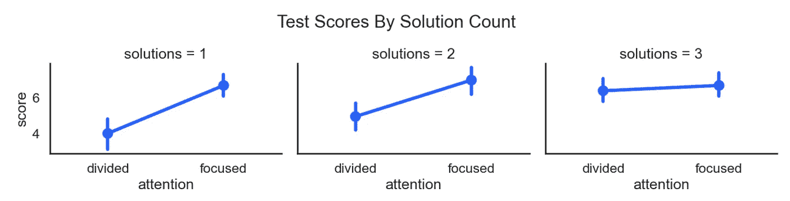

图片来源:作者用上面的代码生成的插图。

# 活火山

火山也是一个公共健康问题和话题。

根据维基百科，活火山是指目前正在喷发或可能在不久的将来喷发的火山。

然而，由于大规模火山爆发并不经常发生，大多数人都低估了它们的风险。但是历史告诉我们，这是愚蠢的，因为一些火山灾难会突然夺去成千上万人的生命。

因此，让我们使用人道主义数据交换中的一个数据集，看看活火山的分布情况(通过人口暴露指数来衡量)。

如果你不知道，人口暴露指数(简称 PEI)是评估火山潜在风险的最可靠的指数之一。某座火山的 PEI 值越高，住在附近的人就越应该担心。

现在，在我们继续之前，在下面的代码中需要记住一些事情。

我们将使用行继续符——通过在每一行的末尾使用反斜杠\\,以便使代码可读，同时仍然能够在一行代码中加载整个数据可视化。

我们还使用 pandas 查询方法只选择活火山。

解决了这个问题，让我们继续。

```
sns.histplot(data=pd.read_csv('https://data.humdata.org/dataset/'\
            +'a60ac839-920d-435a-bf7d-25855602699d/resource/'\
            +'e3b1ecf0-ec47-49f7-9011-6bbb7403ef6d/download/volcano.csv'\
                             ).query('H_active == 1'),
             x='PEI',
             discrete=True,
             kde=True,
             color=my_blue).set(
                                title='Active Volcanoes Dist. By Pop. Exposure Index',
                                xlabel='< Low Risk        ' + \
                                       'Population Exposure Index        ' + \
                                       'Higher Risk >',
                                ylabel='# of Active Volcanoes')
```

对于结果:

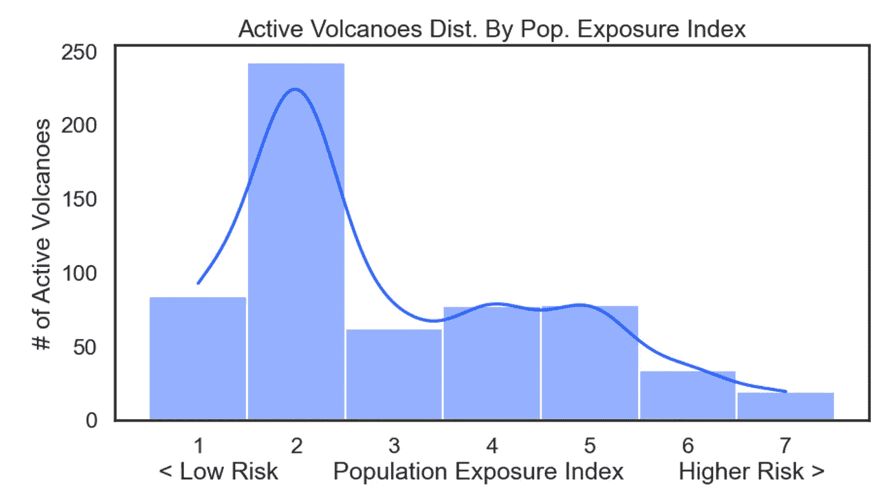

图片来源:作者用上面的代码生成的插图。

查看活火山分布的另一个有趣的方法是按地区查看它们。

所以让我们来看看火山最活跃的五个地区是什么。

PS:在下面的代码中，我们使用了 order 参数来控制水平条形图中显示的组的顺序。

```
sns.catplot(data = pd.read_csv('https://data.humdata.org/'\
            + 'dataset/a60ac839-920d-435a-bf7d-25855602699d/'\
            + 'resource/e3b1ecf0-ec47-49f7-9011-6bbb7403ef6d/'\
            + 'download/volcano.csv').query('H_active == 1')[['Region']],

            kind='count',
            y='Region',

            order = pd.read_csv('https://data.humdata.org/dataset/'\
            +'a60ac839-920d-435a-bf7d-25855602699d/resource/'\
            +'e3b1ecf0-ec47-49f7-9011-6bbb7403ef6d/download/'\
            + 'volcano.csv').query(
                  'H_active == 1')[[
                'Region'
            ]].value_counts().head(5).reset_index()['Region'],

            palette= my_palette,
            aspect=2.5,

            ).set(title='Number Of Active Volcanoes By Region',
                  ylabel='Region',
                  xlabel='# of Active Volcanoes',
                  label= 'lablezao')
```

对于结果:

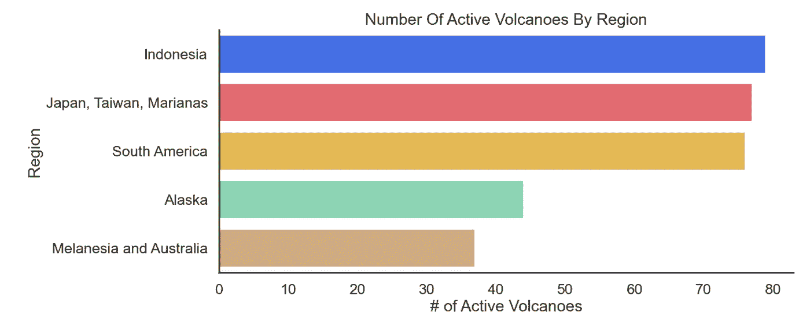

图片来源:作者用上面的代码生成的插图。

让我们添加条形标签来指定条形的值。

不幸的是，这无法在一行代码中完成，但无论如何在本文中值得一提。

```
plot = sns.catplot(data = pd.read_csv('https://data.humdata.org/'/
            +'dataset/a60ac839-920d-435a-bf7d-25855602699d/'\
            +'resource/e3b1ecf0-ec47-49f7-9011-6bbb7403ef6d/'\
            +'download/volcano.csv').query('H_active == 1')[['Region']],

            kind='count',
            y='Region',

            order= pd.read_csv('https://data.humdata.org/'\
            +'dataset/a60ac839-920d-435a-bf7d-25855602699d/'\
            +'resource/e3b1ecf0-ec47-49f7-9011-6bbb7403ef6d/'\
            +'download/volcano.csv').query(
                'H_active == 1')[[
                'Region'
            ]].value_counts().head(5).reset_index()['Region'],

            palette= my_palette,
            aspect=2.5,

            ).set(title='Number Of Active Volcanoes By Region',
                  ylabel='Region',
                  xlabel='# of Active Volcanoes',
                  label= 'lablezao')

plot.ax.bar_label(plot.ax.containers[0])
```

对于结果:

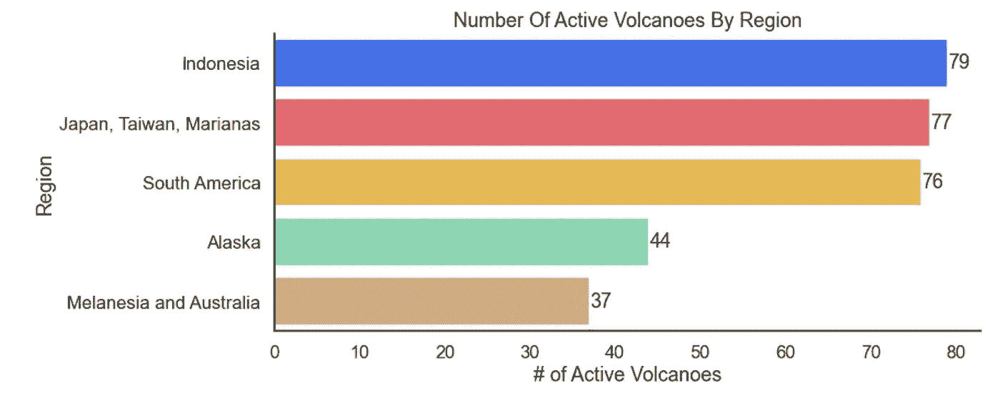

图片来源:作者用上面的代码生成的插图。

# 乌克兰和其他战区

根据国际人道主义法，蓄意攻击医疗设施和其他平民目标被视为战争罪。然而，这种性质的犯罪似乎每天都在乌克兰发生。

记住这一点，让我们调查一下自乌克兰战争开始以来，这种性质的犯罪发生的频率。

现在，在我们开始之前，在下面的代码中需要记住一些事情:

首先，我们在 read_csv 方法中使用了 parse_dates 和 infer_datetime_format 参数，以便轻松地将日期列解析为适当的格式。

我们还使用 pandas Grouper 方法对定期格式的日期时间数据进行分组。(这种方法在处理 datetime 时非常有用，所以如果您不熟悉它的工作方式，我强烈建议您查看一下[文档](https://pandas.pydata.org/docs/reference/api/pandas.Grouper.html))。

```
sns.lineplot(data=pd.read_csv('https://docs.google.com/'
             +'spreadsheets/d/e/2PACX-1vTDw_w3n9b0_frBtv'\
             +'JWtZTJGb5Bn72sZsjJSRXLhIxMa6I1ZECFj'\
             +'b1LTsTZ0PmIHiQOw4SEPCO4uIFv/pub?gid='\
             +'1932484940&single=true&output=csv',
             parse_dates=['ATTACKDATE'],
             infer_datetime_format=True).groupby(
                            pd.Grouper(
                                key='ATTACKDATE',
                                freq='MS'
                            )).count()[['ID']].reset_index(),

             x='ATTACKDATE',
             y='ID',
             color=my_blue).set(
                title='Attacks on Ukrainian Healthcare Facilities',
                ylabel='# of Attacks',
                xlabel='Attack Date')
```

对于结果:


图片来源:作者用上面的代码生成的插图。

战争罪不仅限于乌克兰战争，甚至援助人员也经常成为目标。

因此，让我们借助线图来看看援助人员在饱受战争蹂躏的国家被绑架的频率。

```
pd.read_excel('https://data.humdata.org/dataset/'\
              +'c3c3d829-a51f-4844-b405-ef02f7746fb8'\
              +'/resource/3129bb20-79ed-437b-9346-'\
              +'cfa8e2609a8f/download/'
              +'2022-aid-worker-kka-data-by-'\
              +'insecurity-insight.xlsx').drop(0)\
              .groupby(pd.Grouper(key='Date',freq='MS'))\
               ['Kidnapped 2022'].sum().plot.line(color=my_blue).\
                set(
                    title='Aid Workers Kidnapped (Worldwide)',
                    ylabel='# of Aid Workers Kidnapped')
```

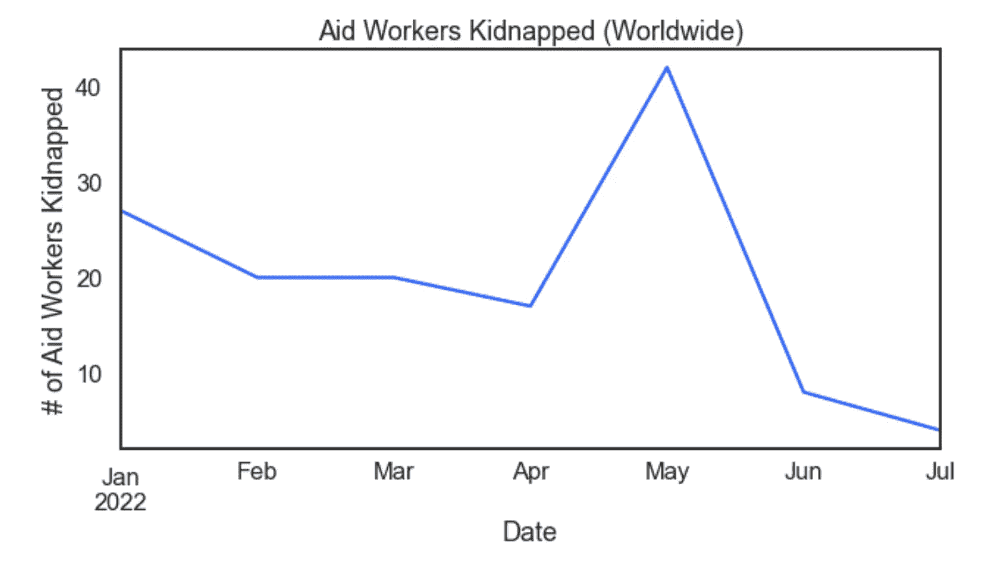

图片来源:作者用上面的代码生成的插图。

# 医护人员

医疗保健行业是一个人际关系极其重要的行业。

毕竟，大多数人只有在处于低谷时才会寻求专业帮助，因此，感受到与他人的联系和保护是至关重要的。

因此，不言而喻，如果我们不认真仔细地研究一下推动整个行业运转的健康专家，我们的分析将是不完整的。

例如，让我们从找出医疗保健行业中平均收入最高的职业开始分析。

现在，在我们继续之前，在下面的代码中需要注意一些事情:

*   首先，由于数据来源于一个 Html 页面，我们必须使用 requests get 方法来下载它…
*   我们还使用了 astype 函数来轻松转换 year 列的数据类型。
*   并且——一如既往——我们使用行继续符使这一大行代码易于阅读。

好了，现在让我们继续:

```
pd.DataFrame(requests.get('https://backend-api.datausa.io/'\
            +'api/data?CIP2=51&measure=Total%20Population,'\
            +'Total%20Population%20MOE%20Appx,Average%20Wage,'\
            +'Average%20Wage%20Appx%20MOE,yocpop%20RCA,'\
            +'Record%20Count&Workforce%20Status=true&drilldowns'\
            +'=Detailed%20Occupation&order=Total%20Population&'\
            +'sort=desc&Record%20Count>=5').json()['data'])\
                .astype({'Year':int}).query('Year == 2020').\
                    sort_values(by='Average Wage').tail(5)\
                        [['Detailed Occupation',
                          'Average Wage']].set_index(
                                           'Detailed Occupation')\
                            .plot.barh(color=my_blue,
                                       xticks = [i for i in range(0,
                                                                  300000,
                                                                  50000)],

                            ).set(
                                title='Top 5 Occupations by Average Wage',
                                ylabel='Occupation',
                                xlabel='Average Wage (in $)',
                                xticklabels = ([0]+[str(i)[:2]+','\
                                    +str(i)[2:] for i in range(50000,
                                                               100000,
                                                               50000)]\
                                    +[str(i)[:3]+','\
                                    +str(i)[3:] for i in range(100000,
                                                               300000,
                                                               50000)]))
```

对于结果:

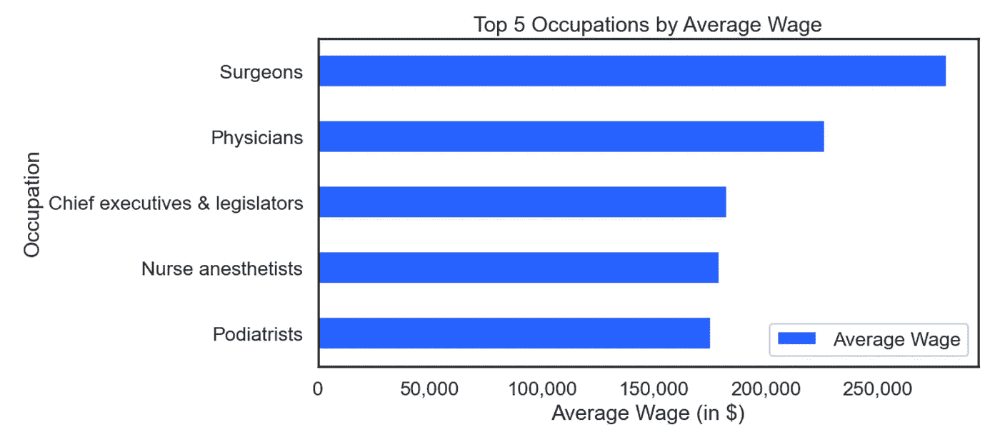

图片来源:作者用上面的代码生成的插图。

同样，您可以通过调用 bar_labels 方法向该图添加条形标签，并使其更有洞察力。

```
plot = pd.DataFrame(requests.get('https://backend-api.datausa.io/'\
            +'api/data?CIP2=51&measure=Total%20Population,'\
            +'Total%20Population%20MOE%20Appx,Average%20Wage,'\
            +'Average%20Wage%20Appx%20MOE,yocpop%20RCA,'\
            +'Record%20Count&Workforce%20Status=true&drilldowns'\
            +'=Detailed%20Occupation&order=Total%20Population&'\
            +'sort=desc&Record%20Count>=5').json()['data'])\
                .astype({'Year':int}).query('Year == 2020').\
                    sort_values(by='Average Wage').tail(5)\
                        [['Detailed Occupation',
                          'Average Wage']].set_index('Detailed Occupation')\
                            .plot.barh(color=my_blue,
                                       xticks = [i for i in range(0,
                                                                  300000,
                                                                  50000)],
                            )

plot.set(title='Top 5 Occupations by Average Wage',
       ylabel='Occupation',
       xlabel='Average Wage (in $)',
       xticklabels = ([0]+[str(i)[:2]+','+str(i)[2:] for i in range(50000,
                                                                    100000,
                                                                    50000)]\
       +[str(i)[:3]+','+str(i)[3:] for i in range(100000,
                                                  300000,
                                                  50000)]))
plot.bar_label(plot.containers[0],
            label_type='center',
             color = 'white')
```

对于结果:

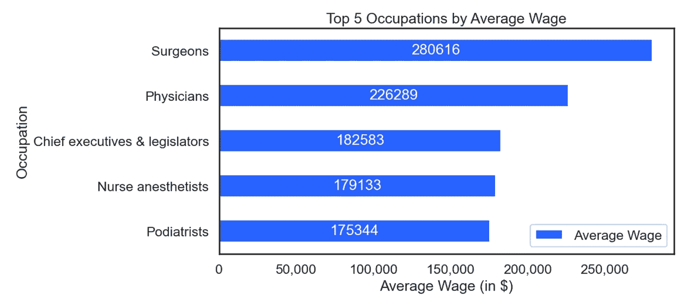

图片来源:作者用上面的代码生成的插图。

另一个值得从数据中挖掘的有意义的见解是显示拥有最多工人的职业。

```
pd.DataFrame(requests.get('https://backend-api.datausa.io'\
            +'/api/data?CIP2=51&measure=Total%20Population,'\
            +'Total%20Population%20MOE%20Appx,Average%20Wage,'\
            +'Average%20Wage%20Appx%20MOE,yocpop%20RCA,'\
            +'Record%20Count&Workforce%20Status=true&drilldowns'\
            +'=Detailed%20Occupation&order=Total%20Population&'\
            +'sort=desc&Record%20Count>=5').json()['data'])\
                .astype({'Year':int}).query('Year == 2020')\
                    [['Detailed Occupation',
                      'Total Population']].sort_values(
                                    by='Total Population',
                                    ascending=False)\
                        .head(5).set_index('Detailed Occupation')\
                            .plot.pie(y='Total Population',
                            colors=my_palette,
                            title='Top 5 Occupations by Total No. of Pros',
                            legend='',ylabel='',radius=1.2)
```

对于结果:

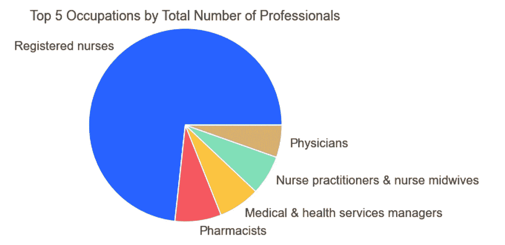

图片来源:作者用上面的代码生成的插图。

# 与工作有关的伤害

一些行业的工人比其他行业的工人面临更大的身体伤害风险，这大大影响了因工伤而休假的天数，这并不奇怪。

因此，考虑到这一点，我们可以从美国劳工部的工伤数据中获得一个有趣的见解，看看这一切到底是如何发生的。

```
sns.boxplot(data=pd.read_csv('https://corgis-edu.github.io/'\
            +'corgis/datasets/csv/injuries/injuries.csv'),
            y='industry.division',
            x='statistics.days away',
            palette=my_palette,
            whis=10).set(
    title='Days Away From Work Due to Work-Injuries By Industry',
    xlabel='Days Away From Work',
    ylabel='Industry',
    xbound= (-1,40))
```

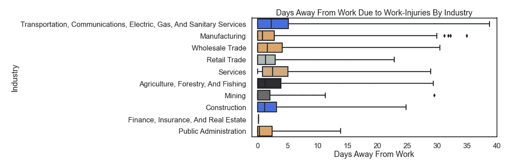

图片来源:作者用上面的代码生成的插图。

# Covid 数据

不管是好是坏，COVID 疫情标志着 21 世纪 20 年代的开始。数十亿人直接受到健康危机本身或其给世界大部分地区带来的经济后果的影响。

考虑到这一点，让我们仔细看看 covid 病例在疫情的前 12 个月中是如何发展的。

```
sns.lineplot(data=pd.read_csv('https://corgis-edu.github.io/'\
            +'corgis/datasets/csv/covid/covid.csv',
            parse_dates={'Date':[1,2]}).iloc[:50000],
            estimator=sum,
             x='Date',
             y='Data.Cases',
             hue='Location.Continent',
             ci=False,
             palette=my_palette[:6]).set(
    title='New Confirmed COVID Cases By Region',ylabel='New Cases',
             xlabel = 'Date (month-year)',
             xticklabels = (
                 ['12-19']\ 
                 + [f'0{i}-20' for i in range(1,10)]\
                 + [f'{i}-20' for i in range(10,12)]))
```

对于结果:

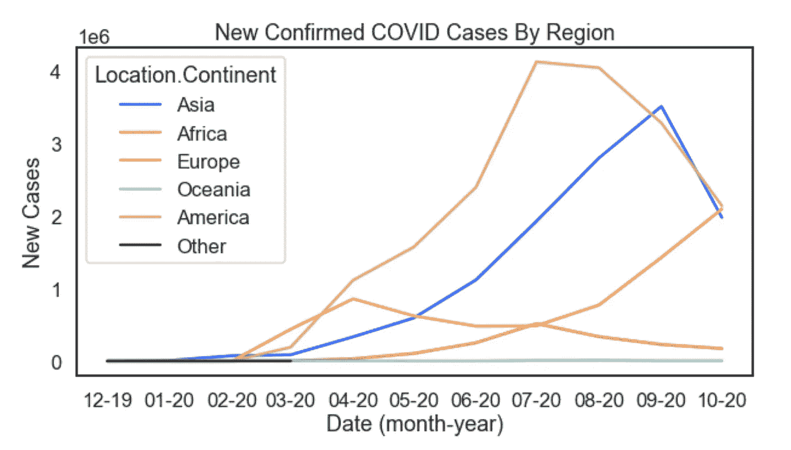

图片来源:作者用上面的代码生成的插图。

# 酒精和毒品消费

医学文献早已证实，酗酒与使用其他药物高度相关。

因此，记住这一点，让我们从物质滥用和精神健康数据档案中载入数据集，亲眼看看这种相关性的程度。

在下面的代码中，我们将在 plot.scatter 方法中使用参数“s ”(代表大小)来添加大麻使用的第三个维度。这种三维散点图也被称为气泡图，当你认为有多个变量值得关注时，它可以非常方便地发现视觉相关性。

我们还将在. figure.legend()方法中使用 bbox_to_anchor 参数，以便将图例框移动到绘图的右下角。

```
pd.read_csv('https://corgis-edu.github.io/'\
            +'corgis/datasets/csv/drugs/drugs.csv').query('Year == 2018')\
            [['Rates.Alcohol.Use Disorder Past Year.26+',
              'Rates.Illicit Drugs.Cocaine Used Past Year.26+',\
              'Rates.Marijuana.Used Past Year.26+']].plot.scatter(
                    x = 'Rates.Alcohol.Use Disorder Past Year.26+',
                    y = 'Rates.Illicit Drugs.Cocaine Used Past Year.26+',
                    s = (pd.read_csv('https://corgis-edu.github.io/'\
                        +'corgis/datasets/csv/drugs/drugs.csv').query(
                        'Year == 2018')\
                        ['Rates.Marijuana.Used Past Year.26+']*100)**2,
                    c = my_blue,
                    title='Alcohol Use Disorder Vs Cocaine Use '\
                          +'In People Over 26 by State',
                xlabel='% of People With Alcohol Use Disorders',
                ylabel='% of People Who Used Cocaine Past Year')\
                .figure.legend(['Size of Circle Indidates '\
                                +'Marijuana Usage Rates'],
                               bbox_to_anchor=(0.5,
                                               0,
                                               0.5,
                                               0))
```

对于结果:

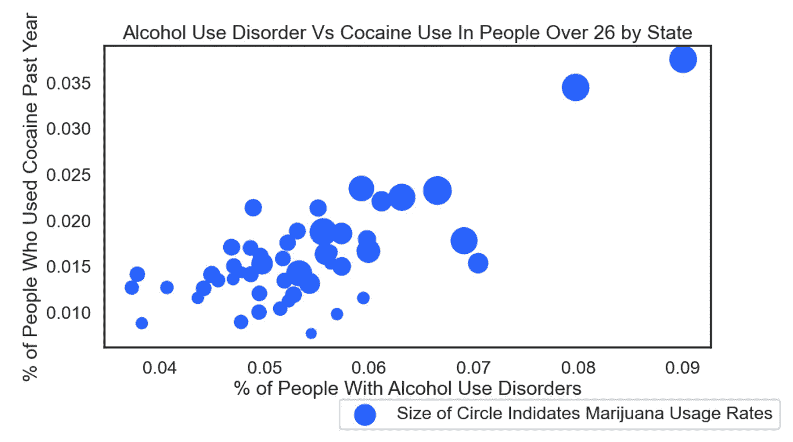

图片来源:作者用上面的代码生成的插图。

稍加修改，我们就可以将这种三向关系形象化为关联矩阵热图。

```
sns.heatmap(
pd.read_csv('https://corgis-edu.github.io/'\
            +'corgis/datasets/csv/drugs/drugs.csv').query('Year == 2018')\
            [['Rates.Alcohol.Use Disorder Past Year.26+',
              'Rates.Illicit Drugs.Cocaine Used Past Year.26+',\
              'Rates.Marijuana.Used Past Year.26+']].corr(),
    annot=True, cmap=my_blues_d)
```

对于结果:

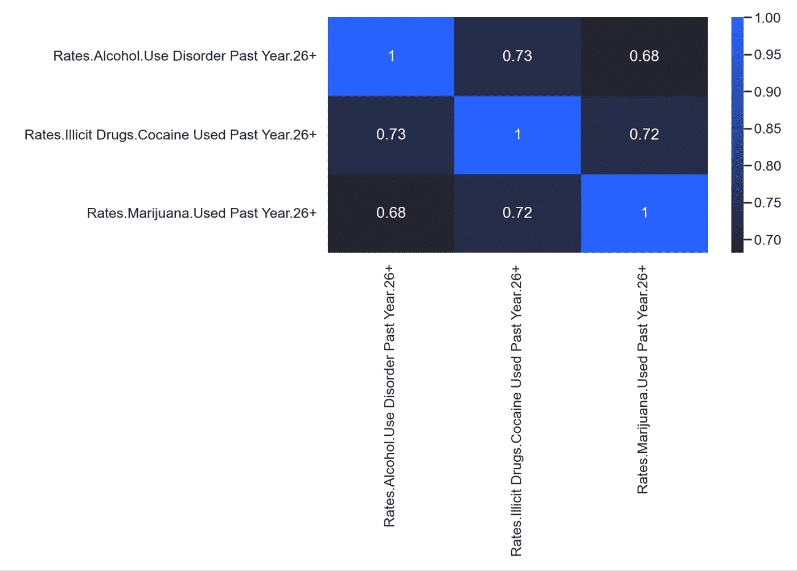

图片来源:作者用上面的代码生成的插图。

# 选定的限制

这篇文章有一些限制和警告。

## 风格

本文中的代码示例打破了许多编码风格惯例。不要把这篇文章作为风格的范本！

## 行延续

对于一些例子，本文使用了行继续符。在 Python 中，反斜杠`\`完成行的延续。另一种实现行连续的技术是 Python 允许代码在逗号之间的下一行继续。

就本文而言，换行(或续行)不算第二行代码。

## 串并置

行延续和字符串连接使得代码在介质上更具可读性。为了使代码在中型平台上看起来更好，并避免奇怪的换行，本文还大量使用了字符串连接。

## 索引列表表格列表

阅读`pd.read_html()`的文档。这个熊猫代码返回熊猫数据帧的列表。方括号中的列表索引，比如`pd.read_html()[i]`起作用，其中 I 代表 read_html 方法返回的列表上的索引。

## 获取数据

本文还使用`requests.get().json()`和`requests.get().json()[data]`从网上抓取 JSON 数据。

# 感谢阅读

你准备好了解更多关于数据科学职业的信息了吗？我进行一对一的职业辅导，并有一份每周电子邮件列表，帮助专业求职者获取数据。[点击此处了解更多](http://coaching.adamrossnelson.com/)。

[](https://coaching.adamrossnelson.com/) [## Adam Ross Nelson 博士提供的数据科学职业指导

### 快速成为一名数据科学家。-为当前和未来的数据科学和机器学习提供职业指导…

coaching.adamrossnelson.com](https://coaching.adamrossnelson.com/) 

感谢阅读。把你的想法和主意发给我。你可以写信只是为了说声嗨。如果你真的需要告诉我是怎么错的，我期待着尽快和你聊天。推特:[@ adamrossnelson](https://twitter.com/adamrossnelson)LinkedIn:[亚当罗斯尼尔森](https://www.linkedin.com/in/arnelson/)。

# 相关阅读

[](https://medium.com/geekculture/48-data-visualizations-that-load-in-a-single-line-of-code-a0be5bea903b) [## 在一行代码中加载 48 种数据可视化

### 如何即时提取几十个政治、体育、教育和其他数据可视化示例中的一个。

medium.com](https://medium.com/geekculture/48-data-visualizations-that-load-in-a-single-line-of-code-a0be5bea903b) [](https://towardsdatascience.com/93-datasets-that-load-with-a-single-line-of-code-7b5ffe62b655) [## 用一行代码加载 93 个数据集

### 你如何即时地从几十个例子中找出一个政治、体育、教育和其他框架。

towardsdatascience.com](https://towardsdatascience.com/93-datasets-that-load-with-a-single-line-of-code-7b5ffe62b655)