# 你应该跟进的 10 篇 NeRF 论文—第 1 部分

> 原文：<https://pub.towardsai.net/10-nerf-papers-you-should-follow-up-part-1-9566707b8f30?source=collection_archive---------0----------------------->

## [计算机视觉](https://towardsai.net/p/category/computer-vision)

## 向 NeRF 研究人员推荐 10 篇论文。第 2 部分将很快推出。

人类通常从眼睛获取大部分信息。计算机视觉已经在许多任务中显示出成功的性能，在处理视觉数据时减少了人工劳动。近年来，视觉渲染已经成为计算机视觉中最热门的领域之一。NeRF 是 Neural Radiance Fields 的缩写，在渲染方面表现出了令人难以置信的性能，在真实场景中实现了可靠而逼真的渲染。对于研究者来说，一篇影响很大的论文，涉及的利益很大；然而，由于变种数量激增，很难跟进。在本文中，我们将深入研究 NeRF 和后续论文的摘要。本文主要介绍 NeRF 的变体。这是我的文章中介绍的论文列表。

1.  NeRF:将场景表示为用于视图合成的神经辐射场
2.  NeRF++分析和改进神经辐射场
3.  野外的 NeRF:无约束照片集的神经辐射场
4.  NSVF:神经稀疏体素场
5.  动态场景的神经辐射场
6.  DeRF:分解辐射场
7.  用于实时视图合成的烘焙神经辐射场
8.  基洛纳夫:用数千个微小的 MLP 加速神经辐射场
9.  深度监督的 NeRF:更少的视图和更快的免费训练
10.  自校准神经辐射场

# 1.NeRF:将场景表示为用于视图合成的神经辐射场(第一个 NeRF)

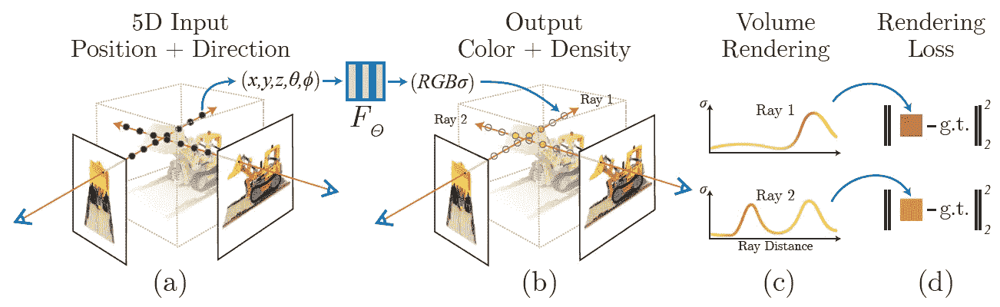

NeRF 建筑插图。

论文链接:【https://arxiv.org/abs/2003.08934】
作者:[本·米尔登霍尔](https://arxiv.org/search/cs?searchtype=author&query=Mildenhall%2C+B)，[普拉图尔·p·斯里尼瓦桑](https://arxiv.org/search/cs?searchtype=author&query=Srinivasan%2C+P+P)，[马修·坦西克](https://arxiv.org/search/cs?searchtype=author&query=Tancik%2C+M)，[乔纳森·t·巴伦](https://arxiv.org/search/cs?searchtype=author&query=Barron%2C+J+T)，[拉维·拉马穆尔蒂](https://arxiv.org/search/cs?searchtype=author&query=Ramamoorthi%2C+R)，[任 Ng](https://arxiv.org/search/cs?searchtype=author&query=Ng%2C+R)
大会:ECCV20 **(最佳论文荣誉奖)**

**描述**

*   第一篇论文提出了 NeRF 架构。他们处理**视图依赖**问题。由于光的属性，例如反射，通过接收观察方向作为输入，对象根据它们的观察方向具有不同的颜色。
*   给定规范空间中的位置向量和观察方向，网络输出颜色和体积密度。下图显示了网络架构。

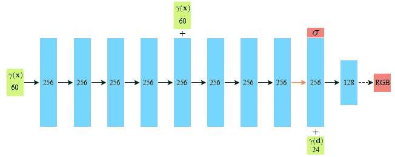

*   该模型是端到端设计的。对于来自训练图像的每条射线，该模型通过对分层采样的射线中的点的体积密度进行颜色加权求和来呈现射线的颜色。详情建议参考论文。训练目标是每条射线的预测颜色与地面真实颜色的 L2 差。
*   他们采用了两种稳定有效的训练策略，即**分层体积采样**和**位置编码**。

# 2.NeRF++分析和改进神经辐射场

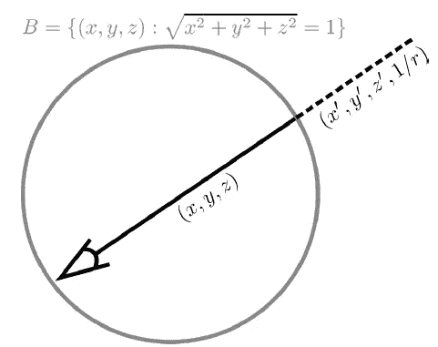

反向球面参数化

论文链接:[https://arxiv.org/abs/2003.08934](https://arxiv.org/abs/2010.07492)

**描述**

*   **动机**:原 NeRF 由于背景深度设置模糊，室外场景渲染困难。换句话说，NeRF 无法渲染无界场景。NeRF++通过**分离前景和背景采样**来解决这个问题。
*   他们设置单位球来分离场景的前景和背景。**对于前景**中的点，也就是单位球面内的点，**它们遵循与原始 NeRF** 相同的方法。但是，对于背景中的**点，也就是单位球面外的点，**用其距离**重新参数化坐标。因此，前景网络接收 5 维输入；然而，背景网络接收 6 维输入。**

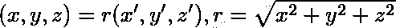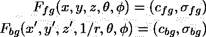

# 3.野外的 NeRF:无约束照片集的神经辐射场

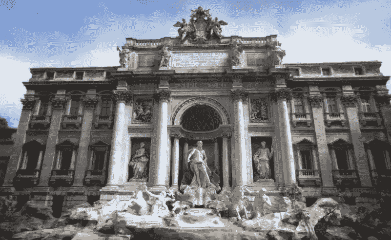

论文链接:[https://arxiv.org/abs/2008.02268](https://arxiv.org/abs/2008.02268)
作者:[里卡多·马丁-布鲁阿拉](https://arxiv.org/search/cs?searchtype=author&query=Martin-Brualla%2C+R)，[诺哈·拉德万](https://arxiv.org/search/cs?searchtype=author&query=Radwan%2C+N)，[迈赫迪·s·m·萨贾迪](https://arxiv.org/search/cs?searchtype=author&query=Sajjadi%2C+M+S+M)，[乔纳森·t·巴伦](https://arxiv.org/search/cs?searchtype=author&query=Barron%2C+J+T)，[阿列克谢·多索维茨基](https://arxiv.org/search/cs?searchtype=author&query=Dosovitskiy%2C+A)，[丹尼尔·杜克沃斯](https://arxiv.org/search/cs?searchtype=author&query=Duckworth%2C+D)
大会:CVPR20 口述

**描述**

*   **动机**:虽然 NeRF 极大地影响了渲染任务，但是它需要在静态条件下捕获的图像集合，可以忽略的光照变化，以及场景中没有瞬态对象。相比之下，NeRF-W 能够从**不受约束的照片集中进行可靠的渲染，尤其是从互联网**上收集的照片。
*   所提出的模型在渲染过程中分离了**静态**和**瞬态**对象。由于瞬态物体在不同场景中不一定位于它们当前的姿态，它们的模型计算光线的**不确定性**。然后，基于计算的不确定性，他们的模型较少关注具有高不确定性的射线。
*   在我个人看来，在无约束的照片集上定义一个评价指标是一个具有挑战性和争议性的问题。本文很好地提出了一个具有令人信服的直觉的评价指标。要了解更多信息，我强烈推荐阅读这篇文章。

# 4.NSVF:神经稀疏体素场

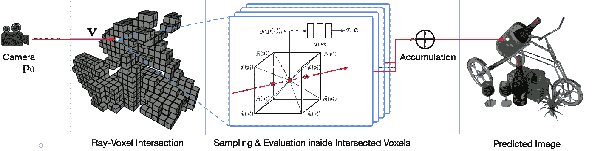

论文链接:
作者:[刘凌杰](https://arxiv.org/search/cs?searchtype=author&query=Liu%2C+L)，[顾](https://arxiv.org/search/cs?searchtype=author&query=Gu%2C+J)，[蔡卓琳](https://arxiv.org/search/cs?searchtype=author&query=Lin%2C+K+Z)，[蔡达生](https://arxiv.org/search/cs?searchtype=author&query=Chua%2C+T)， [Christian Theobalt](https://arxiv.org/search/cs?searchtype=author&query=Theobalt%2C+C)
发布会:NeurIPS20(聚焦)

**描述**

*   **动机**:提高推理时间是 NeRF 应该克服的一个关键挑战。他们指出，当累积的 alpha 值几乎为 1 时，光线中的最后一个点是不必要的。此外，对于正则空间中体积密度较小的部分，我们可以省略渲染。作者在各种数据集上实验性地展示了他们的灵感。
*   从大的体素尺寸开始，所提出的模型**修剪体积密度低于某个阈值**的体素。然后，它减少体素的大小。重复上述过程，他们获得具有小体素尺寸的体素八叉树。在推理时间内，当一个点位于修剪后的体素 l 内时，他们跳过渲染该点。此外，他们采用早期光线终止，当累积的 alpha 值高于阈值时，该终止会忽略渲染。
*   写得很好的论文。这里的想法鼓励了未来的工作，以改善 NeRF 的推理时间。

# 5.动态场景的神经辐射场

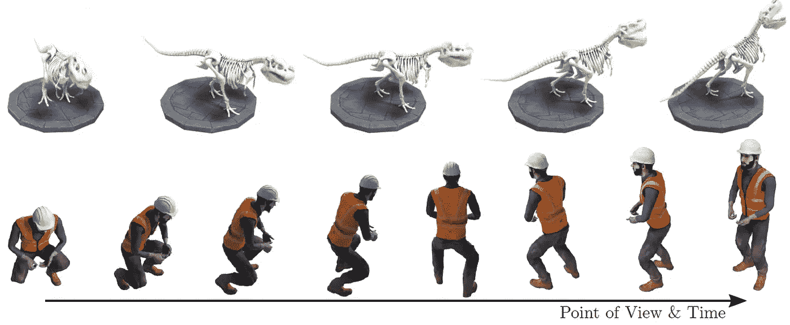

论文链接:[https://arxiv.org/abs/2011.13961](https://arxiv.org/abs/2011.13961)
作者:[阿尔伯特](https://arxiv.org/search/cs?searchtype=author&query=Pumarola%2C+A)、[恩里克](https://arxiv.org/search/cs?searchtype=author&query=Corona%2C+E)、[杰拉德【庞斯-莫尔】、](https://arxiv.org/search/cs?searchtype=author&query=Pons-Moll%2C+G)[弗朗切斯克](https://arxiv.org/search/cs?searchtype=author&query=Moreno-Noguer%2C+F)、
大会:CVPR21

**描述**

*   **动机** : D-NeRF 实现了动态场景的渲染。所提出的模型对于每个时间戳只需要一个视图，这表明它非常适用于真实世界的渲染。
*   想法很简单。他们添加了一个名为**的变形网络**，预测某个地点在特定时间的位置差。利用变形网络的估计位置，规范网络预测颜色和体积密度。

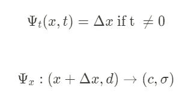

*   这个想法简单而直观。这项工作是有意义的，因为它能够为每个时间戳提供单一视图的视频。我希望很快 D-NeRF 的变体能够渲染包含背景的真实世界场景。

# 6.DeRF:分解的神经辐射场

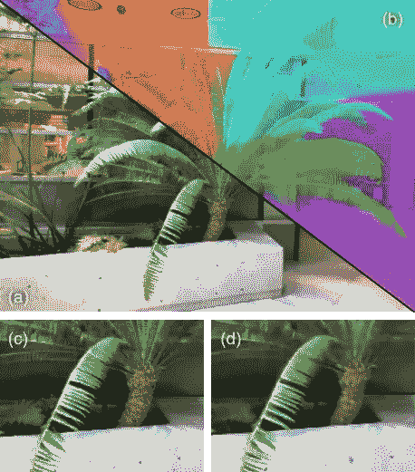

论文链接:【https://arxiv.org/abs/2011.13961】
作者:[丹尼尔·热班](https://arxiv.org/search/cs?searchtype=author&query=Rebain%2C+D)[姜维](https://arxiv.org/search/cs?searchtype=author&query=Jiang%2C+W)[索罗什·亚兹达尼](https://arxiv.org/search/cs?searchtype=author&query=Yazdani%2C+S)[李柯](https://arxiv.org/search/cs?searchtype=author&query=Li%2C+K)[光武义](https://arxiv.org/search/cs?searchtype=author&query=Yi%2C+K+M)[安德里亚·塔利亚萨基](https://arxiv.org/search/cs?searchtype=author&query=Tagliasacchi%2C+A)
发布会:CVPR21

**描述**

*   **动机**:转发一个大型 MLP 网络比转发多个小型 MLP 网络需要更大的计算预算。通过将场景分解成多个 MLP 网络，他们减少了渲染过程中的计算量。
*   当在特定的 3D 点中渲染颜色和体积密度时，他们明确地学习每个 MLP 的重要性。关于 l1 到计算的距离参数，他们对来自每个 MLP 网络的渲染颜色进行加权。
*   使用**画师算法**，模型从**向后到**渲染到外部缓冲区。

# 7.用于实时视图合成的烘焙神经渲染场

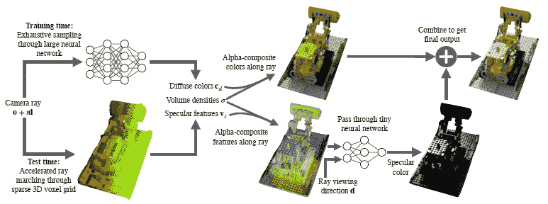

论文链接:[https://arxiv.org/abs/2011.13961](https://arxiv.org/abs/2103.14645)
作者:[彼得·海德曼](https://arxiv.org/search/cs?searchtype=author&query=Hedman%2C+P)，[普拉图尔·p·斯里尼瓦桑](https://arxiv.org/search/cs?searchtype=author&query=Srinivasan%2C+P+P)，[本·米尔登霍尔](https://arxiv.org/search/cs?searchtype=author&query=Mildenhall%2C+B)，[乔纳森·t·巴伦](https://arxiv.org/search/cs?searchtype=author&query=Barron%2C+J+T)，[保罗·德贝维奇](https://arxiv.org/search/cs?searchtype=author&query=Debevec%2C+P)
会议:ICCV21

**描述**

*   **动机**:尽管 NeRF 的许多变种都提高了推理时间，但实现实时渲染仍然具有挑战性。通过分离**镜面颜色**和**阿尔法合成颜色**，它们在保持渲染质量的同时，最大限度地减少了推理时间内的计算。
*   作者提出了被称为**镜面特征**的特征，其隐含地编码视点相关的颜色，即**镜面颜色**。此外，从经过训练的 NeRF 网络中，他们基于 3D 规范空间中的估计体积密度生成**稀疏体素网格**。
*   将生成的稀疏体素网格的颜色存储到纹理图谱中，在推理时间内**跳过渲染**。最终，在推断时间内唯一需要计算的是一个微小的 MLP 网络渲染的视图相关颜色。

# 8.基洛纳夫:用数千兆像素加速神经辐射场

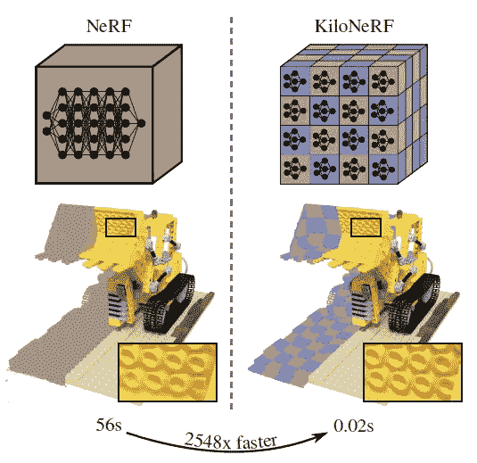

论文链接:
作者:[克里斯蒂安·赖泽](https://arxiv.org/search/cs?searchtype=author&query=Reiser%2C+C)，[宋有朋](https://arxiv.org/search/cs?searchtype=author&query=Peng%2C+S)，[伊一·廖](https://arxiv.org/search/cs?searchtype=author&query=Liao%2C+Y)，[安德里亚斯·盖格](https://arxiv.org/search/cs?searchtype=author&query=Geiger%2C+A)
会议:ICCV21

**描述**

*   **动机**:动机类似于“DeRF:分解神经辐射场”的动机。所提出的算法首先用成千上万个小得多的网络划分规范空间。
*   将训练好的香草神经纤维网络设置为教师模型，他们**将教师模型提炼为多个网络**。为了选择合适的网络，他们定义了一个映射函数。简单地提取教师网络无法生成可靠的场景。因此，他们将 **L2 正则化**应用于网络最后两层的权重和偏差。

# 9.深度监督的 NeRF:更少的视图和更快的免费训练

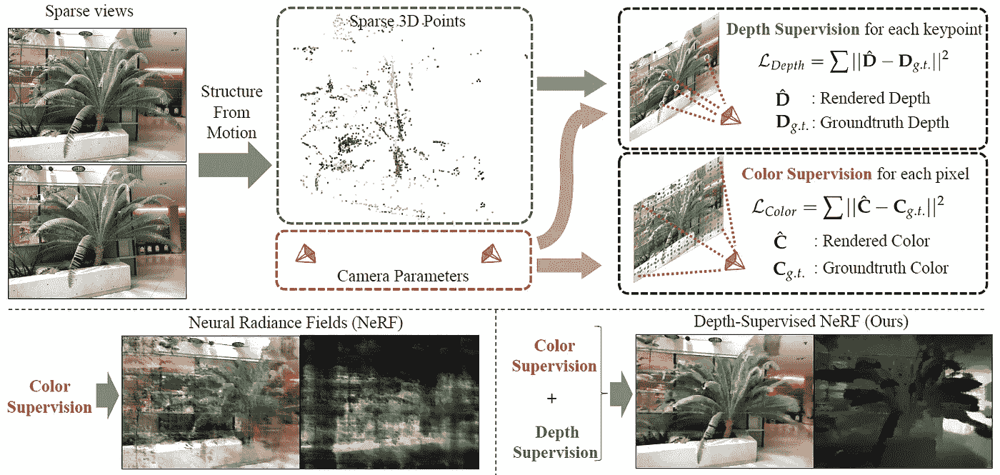

论文链接:
作者:[乐康](https://arxiv.org/search/cs?searchtype=author&query=Deng%2C+K)，[廖骏伦](https://arxiv.org/search/cs?searchtype=author&query=Liu%2C+A)，[朱俊彦](https://arxiv.org/search/cs?searchtype=author&query=Zhu%2C+J)，[提婆拉玛南](https://arxiv.org/search/cs?searchtype=author&query=Ramanan%2C+D)
会议:ICCV21

**描述**

*   **动机** : NeRF 需要一组图像和图像对应的相机姿态。在一般的 SfM 中，相机姿态是用深度值来估计的。但是，NeRF 会忽略估计的深度值。作者认为来自深度值的**监督有利于 NeRF** 学习**精确的体积密度**，从而产生更好的渲染精度。
*   通过训练的体积密度，他们可以估计每条射线的深度。他们提出的深度损失的目标是通过附加的显式损失项来学习精确的深度值。

# 10.自校准神经辐射场

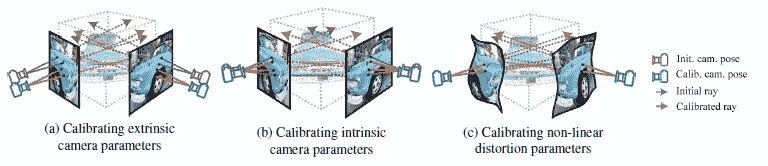

论文链接:[https://arxiv.org/abs/2011.13961](https://arxiv.org/abs/2108.13826)
作者:[郑允佑](https://arxiv.org/search/cs?searchtype=author&query=Jeong%2C+Y)，[安雪君](https://arxiv.org/search/cs?searchtype=author&query=Ahn%2C+S)，[蔡克明](https://arxiv.org/search/cs?searchtype=author&query=Choy%2C+C)， [Animashree Anandkumar](https://arxiv.org/search/cs?searchtype=author&query=Anandkumar%2C+A) ，[苏民町](https://arxiv.org/search/cs?searchtype=author&query=Cho%2C+M)，[宰植公园](https://arxiv.org/search/cs?searchtype=author&query=Park%2C+J)
会议:ICCV21

**描述**

*   **动机**:一般 NeRF 框架假设使用 COLMAP 估计的相机信息足够准确。由于 NeRF 的目标是使网络过度适应场景，因此估计的相机信息的准确性至关重要。
*   作者提出了一个扩展的相机模型来反映相机中的复杂噪声。通过**联合优化相机和 NeRF 参数**，SCNeRF 无需仔细校准相机信息即可进行渲染。此外，该算法产生了比普通 NeRF 和 NeRF++更好的渲染质量。

我们很快会带着第二部分的附加论文回来。如果文章有益有趣，请关注我的个人账户。
LinkedIn:[https://www.linkedin.com/in/yoonwoo-jeong-6994ab185/](https://www.linkedin.com/in/yoonwoo-jeong-6994ab185/)
GitHub:[https://github.com/jeongyw12382](https://github.com/jeongyw12382?tab=repositories)
邮件:jyw123822@gmail.com