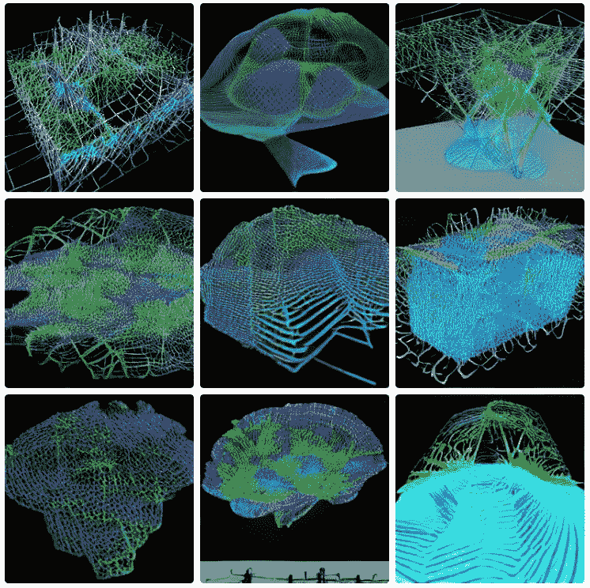

# 人工智能最重要的 10 个递归神经网络

> 原文：<https://pub.towardsai.net/10-of-the-most-important-recurrent-neural-networks-for-ai-8de9989db315?source=collection_archive---------3----------------------->

## 递归神经网络的优势以及十大网络、顶级用例、挑战和最佳实践

由来自 Pexels 的 [Pixabay](https://www.pexels.com/@pixabay/)

# 递归神经网络是可以根据随时间变化的数据进行预测的神经网络。

## 更多技术信息:

递归神经网络(RNN)是一种人工智能，用于对显示时间或顺序行为的数据进行建模[1]。这种类型的神经网络非常适合手写识别和机器翻译任务。rnn 可以学习数据中的复杂模式，并长期存储信息。

传统的神经网络不太适合[25]对表现出时间或顺序行为的数据进行建模，因为传统的神经网络将每个输入向量视为独立的观察值[2]。rnn 旨在通过整合反馈回路来模拟数据序列，从而允许网络保持“记忆”[3]，有效地允许 rnn 长时间学习模式。

有两种公认的递归神经网络:Elman 网络和 Jordan 网络[4]。Elman networks 是 RNN 开发的早期实施方案，也是跨用例采用和部署的简单终端。另一方面，与 Elman 网络相比，Jordan 网络是最近才发展起来的。

Elman 网络包含一个隐藏层和一个输出层。隐藏层包含一组完全连接到输入和输出层的神经元。隐藏层还包含一组与其自身相连的神经元(自循环)。这种自我连接形成了一个反馈回路，使网络能够保持“记忆”

Jordan 网络类似于 Elman 网络，但它们包含两个隐藏层，而不是一个。第一个隐藏层完全连接到输入层，但不连接到第二个隐藏层。第二隐藏层连接到第一和输出层。像 Elman 网络一样，Jordan 网络在每个隐藏层中也包含自循环连接。实际上，这些通过连接的反馈回路允许乔丹网络比埃尔曼网络模拟更复杂的模式。

作者创造的形象

# **递归神经网络的优势(持续更新)**

与传统的神经网络相比，RNNs 有几个优点。首先，RNNs 可以学习传统神经网络无法学习的数据中的复杂模式。其次，RNNs 可以长时间存储信息，这对于机器翻译这样的任务来说是必不可少的。最后，与传统的神经网络相比，RNNs 不太可能过度拟合训练数据[5]。另外:

1.卷积神经网络(CNN)[6]更擅长检测空间数据中的模式，使它们更有效地用于图像识别任务。

2.rnn 可以学习序列模式，这使它们成为语言建模和机器翻译的理想选择。

3.rnn 可以记住长期依赖关系，允许它们有效地模拟复杂的现实世界问题。

4.rnn 对噪声和异常值更鲁棒，使它们不太可能过度拟合训练数据。

5.由于参数数量减少，rnn 比传统的神经网络更容易训练。

来自 Pexels 的 [DS stories](https://www.pexels.com/@ds-stories/)

# **十大递归神经网络**

1.递归神经网络(RNN)是一种人工神经网络，其中节点之间的连接沿着时间序列形成有向图[26]。这允许它展示一个时间序列或文本的动态行为。

2.Elman 网络是一种递归神经网络，其中隐含层包含一个抽头延迟线。

3.Jordan 网络类似于 Elman 网络，但是具有从隐藏层到输出层的双向连接。

4.Hopfield 网络[7]是具有联想记忆的递归神经网络。

5.长短期记忆(LSTM)是一种 RNN，旨在学习长期依赖性。

6.门控循环单元(GRU) [8]是另一种类型的 RNN，使用门来控制信息流。

7.回声状态网络(ESN) [9]是一种递归神经网络，具有随机连接的隐藏层。

8.神经历史压缩(NHC)是一种递归神经网络，使用 Hebbian 学习[10]来记忆其输入/输出模式。

9.时间相关性发现网络(tcdn)[11]是一种 RNN，可以发现数据流中隐藏的相关性。

10.脉冲神经网络(SNNs) [12]是一种通过使用脉冲代替传统的人工神经元来模拟神经元活动的神经网络。

# **顶级用例(持续更新)**

简单列出，没有拆开个性化的细节:

1.自然语言处理:情感分析、主题建模、命名实体识别；

2.时间序列分析:预测、异常检测；

3.计算机视觉:图像分类、物体检测、分割；

4.音频分析:语音识别、音乐推荐；和

5.推荐系统:产品推荐，用户分析。

作者 Pixabay

# **顶级挑战(持续更新)**

使用 RNNs 有一些缺点。首先，由于消失梯度问题，RNNs 可能难以训练[13]。其次，训练 RNNs 在计算上可能很昂贵。第三，rnn 往往需要大量的训练数据才能有效学习。

当网络试图学习长期依赖关系时，误差梯度变得非常小，使得网络难以学习复杂的模式，这时就会出现消失梯度问题。已经提出了几种方法来解决消失梯度问题。一种方法是使用不同的激活函数，如整流线性单元(RELU) [14]。另一种方法是使用不同类型的 RNN，如长短期记忆(LSTM) [15]网络(LSTM 网络是一种 RNN，旨在解决消失梯度问题。)

## 另外:

1.递归神经网络面临的最大挑战之一是有效地训练它们。这是因为它们对输入的变化非常敏感，这使得训练它们变得困难。

2.另一个挑战是，递归神经网络在时间和计算能力方面可能是非常资源密集型的，这使得它们对于许多应用来说是不切实际的。

3.递归神经网络易受过度拟合的影响，这意味着它们可能在训练[27]数据上表现良好，但不能很好地推广到新数据。

4.最后，递归神经网络可能不稳定，每次训练或运行时，即使输入相同，它们也可能产生不同的结果。

来自 Pexels 的 Markus Spiske

# **将递归神经网络应用于机器学习问题的最佳实践(持续更新)**

1.在训练您的模型时，请始终使用训练/测试/验证分割，以帮助防止过度拟合，并在看不见的数据上为您提供模型性能的更准确估计。

2.规范化您的输入数据。这将有助于您的模型更快地收敛并提高其准确性。

3.使用 2 的幂作为批量大小有助于确保模型训练的效率和效果。

4.使用介于 0.001 和 0.0001 [19]之间的学习率可获得最佳结果。过大的学习率会导致模型发散，而过小的学习率会导致模型收敛时间过长。

5.使用 L1 或 L2 正则化[16]你的重量，以防止过度拟合。

6.在你的网络中的每个完全连接的层之后添加 dropout [16],作为一种正则化形式来进一步防止过度拟合。

7.尽可能使用 ReLU 激活函数[14],因为它们比其他激活函数收敛得更快。

8.尽可能使用 Xavier 初始化你的权重来帮助控制渐变的比例，防止渐变爆炸。

9.如果可能的话，用小批量[17]训练你的模型。这将有助于减少训练模型所需的时间，并提高收敛速度和准确性。

10.如果您正在训练深度神经网络，请使用适当的优化器，如 Adam、RMSprop 或 SGD with momentum [21][22][23]。

11.使用适当的度量(如损失函数值和精确度)来监控模型的训练进度，以帮助确保模型按预期收敛，并尽早识别潜在问题。

12.使用早期停止来防止验证集过度拟合，以确保您的最终模型是可概括的，并且不会过度拟合验证数据。

13.培训后保存您的模型，以便您可以在以后需要时重用它们，而不必每次都从头开始重新培训。

14.在生产中部署您的模型时，监视其性能以尽早捕捉任何潜在的问题(并在必要时相应地更新您的模型)。

如果您有任何编辑/修改建议或关于进一步扩展此主题的建议，请考虑与我分享您的想法。

# 另外，请考虑订阅我的每周简讯:

 [## 周日报告#1

### 设计思维与 AI 的共生关系设计思维能向 AI 揭示什么，AI 又能如何拥抱…

pventures.substack.com](https://pventures.substack.com/) 

# **我写了以下与这篇文章相关的内容；他们可能与你有相似的兴趣:**

## 1.我最近写了关于机器学习的贝叶斯推理

 [## 贝叶斯推理:机器学习的 5 个最佳模型和 10 个最佳实践

### 将贝叶斯推理应用于机器学习问题的优势、5 大模型和 10 大最佳实践

medium.com](https://medium.com/@AnilTilbe/bayesian-inference-the-best-5-models-and-10-best-practices-for-machine-learning-11238a43929e) 

## 2.非结构化数据与结构化数据

 [## 非结构化数据与结构化数据:5 个最重要的区别

### 结构化数据、非结构化数据的分类、各自的优势，以及如何将它们部署在一起…

medium.com](https://medium.com/@AnilTilbe/unstructured-vs-structured-data-the-5-most-important-differences-8d86078a163b) 

## 3.回归分析

 [## 回归分析极其困难:不编码如何掌握它

### 对关键概念、3 个经过实战检验的模型和 3 个挑战有一个很好的基本理解，包括…

medium.com](https://medium.com/@AnilTilbe/regression-analysis-is-exceedingly-difficult-how-to-master-it-without-coding-542ae1d6edaf) 

*参考文献。*

*1。杰尼特，y .，格雷夫，e .，朱林，a .，&# 38；t .米科洛夫(2016 年 11 月 18 日)。递归神经网络中的变量计算。ArXiv.Org。*[*https://arxiv.org/abs/1611.06188*](https://arxiv.org/abs/1611.06188)

*2。基于递归神经网络的限价委托单序列分类。(未注明)。计算科学杂志，24，277–286。*[*https://doi.org/10.1016/j.jocs.2017.08.018*](https://doi.org/10.1016/j.jocs.2017.08.018)

*3。PredRNN:用于时空预测学习的递归神经网络。(未注明)。IEEE Xplore。检索到 2022 年 7 月 19 日，来自*[【https://ieeexplore.ieee.org/abstract/document/9749915/】T21](https://ieeexplore.ieee.org/abstract/document/9749915/)

*4。用遗传算法训练 Elman 和 Jordan 网络进行系统识别。(未注明)。工程中的人工智能，13(2)，107–117。*[*https://doi . org/10.1016/s 0954-1810(98)00013-2*](https://doi.org/10.1016/S0954-1810(98)00013-2)

*5。用于剩余使用寿命估算的通用神经网络。(未注明)。IEEE Xplore。检索 2022 年 7 月 19 日，来自*

**6。用于放射学文本报告分类的卷积神经网络(CNN)和递归神经网络(RNN)架构的比较有效性。(未注明)。医学中的人工智能，97，79–88。*[*https://doi.org/10.1016/j.artmed.2018.11.004*](https://doi.org/10.1016/j.artmed.2018.11.004)*

**7。拉姆绍尔、h .施福尔、b .莱赫纳、j .塞德尔、p .韦德里奇、m .阿德勒、t .格鲁伯、l .霍尔兹莱特纳、m .帕夫洛维奇、m .桑德维、G. K .格雷夫、v .克雷伊、d .科普、m .克兰鲍尔、g .布兰德施泰特、j .、&# 38；Hochreiter，S. (2020 年 7 月 16 日)。霍普菲尔德网络是你所需要的。ArXiv.Org。*[【https://arxiv.org/abs/2008.02217】T21](https://arxiv.org/abs/2008.02217)*

*8。门控递归单元(GRU)神经网络的门变量。(未注明)。IEEE Xplore。检索到 2022 年 7 月 19 日，来自[*https://ieeexplore.ieee.org/abstract/document/8053243*](https://ieeexplore.ieee.org/abstract/document/8053243)*

**9。用回声状态网络学习语法结构。(未注明)。神经网络，20(3)，424–432。*[*https://doi.org/10.1016/j.neunet.2007.04.013*](https://doi.org/10.1016/j.neunet.2007.04.013)*

**10。人工神经网络中 Hebb 学习的生物学背景。(未注明)。神经计算，152，27–35。*[*https://doi.org/10.1016/j.neucom.2014.11.022*](https://doi.org/10.1016/j.neucom.2014.11.022)*

**11。(未注明)。ACM 数字图书馆。检索 2022 年 7 月 19 日，转自*[*https://dl.acm.org/doi/abs/10.1145/3097983.3098145*](https://dl.acm.org/doi/abs/10.1145/3097983.3098145)*

**12。脉冲神经网络中的深度学习。(未注明)。神经网络，111，47–63。**

**13。胡，y，胡贝尔，a，安穆拉，j .，&# 38；刘(2018 . 1 . 18)。克服平面递归网络中的消失梯度问题。ArXiv.Org。[*https://arxiv.org/abs/1801.06105*](https://arxiv.org/abs/1801.06105)**

***14。Agarap，A. F. (2018 年 3 月 22 日)。使用校正线性单元(ReLU)的深度学习。ArXiv.Org。*[*https://arxiv.org/abs/1803.08375*](https://arxiv.org/abs/1803.08375)**

***15。舍斯汀斯基(2020)。递归神经网络(RNN)和长短期记忆(LSTM)网络基础。物理 D:非线性现象，404，132306。*[【https://doi.org/10.1016/j.physd.2019.132306】T21](https://doi.org/10.1016/j.physd.2019.132306)**

**16。Dropout 改进了用于手写识别的递归神经网络。(未注明)。IEEE Xplore。检索到 2022 年 7 月 19 日，来自[*https://ieeexplore.ieee.org/abstract/document/6981034*](https://ieeexplore.ieee.org/abstract/document/6981034)**

**17。批量归一化递归神经网络。(未注明)。IEEE Xplore。检索 2022 年 7 月 19 日，转自[*https://ieeexplore.ieee.org/abstract/document/7472159*](https://ieeexplore.ieee.org/abstract/document/7472159)**

**18。双重整流线性单元(DReLUs):准递归神经网络中 tanh 激活函数的替代。(未注明)。模式识别字母，116，8–14。[*https://doi.org/10.1016/j.patrec.2018.09.006*](https://doi.org/10.1016/j.patrec.2018.09.006)**

***19。Laje，&# 38；早上好。(2013).通过驯服递归神经网络中的混沌实现鲁棒的定时和运动模式。自然神经科学，16(7)，925–933。*[*https://doi.org/10.1038/nn.3405*](https://doi.org/10.1038/nn.3405)**

***20。西里亚诺，j .，&# 38；k . spiliopoulos(2019 年 7 月 9 日)。具有 xavier 初始化和收敛到全局最小值的神经网络的标度极限。ArXiv.Org。*[*https://arxiv.org/abs/1907.04108*](https://arxiv.org/abs/1907.04108)**

***21。纽约州艾达，纽约州藤原，&# 38；岩村，S. (2016 年 5 月 31 日)。基于协方差矩阵预处理的深度神经网络自适应学习速率。ArXiv.Org。***

***22。陈，周，丁，唐，杨，张，曹，&# 38；古，q .(2018 . 6 . 18)。缩小自适应梯度方法在训练深度神经网络中的推广差距。ArXiv.Org。[*https://arxiv.org/abs/1806.06763*](https://arxiv.org/abs/1806.06763)***

***23。基于双向深度递归神经网络的移动边缘计算在线主动缓存。(未注明)。IEEE Xplore。检索 2022 年 7 月 19 日，来自*[*https://ieeexplore.ieee.org/abstract/document/8660445*](https://ieeexplore.ieee.org/abstract/document/8660445)**

***24。帕斯卡努，r，米科洛夫，t .，&# 38；纽约州本吉奥市(2013 年 5 月 26 日)。递归神经网络的训练难度。PMLR。*[【https://proceedings.mlr.press/v28/pascanu13.html】T21](https://proceedings.mlr.press/v28/pascanu13.html)**

**25。用超网反转区别表示。[*https://blog . singularity net . io/inverting-discriminal-representations-with-hypernets-b 259 DC 64530 c*](https://blog.singularitynet.io/inverting-discriminative-representations-with-hypernets-b259dc64530c)**

***二十六。用超网反转区别表示。*[*https://blog . singularity net . io/inverting-discriminal-representations-with-hypernets-b 259 DC 64530 c*](https://blog.singularitynet.io/inverting-discriminative-representations-with-hypernets-b259dc64530c)**

***二十七。机器学习中的模型复杂度&过拟合。*[*https://vital flux . com/model-complexity-overfitting-in-machine-learning/*](https://vitalflux.com/model-complexity-overfitting-in-machine-learning/)**