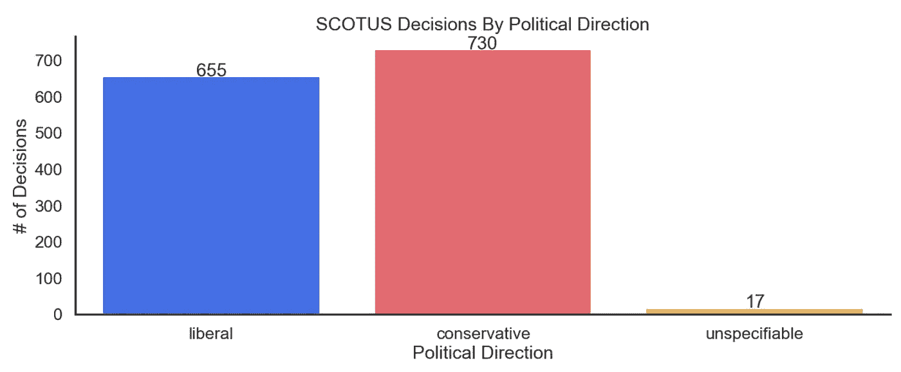
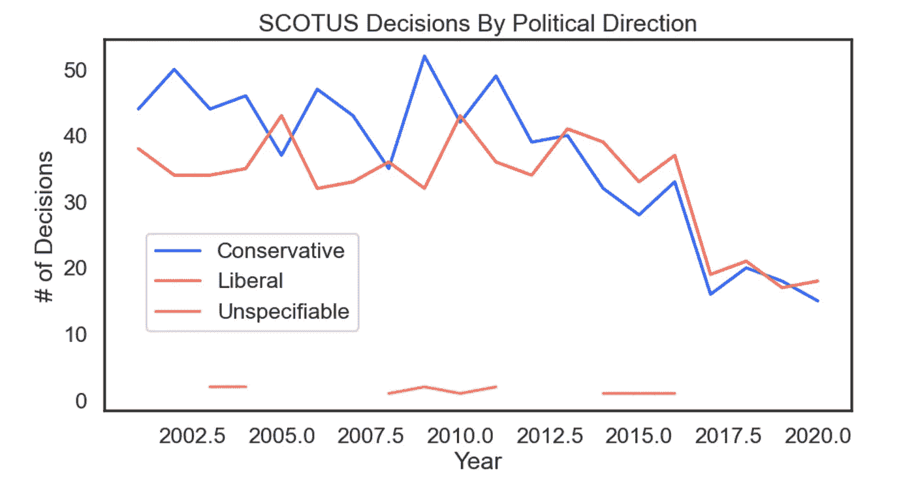
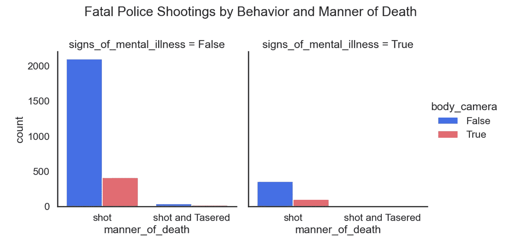
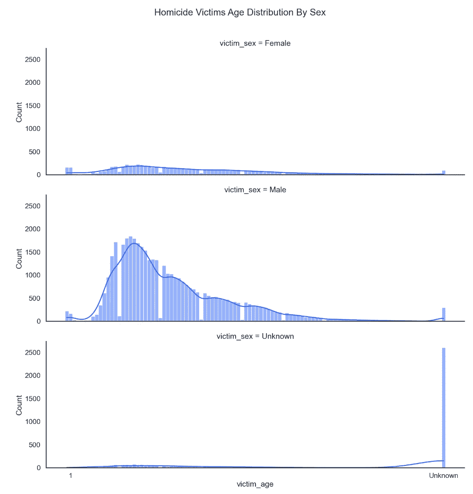
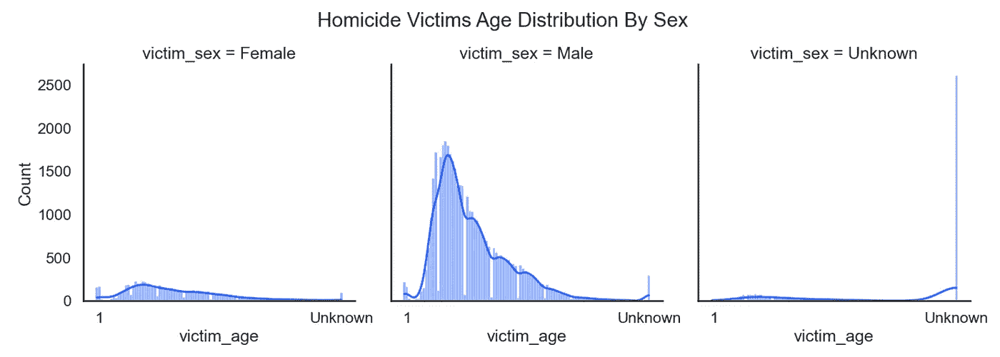
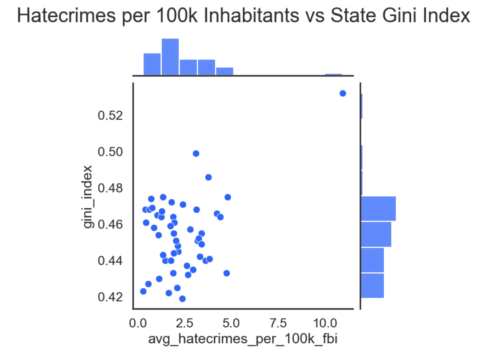
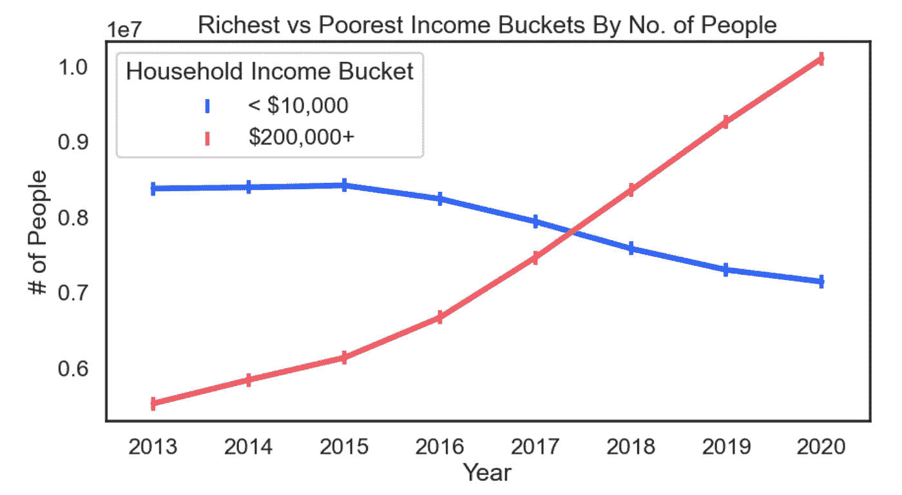
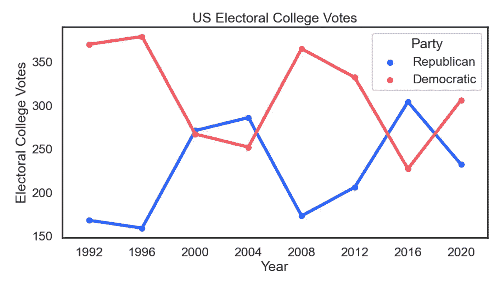
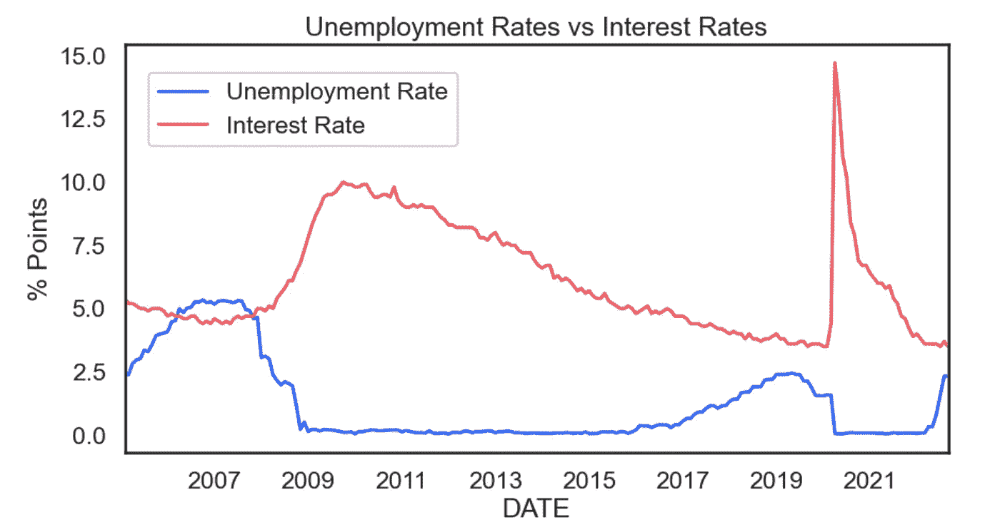
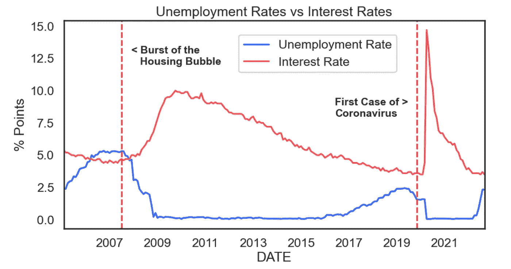

# 一行代码中包含 10 多种与政治相关的数据

> 原文：<https://pub.towardsai.net/10-politics-related-data-visuals-in-a-single-line-of-code-772474ef4b89?source=collection_archive---------4----------------------->

## 面向需要快速即时 viz 进行测试、演示或培训的数据科学家和数据专家

# 介绍

对第一次约会来说不是个好话题。但是对于数据可视化实践、测试、演示和培训来说，这是一个很好的主题。

如果你想探索你的政治观点和意见，而不仅仅是基于你自己的主观经验，你可以从公开的数据中获取见解。同时，你可以练习数据可视化。有关获取这些数据的更多信息，请参见:

[](https://coaching.adamrossnelson.com/blog/20-politics-related-data-sets-in-a-single-line-of-code) [## 单行代码中包含 20 多个与政治相关的数据集

### TLDR:这里有 20 多个有趣且易于下载的政治相关数据集，你可以马上开始探索。一…

coaching.adamrossnelson.com](https://coaching.adamrossnelson.com/blog/20-politics-related-data-sets-in-a-single-line-of-code) 

在这篇文章中，我将向你展示 10+政治相关的数据可视化。本文将引导您思考如何用数据驱动的方法探索与政治相关的主题，并作为关于用 Pandas + Seaborn 实现 Python 中的数据可视化主题的通用快速参考指南。

现在，因为我想让这篇文章具有可操作性，我将专注于只用一行代码创建所有的视觉效果。这篇文章不是关于漂亮的代码。这甚至不是美丽的视觉化。这篇文章是关于快速建立和运行数据可视化的(其他美学…几乎没有考虑)。

在本文的最后，我将讨论这种单行代码方法固有的一些限制和警告，所以请查看一下。

好了，现在我们开始吧。

# 标准进口

像往常一样，我们将首先加载数据分析任务的常用导入，例如:

*   Pandas:用于轻松存储和操作表格数据；
*   Matplotlib:创建和编辑数据可视化；
*   Seaborn:用于用很少的代码创建情节；
*   请求:向 URL 发送 HTTP 请求。我们将使用这个软件包在线下载数据。

更重要的是，我们还可以调用 seaborn `set_context('talk')`来轻松定制剧情的外观和感觉。“talk”上下文提供了更大的字体和更好的视觉比例。

最后，我们还将保存我的首选调色板，以便在需要时轻松设计我们的地块。

```
import pandas as pd
import seaborn as sns
import matplotlib.pyplot as plt
import requests

%matplotlib inline

sns.set(style='white',
        rc={'figure.figsize':(10,5)})
sns.set_context('talk')

cb = sns.color_palette('colorblind')
my_blues = cmap=sns.light_palette('#2962FF', 
                                  as_cmap=True)
my_blues_d =cmap=sns.dark_palette('#2962FF', 
                                  as_cmap= True)

my_blue = '#2962FF'
my_palette = ['#2962FF','#F6575E','#FAC33E',
              '#7FE1B5','#E1AC75','#241D50',
              '#82685C']
```

现在我们已经加载了所有需要的包，我们终于可以开始创建数据可视化了。

# 美国最高法院

对于那些不知道的人，我也是一名律师。这个话题谈到了我在数据科学之前的职业生涯。

美国最高法院是美国法律体系中的最高法院，对有关联邦法律的重要问题有最终决定权。

正因为如此，它不可避免地引起了来自政治光谱各个方面的人们的注意和批评。以至于批评家经常指责法院及其成员有偏见。

幸运的是，我们可以通过使用最高法院的数据库来检查他们是否真的偏向了某个特定的决策方向。为了便于分析，让我们只看一看本千年开始以来法院的判决。

在我们继续之前，在我们下面使用的代码和数据中，有一些事情需要记住:

首先，我们使用 pandas 查询方法从数据集中过滤掉我们不想要的数据。当你想通过数字数据过滤数据时，这种方法非常有用，所以如果你不完全熟悉它是如何工作的，我强烈建议你查看熊猫官方文档[这里](https://pandas.pydata.org/docs/reference/api/pandas.DataFrame.query.html)。

第二，我不完全同意这些数据对决策的分类或描述。为了进行更细致的分析，我建议用新的方法更新数据。在这个演示中，我按原样处理数据。

最后，我们使用行继续符——由反斜杠\字符表示——使代码易于阅读，同时始终遵守我们的单行代码策略。

好了，现在让我们继续进行数据可视化。

```
sns.catplot(data=pd.read_csv('https://corgis-edu.github.io/'\
            +'corgis/datasets/csv/supreme_court/'\
            +'supreme_court.csv').\
        query('`decision.date.year` > 2000'),
        x='decision.direction',
        kind='count',
        palette=my_palette,
        aspect=2.5).set(
            title='SCOTUS Decisions By Political Direction',
            xlabel='Political Direction',
            ylabel='# of Decisions')
```

PS:注意，在 pandas 查询方法中查询的列需要在其名称前后加反引号，这是因为带空格的列名必须以这种方式引用。这个例子和其他例子使用相关的语法。

对于结果:


图片来源:作者用上面的代码生成的插图。

这种可视化的一个问题是，读者可能会不知道每个条形代表多少价值。

因此，如果您想让您的分析更加清晰，您可以很容易地将条形标签添加到图中。

不幸的是，这不能在一行代码中完成，但是因为这将使情节更加清晰，所以让我们继续做下去。

```
plot = \
sns.catplot(data=pd.read_csv('https://corgis-edu.github.io/'\
            +'corgis/datasets/csv/supreme_court/'\
            +'supreme_court.csv').\
        query('`decision.date.year` > 2000'),
        x='decision.direction',
        kind='count',
        palette=my_palette,
        aspect=2.5).set(
            title='SCOTUS Decisions By Political Direction',
            xlabel='Political Direction',
            ylabel='# of Decisions')

plot.ax.bar_label(plot.ax.containers[0],padding=-3)
```



图片来源:作者用上面的代码生成的插图。

正如你可能看到的，似乎两种政治决策的方向似乎是均匀分布的(至少从这个角度看是这样)。但是，如果您想进一步考察这个问题，也可以将数据按年可视化。

```
pd.read_csv('https://corgis-edu.github.io/'\
            +'corgis/datasets/csv/supreme_court/'\
            +'supreme_court.csv').\
        query('`decision.date.year` > 2000').\
        groupby(['decision.date.year',
                 'decision.direction']).\
        count()['id.case'].reset_index()\
        .pivot_table(index='decision.date.year',
                     columns='decision.direction',
                     values='id.case').\
                            plot.line(
                                title='SCOTUS Decisions By '\
                                     +' Political Direction',
                                xlabel='Year',
                                ylabel='# of Decisions',
                                color= my_palette,
                                legend=None).\
                                figure.legend(['Conservative',
                                               'Liberal',
                                               'Unspecifiable'],
                                               bbox_to_anchor=(0,
                                                               0.5,
                                                               0.4,
                                                               0))

# Pay attention that the column queried in the pandas 
# query method required backquotes before and after its 
# name, and that's because column names with spaces must 
# be referenced this way. This and other examples use
# related syntax.

# Also notice the parameter bbox_to_anchorinside the figure.legend()
# method in order to move the legend box to the bottom left corner 
# of the plot.
```

对于结果:



图片来源:作者用上面的代码生成的插图。

# 凶杀率+统计数据

我们来分析一下警方的拍摄数据，看能不能画出清晰的画面。在下面的代码中要记住两件事:

*   首先，我们使用 Pandas `read_csv`方法中的`parsedates`参数轻松地将指定的列转换成 datetime 格式。
*   其次，我们还在 seaborn `catplot`方法中使用了`col`参数，为数据增加了另一个维度，也为我们的数据分析增加了一个视角。这个`col`参数给出了两个视觉效果(一个表示精神疾病的迹象=假，另一个表示精神疾病的迹象=真)。

```
sns.catplot(data=pd.read_csv('https://raw.githubusercontent.com/'\
            +'washingtonpost/data-police-shootings/master/'\
            +'fatal-police-shootings-data.csv',
            parse_dates=['date']).query('date > 2020'),
            kind='count',
            x='manner_of_death',
            hue='body_camera',
            col='signs_of_mental_illness',
            palette=my_palette).fig.suptitle(\
            "Fatal Police Shootings by Behavior and Manner of Death",
                                             y=1.1)
```

对于结果:



图片来源:作者用上面的代码生成的插图。

我们还可以看看与警察枪击无关的凶杀案的分布，以发现在分析这些犯罪时哪些因素可能是重要的。

为此，我们可以使用华盛顿邮报的凶杀案数据集吗？

```
sns.displot(\
    data=pd.read_csv('https://github.com/washingtonpost/'\
                    +'data-homicides/raw/master/'\
                    +'homicide-data.csv',
                encoding='latin-1')\
            .astype({'victim_age':int},
                    errors='ignore').sort_values(
    by='victim_age'),
        x='victim_age',
        discrete=True,
        aspect=3,
        row='victim_sex',
        kde=True,
        color=my_blue,
        facet_kws={'subplot_kws':{'xticks':[1,101]}})\
        .fig.suptitle('Homicide Victims Age Distribution By Sex',
                      y=1.05)
```

对于结果:



图片来源:作者用上面的代码生成的插图。

要并排查看这些，我们转向`col`选项。

```
sns.displot(\
    data=pd.read_csv(\
        'https://github.com/washingtonpost/'\
       +'data-homicides/raw/master/homicide-data.csv',
                     encoding='latin-1')\
            .astype({'victim_age':int},
                    errors='ignore').sort_values(by='victim_age'),
            x='victim_age',
            discrete=True,
            aspect=1,
            col='victim_sex',
            kde=True,
            color=my_blue,
            facet_kws={'subplot_kws':{'xticks':[1,101]}})\
    .fig.suptitle('Homicide Victims Age Distribution By Sex',
                  y=1.05)
```

对于结果:



图片来源:作者用上面的代码生成的插图。

# 贫富差距引发的仇恨犯罪

仇恨犯罪的动机无非是仇恨。仇恨犯罪往往是如此残酷和毫无意义。行为和社会科学家研究了为什么这些犯罪在一些地方更频繁地发生。一种想法是，可能与贫富悬殊或财富不平等有关。

让我们调查一下每 10 万居民的仇恨犯罪数量与财富不平等(用基尼指数衡量)之间是否存在关联。根据维基百科:

> 基尼系数是统计离差的一种 T4 度量，意在表示一个国家或社会群体内的收入不平等或财富不平等

如果你不知道，基尼指数是衡量贫富差距最广泛使用的指数之一，其中 1 代表完全彻底的不平等，0 代表收入和净值完全平等的社会。

```
sns.jointplot(\
    data=pd.read_csv('https://raw.githubusercontent.com/'\
              +'fivethirtyeight/'\
              +'data/master/hate-crimes/hate_crimes.csv'),
        y='gini_index',
        x='avg_hatecrimes_per_100k_fbi',
        color=my_blue)\
        .fig.suptitle('Hatecrimes per 100k Inhabitants '\
                     +'vs State Gini Index',
                     y=1.04,
                     fontsize=25)
```

对于结果:



图片来源:作者用上面的代码生成的插图。

# 家庭收入统计

说到贫富差距，我们可以使用 DataUSA 的“家庭收入”数据集来比较最富裕和最贫穷家庭的收入桶在这些年里是如何增长或收缩的(至少从两组人口的绝对数量来看)。

PS:注意，在 pandas 查询方法中查询的列需要在其名称前后加反引号，这是因为带空格的列名必须以这种方式引用。

```
sns.pointplot(\
    data=pd.DataFrame(\
        requests.get('https://datausa.io/api/data?'\
                    +'measure=Household%20Income,'\
                    +'Household%20Income%20Moe&geo=01000US,'\
                    +'01000US&drilldowns=Household'\
                    +'%20Income%20Bucket').json()['data'])\
    .astype({'ID Household Income Bucket':int,
             'Year':int}).\
    query('`ID Household Income Bucket` == 0 '\
          +'| `ID Household Income Bucket` == 15')\
        [['Household Income Bucket',
          'Year',
          'Household Income']],
                    x='Year',
                    y='Household Income',
                    hue='Household Income Bucket',
                    palette=my_palette,markers='|').set(
                        title='Richest vs Poorest Income '\
                             +'Buckets By No. of People',
                        xlabel='Year',
                        ylabel='# of People')
```

对于结果:



图片来源:作者用上面的代码生成的插图。

# 美国选举团

与其他许多决定选举的国家不同，在美国，人们实际上投票给候选人的选举人，这样这些选举人就可以反过来选择总统。

然而，就像所有与政治相关的事情一样，权力经常周期性地从光谱的一端摇摆到另一端。

因此，让我们仔细看看选举人团投票在过去八个选举周期中的表现。

但是首先，请记住下面代码中的一些内容。

*   首先，我们使用来自请求的 get 方法，以便从 HTML 页面下载来自 DataUSA 的数据集。
*   其次，我们还使用 pandas 的 astype 方法将 year 列从 string 数据类型转换为 integer 数据类型。
*   最后，我们使用 seaborn pointplot 方法中的 markers 参数为整个图形指定一个简洁的标记。

现在，有了这个方法，让我们继续。你能凭记忆说出每年哪位总统获胜吗？

```
sns.pointplot(\
    data=pd.DataFrame(\
        requests.get('https://api-ts-vibranium.datausa.io/'\
            +'tesseract/data?cube=Data_USA_Electoral_'\
            +'College_president&drilldowns=State,Party,Year'\
            +'&measures=Electoral+College+Votes')\
                      .json()['data']).astype({'Year':int}),
            x='Year',
            y='Electoral College Votes',
            hue='Party',
            ci=None,
            estimator=sum,
            palette=my_palette,markers='.')\
        .set(
            title='US Electoral College Votes',
            xlabel='Year',
            ylabel='Electoral College Votes')
```

对于结果:



图片来源:作者用上面的代码生成的插图。

# 经济学

经济的健康有时是政治观点的驱动力。政客们经常意识到，如果经济一落千丈，他们的连任前景也会随之黯淡。因此，经常与 1992 年比尔·克林顿竞选联系在一起的一句名言是“笨蛋，是经济”。

因此，考虑到这一点，让我们来看看失业率和利率这两个重要的经济指标自上两次经济危机以来的表现。

在我们继续之前，下面是对代码的一些观察:

*   首先，我们使用了来自两个不同数据集的数据，所以我们必须使用 pandas `merge` merge 方法来组合它们。
*   其次，我们在`figure.legend()`方法中使用了参数`bbox_to_anchor`，以便将图例框移动到绘图的左上角。
*   第三，我们还使用 pandas `grouper`方法按照指定的时间段对日期列进行分组。
*   最后，由于我们被限制在一行代码中，我们使用了大量的行继续符——正如反冲`\`所表示的那样(以及字符串连接),以使这个巨大的代码块可读。

好了，现在让我们继续。

```
pd.read_csv('https://fred.stlouisfed.org/graph/'\
        +'fredgraph.csv?bgcolor=%23e1e9f0&chart_type='\
        +'line&drp=0&fo=open%20sans&graph_bgcolor='\
        +'%23ffffff&height=450&mode=fred&recession_bars='\
        +'on&txtcolor=%23444444&ts=12&tts=12&width='\
        +'1168&nt=0&thu=0&trc=0&show_legend=yes&show_axis_titles='\
        +'yes&show_tooltip=yes&id=DFF&scale=left&cosd='\
        +'1975-01-10&coed=2022-10-13&line_color=%234572a7&'\
        +'link_values=false&line_style=solid&mark_type='\
        +'none&mw=3&lw=2&ost=-99999&oet=99999&mma=0&fml='\
        +'a&fq=Daily%2C%207-Day&fam=avg&fgst=lin&fgsnd='\
        +'2020-02-01&line_index=1&transformation=lin&'\
        +'vintage_date=2022-10-14&revision_date='\
        +'2022-10-14&nd=1954-07-01',
        parse_dates=['DATE']).\
            merge(pd.read_csv('https://fred.stlouisfed.org/graph/'\
        +'fredgraph.csv?bgcolor=%23e1e9f0&chart_type='\
        +'line&drp=0&fo=open'\
        +'%20sans&graph_bgcolor=%23ffffff&height=450&mode='\
        +'fred&recession_bars=on&txtcolor=%23444444&ts=12&'\
        +'tts=12&width=1168&nt=0&thu=0&trc=0&show_legend='\
        +'yes&show_axis_titles=yes&show_tooltip=yes&id=UNRATE&'\
        +'scale=left&cosd=1948-01-01&coed=2022-09-01&'\
        +'line_color=%234572a7&link_values=false&line_style=solid'\
        +'&mark_type=none&mw=3&lw=2&ost=-99999&oet='\
        +'99999&mma=0&fml=a&fq=Monthly&fam=avg&fgst=lin&fgsnd='\
        +'2020-02-01&line_index=1&transformation='\
        +'lin&vintage_date=2022-10-14&revision_date='\
        +'2022-10-14&nd=1948-01-01',
        parse_dates=['DATE']),
            how='inner',
            on='DATE').query('DATE > 2005').groupby(
                pd.Grouper(key='DATE',
                           freq='MS')).mean().plot.line(
                    color=my_palette,
                    title='Unemployment Rates vs Interest Rates',
                    ylabel='% Points',
                    legend=None)\
                    .figure.legend(['Unemployment Rate',
                                    'Interest Rate'],
                                   bbox_to_anchor=(0,
                                                   .85,
                                                   0.45,
                                                   0))
```

对于结果:



图片来源:作者用上面的代码生成的插图。

正如你所看到的，失业率和利率似乎受到经济周期的影响。然而，图表中还不清楚的一点是经济衰退发生的时间。

如果您想让这个图更清楚，您可以很容易地添加文本注释和垂直参考线到图中，以准确地指定循环阶段发生的时间。这种注释技术可以揭示更多的见解。

请记住，所有这些添加技术不可能在一行代码中完成。我相信无论如何都值得看一看。

```
plot = \
pd.read_csv('https://fred.stlouisfed.org/graph/'\
        +'fredgraph.csv?bgcolor=%23e1e9f0&chart_type='\
        +'line&drp=0&fo=open%20sans&graph_bgcolor='\
        +'%23ffffff&height=450&mode=fred&recession_bars='\
        +'on&txtcolor=%23444444&ts=12&tts=12&width='\
        +'1168&nt=0&thu=0&trc=0&show_legend=yes&show_axis_titles='\
        +'yes&show_tooltip=yes&id=DFF&scale=left&cosd='\
        +'1975-01-10&coed=2022-10-13&line_color=%234572a7&'\
        +'link_values=false&line_style=solid&mark_type='\
        +'none&mw=3&lw=2&ost=-99999&oet=99999&mma=0&fml='\
        +'a&fq=Daily%2C%207-Day&fam=avg&fgst=lin&fgsnd='\
        +'2020-02-01&line_index=1&transformation=lin&'\
        +'vintage_date=2022-10-14&revision_date='\
        +'2022-10-14&nd=1954-07-01',
        parse_dates=['DATE']).\
            merge(pd.read_csv('https://fred.stlouisfed.org/graph/'\
        +'fredgraph.csv?bgcolor=%23e1e9f0&chart_type='\
        +'line&drp=0&fo=open'\
        +'%20sans&graph_bgcolor=%23ffffff&height=450&mode='\
        +'fred&recession_bars=on&txtcolor=%23444444&ts=12&'\
        +'tts=12&width=1168&nt=0&thu=0&trc=0&show_legend='\
        +'yes&show_axis_titles=yes&show_tooltip=yes&id=UNRATE&'\
        +'scale=left&cosd=1948-01-01&coed=2022-09-01&'\
        +'line_color=%234572a7&link_values=false&line_style=solid'\
        +'&mark_type=none&mw=3&lw=2&ost=-99999&oet='\
        +'99999&mma=0&fml=a&fq=Monthly&fam=avg&fgst=lin&fgsnd='\
        +'2020-02-01&line_index=1&transformation='\
        +'lin&vintage_date=2022-10-14&revision_date='\
        +'2022-10-14&nd=1948-01-01',
        parse_dates=['DATE']),
            how='inner',
            on='DATE').query('DATE > 2005').groupby(
                pd.Grouper(key='DATE',
                           freq='MS')).mean().plot.line(
                    color=my_palette,
                    title='Unemployment Rates vs Interest Rates',
                    ylabel='% Points',
                    legend=None)\
                    .figure.legend(['Unemployment Rate',
                                    'Interest Rate'],
                                   bbox_to_anchor=(0,
                                                   .85,
                                                   0.75,
                                                   0))

plt.axvline(450, color='red', linewidth=2, linestyle='--')
plt.axvline(598, color='red', linewidth=2, linestyle='--')

plt.text(455,12,'< Burst of the \n   Housing Bubble',
         fontweight='bold',fontsize=14)
plt.text(557,8,'First Case of > \nCoronavirus',
         fontweight='bold',fontsize=14)

plt.show()
```

对于结果:



图片来源:作者用上面的代码生成的插图。

# 附加阅读

[](https://coaching.adamrossnelson.com/blog/20-politics-related-data-sets-in-a-single-line-of-code) [## 单行代码中包含 20 多个与政治相关的数据集

### TLDR:这里有 20 多个有趣且易于下载的政治相关数据集，你可以马上开始探索。一…

coaching.adamrossnelson.com](https://coaching.adamrossnelson.com/blog/20-politics-related-data-sets-in-a-single-line-of-code) [](https://coaching.adamrossnelson.com/blog/20-health-related-data-sets-in-a-single-line-of-code) [## 单行代码中的 20 多个健康相关数据集

### TLDR:这里有 20 多个有趣且易于下载的健康相关数据集，你可以马上开始探索…

coaching.adamrossnelson.com](https://coaching.adamrossnelson.com/blog/20-health-related-data-sets-in-a-single-line-of-code) [](https://medium.com/geekculture/48-data-visualizations-that-load-in-a-single-line-of-code-a0be5bea903b) [## 在一行代码中加载 48 种数据可视化

### 如何即时提取几十个政治、体育、教育和其他数据可视化示例中的一个。

medium.com](https://medium.com/geekculture/48-data-visualizations-that-load-in-a-single-line-of-code-a0be5bea903b) [](https://towardsdatascience.com/93-datasets-that-load-with-a-single-line-of-code-7b5ffe62b655) [## 用一行代码加载 93 个数据集

### 你如何即时地从几十个例子中找出一个政治、体育、教育和其他框架。

towardsdatascience.com](https://towardsdatascience.com/93-datasets-that-load-with-a-single-line-of-code-7b5ffe62b655) 

# 选定的限制

与相关文章一样，本文也有一些限制和警告。

## 风格

本文中的代码示例打破了许多编码风格惯例。不要把这篇文章作为风格的范本！

## 行延续

对于一些例子，本文使用了行继续符。在 Python 中，反斜杠`\`完成行的延续。另一种实现行连续的技术是 Python 允许代码在逗号之间的下一行继续。

就本文而言，换行(或续行)不算第二行代码。

## 串并置

行延续和字符串连接使得代码在介质上更具可读性。为了使代码在中型平台上看起来更好，并避免奇怪的换行，本文还大量使用了字符串连接。

## 索引列表表格列表

阅读`pd.read_html()`的文档。这个熊猫代码返回熊猫数据帧的列表。方括号中的列表索引，比如`pd.read_html()[i]`起作用，其中 I 代表 read_html 方法返回的列表上的索引。

## 获取数据

本文还使用`requests.get().json()`和`requests.get().json()[data]`从网上抓取 JSON 数据。

# 感谢阅读

你准备好了解更多关于数据科学职业的信息了吗？我进行一对一的职业辅导，并有一份每周电子邮件列表，帮助专业求职者获取数据。[点击此处了解更多](http://coaching.adamrossnelson.com/)。

[](https://coaching.adamrossnelson.com/) [## Adam Ross Nelson 博士提供的数据科学职业指导

### 快速成为一名数据科学家。-为当前和未来的数据科学和机器学习提供职业指导…

coaching.adamrossnelson.com](https://coaching.adamrossnelson.com/) 

感谢阅读。把你的想法和主意发给我。你可以写信只是为了说声嗨。如果你真的需要告诉我是怎么错的，我期待着尽快和你聊天。推特:[@ adamrossnelson](https://twitter.com/adamrossnelson)LinkedIn:[亚当罗斯尼尔森](https://www.linkedin.com/in/arnelson/)。