# 人工智能趋势—2022 年 11 月

> 原文：<https://pub.towardsai.net/10-research-papers-you-shouldnt-miss-82f36c104586?source=collection_archive---------0----------------------->

## *蓉城。人工智能关闭，贾斯帕。AI，还有稳定。AI 获得大量资金，FLAN-T5 LLM，Meta 的神经音频压缩，You-only-live-once，Dreamfusion，句子嵌入的新 MTEB 基准，城市驾驶的模仿学习，等等。*

图片由 Zeta Alpha 提供。

随着最大的人工智能研究会议(NeurIPS 2022)即将召开，我们进入了 2022 年的最后阶段。一个月后，我们将再次参加 NeurIPS 会议，对此我们感到非常兴奋，但首先，让我们回顾一下人工智能领域最近发生的事情。让我们开始强调一些新闻和代码发布！

# 🗞新闻

*   [jasper . AI](https://www.jasper.ai/)——人工智能内容生成平台——以 15 亿美元的估值融资 1.25 亿美元。特别是自两年前的 GPT-3 以来，用于内容创作(文本、图像……)的人工智能正在兴起，投资者不断在这方面下注。同样，[Stability AI](https://stability.ai/)——著名的文本到图像模型 Stable Diffusion 背后的初创公司——以 1B 的估值筹集了 1.01 亿美元。
*   另一方面，许多自动驾驶计划未能在短短几年内实现完全自主的宏伟承诺，大型参与者正在放弃这场竞赛。[蓉城。AI](http://argo.ai/)——曾经估值 70 亿美元、由巨头福特和大众拥有的自动驾驶公司[——正在关闭](https://techcrunch.com/2022/10/26/ford-vw-backed-argo-ai-is-shutting-down/)。
*   随着美国宣布更加严格地禁止出口高科技芯片设计和制造设备，围绕关键硅技术的美中贸易战升温。

# 👾密码

*   [Kernl](https://github.com/ELS-RD/kernl) 是用 [OpenAI 的 Triton](https://openai.com/blog/triton/) 编写的推理机，用于加速变形金刚的推理。
*   [DiffDock](https://github.com/gcorso/DiffDock):DiffDock[的实现:扩散步骤，分子对接的曲折](https://arxiv.org/abs/2210.01776)。一种使用扩散的分子对接技术，很快获得了牵引力。
*   img-to-music :想象图像听起来是什么样子的模型！

# 🔬研究

每个月，我们都会分析最新的研究文献，并选择 10 篇你应该知道的论文。本月我们将讨论强化学习(RL)、扩散模型、自动驾驶、语言模型等主题。

## [1。缩放指令-微调语言模型](https://arxiv.org/abs/2210.11416)

*由 Hyung Won Chung、Le Hou、Shayne Longpre、Barret Zoph、Yi Tay 等人编写*

**❓为什么→** 一年前，谷歌的 FLAN 展示了如何通过将带标签的 NLP 例子重新表述为自然语言指令，并将其包含在预训练语料库中，来提高语言模型(LMs)的泛化能力。现在我们知道扩大这项技术的规模是什么样的了。

**💡关键见解→**open ai 著名的 GPT LMs 系列的基本约束之一是对未标记数据的训练。但这并不意味着自回归 LMs 不能使用标记数据进行训练:可以在不改变任何架构的情况下将注释注入到模型的训练中。关键思想是——而不是让分类头输出输入的标签——将带标签的例子重新表述为用自然语言编写的指令。例如，情感分类的标记示例可以转换为具有以下模板的语句:

> 这部电影有恐怖的情节和精彩的表演。【阳性】
> 
> 这部电影很好，因为它有很棒的情节和精湛的演技。

大警告:要比较零射击性能与完全自我监督的模型，如 GPT-3，必须确保评估中使用的任务不包括在训练指令中！

最初的 FLAN 论文显示了这种技术在 137B params 模型上的强大功能，从几十个 NLP 任务中获得了最多 30k 的额外指令。在这篇论文中，他们通过缩放(1)任务数量到 1836，(2)模型大小到 540B 参数，以及(3)添加思维链提示，进入下一个级别。

结果表明，添加指令会提升性能，尤其是对于较小的模型，但原始模型规模仍然是最大的因素。

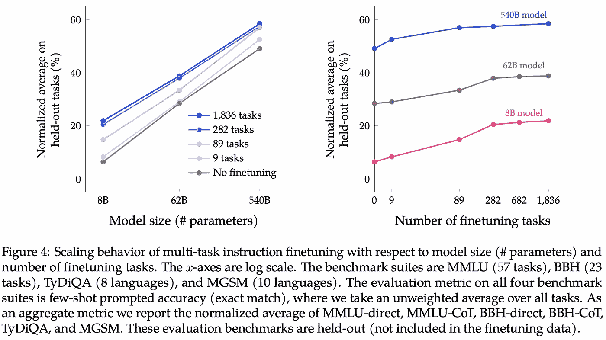

来源:[https://arxiv.org/pdf/2210.11416.pdf](https://arxiv.org/pdf/2210.11416.pdf)

完整的模型在谷歌的研究 Github 知识库上公开发布。

## [2。背诵-增强语言模型](https://arxiv.org/abs/2210.01296)

*作者:孙志清、王学智、易泰、、周丹妮。*

**❓为什么→** 聪明的提示技术继续扩展预先训练的语言模型的能力，而不需要新的复杂的建模技术。

**💡关键见解→** 检索增强语言模型通常从语料库中检索段落，并将它们作为文本附加到提示中，允许它们显式地访问内存。这使得它们更有效，事实上更正确，但代价是大大增加了它们的训练和实现的复杂性。

return 是语言模型提示的一个新版本，其中提示模板推动模型在生成答案之前从记忆中背诵其训练语料库中的相关段落。通过在包含来自训练语料库的段落的提示中提供例子，模型将经常正确地背诵其中的精确段落。

这种方法利用大型 LMs 惊人的良好记忆能力来提高问题回答的性能，而不需要从语料库中显式检索。与之前现成的高级提示技术类似，如思维链。

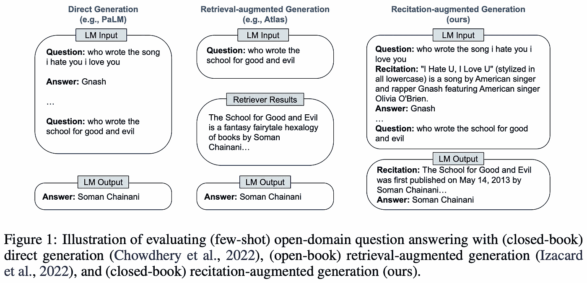

来源:https://arxiv.org/pdf/2210.01296.pdf

一个重要的警告适用于虽然！这种方法不会像开箱即用那样创造奇迹。为了让它工作得更好，它通常需要多路径 decoding⁴，这包括在给定提示(例如，20)的情况下对多个完成进行采样，然后基于多数投票选择答案，并且采样更多路径通常会导致更好的性能，但缺点是推理成本高得多。

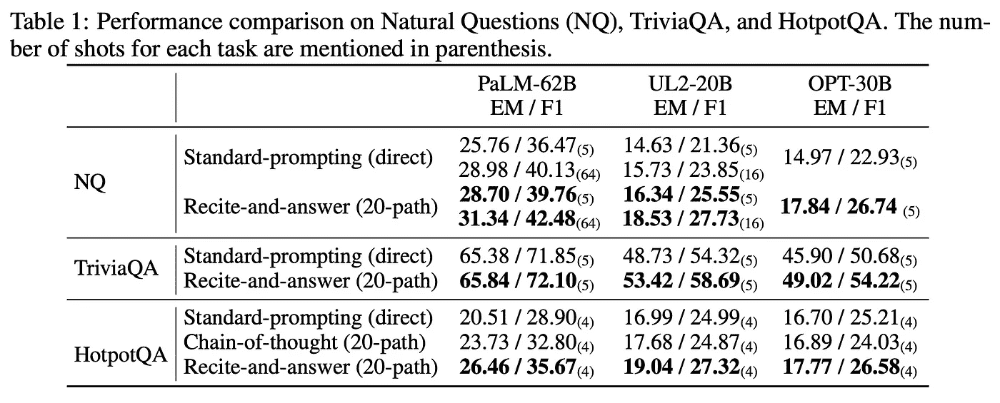

来源:[https://arxiv.org/pdf/2210.01296.pdf](https://arxiv.org/pdf/2210.01296.pdf)

如果你对语言模型感兴趣，你也会喜欢这个关于思维链提示的后续工作:[大型语言模型可以自我改进](https://arxiv.org/abs/2210.11610)。

## [3。迈向下一代人工智能:催化神经革命](https://arxiv.org/abs/2210.08340)

安东尼·扎多尔和其他 26 名人工智能和神经科学领域的知名研究人员。

**❓为什么→** 人工智能的创始人，如都灵或明斯基，都受到对大脑如何工作以及它们如何被机器复制的强烈好奇心的驱动。相比之下，现代人工智能从业者大多倾向于作为计算机科学家、逻辑学家和统计学家进行思考，与大脑如何工作的研究无关。该领域会从更紧密的合作中受益吗？很多 AI 和神经科学的高知名度人物都是这么认为的。

**💡关键见解→** 对大脑的更好理解将为如何建造智能机器提供见解，这一想法并不新鲜。人类大脑和人工智能从一开始就交织在一起。

立场文件强调了人工智能代理的现有挑战，特别是当它以一种明智的方式与世界互动时。虽然语言经常被描绘为人类智力的巅峰，但学习人类水平的感觉运动技能远非一项已解决的任务，而自然语言生成的进展令人震惊，以至于有些人认为原始的图灵测试已经解决。

该宣言的基本原则简明扼要地阐述如下:

> *…对神经计算的更好理解将揭示智能的基本成分，并催化人工智能的下一场革命。*

作为对这一挑战的回应，作者提出了**具体化的**图灵**测试**作为原始图灵测试的继承者:一种更全面的测试，除了明确的推理能力之外，还包括评估感觉运动技能。

解决下一代图灵测试的路线图依赖于 3 个主要支柱。(1)对两个阵营给予同等重视的人工智能课程，以便新一代人工智能研究人员对计算机科学和神经科学一样感兴趣，(2)测试代理的共享平台，以及(3)增加对神经计算基础理论研究的资助。

## [4。你只活一次:单生命强化学习](https://arxiv.org/abs/2210.08863)

安妮·s·陈、阿奇特·夏尔马、谢尔盖·莱文和切尔西·费恩。

**❓为什么→** 部署后，代理能够快速适应新环境吗？对于要求代理在看不见的环境中表现良好的问题，情景强化学习并不是一个合适的框架。

**💡关键见解→** 在这项工作中，作者为单生命强化学习奠定了形式主义，这是一种在看不见的环境中测试代理的范式。目标是一次性解决任务而不陷入困境，而不是像在传统 RL 中那样学习该环境的策略。

作者还提出了一种新的算法，Q 加权对抗学习(QWALE)，它使用“分布匹配”来利用以前的经验作为新情况下的指导。当然，他们的方法远远优于基线，但与大多数挑战范式的工作一样，不清楚评估的选择在多大程度上是根据提出的特定模型定制的。

在任何情况下，这种 RL 范式都与零触发学习和泛化有着有趣的相似之处，这是 ML 中获得牵引力的领域，因为古老的监督学习技术的脆弱性已经被发现。单次 RL 会成为 RL 论文中一个新的必须包含的评估机制吗？我们希望如此！

来源:https://arxiv.org/pdf/2210.08863.pdf

## [5。基于模型的城市驾驶模仿学习](https://arxiv.org/abs/2210.07729) | [代码](https://github.com/wayveai/mile) | [博文](https://wayve.ai/blog/learning-a-world-model-and-a-driving-policy/)

*作者:Anthony Hu、Gianluca Corrado、Nicolas Griffiths、Zak Murez、Corina Gurau、Hudson Yeo、Alex Kendall、Roberto Cipolla 和 Jamie Shotton。*

**❓为什么→** 自动驾驶性能的飞跃(嗯，在模拟环境下！)

**💡关键见解→** 从与世界的互动中在线学习与从演示中离线学习(模仿学习)是 RL 中最基本的划分之一。广义而言，前者稳健但低效，后者高效但脆弱。

本文介绍了在 CARLA⁵模拟器上利用模仿学习实现自动驾驶的最新进展。模仿学习的进步特别有用，因为它们能更好地转化为现实世界的情况。在现实世界中学习驾驶政策在线学习往往太危险和昂贵。没人愿意每集重置都买新车！

这里提出的模型(MILE)通过尝试推断哪些潜在特征导致训练中提供的专家观察来学习潜在空间中的世界动态。您可以在下图中找到该模型如何工作的概述。

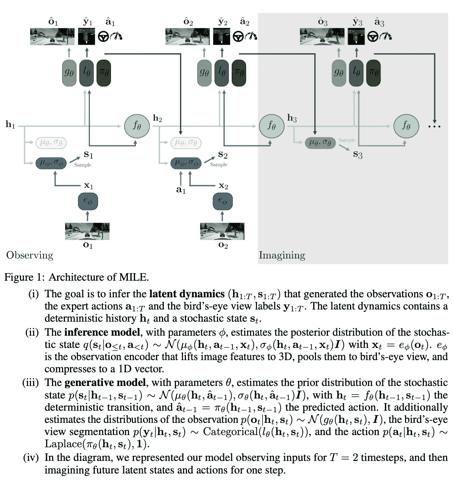

资料来源:https://arxiv.org/pdf/2210.07729.pdf

当谈到结果时，MILE 闪耀**特别是在域外评估**:看不见的城镇和看不见的天气条件。

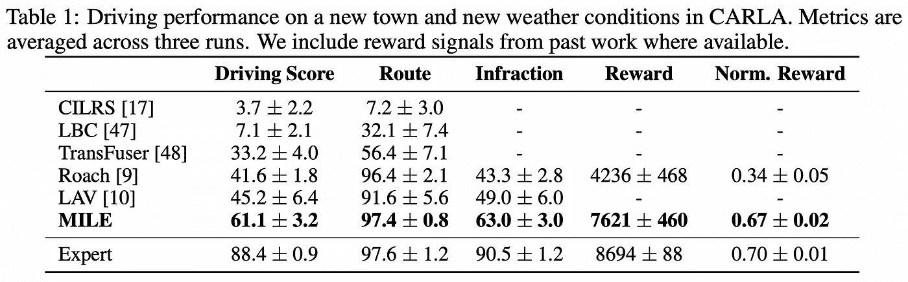

来源:[https://arxiv.org/pdf/2210.07729.pdf](https://arxiv.org/pdf/2210.07729.pdf)

## 6。DreamFusion:使用 2D 扩散将文本转换为 3D|[项目页面](https://dreamfusion3d.github.io) | [非官方实现(稳定 DreamFusion)](https://github.com/ashawkey/stable-dreamfusion)

本·普尔、阿贾伊·贾恩、乔纳森·t·巴伦和本·米尔登霍尔。

**❓为什么→** 扩散模型的迅速崛起超越了纯文本到图像的时代。

**💡关键见解→** 3D 生成很难(还有其他挑战),因为不像 2D 图像，没有多少 3D 模型可以用来训练端到端的 3D 生成器。在这项工作中，他们通过利用现有 2D 图像生成器的功能来引导 3D 资产的生成，从而规避了这一限制。

关键成分是**分数蒸馏取样(SDS)。**该方法能够将 2D 文本到图像模型的输出转换到任何参数空间，例如 3D 模型，只要该转换是可微分的。为了从文本合成场景，该方法随机初始化一个 NeRF 模型，并从不同的相机位置和角度重复渲染该 NeRF 的视图，然后使用这些渲染作为扩散模型的输入+通过 NeRF 反向传播的得分蒸馏损失。最初，这些视图看起来像噪声，但是通过足够的扩散优化时间步长，它们最终正确地表示 3D 对象的视图。

需要一些技巧和规则来使设置工作，但结果是引人注目的，因为你可以在他们的项目页面上查看。你也可以玩一个[非官方的开源实现](https://github.com/ashawkey/stable-dreamfusion),由同样开源的文本到图像稳定扩散支持。

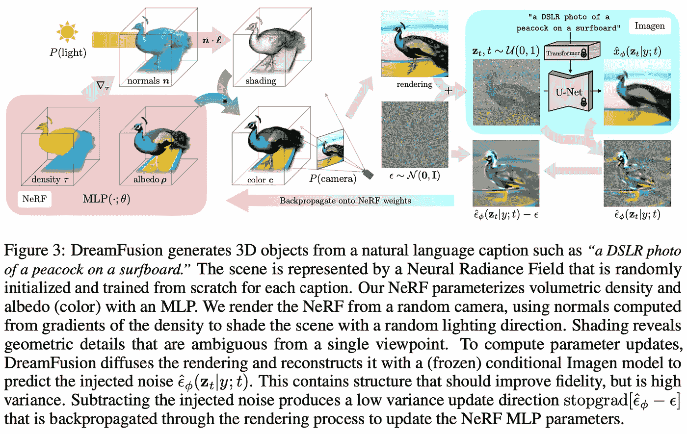

来源:[https://arxiv.org/pdf/2209.14988.pdf](https://arxiv.org/pdf/2209.14988.pdf)

## [7。Imagic:使用扩散模型进行基于文本的真实图像编辑](https://arxiv.org/abs/2210.09276)

*作者:Bahjat Kawar、Shiran Zada、Oran Lang、Omer Tov、Huiwen Chang、Dekel、Inbar Mosseri、Michal 等。*

**❓为什么→** 用扩散模型编辑图像变得更好了！

**💡关键见解→** 继续讨论扩散模型的话题，这种模型的一个强大应用是受限于特定编辑类型的图像编辑，例如条件修复或样式转移。这项工作展示了对图像应用无约束的、复杂的、语义相关的、文本引导的编辑的能力。

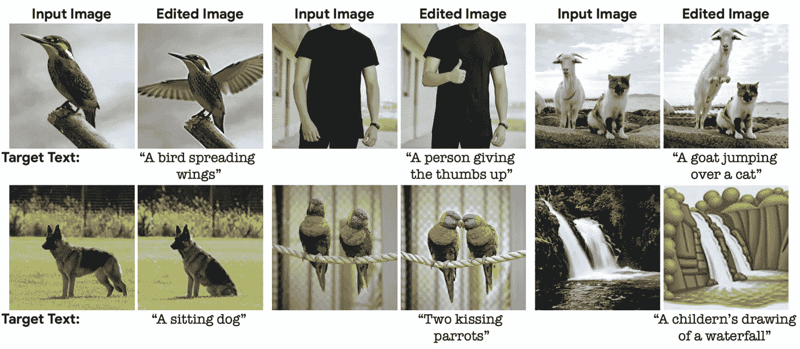

来源:[https://arxiv.org/pdf/2210.09276.pdf](https://arxiv.org/pdf/2210.09276.pdf)

该技术依赖于在输入和目标图像之间的嵌入空间中进行插值。首先(A)，它们对齐文本和图像嵌入，使得在给定冻结的预训练扩散模型的情况下，相似的嵌入产生相似的图像代。然后(B)在对准嵌入上微调扩散模型，最后，内插目标和对准嵌入并用于生成编辑图像。

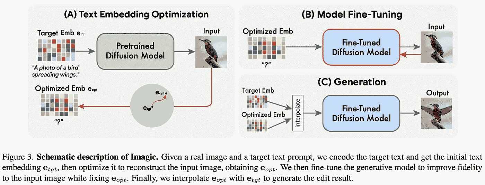

来源:https://arxiv.org/pdf/2210.09276.pdf

## [8。GoalsEye:在物理机器人上学习高速精密乒乓球](https://arxiv.org/abs/2210.03662) | [项目页面](https://sites.google.com/view/goals-eye)

*作者:田丽·丁、劳拉·格雷塞、萨明达·阿贝鲁万、戴维·b·安布罗休、安尼施·尚卡尔、皮埃尔·塞尔马内、潘纳格·r·桑克蒂、科里·林奇。*

**❓为什么→** 这是模仿学习的又一个展示，展示了它将出色的表现传递给物理机器人的力量。

**💡关键见解→** 仍然在 2022 年，RL 系统最大的挑战之一是让它们在真实世界中工作，而不是在模拟环境中工作。这一点尤其重要——正如我们刚刚在自动驾驶汽车的背景下提到的那样——因为 RL 中的在线学习通常在物理世界中不可行:它仍然是低效的，并且太多的东西会坏太多次。

本文展示了如何使用迭代监督模仿学习来教机器人打网球，即，将自我游戏与面向目标的行为克隆相结合。成功的关键是:( 1)从机器人刚刚击球的演示的非目标导向引导数据集开始，以克服低效的初始探索阶段。(2)后见之明重新标记目标条件行为克隆(例如，记录球是如何被击中的以及球落在哪里，然后将其用作目标)。(3)目标导向的迭代自我监督游戏以击中目标。

查看他们的项目页面[来观看他们的机器人如何工作的所有视频演示！](https://sites.google.com/view/goals-eye)

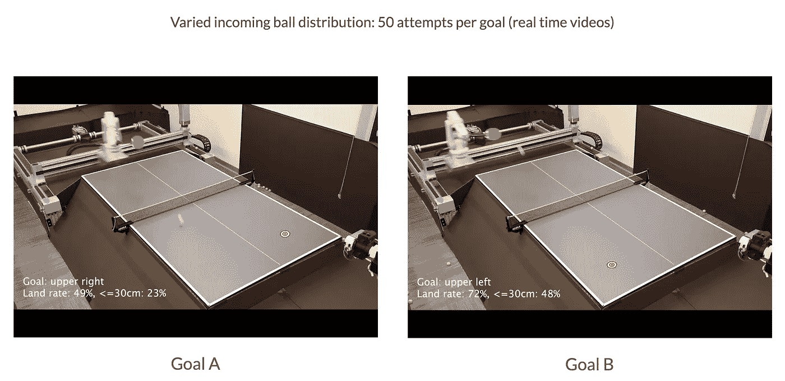

资料来源:https://arxiv.org/pdf/2210.03662.pdf

## [9。MTEB:海量文本嵌入基准](https://arxiv.org/abs/2210.07316) | [代码](https://t.co/QseYZpIzuU) | [排行榜](https://huggingface.co/spaces/mteb/leaderboard)

Niklas Muennighoff、Nouamane Tazi、loc Magne 和 Nils Reimers。

**❓为什么→** 如今有大量现成的自然语言处理嵌入模型，从中做出选择已经成为一个挑战。这项工作促进了这一进程。

**💡关键见解→** 泛型语言嵌入非常流行的主要原因之一是它们的便利性:在将文本转换为向量后，执行 NLP 任务，如分类、语义相似性、检索或聚类等，变得很容易。但是用*一个嵌入来统治所有*的承诺还远未实现，这就是为什么对各种任务进行基准测试是找到通用用例最佳模型的关键。

该基准测试包括 8 个嵌入任务，共涵盖 56 个数据集和 112 种语言，构建时考虑了 4 个基本原则:

*   多样性(8 项任务):分类、聚类、配对分类、重新排序、检索、语义文本相似性和摘要。
*   简单性:可以通过即插即用的 API 访问该基准。
*   可扩展性:有一个指定的语法和过程，可以通过 HuggingFace hub 轻松地向现有基准添加新数据集。
*   可再现性:版本控制是该基准测试版的一个内置特性，使得在该基准测试的任何版本上重新运行任何评估成为可能。

结果表明，现代基于变压器的模型如何优于 GloVe 等经典模型，但性能往往是以速度为代价的，这对于一些应用来说是不可接受的。您可以在[hugging face 排行榜](https://huggingface.co/spaces/mteb/leaderboard)上查看最新结果。

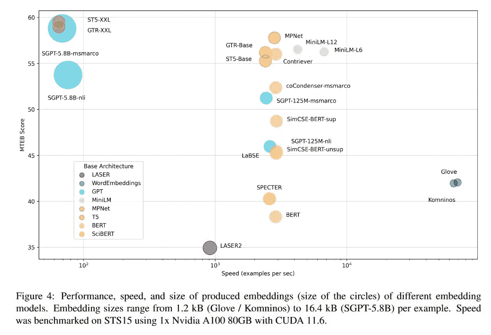

来源:[https://arxiv.org/pdf/2210.07316.pdf](https://arxiv.org/pdf/2210.07316.pdf)

## [10。高保真神经音频压缩](https://arxiv.org/abs/2210.13438) | [博文](https://ai.facebook.com/blog/ai-powered-audio-compression-technique/) | [代码+模型](https://github.com/facebookresearch/encodec)

*作者:Alexandre Défossez、Jade Copet、Gabriel Synnaeve 和 Yossi Adi。*

**❓为什么→** 压缩算法是互联网的支柱。经过多年对神经编解码器的研究，它们不仅在质量上，而且在方便性上都赶上了经典的健壮替代品。

**💡关键见解→**Meta 提出的压缩音频的方法由一个量化的自动编码器组成，该编码器根据重建和不利损失的组合进行训练。重构损失既在原始音频信号上也在 mel 谱图上，并且对抗性损失来自于需要对压缩表示和结果音频是否彼此对应进行分类的鉴别器。最后，量化表示上的额外正则化损失用于防止量化过度改变压缩表示。

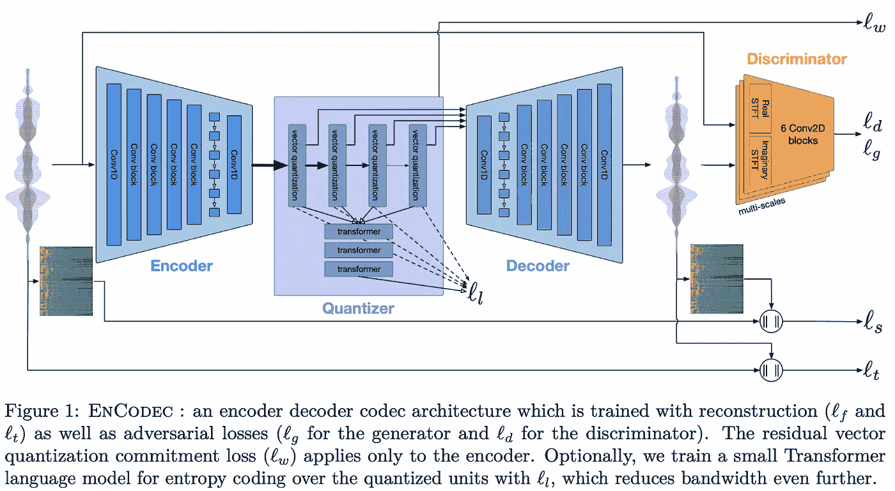

来源:https://arxiv.org/pdf/2210.13438.pdf

所描述的方法并不特别新颖，但高度的优化性和稳健性是。这种方法在合理的音频质量下实现的压缩增益令人印象深刻，以低至 6kbps 的速度编码音频，保持了与 64kbps mp3 编解码器相当的质量，同时以大约 10 倍的实时系数解码。[这个例子](https://ai.facebook.com/blog/ai-powered-audio-compression-technique/)你可以自己听。

但是性能并不是唯一重要的变量，尽管对于压缩编解码器来说，便利性是经典编解码器难以超越的。从 Meta 关于这项研究的博客帖子来看，他们认为这是一项关键的使能技术，用于他们涉及元宇宙的更广泛的公司使命，因此我们预计该公司将很快在生产中利用这些模型。

*参考文献:*

*【1】《微调过的语言模型是零射学习者》Jason Wei 等人，2021。*

*【2】《思维链提示引发大型语言模型中的推理》Jason Wei 等，2022。*

*【3】《领域:检索-增强语言模型预训练》Kelvin Guu 等人 2020。*

*【4】《语言模型中自洽性提高思维推理链》王学智等 2022。*