# NeurIPS 2022 指南——你不应错过的 10 个主题和 50 篇论文

> 原文：<https://pub.towardsai.net/10-topics-and-50-papers-you-shouldnt-miss-ac1c15844733?source=collection_archive---------0----------------------->

## *2672 篇主论文，63 场工作坊，7 场特邀讲座，*最后，*再次亲临。语言模型、大脑启发的研究、扩散模型、图形神经网络……neur IPS 提供了世界级的人工智能研究见解，本指南将帮助您找到将注意力引向何处。*

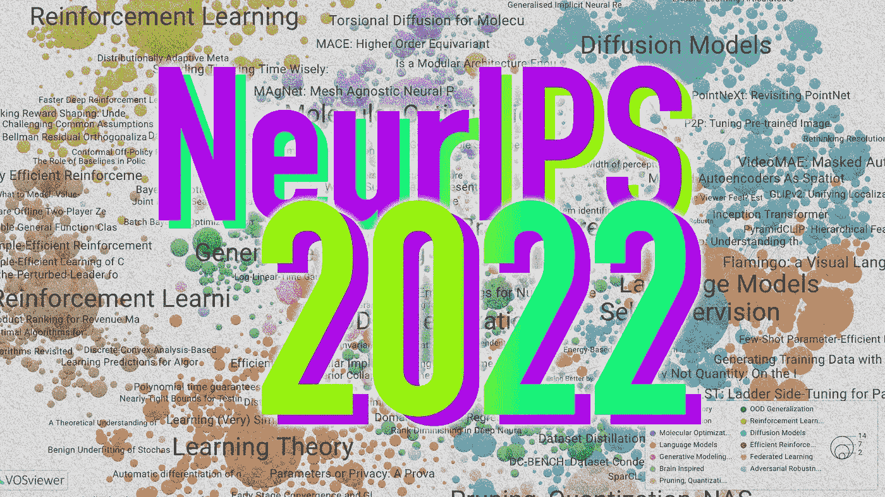

图片由 Zeta Alpha 提供。

第 36 届神经信息处理系统会议(NeurIPS)即将开幕，我们无法形容我们去那里是多么兴奋。由于这已成为会议的一个传统，我们希望帮助我们的观众浏览这一令人着迷而又势不可挡的阵容，其中包括 2672 篇论文、163 个数据集和基准跟踪论文，以及 63 个研讨会的 700 多篇研讨会论文，其中 43 篇是面对面的。

今年，我们将内容划分为我们认为的 10 个关键主题领域，并对它们所包含的内容进行了简要描述，还选择了 5 篇您不应该错过的论文。如果你发现自己被某篇论文不合理地吸引住了，请点击🔎**更喜欢这篇论文**按钮，你会发现 NeurIPS 上关于这个主题的相关论文列表。

# 1.语言模型和提示

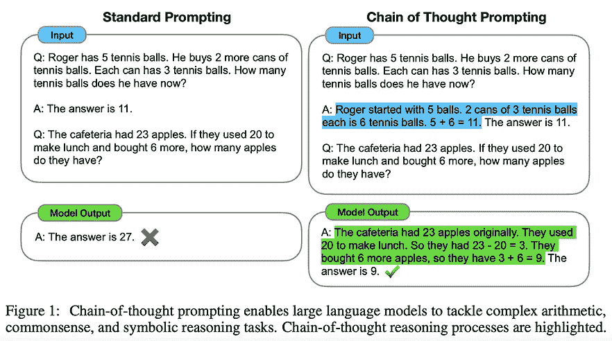

来源:[https://openreview.net/pdf?id=_VjQlMeSB_J](https://openreview.net/pdf?id=_VjQlMeSB_J)

可以说，人工智能中最受欢迎的研究领域——特别是自 2020 年推出 GPT-3 以来——在会议上受到了极大的关注。许多重磅出版物来自 Google、DeepMind、OpenAI、Meta、Stanford 等大型计算公司。

预计会发现很多关于“简单提示”技术的工作，如思维链技术(或技巧？)从普通的预训练自回归 LMs 中挤出更多的性能。多模态今年也受到了关注，DeepMind 的 Flamingo(视觉+语言)是其中最受欢迎的，谷歌的 Minerva 显示了在用正确的数据进行预训练时 LMs 在数学方面有多好，InstructGPT 展示了人类反馈和强化学习如何用于微调大型 LMs。

**1️⃣** [**思维链提示引发大型语言模型中的推理**](https://search.zeta-alpha.com/?doc_ids=028c17a38c59f883641c397df87f31a0288bc1e6)

[🔗OpenReview](https://openreview.net/forum?id=_VjQlMeSB_J) | [🖥虚拟海报](https://neurips.cc/virtual/2022/poster/54087) | [🔎更喜欢这篇论文](https://search.zeta-alpha.com/?similar_to=CO_3594093&sort_by=relevance&q=&d=c&dr=2022-01-01T00%3A00%3A00%2C2022-12-31T23%3A59%3A59&doc_sources=Advances+in+Neural+Information+Processing+Systems)

💡简单地提示 LMs 输出推理步骤，而不是直接回答，可以极大地提高性能。又见后续作品如[星](https://openreview.net/forum?id=_3ELRdg2sgI)。

**2️⃣**

[🔗OpenReview](https://openreview.net/forum?id=EbMuimAbPbs) | [🖥虚拟海报](https://neurips.cc/virtual/2022/poster/54165) | [🔎更喜欢这篇论文](https://search.zeta-alpha.com/?doc_sources=Advances+in+Neural+Information+Processing+Systems&d=c&dr=2022-01-01T00%3A00%3A00%2C2022-12-31T23%3A59%3A59&similar_to=CO_3482016&sort_by=relevance)

💡DeepMind 引入了一个经过视觉+语言训练的“简单”单一模型，为各种多模态任务设定了艺术状态

**3️⃣** [**用语言模型解决定量推理问题(Minerva)**](https://search.zeta-alpha.com/documents/6f07fcd494aee5d035255948bb39ddc6f21fc774_0)

[🔗OpenReview](https://openreview.net/forum?id=IFXTZERXdM7) | [🖥虚拟海报](https://neurips.cc/virtual/2022/poster/54708) | [🔎更喜欢这篇论文](https://search.zeta-alpha.com/?similar_to=CO_3608727&sort_by=relevance&q=&d=c&dr=2022-01-01T00%3A00%3A00%2C2022-12-31T23%3A59%3A59&doc_sources=Advances+in+Neural+Information+Processing+Systems)

💡在数学数据上训练的大型 LM 可以在定量推理任务上实现强大的性能，包括在数学数据集上的最先进的性能。

**4️⃣** [**数据分布特性驱动变形金刚**](https://search.zeta-alpha.com/?doc_ids=4a9b43e05f07ebe105e6cb219d78ca13f9297a9a) 中涌现的情境学习

[🔗OpenReview](https://openreview.net/forum?id=lHj-q9BSRjF) | [🖥虚拟海报](https://neurips.cc/virtual/2022/poster/54758) | [🔎更喜欢这篇论文](https://search.zeta-alpha.com/?similar_to=CO_3594076&sort_by=relevance&q=&d=c&dr=2022-01-01T00%3A00%3A00%2C2022-12-31T23%3A59%3A59&doc_sources=Advances+in+Neural+Information+Processing+Systems)

💡大规模的前期培训在哪些方面推动了情境学习？训练数据分布需要*突发性*和大量*罕见情况*。

**5️⃣** [**训练语言模型跟随指令与人类反馈**](https://search.zeta-alpha.com/documents/e57fca56943a670830350843844a25f2a9095c73_0)**(instructgpt)**

[🔗OpenReview](https://openreview.net/forum?id=TG8KACxEON) | [🖥虚拟海报](https://neurips.cc/virtual/2022/poster/52886) | [🔎更喜欢这篇论文](https://search.zeta-alpha.com/?similar_to=CO_3481996&sort_by=relevance&q=&d=c&dr=2022-01-01T00%3A00%3A00%2C2022-12-31T23%3A59%3A59&doc_sources=Advances+in+Neural+Information+Processing+Systems)

💡OpenAI 使用人类在回路中的强化学习(RLHF)来使用从人类贴标机收集的数据微调 GPT-3。由此产生的模型称为 InstructGPT，在一系列 NLP 任务上优于 GPT-3。

# 2.扩散模型

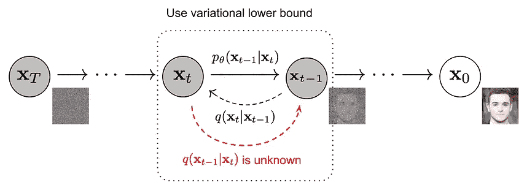

来源:[https://arxiv.org/pdf/2209.00796.pdf](https://arxiv.org/pdf/2209.00796.pdf)

当然，如果有什么东西值得获得 2022 年最酷的城市儿童的桂冠，那一定是文本到图像生成模型，其中大多数都是由**扩散模型**驱动的:OpenAI 的 DALL E 2，谷歌的 Imagen，或稳定扩散。

作为成熟的早期标志——从它们流行到现在还不到两年！—建模技术现在已经超出了 2D 静止图像生成的范畴，并被应用于 3D 场景合成、视频生成和分子对接等领域。正如我们在 2017 年的《变形金刚》中看到的那样，一个研究想法成为主流所需的时间正在不断缩短。

**1️⃣** [**具有深度语言理解的真实感文本到图像扩散模型**](https://search.zeta-alpha.com/?doc_ids=36b1dbee5df97639d95e33c35b7d3e72d5e9766f)**【imagen】**

[🔗OpenReview](https://openreview.net/forum?id=08Yk-n5l2Al) | [🖥虚拟海报](https://neurips.cc/virtual/2022/poster/55018) | [🔎更多像这样的论文](https://search.zeta-alpha.com/?similar_to=CO_3771085&sort_by=relevance&q=&d=c&dr=2022-01-01T00%3A00%3A00%2C2022-12-31T23%3A59%3A59&doc_sources=Advances+in+Neural+Information+Processing+Systems)

💡Imagen，一种使用扩散模型进行文本到图像合成的简单方法。

**2️⃣** [**物体场景再现变压器**](https://search.zeta-alpha.com/?doc_ids=a576e1479cced7448648c43cf5438797d15f048b) **(OSRT)**

[🔗OpenReview](https://openreview.net/forum?id=znNmsN_O7Sh) | [🖥虚拟海报](https://neurips.cc/virtual/2022/poster/55325) | [🔎更多这样的论文](https://search.zeta-alpha.com/?similar_to=CO_3606850&sort_by=relevance&q=&d=c&dr=2022-01-01T00%3A00%3A00%2C2022-12-31T23%3A59%3A59&doc_sources=Advances+in+Neural+Information+Processing+Systems)

💡一种高效的以 3D 为中心的模型，其中通过新颖的视图合成自然地呈现各个对象。

**3️⃣** [**去噪扩散复原模型**](https://search.zeta-alpha.com/?doc_ids=9902ab2ff8bb21e5acd7d40cf0c7fed646ea73f6)**【ddrm】**

[🔗OpenReview](https://openreview.net/forum?id=kxXvopt9pWK) | [🖥虚拟海报](https://neurips.cc/virtual/2022/poster/54021) | [🔎更多像这样的论文](https://search.zeta-alpha.com/?similar_to=CO_3646610&sort_by=relevance&q=&d=c&dr=2022-01-01T00%3A00%3A00%2C2022-12-31T23%3A59%3A59&doc_sources=Advances+in+Neural+Information+Processing+Systems)

💡使用预训练的去噪扩散概率模型(DDPMs)进行超分辨率、去模糊、修补和着色，而无需特定问题的监督训练。

**4️⃣** [**柔性扩散建模长视频**](https://search.zeta-alpha.com/documents/a12de8253747685a074398e8700be48d990c3617_0)

[🔗OpenReview](https://openreview.net/forum?id=0RTJcuvHtIu) | [🖥虚拟海报](https://neurips.cc/virtual/2022/poster/53513) | [🔎更多像这样的论文](https://search.zeta-alpha.com/?retrieval_method=keyword&retrieval_unit=document&d=c&sort_by=relevance&with_code=false&similar_to=CO_3524504&q=Flexible+Diffusion+Modeling+of+Long+Videos+&dr=2022-01-01T00%3A00%3A00%2C2022-12-31T23%3A59%3A59&doc_sources=Advances+in+Neural+Information+Processing+Systems)

💡DDPMs 应用于视频领域。为了捕捉帧之间的长期依赖性，他们提出了一种可以根据视频帧的任何子集灵活调整的架构。

**5️⃣**

[🔗OpenReview](https://openreview.net/forum?id=xxgp42Qz6dL) | [🖥虚拟海报](https://neurips.cc/virtual/2022/poster/54212) | [🔎更多像这样的论文](https://search.zeta-alpha.com/?similar_to=CO_3597811&sort_by=relevance&q=&d=c&dr=2022-01-01T00%3A00%3A00%2C2022-12-31T23%3A59%3A59&doc_sources=Advances+in+Neural+Information+Processing+Systems)

💡能量引导的随机微分方程(EGSDE)采用在源域和目标域上预训练的能量函数来指导预训练 SDE 的推理过程，以获得真实可信的不成对图像到图像(I2I)。

# 3.自我监督学习

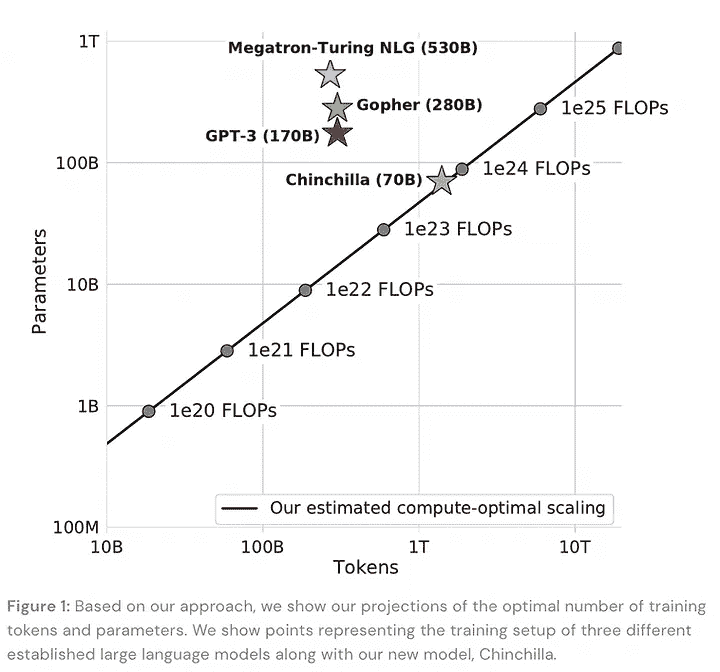

来源:[https://openreview.net/pdf?id=iBBcRUlOAPR](https://openreview.net/pdf?id=iBBcRUlOAPR)

自我监督学习(SSL)已经成为现代人工智能的一个重要组成部分，它现在已经以这样或那样的方式融入到大多数研究中。2018 年，NLP 首次在深度学习领域领先于 BERT，计算机视觉后来也加入了 SSL 的行列，并取得了 SimCLR 等成功技术。

我们的语义地图的这个区域大量代表了计算机视觉的新 SSL 技术:从无监督的视频中学习，数据增强对图像的影响……但可以说，最重要的是 DeepMind 的 Chinchilla:一项关于语言模型的预训练预算应该在模型参数上花费多少以及在更大的训练语料库中花费多少的研究(发现大多数大型 LMs 都*太大或训练不足*)，从而产生了 Chinchilla，一个 70B 参数的 LM，它通过更长时间的训练胜过其更大的对手。

最后，我们也不能错过用于信息检索的全新(部分)SSL 技术，比如可区分的搜索索引。

虽然 SSL 现在如此普遍，但它经常被归为无关紧要的脚注。所有这些研究都证明，在这个领域还有许多未开发的石头和新的见解有待发现。

**1️⃣** [**计算优化大型语言模型训练的实证分析**](https://search.zeta-alpha.com/documents/6cd68201d47749f962a828746af86811f004675f_0) **【龙猫】**

[🔗OpenReview](https://openreview.net/forum?id=iBBcRUlOAPR) | [🖥虚拟海报](https://neurips.cc/virtual/2022/poster/53031) | [🔎更多这样的论文](https://search.zeta-alpha.com/?retrieval_method=keyword&retrieval_unit=document&d=c&sort_by=relevance&with_code=false&doc_sources=Advances+in+Neural+Information+Processing+Systems&dr=2022-01-01T00%3A00%3A00%2C2022-12-31T23%3A59%3A59&similar_to=CO_3742746)

💡最好在更多的令牌上训练更小的语言模型。DeepMind 展示了这一点，他们的 70B 龙猫模型优于更大的模型，如地鼠(280B)，GPT-3 (175B)或威震天-图灵 NLG (530B)。

**2️⃣**

[🔗OpenReview](https://openreview.net/forum?id=AhccnBXSne) | [🖥虚拟海报](https://neurips.cc/virtual/2022/poster/54362) | [🔎更多像这样的论文](https://search.zeta-alpha.com/?retrieval_method=keyword&retrieval_unit=document&d=c&sort_by=relevance&with_code=false&doc_sources=Advances+in+Neural+Information+Processing+Systems&dr=2022-01-01T00%3A00%3A00%2C2022-12-31T23%3A59%3A59&similar_to=CO_3505772)

💡在视频上做精致的预训练视频表示。3 个要点:高屏蔽率是最好的，这种技术即使在小数据集上也能很好地工作，当涉及到自我监督的视频分割时，质量>数量。

**3️⃣** [**质而不量:论数据集设计与剪辑鲁棒性的互动**](https://search.zeta-alpha.com/?doc_ids=02ca48e294d29ad5f7cd9e82839690836d39646c)

[🔗OpenReview](https://openreview.net/forum?id=LTCBavFWp5C) | [🖥虚拟海报](https://neurips.cc/virtual/2022/poster/53131) | [🔎更多这样的论文](https://search.zeta-alpha.com/?retrieval_method=keyword&retrieval_unit=document&d=c&sort_by=relevance&with_code=false&doc_sources=Advances+in+Neural+Information+Processing+Systems&dr=2022-01-01T00%3A00%3A00%2C2022-12-31T23%3A59%3A59&similar_to=CO_3579884)

💡CLIP 预处理数据源之间相互作用的系统研究。令人惊讶(？)混合多个数据源并不一定会产生更好的模型，这一点被我们对玩具模型的理论分析所佐证。

**4️⃣**

[🔗OpenReview](https://openreview.net/forum?id=ekQ_xrVWwQp) | [🖥虚拟海报](https://neurips.cc/virtual/2022/poster/53295) | [🔎更多像这样的论文](https://search.zeta-alpha.com/?retrieval_method=keyword&retrieval_unit=document&d=c&sort_by=relevance&with_code=false&doc_sources=Advances+in+Neural+Information+Processing+Systems&dr=2022-01-01T00%3A00%3A00%2C2022-12-31T23%3A59%3A59&similar_to=CO_3743298)

💡数据扩充(DA)及其如何影响模型参数的分析研究。例如，给定手边的损失，普通 DAs 需要数万个样本来正确估计损失并使模型训练收敛。

**5️⃣** [**变压器内存作为可微分搜索索引**](https://search.zeta-alpha.com/?doc_ids=34f9d0628d7cfb575ad92a7850452cd905a318ac)

[🔗OpenReview](https://openreview.net/forum?id=Vu-B0clPfq) | [🖥虚拟海报](https://neurips.cc/virtual/2022/poster/53008) | [🔎更多这样的论文](https://search.zeta-alpha.com/?retrieval_method=keyword&retrieval_unit=document&d=c&sort_by=relevance&with_code=false&doc_sources=Advances+in+Neural+Information+Processing+Systems&dr=2022-01-01T00%3A00%3A00%2C2022-12-31T23%3A59%3A59&similar_to=CO_3683868)

💡给定一个查询作为提示，单个转换器被训练成直接输出文档标识符自回归。NeurIPS 上还展示了后续工作，例如[一个用于文档检索的神经语料库索引器](https://search.zeta-alpha.com/documents/f68b1f9b5cf23fb1911762125c8daf3a2179ba08_0)。

# 4.图形神经网络

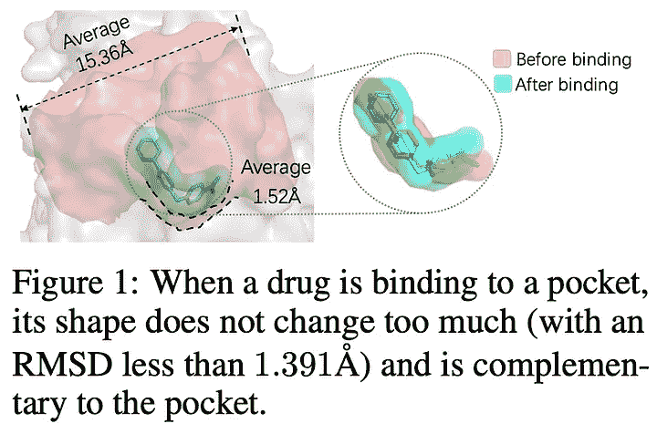

来源:[https://openreview.net/pdf?id=H_xAgRM7I5N](https://openreview.net/pdf?id=H_xAgRM7I5N)

等方差、3D 分子生成、偏微分方程……图形神经网络(GNNs)已经存在了一段时间，虽然它们没有像变形金刚或扩散模型那样获得名人级的知名度，但在过去几年中，它们的规模稳步增长，扩展到了药物设计、微分方程求解或推理等应用领域。

这种异构的景观是有意义的，因为正如[几何深度学习](https://arxiv.org/abs/2104.13478)蓝图中所概述的那样，在某种程度上，GNNs 是对 NNs 的一种新的抽象，以从关于如何将任意问题投射到正确架构的第一原则中解锁思维，通过利用对称性和不变性来逃离维度的诅咒。例如，这是找到计算解决偏微分方程的正确表示或预测有机分子形状以更有效地设计新药的关键。👇

**1️⃣** [**零拍摄 3D 药物设计草图生成**](https://search.zeta-alpha.com/documents/ce00493ea260f7ddd643678a6d086d7cf98fed44_0) **(沙漠)**

[🔗OpenReview](https://openreview.net/forum?id=H_xAgRM7I5N) | [🖥虚拟海报](https://neurips.cc/virtual/2022/poster/54457) | [🔎更多这样的论文](https://search.zeta-alpha.com/?retrieval_method=keyword&retrieval_unit=document&d=c&sort_by=relevance&with_code=false&doc_sources=Advances+in+Neural+Information+Processing+Systems&dr=2022-01-01T00%3A00%3A00%2C2022-12-31T23%3A59%3A59&similar_to=CO_3745720)

💡由预训练技术驱动的零剂量药物设计方法。现有的基于深度学习的药物设计方法通常依赖于稀缺的实验数据或缓慢的对接模拟。DESERT 将设计过程分为草图绘制和生成阶段，在保持高精度的同时加快了生成速度。

**2️⃣** [**扭转扩散为分子构象体生成**](https://search.zeta-alpha.com/?doc_ids=c4bb0f1e42375f849cb0905057c342197989a773)

[🔗OpenReview](https://openreview.net/forum?id=w6fj2r62r_H) | [🖥虚拟海报](https://neurips.cc/virtual/2022/poster/54153) | [🔎更多这样的论文](https://search.zeta-alpha.com/?retrieval_method=keyword&retrieval_unit=document&d=c&sort_by=relevance&with_code=false&doc_sources=Advances+in+Neural+Information+Processing+Systems&dr=2022-01-01T00%3A00%3A00%2C2022-12-31T23%3A59%3A59&similar_to=CO_3578513)

💡经由扭转角上的扩散过程的药物样分子构象异构体生成经由 hypertorus 上的扩散建模和外部到内部评分模型的快速和准确的构象异构体生成，同时比先前的基于扩散的方法快几个数量级。

**3️⃣** [**磁铁:网格不可知神经 PDE 求解器**](https://search.zeta-alpha.com/?doc_ids=ef4848383e458fb93fb7b1853c318d3114d5897c)

[🔗OpenReview](https://openreview.net/forum?id=bx2roi8hca8) | [🖥虚拟海报](https://neurips.cc/virtual/2022/poster/52976) | [🔎更多这样的论文](https://search.zeta-alpha.com/?retrieval_method=keyword&retrieval_unit=document&d=c&sort_by=relevance&with_code=false&doc_sources=Advances+in+Neural+Information+Processing+Systems&dr=2022-01-01T00%3A00%3A00%2C2022-12-31T23%3A59%3A59&similar_to=CO_3663448)

💡一种新的网格不可知的架构，预测在 PDE 域的任何空间连续点的 PDE 解，并在不同的网格和分辨率上推广。

**4️⃣**

[🔗OpenReview](https://openreview.net/forum?id=YPpSngE-ZU) | [🖥虚拟海报](https://neurips.cc/virtual/2022/poster/53926) | [🔎更多像这样的论文](https://search.zeta-alpha.com/?retrieval_method=keyword&retrieval_unit=document&d=c&sort_by=relevance&with_code=false&doc_sources=Advances+in+Neural+Information+Processing+Systems&dr=2022-01-01T00%3A00%3A00%2C2022-12-31T23%3A59%3A59&similar_to=CO_3719265)

💡消息传递神经网络是模拟原子间势的一种强有力的方法，但它们效率很低。MACE 以高度并行的方式引入了高阶消息传递，在各种基准测试中实现了 SOTA。

**5️⃣** [**通过连接子图预处理的少量关系推理**](https://search.zeta-alpha.com/?doc_ids=8e0c3ef9a1216c43e02e9a332aafabc2152229a8) **(CSR)**

[🔗OpenReview](https://openreview.net/forum?id=LvW71lgly25) | [🖥虚拟海报](https://neurips.cc/virtual/2022/poster/53677) | [🔎更多像这样的论文](https://search.zeta-alpha.com/?retrieval_method=keyword&retrieval_unit=document&d=c&sort_by=relevance&with_code=false&doc_sources=Advances+in+Neural+Information+Processing+Systems&dr=2022-01-01T00%3A00%3A00%2C2022-12-31T23%3A59%3A59&similar_to=CO_3633326)

💡CSR 可以通过对知识图的自我监督预训练，直接对目标少发任务做出预测。

# 5.强化学习

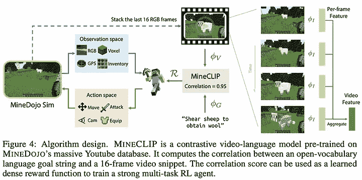

来源:[https://openreview.net/pdf?id=rc8o_j8I8PX](https://openreview.net/pdf?id=rc8o_j8I8PX)

让代理成为更高效的学习者是 RL 研究人员仍在努力解决的一个关键问题，今年的 NeurIPS 包含了许多关于如何实现这一目标的建议。例如，使用离线学习和大规模模仿学习来克服最初的低效探索阶段，改进信用分配技术以更好地导航稀疏奖励景观，或者使用预训练的语言模型来引导具有人类先验的策略。其他感兴趣的点通常围绕鲁棒性和再现性，这与挑战性开放式设置的效率密切相关。

最后，RL 还看到了在芯片设计等领域的成功应用，并有相当多的论文涉及该主题(说真的，查看“更像这样！”).

**1️⃣** [**利用自然语言和程序抽象向机器灌输人类的归纳偏见**](https://search.zeta-alpha.com/documents/fc8198793bea470be977ebbbfffd7ea147cecf84_0)

[🔗OpenReview](https://openreview.net/forum?id=buXZ7nIqiwE) | [🖥虚拟海报](https://neurips.cc/virtual/2022/poster/54789) | [🔎更多这样的论文](https://search.zeta-alpha.com/?retrieval_method=keyword&retrieval_unit=document&d=c&sort_by=relevance&with_code=false&doc_sources=Advances+in+Neural+Information+Processing+Systems&dr=2022-01-01T00%3A00%3A00%2C2022-12-31T23%3A59%3A59&similar_to=CO_3467249)

💡元学习代理可以通过与来自语言描述和程序归纳的表示进行共同训练来学习人类的归纳偏差。

**2️⃣** [**MineDojo:用互联网规模的知识构建开放式的具身代理**](https://search.zeta-alpha.com/documents/33f0f74cfbd52c9366cd4bc87a843eb3a84a6996_0)

[🔗OpenReview](https://openreview.net/forum?id=rc8o_j8I8PX) | [🖥虚拟海报](https://neurips.cc/virtual/2022/poster/55737) | [🔎更多这样的论文](https://search.zeta-alpha.com/?retrieval_method=keyword&retrieval_unit=document&d=c&sort_by=relevance&with_code=false&doc_sources=Advances+in+Neural+Information+Processing+Systems&dr=2022-01-01T00%3A00%3A00%2C2022-12-31T23%3A59%3A59&similar_to=CO_3691961)

💡利用大型预训练模型自动标记带有动作的视频，以创建用于离线学习的大规模数据集，仅使用来自《我的世界》的视频数据。

**3️⃣**

[🔗OpenReview](https://openreview.net/forum?id=T2DBbSh6_uY) | [🖥虚拟海报](https://neurips.cc/virtual/2022/poster/54344) | [🔎更多像这样的论文](https://search.zeta-alpha.com/?retrieval_method=keyword&retrieval_unit=document&d=c&sort_by=relevance&with_code=false&doc_sources=Advances+in+Neural+Information+Processing+Systems&dr=2022-01-01T00%3A00%3A00%2C2022-12-31T23%3A59%3A59&similar_to=CO_3745441)

💡RL 代理比人类更善于在硅片设计上分配组件。

**4️⃣** [**明智地花费思考时间:用虚拟资料片**](https://search.zeta-alpha.com/?doc_ids=025d02f27edc18bbb2c34ad8b47c27f1b760562f) 加速 MCTS

[🔗OpenReview](https://openreview.net/forum?id=B_LdLljS842) | [🖥虚拟海报](https://neurips.cc/virtual/2022/poster/54920) | [🔎更多像这样的论文](https://search.zeta-alpha.com/?retrieval_method=keyword&retrieval_unit=document&d=c&sort_by=relevance&with_code=false&doc_sources=Advances+in+Neural+Information+Processing+Systems&dr=2022-01-01T00%3A00%3A00%2C2022-12-31T23%3A59%3A59&similar_to=CO_3648133)

💡MCTS 通过在更困难的州分配更高的计算预算来提高效率。

**5️⃣** [**轨迹平衡:改进了 GFlowNets**](https://search.zeta-alpha.com/?doc_ids=29f61e51cac4adb13d57d6651e5f425670c6d40b) 中的信用分配

[🔗OpenReview](https://openreview.net/forum?id=5btWTw1vcw1) | [🖥虚拟海报](https://neurips.cc/virtual/2022/poster/53114) | [🔎更多这样的论文](https://search.zeta-alpha.com/?retrieval_method=keyword&retrieval_unit=document&d=c&sort_by=relevance&with_code=false&doc_sources=Advances+in+Neural+Information+Processing+Systems&dr=2022-01-01T00%3A00%3A00%2C2022-12-31T23%3A59%3A59&similar_to=CO_3584161)

💡生成流网络的一个新的训练目标，解决了信用分配的问题(轨迹中的什么行为对最终奖励最负责？)导致更快的收敛和更好地拟合目标分布。

# 6.受大脑启发的

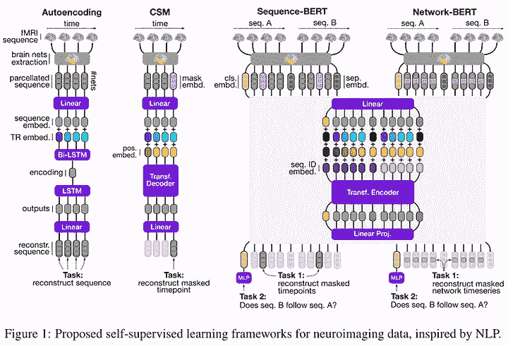

来源:[https://openreview.net/pdf?id=dqO59nI_R9A](https://openreview.net/pdf?id=dqO59nI_R9A)

别忘了 NeurIPS 也是神经科学相关文献的发源地；毕竟，我们的大脑是神经信息处理系统 T21，它引发了许多现代人工神经网络。

这个多样化的领域涉及到从大脑成像技术(如 fMRI)中的大量学习，反向投影学习的替代方法预示着我们对神经元、尖峰神经网络等的了解会更好！

**1️⃣** [**通过预测编码在任意图拓扑上学习**](https://search.zeta-alpha.com/?doc_ids=49e1806683d3a6561fdf63f19c2b350e1090d013)

[🔗OpenReview](https://openreview.net/forum?id=dqO59nI_R9A) | [🖥虚拟海报](https://neurips.cc/virtual/2022/poster/53267) | [🔎更多像这样的论文](https://search.zeta-alpha.com/?retrieval_method=keyword&retrieval_unit=document&d=c&sort_by=relevance&with_code=false&doc_sources=Advances+in+Neural+Information+Processing+Systems&dr=2022-01-01T00%3A00%3A00%2C2022-12-31T23%3A59%3A59&similar_to=CO_3582162)

💡反向传播不允许在具有循环或反向连接的网络上进行训练，而循环或反向连接被认为是类脑计算中必不可少的。他们展示了预测编码(PC)，一种大脑皮层中的信息处理理论，如何用于对任意图形拓扑进行推理和学习。

**2️⃣** [**理论上可证明的尖峰神经网络**](https://search.zeta-alpha.com/?doc_ids=b82404679c4ecc140218542b1d80e379f2bd1841)

[🔗OpenReview](https://openreview.net/forum?id=I0CiI7Oyp1E) | [🖥虚拟海报](https://neurips.cc/virtual/2022/poster/54605) | [🔎更多这样的论文](https://search.zeta-alpha.com/?retrieval_method=keyword&retrieval_unit=document&d=c&sort_by=relevance&with_code=false&doc_sources=Advances+in+Neural+Information+Processing+Systems&dr=2022-01-01T00%3A00%3A00%2C2022-12-31T23%3A59%3A59&similar_to=CO_3306917)

💡自连接脉冲神经网络逼近能力和计算效率的理论研究。

**3️⃣**

[🔗OpenReview](https://openreview.net/forum?id=lMrpZ-ycIaT) | [🖥虚拟海报](https://neurips.cc/virtual/2022/poster/54130) | [🔎更多这样的论文](https://search.zeta-alpha.com/?retrieval_method=keyword&retrieval_unit=document&d=c&sort_by=relevance&with_code=false&doc_sources=Advances+in+Neural+Information+Processing+Systems&dr=2022-01-01T00%3A00%3A00%2C2022-12-31T23%3A59%3A59&similar_to=CO_3532782)

💡受自然语言处理中突出的学习框架的启发，使用迄今为止用于预训练的最广泛的神经成像数据集之一，为神经成像数据提供了新的自我监督学习技术。

**[**关于节点扰动学习的稳定性和可扩展性**](https://search.zeta-alpha.com/?doc_ids=d79291f73027a652d91c6dad19ba8cfd2bdae13e)**

**[🔗OpenReview](https://openreview.net/forum?id=X0CKM7QV5k) | [🖥虚拟海报](https://neurips.cc/virtual/2022/poster/53156) | [🔎更多这样的论文](https://search.zeta-alpha.com/?retrieval_method=keyword&retrieval_unit=document&d=c&sort_by=relevance&with_code=false&doc_sources=Advances+in+Neural+Information+Processing+Systems&dr=2022-01-01T00%3A00%3A00%2C2022-12-31T23%3A59%3A59&similar_to=CO_3742969)**

**💡节点扰动对于过度参数化是可伸缩的，但是在模型不匹配的情况下是不稳定的。**

****5️⃣** [**师生网络课程学习的分析理论**](https://search.zeta-alpha.com/?doc_ids=8baf7d77b17fe862f1916846ace887e89d449c58)**

**[🔗OpenReview](https://openreview.net/forum?id=4d_tnQ_agHI) | [🖥虚拟海报](https://neurips.cc/virtual/2022/poster/53438) | [🔎更多像这样的论文](https://search.zeta-alpha.com/?retrieval_method=keyword&retrieval_unit=document&d=c&sort_by=relevance&with_code=false&doc_sources=Advances+in+Neural+Information+Processing+Systems&dr=2022-01-01T00%3A00%3A00%2C2022-12-31T23%3A59%3A59&similar_to=CO_3592293)**

**💡课程学习的可解模型及对 ML 和实验心理学文献的意义的评论。**

# **7.域外泛化**

**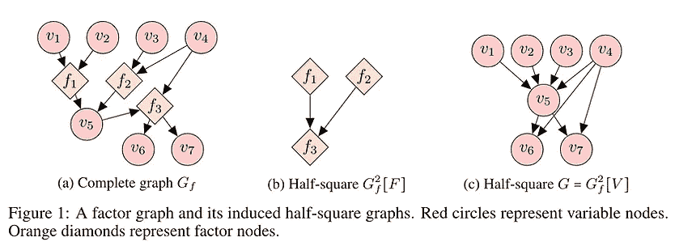**

**来源:[https://openreview.net/pdf?id=k713e8vXzwR](https://openreview.net/pdf?id=k713e8vXzwR)**

**域外概括和密切相关的因果关系是学术研究的热门话题。虽然独立的 OOD 研究还没有完全进入主流，但在机器学习基准测试文化中有一个不可否认的趋势，即越来越关注在具有挑战性的条件下(如零/少镜头或在大量数据分布变化的情况下)的稳健推广，因为静态域内评估已经以破纪录的速度一个接一个地被破解。**

**这个领域——大多数都处于早期阶段——仍然缺乏标准化，这就是为什么我们强调了关于这个主题的几个出版物(2，3)。此外，我们强调了一种简单的集成技术，用于领域概括(1)、表格嵌入(4)和因果发现的规模稀疏连接因子图(5)，这代表了我们之前强调的研究方向的进展:使用稀疏性+通信瓶颈将模型约束到捕捉其稳健因果结构的世界学习模型中。**

****1️⃣** [**平均值集成:改进模型选择，提升领域泛化性能**](https://search.zeta-alpha.com/?doc_ids=16a7f295b4b749dc504015c8c15eb8fbc2200d32)**

**[🔗OpenReview](https://openreview.net/forum?id=peZSbfNnBp4) | [🖥虚拟海报](https://neurips.cc/virtual/2022/poster/54128) | [🔎更多像这样的论文](https://search.zeta-alpha.com/?retrieval_method=keyword&retrieval_unit=document&d=c&sort_by=relevance&with_code=false&doc_sources=Advances+in+Neural+Information+Processing+Systems&dr=2022-01-01T00%3A00%3A00%2C2022-12-31T23%3A59%3A59&similar_to=CO_2510871)**

**💡在训练和集成期间使用模型参数的简单移动平均的简单超参数自由策略实现了领域泛化基准上的 SOTA，并且可以使用偏差-方差权衡来解释。**

****2️⃣** [**浅析迁移学习中的非分布泛化**](https://search.zeta-alpha.com/?doc_ids=3936e2462ac9102c82c25130275aa1b9de05356a)**

**[🔗OpenReview](https://openreview.net/forum?id=57Ryl7lLD4h) | [🖥虚拟海报](https://neurips.cc/virtual/2022/poster/53190) | [🔎更多像这样的论文](https://search.zeta-alpha.com/?retrieval_method=keyword&retrieval_unit=document&d=c&sort_by=relevance&with_code=false&doc_sources=Advances+in+Neural+Information+Processing+Systems&dr=2022-01-01T00%3A00%3A00%2C2022-12-31T23%3A59%3A59&similar_to=CO_3426749)**

**💡大规模的非分布泛化实证研究。**

****3️⃣** [**模块化架构够用吗？**](https://search.zeta-alpha.com/documents/46aced9f023c556db7d736e4f7def9796da422cb_0)**

**[🔗OpenReview](https://openreview.net/forum?id=3-3XMModtrx) | [🖥虚拟海报](https://neurips.cc/virtual/2022/poster/54964) | [🔎更多这样的论文](https://search.zeta-alpha.com/?retrieval_method=keyword&retrieval_unit=document&d=c&sort_by=relevance&with_code=false&doc_sources=Advances+in+Neural+Information+Processing+Systems&dr=2022-01-01T00%3A00%3A00%2C2022-12-31T23%3A59%3A59&similar_to=CO_3580913)**

**💡度量标准，以研究广泛的混合专家风格的模块化系统。这样的系统遭受崩溃和专门化的问题，并且可能需要额外的归纳偏差来克服这种次优性。**

****4️⃣** [**关于表格深度学习中数字特征的嵌入**](https://search.zeta-alpha.com/?doc_ids=98cf2f098458e82561d113e7e5bef98964c0e3ea)**

**[🔗OpenReview](https://openreview.net/forum?id=pfI7u0eJAIr) | [🖥虚拟海报](https://neurips.cc/virtual/2022/poster/54180) | [🔎更多这样的论文](https://search.zeta-alpha.com/?retrieval_method=keyword&retrieval_unit=document&d=c&sort_by=relevance&with_code=false&doc_sources=Advances+in+Neural+Information+Processing+Systems&dr=2022-01-01T00%3A00%3A00%2C2022-12-31T23%3A59%3A59&similar_to=CO_3599767)**

**💡用向量而不是标量值来表示数字特征可以显著提升表格数据的 DL 模型。**

****5️⃣** [**大规模可微因果因子图的发现**](https://search.zeta-alpha.com/?doc_ids=4e385ccbfd673955cfd34eda6b2a369cc6d71926)**

**[🔗OpenReview](https://openreview.net/forum?id=k713e8vXzwR) | [🖥虚拟海报](https://neurips.cc/virtual/2022/poster/55048) | [🔎更多像这样的论文](https://search.zeta-alpha.com/?retrieval_method=keyword&retrieval_unit=document&d=c&sort_by=relevance&with_code=false&doc_sources=Advances+in+Neural+Information+Processing+Systems&dr=2022-01-01T00%3A00%3A00%2C2022-12-31T23%3A59%3A59&similar_to=CO_3608852)**

**💡使用因子图进行具有介入数据的大规模因果发现学习。**

# **8.学习理论**

**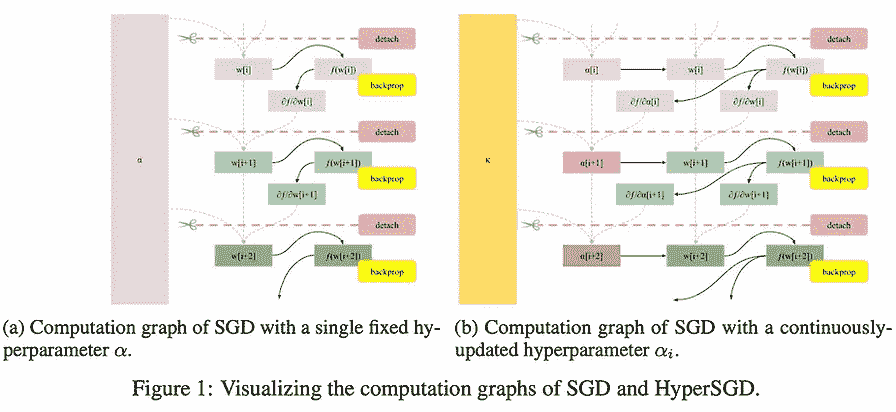**

**来源:[https://openreview.net/pdf?id=WUMH5xloWn](https://openreview.net/pdf?id=WUMH5xloWn)**

**好吧，让我们首先承认，我们中的许多人都觉得繁重的数学工作令人不快。尽管如此，NeurIPS 还是有很多值得学习的地方。**

**例如，大批量被证明是成功学习对比学习表征的关键。这从直觉上讲是有道理的，但是有更有根据的统计解释吗？(1)或者当在不够平滑的函数上盲目使用 autodiff 时，我们可以期待什么保证？(3)或者说，在什么条件下，在发行之外表现良好甚至是可能的？(2).如果你对这些问题感兴趣，可以看看下面的文章。**

****1️⃣** [**对比学习中为什么需要大批量？渐变透视**](https://search.zeta-alpha.com/documents/fdc8de5fc2a6f3b54bc291fc415b39e571a1f7b8_0)**

**[🔗OpenReview](https://openreview.net/forum?id=T1dhAPdS--) | [🖥虚拟海报](https://neurips.cc/virtual/2022/poster/54394) | [🔎更多这样的论文](https://search.zeta-alpha.com/?retrieval_method=keyword&retrieval_unit=document&d=c&sort_by=relevance&with_code=false&doc_sources=Advances+in+Neural+Information+Processing+Systems&dr=2022-01-01T00%3A00%3A00%2C2022-12-31T23%3A59%3A59&similar_to=CO_3745540)**

**💡一种贝叶斯数据扩充方法，用于在对比学习中解开负样本以减轻梯度偏差。**

****2️⃣** [**分布外检测可学吗？**](https://search.zeta-alpha.com/documents/5e1a7b15569f47d13933675163a6b3fe16d7e675_0)**

**[🔗OpenReview](https://openreview.net/forum?id=sde_7ZzGXOE) | [🖥虚拟海报](https://neurips.cc/virtual/2022/poster/55375) | [🔎更多这样的论文](https://search.zeta-alpha.com/?retrieval_method=keyword&retrieval_unit=document&d=c&sort_by=relevance&with_code=false&doc_sources=Advances+in+Neural+Information+Processing+Systems&dr=2022-01-01T00%3A00%3A00%2C2022-12-31T23%3A59%3A59&similar_to=CO_3747496)**

**💡通过可能近似正确(PAC)学习理论的视角，本文研究了 OOD 检测的推广:对样本是否属于训练分布进行分类。他们发现在某些条件下这是不可能的，并围绕它证明了形式定理，但这些条件在现实世界的问题中大多不被关注。**

****3️⃣** [**自动微分的非光滑迭代算法**](https://search.zeta-alpha.com/?doc_ids=cafaf1ce637f01459ef0bdd22c72f845f91a6b08)**

**[🔗OpenReview](https://openreview.net/forum?id=WUMH5xloWn) | [🖥虚拟海报](https://neurips.cc/virtual/2022/poster/54759) | [🔎更多像这样的论文](https://search.zeta-alpha.com/?retrieval_method=keyword&retrieval_unit=document&d=c&sort_by=relevance&with_code=false&doc_sources=Advances+in+Neural+Information+Processing+Systems&dr=2022-01-01T00%3A00%3A00%2C2022-12-31T23%3A59%3A59&similar_to=CO_3368463)**

**💡对不够平滑的函数应用自动挖掘会发生什么？基本没问题。无论如何，它们都会收敛到经典导数。**

****4️⃣** [**高效和模块化的隐性分化**](https://search.zeta-alpha.com/?doc_ids=36e6ad7e300d6e2752f0959b3ffdf9ad3ff18b9e)**

**[🔗OpenReview](https://openreview.net/forum?id=Q-HOv_zn6G) | [🖥虚拟海报](https://neurips.cc/virtual/2022/poster/54915) | [🔎更多像这样的论文](https://search.zeta-alpha.com/?retrieval_method=keyword&retrieval_unit=document&d=c&sort_by=relevance&with_code=false&doc_sources=Advances+in+Neural+Information+Processing+Systems&dr=2022-01-01T00%3A00%3A00%2C2022-12-31T23%3A59%3A59&similar_to=CO_3295434)**

**💡Autodiff 但是以隐式形式(即当你不能在等号左边隔离 f(x)时)。在 JAX 实施。**

****5️⃣**t8**渐变下降:终极优化器**t11】**

**[🔗OpenReview](https://openreview.net/forum?id=-Qp-3L-5ZdI) | [🖥虚拟海报](https://neurips.cc/virtual/2022/poster/54591) | [🔎更多这样的论文](https://search.zeta-alpha.com/?retrieval_method=keyword&retrieval_unit=document&d=c&sort_by=relevance&with_code=false&doc_sources=Advances+in+Neural+Information+Processing+Systems&dr=2022-01-01T00%3A00%3A00%2C2022-12-31T23%3A59%3A59&similar_to=CO_3352159)**

**💡使用梯度下降不仅调整超参数，还调整超超参数，等等…这项工作展示了如何通过对反向传播进行简单而优雅的修改来自动计算超梯度。**

# **9.对抗鲁棒性，联合学习，压缩**

**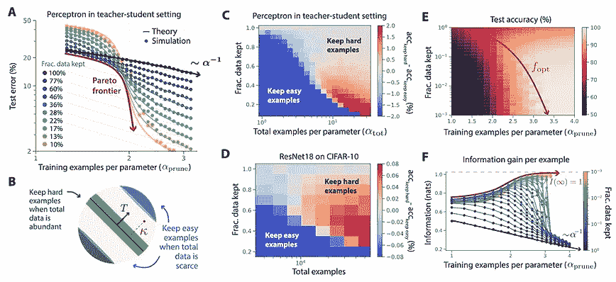**

**来源:[https://openreview.net/pdf?id=UmvSlP-PyV](https://openreview.net/pdf?id=UmvSlP-PyV)**

**在我的记忆中，ML 中的对抗性健壮性已经成为*的事情*，今年也没有什么不同(3，5)。这是可以理解的，因为当涉及到在安全关键应用(如自动驾驶)中使用模型时，这是一个非常重要的问题。**

**另一方面，联合学习，有时与差分隐私结合，是另一个多产的研究领域，仍然需要在主流现实世界应用中找到它的用途(2)。一个在现实世界中已经广泛使用的 camp，压缩，修剪和其他速度/效率增强技术(4)。最后，修剪的新变化着眼于修剪数据，而不是权重，以比比例法则允许的更快的速度训练神经网络！(1)**

****1️⃣****

**[🔗OpenReview](https://openreview.net/forum?id=UmvSlP-PyV) | [🖥虚拟海报](https://neurips.cc/virtual/2022/poster/53016) | [🔎更多像这样的论文](https://search.zeta-alpha.com/?retrieval_method=keyword&retrieval_unit=document&d=c&sort_by=relevance&with_code=false&doc_sources=Advances+in+Neural+Information+Processing+Systems&dr=2022-01-01T00%3A00%3A00%2C2022-12-31T23%3A59%3A59&similar_to=CO_3585866)**

**💡在理论和实践中，可以通过智能数据修剪来改善关于数据集大小的幂律误差标度。**

****2️⃣** [**自我感知的个性化联邦学习**](https://search.zeta-alpha.com/?doc_ids=43a263018a1400835605ceffb25e2c00538cc617)**

**[🔗OpenReview](https://openreview.net/forum?id=EqJ5_hZSqgy) | [🖥虚拟海报](https://neurips.cc/virtual/2022/poster/52778) | [🔎更多像这样的论文](https://search.zeta-alpha.com/?retrieval_method=keyword&retrieval_unit=document&d=c&sort_by=relevance&with_code=false&doc_sources=Advances+in+Neural+Information+Processing+Systems&dr=2022-01-01T00%3A00%3A00%2C2022-12-31T23%3A59%3A59&similar_to=CO_2788924)**

**💡我们提出了一种新的用于个性化的自适应联邦学习算法。**

****3️⃣****

**[🔗OpenReview](https://openreview.net/forum?id=NkK4i91VWp) | [🖥虚拟海报](https://neurips.cc/virtual/2022/poster/55120) | [🔎更多像这样的论文](https://search.zeta-alpha.com/?retrieval_method=keyword&retrieval_unit=document&d=c&sort_by=relevance&with_code=false&doc_sources=Advances+in+Neural+Information+Processing+Systems&dr=2022-01-01T00%3A00%3A00%2C2022-12-31T23%3A59%3A59&similar_to=CO_3292310)**

**💡使研究人员能够发现有缺陷的对抗性鲁棒性评估的测试。通过这个测试产生了令人信服的证据，证明所使用的攻击有足够的能力来评估模型的健壮性。**

****4️⃣**[**256 kb 内存下的车载训练**](https://search.zeta-alpha.com/?doc_ids=31cbd45e213938f6c0453954bcdfb1414279dcea)**

**[🔗OpenReview](https://openreview.net/forum?id=zGvRdBW06F5) | [🖥虚拟海报](https://neurips.cc/virtual/2022/poster/55026) | [🔎更多这样的论文](https://search.zeta-alpha.com/?retrieval_method=keyword&retrieval_unit=document&d=c&sort_by=relevance&with_code=false&doc_sources=Advances+in+Neural+Information+Processing+Systems&dr=2022-01-01T00%3A00%3A00%2C2022-12-31T23%3A59%3A59&similar_to=CO_3638105)**

**💡一个在小型物联网设备上进行设备上培训的框架，即使在 256KB 的有限内存预算下也是如此。**

****5️⃣** [**预先训练好的对抗性扰动**](https://search.zeta-alpha.com/documents/c07378e4db5c6d2676f317d3e4f02c8a884c3dbb_0)**

**[🔗OpenReview](https://openreview.net/forum?id=ZLcwSgV-WKH) | [🖥虚拟海报](https://neurips.cc/virtual/2022/poster/53285) | [🔎更多像这样的论文](https://search.zeta-alpha.com/?retrieval_method=keyword&retrieval_unit=document&d=c&sort_by=relevance&with_code=false&doc_sources=Advances+in+Neural+Information+Processing+Systems&dr=2022-01-01T00%3A00%3A00%2C2022-12-31T23%3A59%3A59&similar_to=CO_3619404)**

**💡一种使用预训练模型生成对抗样本的新算法，该算法可以欺骗相应的微调模型，从而揭示微调预训练模型执行下游任务的安全性问题。**

# **10.数据集和基准**

**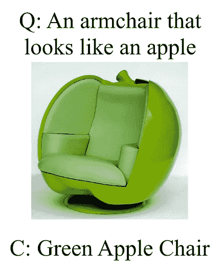**

**来源:[https://openreview.net/pdf?id=M3Y74vmsMcY](https://openreview.net/pdf?id=M3Y74vmsMcY)**

**最后但同样重要的是，曼梯·里的无名英雄们。随着进步的步伐不断加快，甚至现代数据集的饱和速度也超过了大多数人的预测[链接到 palm 和指令微调]，衡量有趣现象的新数据集必须出现，以取代它们。像去年一样，NeurIPS 为数据集和基准测试论文提供了一个特殊的轨道([参见这里的完整列表](https://openreview.net/group?id=NeurIPS.cc/2022/Track/Datasets_and_Benchmarks))。**

**许多建议的基准非常有趣和有用，所以下面的列表肯定会漏掉一些。尽管如此，它还是来了👇**

****1️⃣** [**LAION-5B:用于训练下一代图文模型的开放大规模数据集**](https://search.zeta-alpha.com/documents/c5663b59ddaa30ed239c3305e834b0c8c1f2bb78_0)**

**[🔗OpenReview](https://openreview.net/forum?id=M3Y74vmsMcY) | [🖥虚拟海报](https://neurips.cc/virtual/2022/poster/55659) | [🔎更多像这样的论文](https://search.zeta-alpha.com/?retrieval_method=keyword&retrieval_unit=document&d=c&sort_by=relevance&with_code=false&doc_sources=Advances+in+Neural+Information+Processing+Systems&dr=2022-01-01T00%3A00%3A00%2C2022-12-31T23%3A59%3A59&similar_to=CO_3677892)**

**💡一个开放的、公开可用的 5.8B 图像-文本对数据集，并通过复制不同比例的最新剪辑模型的训练结果来验证它。**

****2️⃣** [**DC-BENCH:数据集凝聚基准**](https://search.zeta-alpha.com/?doc_ids=d0b584376fb59f4b8c1a0c08249909c2f762f34f)**

**[🔗OpenReview](https://openreview.net/forum?id=Bs8iFQ7AM6) | [🖥虚拟海报](https://neurips.cc/virtual/2022/poster/55673) | [🔎更多这样的论文](https://search.zeta-alpha.com/?retrieval_method=keyword&retrieval_unit=document&d=c&sort_by=relevance&with_code=false&doc_sources=Advances+in+Neural+Information+Processing+Systems&dr=2022-01-01T00%3A00%3A00%2C2022-12-31T23%3A59%3A59&similar_to=CO_3529354)**

**💡数据集浓缩旨在学习一个微小的数据集，该数据集捕捉原始数据集中编码的丰富信息。比较冷凝仍然是一个挑战，这就是为什么提出这个基准。**

****3️⃣** [**NeoRL:离线强化学习的近真实基准**](https://search.zeta-alpha.com/?doc_ids=4ea44d20c0aed5af237c72679f9cebc3a562f9c9)**

**[🔗OpenReview](https://openreview.net/forum?id=jNdLszxdtra) | [🖥虚拟海报](https://neurips.cc/virtual/2022/poster/55707) | [🔎更多这样的论文](https://search.zeta-alpha.com/?retrieval_method=keyword&retrieval_unit=document&d=c&sort_by=relevance&with_code=false&doc_sources=Advances+in+Neural+Information+Processing+Systems&dr=2022-01-01T00%3A00%3A00%2C2022-12-31T23%3A59%3A59&similar_to=CO_3278878)**

**💡近真实世界离线 RL 基准测试(NeoRL)是一个强调在真实世界应用中部署离线 RL 的完整管道的基准测试，旨在弥合离线评估和在线部署性能之间的性能差距。**

****4️⃣** [**对文本后门学习的统一评价:框架与基准**](https://search.zeta-alpha.com/?doc_ids=2d87b0b09381276f5a8a81339d9834b52edacbc5)**

**[🔗OpenReview](https://openreview.net/forum?id=k3462dQtQhg) | [🖥虚拟海报](https://neurips.cc/virtual/2022/poster/55741) | [🔎更多像这样的论文](https://search.zeta-alpha.com/?retrieval_method=keyword&retrieval_unit=document&d=c&sort_by=relevance&with_code=false&doc_sources=Advances+in+Neural+Information+Processing+Systems&dr=2022-01-01T00%3A00%3A00%2C2022-12-31T23%3A59%3A59&similar_to=CO_3588839)**

**💡在训练阶段注入后门可能是对手控制 NLP 系统(如语言模型)的一种强有力的方法。这项工作提出了一个开源工具包 OpenBackdoor，它能够严格评估模型在这些类型的攻击面前有多脆弱。**

****5️⃣** [**同行:蛋白质序列理解的综合多任务基准**](https://search.zeta-alpha.com/?doc_ids=6b4448e97cd9a19475a037eb14fb18283a68c066)**

**[🔗OpenReview](https://openreview.net/forum?id=QgTZ56-zJou) | [🖥虚拟海报](https://neurips.cc/virtual/2022/poster/55752) | [🔎更多像这样的论文](https://search.zeta-alpha.com/?retrieval_method=keyword&retrieval_unit=document&d=c&sort_by=relevance&with_code=false&doc_sources=Advances+in+Neural+Information+Processing+Systems&dr=2022-01-01T00%3A00%3A00%2C2022-12-31T23%3A59%3A59&similar_to=CO_3567971)**

**💡蛋白质序列理解的综合多任务基准，研究单任务和多任务学习。**

**我们的选择到此结束，但我们的 NeurIPS 报道才刚刚开始！会议期间，我们将在新奥尔良进行现场直播，所以请务必在 Twitter @zetavector 上关注我们，了解那里发生的一切！**