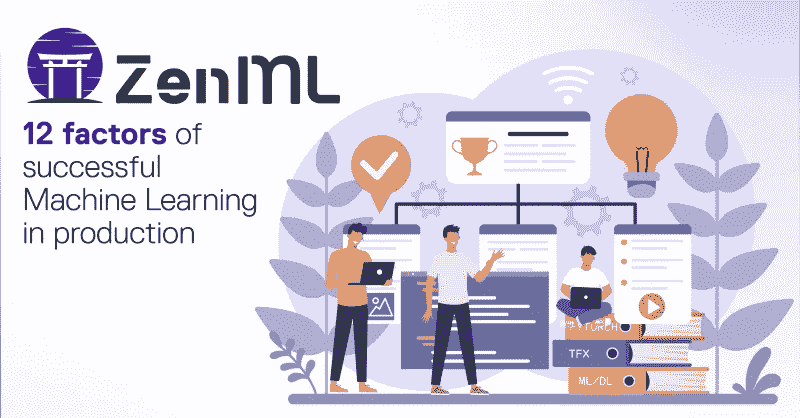

# 生产中可重复机器学习的 12 个因素

> 原文：<https://pub.towardsai.net/12-factors-of-reproducible-machine-learning-in-production-9fa8b51a511b?source=collection_archive---------2----------------------->

## [机器学习](https://towardsai.net/p/category/machine-learning)

过去的二十年让我们对软件开发有了一些深刻的理解。这在很大程度上是由于 DevOps 的出现及其在整个行业的广泛采用。

领先的软件公司遵循相同的模式:软件开发中的快速迭代，然后是持续集成、持续交付、持续部署。每一个工件都被测试其提供价值的能力，总是处于就绪状态，并且通过自动化进行部署。

作为一个领域，机器学习不同于传统的软件开发，但我们仍然可以借鉴许多知识，并将其应用于“我们的”行业。在过去的几年里，我们一直在生产中做机器学习项目，所以超越了概念证明，我们的目标也是软件开发中的目标:可再现性。因此，我们建立了一个管道协调器，强大的自动化，并建立了一个工作流程来实现这一目标。

为什么不只是 Jupyter 笔记本？那么，从零开始构建一个笔记本需要多长时间，包括所有的处理步骤，从零开始？让新成员加入团队有多容易？你能快速重现两个月前的结果吗？你能把今天的结果和历史结果进行比较吗？你能在整个培训过程中给出数据的出处吗？如果你的模型过时了会怎么样？

我们已经面对了所有这些问题，甚至更多，现在根据我们的经验推断出 12 个因素(作为对 [12 因素应用](https://12factor.net/)的认可)，这些因素构成了生产中成功 ML 的支柱。

# 1.版本控制

虽然基本上所有软件工程师都明白，但版本控制并不是数据科学家普遍接受的方法。让我引用 Gitlab 的人的话作为快速入门:

> *版本控制促进了整个软件开发团队的协调、共享和协作。版本控制软件使团队能够在分布式和异步环境中工作，管理代码和工件的变更和版本，并解决合并冲突和相关异常。*

简而言之，版本控制让您安全地管理软件开发的移动部分。

机器学习作为软件开发的一种特殊形式，有着独特的要求。首先，它有两个移动的部分:代码和数据。第二，模型训练发生在(快速)迭代中，并且引入了代码的高方差(例如，分割、预处理、模型)。

一旦数据可能发生变化，就需要对其进行版本控制，以便能够可重复地进行实验和训练模型。原始形式的版本控制(读:硬拷贝)可以走很长的路，但是特别是在团队场景共享中，不可变的版本控制变得非常关键。

代码的版本控制甚至更为关键。除了上面的引用之外，预处理代码不仅与训练相关，还与服务时间相关，并且需要与模型不变地相关。无服务器功能可以提供一种简单易用的方法，在数据科学家的工作流程和生产就绪需求之间找到一个中间点。

**TL；DR:** 你需要版本化你的代码，你需要版本化你的数据。

# 2.显式特征依赖关系

在一个完美的世界中，无论是什么产生你的输入数据，都将永远产生完全相同的数据，至少在结构上是这样。但是这个世界并不完美，你正在从一个上游服务中消费数据，这个上游服务是由人类建立的，可能会发生变化。特征最终会改变。在最好的情况下，你的模型会彻底失败，但在最坏的情况下，它们只会悄悄地产生无用的结果。

显式定义的功能依赖关系允许尽早出现透明故障。设计良好的系统将在持续培训和服务期间适应功能依赖。

**TL；DR:** 在代码中明确你的特性依赖。

# 3.描述性训练和预处理

好的软件是描述性的——不需要阅读每一行代码就可以很容易地阅读和理解。

虽然机器学习是软件开发的独特风格，但它并没有免除从业者遵循既定的编码指南。只需很少的努力和很短的时间，就可以获得对编码标准要点的基本理解。

预处理和模型的代码都应该遵循 [PEP8](https://www.python.org/dev/peps/pep-0008/) 。它应该由有意义的对象名组成，并包含有用的注释。遵循 PEP8 将提高代码可读性，降低复杂性，并加快调试速度。像 [SOLID](https://en.wikipedia.org/wiki/SOLID) 这样的编程范例提供了思想框架，使得代码对于未来的用例来说更加可维护、可理解和灵活。

配置应该与代码分开。不要硬编码你的分割比率，在运行时通过配置提供它们。正如超参数调优所知，良好分离的配置显著提高了迭代速度，并使代码库可重用。

**TL；DR:** 写可读的代码，把代码从配置中分离出来。

# 4.训练的再现性

如果你不能重现训练结果，你就不能相信结果。虽然这是这篇博文的主题，但再现性也有细微差别。不仅仅是你自己需要能够重现一次训练，整个团队都应该能够做到。在某人的 PC 或 AWS 上的一些 VM 上模糊 Jupyter 笔记本中的训练是可再现训练的字面逆。

通过使用管道来训练模型，整个团队在进行的实验和训练运行中获得了访问权和透明度。捆绑了可重用的代码库和与配置的分离，每个人都可以在任何时间点成功地重新启动任何培训。

**TL；DR:** 使用流水线和自动化。

# 5.测试

测试有多种形式。举两个例子:

*   [单元测试](https://en.wikipedia.org/wiki/Unit_testing)是原子级别的测试——每一个功能都根据其特定的标准单独测试。
*   [集成测试](https://en.wikipedia.org/wiki/Integration_testing)采用了一种相反的方法——将代码库的所有元素作为一个组进行测试，与上游和下游服务的克隆/模拟一起进行测试。

这两种范式都是机器学习的良好起点。预处理代码注定要用于单元测试——给定各种输入，转换会产生正确的结果吗？模型是集成测试的一个很好的用例——您的模型在生产环境中的服务时间产生了与评估相当的结果吗？

**TL；测试你的代码，测试你的模型。**

# 6.漂移/连续训练

漂移是生产场景中的一个合法问题。只要有一点点数据可能改变(例如，用户输入、上游服务波动)，您就需要考虑漂移。有两种方法可以减轻风险:

*   生产系统的数据监控。建立自动报告机制，提醒团队数据的变化，甚至超出明确定义的功能依赖。
*   对新输入数据的持续培训。自动化程度高的管道可以根据新记录的数据重新运行，并提供与历史训练结果的可比性，以显示性能下降，并提供一种快速方式，将新训练的模型推广到生产中，因为模型性能更好。

**TL；DR:** 如果你的数据可以改变，运行一个持续的培训管道。

# 7.结果跟踪

Excel 不是跟踪实验结果的好方法。不仅仅是 Excel，任何分散的手动形式的跟踪都会产生不权威的信息，因此是不可信的。

正确的方法是在一个集中的数据存储中记录训练结果的自动化方法。自动化确保了对每次训练运行的可靠跟踪，并允许训练运行相互比较。结果的集中存储为团队提供了透明度，并允许连续分析。

**TL；DR:** 通过自动化跟踪结果。

# 8.实验与生产模型

理解数据集需要努力。通常，这种理解是通过实验获得的，尤其是在具有大量隐藏领域知识的领域中操作时。启动一个 Jupyter 笔记本，将部分/全部数据放入熊猫数据框，做几个小时的无序魔术，训练第一个模型，评估结果——这是乔布斯做的。不幸的是没有。

实验在机器学习的生命周期中是有目的的。然而，这些实验的结果不是模型，而是理解。来自探索性 Jupyter 笔记本的模型是理解的证明，而不是生产就绪的工件。获得理解将需要更多的成型和适应生产准备就绪的培训管道。

然而，所有与特定领域知识无关的理解都可以自动化。生成您正在使用的每个数据版本的统计数据，以跳过您可能不得不在 Jupyter 笔记本中进行的任何一次性的临时探索工作，直接进入第一个管道。您越早在管道中进行试验，就可以越早在中间结果上进行合作，并且越早获得生产就绪的模型。

**TL；DR:** 笔记本电脑还不能投入生产，所以要尽早尝试。

# 9.训练发球偏斜

避免偏斜的训练和服务环境通常被简化为将所有数据预处理正确地嵌入到模型服务环境中。这是绝对正确的，你需要坚持这个规则。然而，这也是对训练-发球-歪斜的一种过于狭隘的解释。

稍微回顾一下古老的 DevOps 历史:2006 年，亚马逊的首席技术官沃纳·威格尔创造了一个术语“你建造它，你经营它”。这是一个描述性的短语，将开发人员的责任扩展到不仅编写，而且运行他们构建的软件。

机器学习项目也需要类似的动力——理解数据的上游生成和生成模型的下游使用是数据科学家的责任。什么系统生成你的训练数据？它能打破吗，什么是系统 SLO(服务水平目标)，它和服务是一样的吗？你的模特是怎么服务的？什么是运行时环境，在服务过程中如何应用预处理函数？这些都是数据科学家需要了解并找到答案的问题。

**TL；DR:** 正确地将预处理嵌入到服务中，并确保理解数据的上下游。

# 10.相似性

从在项目中引入第二个培训脚本的时间点开始，可比性就成为任何未来工作的基本部分。如果第二个模型的结果根本无法与第一个模型进行比较，那么就会产生浪费，并且这两个模型中至少有一个是多余的，如果不是两个都是多余的话。

根据定义，所有试图解决相同问题的模型训练都需要具有可比性，否则，它们就不是在解决相同的问题。虽然迭代将改变随时间推移比较模型的定义，但是比较模型训练的技术可能性需要在早期作为一等公民构建到训练架构中。

**TL；DR:** 建立你的管道，这样你就可以很容易地跨管道比较培训结果。

# 11.监视

作为一个非常粗略的描述，机器学习模型应该通过从数据中学习来解决问题。为了解决这个问题，计算资源被分配。先训练模型，后服务模型。负责在培训期间花费资源的抽象实体(例如，人或部门)将责任向前推进到服务。在模型的生命周期中，会出现大量的负面退化:数据会漂移，模型会成为整体性能的瓶颈，偏差是一个真正的问题。

效果是:数据科学家和团队负责监控他们制作的模型。如果有更大的组织参与，不一定是在监控的实施过程中，但肯定是为了理解和解释监控数据。至少，需要监控模型的输入数据、推理时间、资源使用(读取:CPU、RAM)和输出数据。

**TL；博士:**再次:你建造它，你运行它。生产中的监控模型是生产中数据科学的一部分。

# 12.模型的可部署性

在技术层面上，每个模型培训管道都需要产生一个可部署到生产中的工件。模型结果可能是可怕的，毫无疑问，但是它最终需要被包装成一个您可以直接转移到生产环境中的工件。

这是软件开发中的一个常见主题——它被称为持续交付。团队应该能够在任何给定的时刻部署他们的软件，迭代周期需要足够快以适应这个目标。

机器学习也需要类似的方法。它首先会加强关于现实和对模型的期望的对话。所有的利益相关者都需要知道模型结果在理论上的可能性。所有涉众需要就部署模型的方式，以及它在更大的软件架构中的位置达成一致。然而，这也将导致强大的自动化，并且必然采用前面段落中概述的大多数因素。

**TL；DR:** 每个培训管道都需要产生一个可部署的工件，而不仅仅是一个模型。

# 关闭

这绝不是一份详尽的清单。它结合了我们的经验，欢迎您将它用作基准测试您的产品架构的样板，或者作为设计您自己的产品架构的蓝图。

我们将这些因素作为 ML orchestrator[ZenML](https://github.com/maiot-io/zenml)的指导原则。所以在你从头开始之前，先看看 GitHub 上的 ZenML:【https://github.com/maiot-io/zenml 