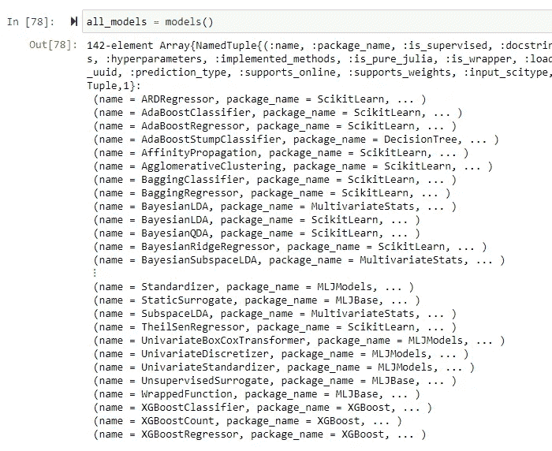
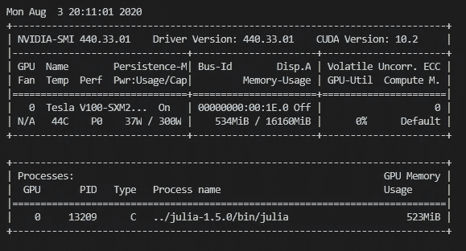
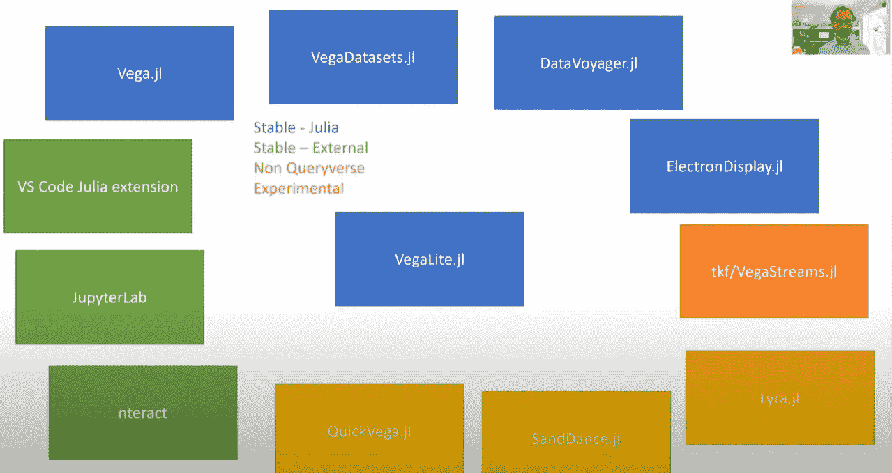

# 我在 JuliaCon 2020 学到的 13 个数据科学知识

> 原文：<https://pub.towardsai.net/13-data-science-things-i-learned-at-juliacon-2020-5362d543ced7?source=collection_archive---------4----------------------->

## [数据科学](https://towardsai.net/p/category/data-science)

来源:https://juliacon.org/2020/

# 介绍

在这篇文章中，我将分享我在 JuliaCon 2020 上了解到的 13 件与数据科学相关的事情。

# 概观

我把我的学习分成 4 类，即机器学习、工具、Julia 编码和其他。以下是他们的名单:

**机器学习**

1.  如何对表格数据进行机器学习
2.  开放机器学习(OpenML)项目
3.  用 Julia 探索图形神经网络
4.  AlphaGo Zero 的工作原理
5.  什么是科学机器学习，Julia 能提供什么帮助

**工具**

6.给朱莉娅的 IDEs

7.如何进行交互式数据可视化

8.如何从 R 调用 Julia 代码

9.茱莉亚的互动笔记本

**Julia 中的编码**

10.如何快速编写 Julia 代码

11.SIMD 是如何运作的

12.如何组织 Julia 代码

**杂项**

13.使用计算教科书学习数据科学

# 机器学习

## 如何对表格数据进行机器学习

[MLJ.jl](https://github.com/alan-turing-institute/MLJ.jl) 是艾伦图灵研究所的一个包，作为与其他包中的机器学习算法进行交互的接口。此外，它还提供了在机器学习项目中执行常见任务的功能，例如评估模型、模型堆叠和超参数调整。

目前可以对接 142 个型号。以下是其中的一部分:

图 1:MLJ 可以接口的模型子集

安东尼·布劳姆、蒂博·利纳特、杰夫罗伊·海豚、奥孔·萨缪尔和塞巴斯蒂安·沃尔默在 MLJ 举办了一次研讨会，他们在会上演示了如何使用 MLJ 在虹膜数据集上构建模型。这里有一个[记录](https://youtu.be/qSWbCn170HU)和[材料](https://github.com/ablaom/MachineLearningInJulia2020)的链接。

## 开放机器学习(OpenML)项目

OpenML 项目是一个民主化机器学习研究的平台。它有一个数据仓库，人们可以在那里定义工作任务。然后，人们可以将他们的工作提交到网站上，这样其他人就可以复制并比较结果。

它有针对 [Python](https://github.com/openml/openml-python) 和 [R](https://github.com/openml/openml-r) 的库，可以轻松下载数据、打包结果并上传回平台。Julia 似乎没有得到官方支持，但 MLJ 团队正在努力。目前，MLJ 只支持数据集接口。

这里有一个 1 分钟的[视频](https://www.youtube.com/embed/1N3qATxXrpE)来介绍这个平台是怎么回事。

## 用 Julia 探索图形神经网络

岳-涂画做了一个[演讲](https://youtu.be/GczF2zmJKlk)来介绍 [GeometricFlux.jl](https://github.com/yuehhua/GeometricFlux.jl) 这是他开发的一个做几何深度学习的包。[示例](https://github.com/yuehhua/GeometricFlux.jl/tree/master/examples)文件夹包含图形自动编码器、图形注意和图形卷积网络的实现。

我试着运行这些示例，但是没有一个会使用我的 GPU:

图 2:为什么 GPU 没有被利用？

我在 AWS 上运行它，使用的是带有深度学习(Ubuntu) AMI 的 P3 实例。看起来 AWS 在 Julia 上缺乏对 GPU 计算的开箱即用支持。

## AlphaGo Zero 的工作原理

你对 AlphaGo Zero 的算法很好奇吗？然后看看 DeepMind 的这篇博文和附带的论文。我个人并不觉得它很有帮助，因为如果没有一些代码需要修改，很难完全理解正在发生的事情。

幸运的是，有一个由 Jonathan Laurent 创建的包:

> …提供 Deepmind 的 AlphaZero 算法的*通用*、*简单*和*快速*实现:
> 
> *核心算法只有 2000 行纯的、可破解的 Julia 代码。
> 
> *通用界面便于添加对新游戏或新学习框架的支持。
> 
> *该实现比用 Python 编写的竞争对手快一到两个数量级，能够在带有 GPU 的标准桌面计算机上解决重要的游戏。

这个包附带了全面的文档，被积极地维护着，代码可读性很高，组织也很好。这是一个开始深入理解算法如何工作以及学习如何编写地道的 Julia 代码的好地方。

这个包的另一个显著特点是它支持分布式培训！马特·鲍曼在他的[演讲](https://youtu.be/JVUJ5Oohuhs?t=161)中演示了这一点，他使用 [JuliaHub](https://juliahub.com/ui/Home) 训练一个模型在云上的 11 个 GPU 节点集群上玩 Connect Four。请注意，JuliaHub 的这一特殊功能仍处于测试阶段，但您可以在这里[注册您的兴趣。](https://juliacomputing.com/juliahub-interest/)

AlphaZero.jl 中可用的游戏有 Connect Four 和 Tic Tac Toe。曼卡拉是一项正在进行中的工作。正在讨论增加对国际象棋的支持。

## 什么是科学机器学习，Julia 能提供什么帮助

Karen E. Wilcox 教授做了一个关于科学机器学习的主题演讲[,题目是“科学机器学习:基于物理的建模遇到数据驱动的学习”。](https://youtu.be/Bk4PJnjuPps)

我真的很喜欢这次谈话。我认为她很好地解释了使用机器学习来帮助科学发现的机遇和挑战。

例如，她分享了她的实验室开发的一种方法，该方法近似于模拟火箭发动机燃烧室内部反应流的模拟器，以便科学家可以在几秒钟内获得结果，而不是等待数百小时。如果你渴望了解更多关于这种机器学习应用的信息，请查看她的实验室的页面。

原来 Julia 有很多帮助科学机器学习的包。Chris Rackauckas 主持了一个[研讨会](https://youtu.be/QwVO0Xh2Hbg)，他在会上参观了 SciML [网站](https://sciml.ai/)的内容，并做了几个现场编码会议来演示科学机器学习的几个不同用例，包括使用贝叶斯推理来估计一组微分方程的参数，以及用神经网络求解微分方程。

# 工具

## 给朱莉娅的 IDEs

Julia 有两个流行的 ide:[Juno](https://junolab.org/)和 [Visual Studio Code (VS Code)。](https://marketplace.visualstudio.com/items?itemName=julialang.language-julia)在 JuliaCon 2020 上，Juno [的开发者宣布](https://youtu.be/rQ7D1lXt3GM)他们将与 VS 代码的 Julia 扩展的开发者联手。

我认为这是一个好消息，因为每个 IDE 都有它的优点和缺点，随着开发人员现在将他们的资源集中在一起，这应该会为 Julia 生态系统带来更好的工具。如果你是 VS 代码的新手，看看 David Anthoff 的[演练](https://youtu.be/IdhnP00Y1Ks)关于用 VS 代码做 Julia 的开发。

## 如何进行交互式数据可视化

在 Julia 中进行交互式可视化的一种方式是通过 [VegaLite.jl](https://github.com/queryverse/VegaLite.jl) 包。David Anthoff 有另一个[演讲](https://youtu.be/UotQ4tPjyTk)，他描述了 Julia 中的 [Vega](https://vega.github.io/vega/) 和 [Vega-Lite](https://vega.github.io/vega-lite/) 生态系统以及未来的计划:

图 Julia 中的 Vega 和 Vega-Lite 生态系统

使用这个生态系统中的包进行可视化的一个方面，我发现非常有吸引力，那就是使用 [DataVoyager.jl](https://github.com/queryverse/DataVoyager.jl#extracting-plots) 中的 UI 来交互式地创建可视化而无需任何代码，并提取其 [Vega-Lite 规范](https://vega.github.io/vega-lite/docs/spec.html)以便在必要时进一步定制是多么容易。

这是一个非常有用的特性，因为我经常很难回忆起正确的序列函数调用来产生我想要的可视化效果。

## 如何从 R 调用 Julia 代码

Stefan Lenz 在[演讲](https://youtu.be/ObYDHi_jJXk)中介绍了 [JuliaConnectoR](https://github.com/stefan-m-lenz/JuliaConnectoR) ，这是一个提供 R 和 Julia 之间无缝集成的 R 包。

我认为值得关注这个包，因为它为 R 用户提供了另一种解决代码性能瓶颈的方法。

## 茱莉亚的互动笔记本

[Pluto.jl](https://github.com/fonsp/Pluto.jl) 是茱莉亚的笔记本环境。它很像 Jupyter，只不过它只支持 Julia(至少目前是这样)。那么为什么要用冥王星呢？

Jupyter 笔记本的挑战在于它很难进行版本控制(试着做一个笔记本的 diff ),并且很容易通过以任意顺序执行单元格来弄乱你的结果。冥王星没有这些缺陷。

在 Pluto 中，笔记本被保存为普通的 Julia 文本文件，因此这些差异是人们可读的。Pluto 的设计是这样的，更新单元格中的变量会自动更新依赖于该变量的任何单元格，因此任何单元格中的结果都将总是反映所有变量的最新值。

这些只是使用冥王星笔记本的一些好处。要了解更多细节和其他很酷的功能，请观看 Fons van der Plas 和 Nicholas Bochenski 的[演示](https://youtu.be/IAF8DjrQSSk)。

# Julia 中的编码

## 如何快速编写 Julia 代码

Nassar Huda 举办了一场[研讨会](https://youtu.be/S5R8zXJOsUQ)，她在会上讲述了如何:

*   基准朱莉娅代码
*   提高 Julia 代码运行时间的性能技巧
*   从 Julia 调用 C 和 Python 代码

这是一个针对 Julia 新手的研讨会，但整个过程都有活跃的问答环节，所以我认为即使对于中级用户也值得一看。这里是[链接](https://github.com/nassarhuda/juliacon2020files)到所涵盖的材料。

布莱恩·杰克逊的[演讲](https://youtu.be/o8qTJGcPWkE)是另一个我觉得有趣的与表演相关的演讲。他分享了编写无分配代码的 3 个技巧:

*   使用[静态数组](https://github.com/JuliaArrays/StaticArrays.jl)
*   使用[功能障碍](https://docs.julialang.org/en/v1/manual/performance-tips/index.html#kernel-functions-1)
*   使用数组的向量而不是多维数组

这些技巧基于他优化[trajectory optimization . JL](https://github.com/RoboticExplorationLab/TrajectoryOptimization.jl)包的经验，在这个包中，他通过消除分配实现了 100 倍的加速！

## SIMD 是如何运作的

SIMD 代表单指令多数据，它指的是现代 CPU 中允许它并行执行数据向量操作的指令集。实际上，这是另一种提高性能的方法。

在 Julia 上利用 SIMD 非常容易，尽管这是一个非常低级的性能调整。Kristoffer Carlsson 在他的[演讲](https://youtu.be/MUGQnq7mkSs)中描述了如何做到这一点，他还谈到:

*   SIMD 是如何运作的
*   如何检查你的朱莉娅代码使用 SIMD

## 如何组织 Julia 代码

雅各布·奎因主持了一个关于构建微服务的[研讨会](https://youtu.be/uLhXgt_gKJc)。在那个工作室里，他从零开始构建了一个基于微服务架构的 web 应用程序来管理音乐专辑。

虽然这肯定不是一个典型的数据科学家会做的事情，但我发现这个研讨会非常有用，它可以帮助我了解 Julia 必须支持的包，为模型推断构建一个 HTTP REST 端点。我还学会了如何为大型项目组织 Julia 代码，以及如何使用`import`、`using`和`include`语句。

这里是研讨会期间使用的[幻灯片](https://docs.google.com/presentation/d/1gUkGFZgs26xd2tguN52mk2mJX4KD4Jmtn1eWoXlcqLY)和[报告](https://github.com/quinnj/MusicAlbums.jl/tree/master)的链接。

# 其他人

## 使用计算教科书学习数据科学

来自密歇根大学的特拉维斯·德普拉托和拉吉·拉奥教授做了一次演讲，介绍了法典的概念。据他们说:

> 法典是一个独立的、交互式的、计算性的指导性文件。

这听起来就像你用 Jupyter 笔记本写了一本书一样，不是吗？嗯，这不是你从学习效能的角度来看。

Jupyter 笔记本作为教学工具的一些局限性包括:

*   对于学习者来说，点击“运行全部”并完成它是很有诱惑力的
*   您不能个性化内容

他们已经建立了一个[平台](https://mynerva.io/)来帮助创作和分发代码。创作功能将于 2021 年初推出，目前可用的代码似乎是密歇根大学的课程，并没有广泛提供给公众(例如，[科学家和工程师的计算机器学习](https://mynerva.io/continuum/)，[每个人的应用计算线性代数](https://mynerva.io/compla/))。

可供公众消费的有:

*   朱莉娅简介
*   有通量的深网. jl

在此注册[即可体验，课程注册码`JuliaCon2020`。我试过了，发现它们非常吸引人(因为你不能跳过细胞)。](https://mynerva.io/courses/register)

我希望将来我们能看到更多以这种格式出版的技术教科书。

# 结论

这篇文章回顾了我在 JuliaCon 2020 上了解到的与数据科学相关的 13 件事。我希望这激起了你在下一个数据科学项目中尝试 Julia 的兴趣。