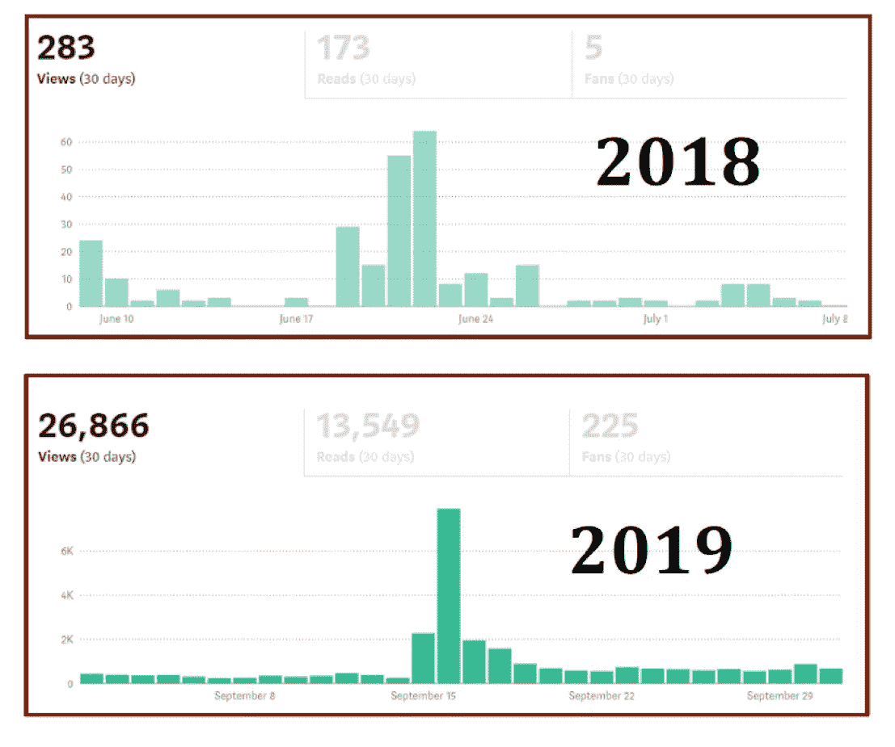
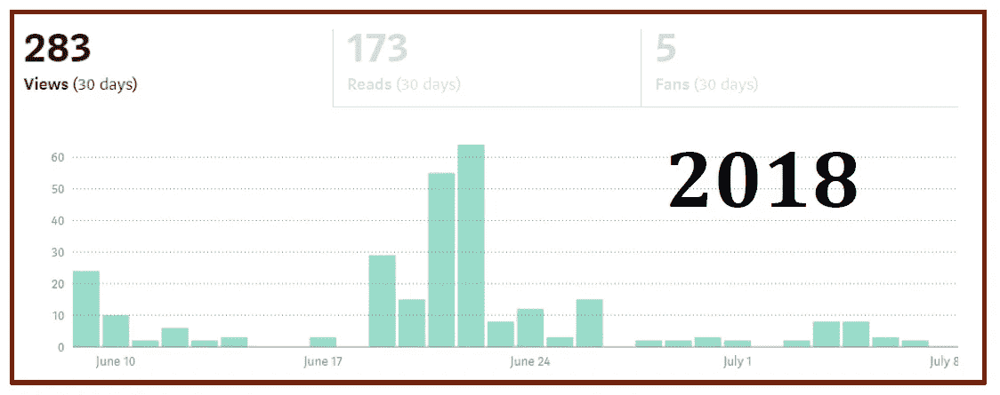
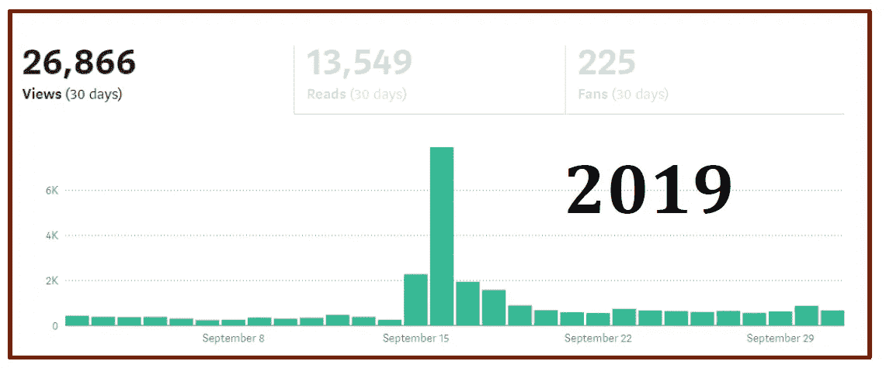
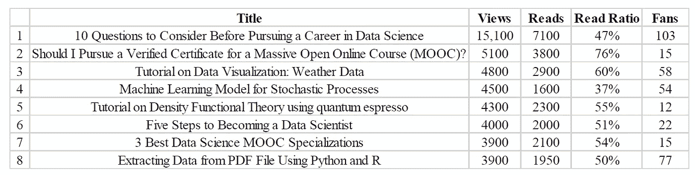
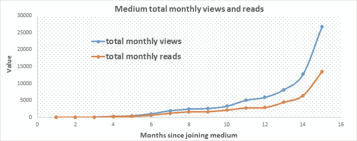
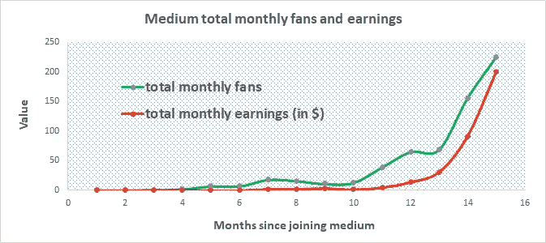

# 15 个月撰写关于媒体的数据科学文章——成就和经验教训

> 原文：<https://pub.towardsai.net/15-months-of-writing-data-science-articles-on-medium-accomplishments-and-lessons-learned-8b3d3f37d053?source=collection_archive---------0----------------------->

## 写数据科学文章的个人经验| [走向 AI](https://towardsai.net)

我一年多前加入了 Medium。我在 2018 年 7 月 7 日**发表了我的第一篇中型文章 [**使用 R 中的 sapply()函数生成一个表格**](https://medium.com/@benjaminobi/using-sapply-function-in-r-to-generate-a-table-310c8fb931cf) 。这篇文章主要是为了实验目的而写的。当有人真正阅读他们的作品并对他们的作品发表反馈和评论时，作家获得的满足感是鼓励我继续写作的原因。**

尽管我已经写了几篇文章，涵盖了各种各样的主题，如体育分析、材料科学、物理学、在线教育和个人成长，但本文将只关注数据科学文章。

在深入研究我一年多来撰写数据科学文章的成就和经验之前，让我先解释一下使用介质写作的好处。

# 在介质上写数据科学文章的好处？

写中型文章有 6 个主要优势:

1.  它为您提供了展示数据科学知识和技能的途径。
2.  它激励你从事具有挑战性的数据科学项目，从而提高你的数据科学技能。
3.  它使你能够提高你的沟通技巧。这是有用的，因为它使你能够以一种普通大众能够理解的方式传达信息。
4.  写作是一个学术过程，可以帮助你发展思维能力和创造力。
5.  每一篇发表在 medium 上的文章都被认为是知识产权，所以你可以在简历中添加一篇 Medium 文章。
6.  你可以从你的文章中赚钱。借助[**Medium Partner Program**](https://medium.com/creators)，任何在 Medium 上发表文章的人都可以使自己的文章获得赚钱的资格。

# 在媒体上发表 15 个月后的成就

媒体刊物[对 AI](https://medium.com/towards-artificial-intelligence/about) 的顶级撰稿人。

连续 3 个月，我的数据科学文章作为最受欢迎的文章出现在关于人工智能的出版物中:[关于人工智能，最受欢迎的故事-2019 年 6 月](https://medium.com/towards-artificial-intelligence/most-popular-stories-june-2019-334616eea957)，[关于人工智能，最受欢迎的故事-2019 年 7 月](https://medium.com/towards-artificial-intelligence/towards-ai-most-popular-stories-july-2019-9dbe54e4a35c)，[关于人工智能，最受欢迎的故事-2019 年 8 月](http://Towards AI, Most Popular Stories — August 2019)

空前的总浏览量= 71，000

空前的总阅读量= 38，000

所有时间的读取率= 54%

关注人数= 555

最大月总收入= **$200**

最低月总收入= **$1.47**

**增加百分比** = 100 x(最大-最小)/最小= **13，500%**

**加入媒体第一个月的浏览量与当前浏览量的对比:**

**我的前 8 篇中型文章:**

# 如何增加你的浏览量、阅读量、粉丝数和收入

每个作家都希望自己的文章或故事被更多的读者阅读。此外，medium 根据阅读时间、点击次数、阅读率、粉丝数量等参与度指标向作者支付报酬。尽管 Medium 用来确定你收入的算法晦涩难懂，但有一点是明确的:你的参与度指标与你文章的浏览量密切相关。

所以为了增加你的收入，你需要增加你的文章的浏览量。当你的文章浏览量上升时，你的阅读量会上升，你的鼓掌次数会上升，你的粉丝数也会上升。

因此，增加中等收入的秘诀是增加你的浏览量，如下图所示。

# 增加你的浏览量、阅读量、粉丝数和收入的 4 个技巧:

1.  作为一个成功的媒体作家，你必须不停地写，写，写。你写的和发布的越多，你获得的浏览次数就越多，这反过来会转化为阅读量、粉丝和收入。
2.  保持你的文章有 4 到 6 分钟的阅读时间。大多数人的注意力持续时间都不是很长。为了鼓励和激励你的读者从头到尾阅读你的文章，保持你的文章简短是很好的。
3.  策划的故事:为了让你的故事被策划，它必须是高质量的。策划的故事获得更多的观点，因为你的文章通过媒体传播，可以被列为特色文章。这将吸引更多的观众和读者，以及更多的粉丝。有关这方面的更多信息，请参见 [**Medium 的策展指南**](https://help.medium.com/hc/en-us/articles/360006362473?source=post_stats_page---------------------------) 。
4.  特征图像:你的特征图像应该仔细选择。它应该是一个高质量的图像，能够立即抓住观众的注意力，并激励他们点击你的故事并通读。特征图像对于一个故事是否被策展人选中起着很大的作用。如果您使用来自网站的图像，建议您遵守关于该图像的版权规则。确保您有权重复使用该图像。为了避免违反版权规则，你可以创建自己的特色图片。我的大部分被策划的文章都是我自己创作的特色图片。本文: [**为您的数据科学文章选择合适的特色图片**](https://medium.com/towards-artificial-intelligence/choose-the-right-featured-image-for-your-data-science-article-e101719600cf) 将帮助您为您的文章选择合适的特色图片。

# 未来写作目标

自从大约 15 个月前我的第一篇文章在 medium 上发表以来，写作已经成为我生活中不可或缺的一部分。通过我的文章，我与世界各地成千上万热情的学习者分享了我在物理、材料科学、在线教育、数据科学、机器学习和分析方面的不同经验。我的目标是继续提高自己作为一名作家的水平，不断鞭策自己写作，写作，再写作。写作是奇妙而有趣的！

**其他有用链接:**

[在媒体上撰写数据科学博客的初学者指南](https://medium.com/towards-artificial-intelligence/beginners-guide-to-writing-data-science-blogs-on-medium-a74774cf8f66)

[数据科学 101 —包含 R 和 Python 代码的中型平台短期课程](https://medium.com/towards-artificial-intelligence/data-science-101-a-short-course-on-medium-platform-with-r-and-python-code-included-3cdc9d489c6d)

[在从事数据科学职业之前需要考虑的 10 个问题](https://medium.com/towards-artificial-intelligence/10-questions-to-consider-before-pursuing-a-career-in-data-science-9fc6a1c92ba3)

[为您的数据科学文章选择合适的特色图片](https://medium.com/towards-artificial-intelligence/choose-the-right-featured-image-for-your-data-science-article-e101719600cf)