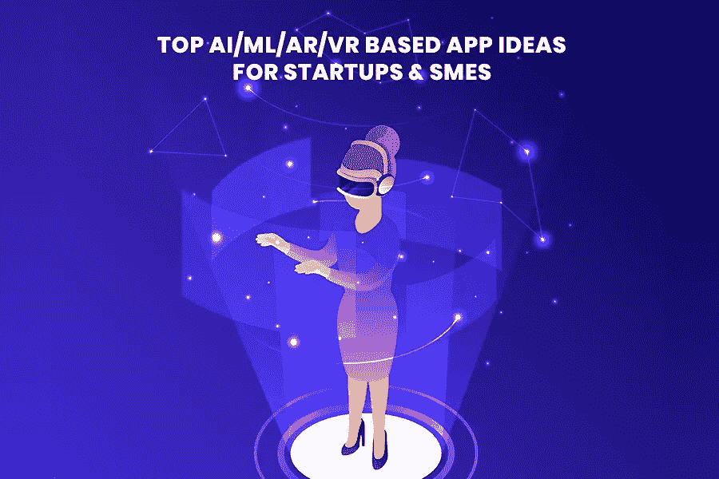
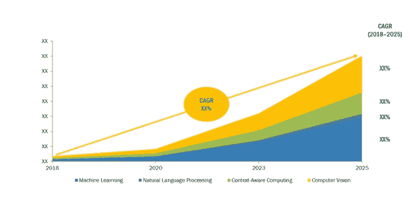
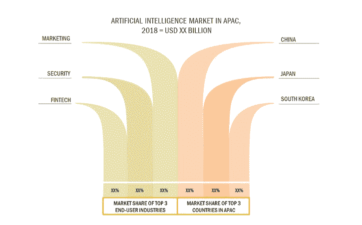
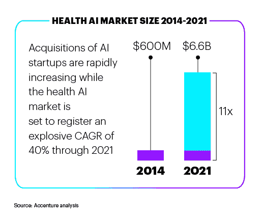
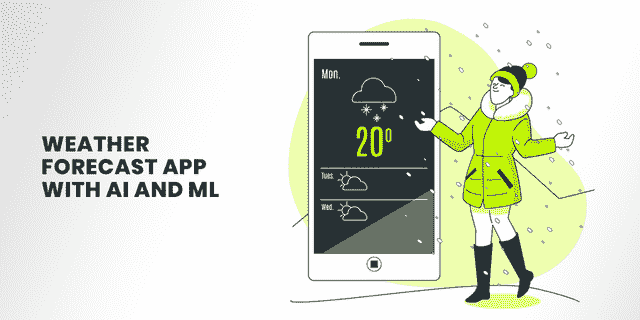
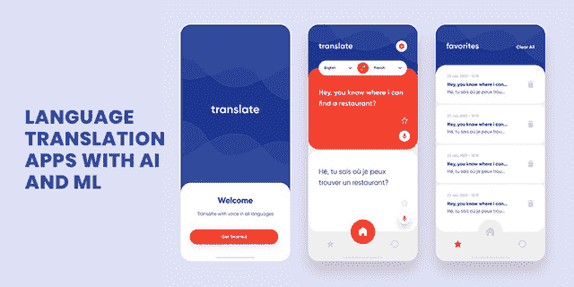

# 2021 年基于 AI/ML/AR/VR 的 15 大独特应用创意

> 原文：<https://pub.towardsai.net/15-top-ai-ml-ar-vr-based-app-ideas-for-startups-and-smes-in-2020-21-3379efcae92f?source=collection_archive---------0----------------------->

## [技术](https://towardsai.net/p/category/technology)

> 打算投资一款手机应用？以下是确保你在 2021 年成功的 15 大 AI/ML/VR/AR 应用开发创意！

随着应用程序商店中约 500 万个应用程序的出现，开发普通移动应用程序的趋势正在逐渐消失。移动应用程序的使用逐年增加，这也推动了对创新技术的需求，以满足未来移动应用程序用户的需求。

人工智能和机器学习(AI & ML)已经成为移动应用开发领域最具影响力的技术，并为 2021 年的创业公司创造了大量机会。

事实是，人工智能和人工智能、增强现实和虚拟现实等新兴技术已经改变了我们管理日常任务的方式。从要求 Alexa 为你订购杂货到获得个人购物建议，Snapchat 中基于增强现实的过滤器到基于虚拟现实的游戏，访问虚拟助手到语音辅助，AI/ML/AR/VR 技术正在统治着每一个地方。

如果你仍然想知道在 AI/ML/AR/VR 应用程序开发上投入时间和精力是否是一个值得的决定。

## 在这种情况下，你应该了解关于人工智能和机器学习的关键统计数据:

*   根据 [MarketsandMarkets 预测](https://www.marketsandmarkets.com/Market-Reports/artificial-intelligence-market-74851580.html)，人工智能市场将从 2018 年的 214.6 亿美元跃升至 2025 年的 1906.1 亿美元，CAGR 为 36.62%。

图片来源:[市场和市场](https://www.marketsandmarkets.com/Market-Reports/artificial-intelligence-market-74851580.html)

*   据《福布斯》报道，84%的受访者表示，人工智能将使他们获得或保持竞争优势，并帮助他们在市场中保持竞争力。
*   61%拥有创新战略的企业高管表示，他们正在使用人工智能来识别否则会被错过的数据机会。
*   [95%的企业](https://www.forbes.com/sites/gilpress/2016/07/20/artificial-intelligence-rapidly-adopted-by-enterprises-survey-says/#30372f1e12da)同意，如果他们擅长使用大数据来解决业务问题或产生洞察力，他们也可以使用人工智能技术来简化他们的业务任务。
*   [根据研究](https://www.idc.com/getdoc.jsp?containerId=US43171317)，到 2021 年，75%的商业企业应用将使用人工智能。
*   [80%的企业](https://www.businesswire.com/news/home/20150611005252/en/80-Percent-Business-Tech-Leaders-Artificial-Intelligence)和科技领袖都认为人工智能提高了生产力，创造了更好的商业机会。
*   中国、日本和韩国被认为是工业机器人和营销的最大市场。安全和金融科技是 it 被广泛应用的主要领域。

图片来源:[市场和市场](https://www.marketsandmarkets.com/Market-Reports/artificial-intelligence-market-74851580.html)

在分析了这些统计数据后，有一件事很清楚，移动应用肯定会留在未来，没有任何下降的迹象。这一事实产生了对 [**雇佣移动应用程序开发人员**](https://www.xicom.biz/offerings/hire-mobile-developers/) 的需求，这些专家使用领先的技术并根据市场标准构建应用程序。

这两种技术都将帮助你开发未来的应用程序，并在商业世界中打开广阔的机会。如果正确采用人工智能和人工智能技术，您的企业将在未来受益，并简化业务运营。

但现在的核心问题是，“利用所有这些技术，您可以开发什么类型的应用程序”？

记住这个当前的问题，我们已经创建了一个基于 AI/ML/AR/VR 的优秀应用程序想法的列表，这些想法将在 2021 年让你赚钱。

# **2021 年创业公司和中小企业基于 AI/ML/AR/VR 的 15 大移动应用开发创意**

## **1。人工智能聊天机器人:让你的机器人与用户对话**

客户不断致电客户服务部寻求问题解决方案的日子已经一去不复返了。基于人工智能的聊天机器人是新的虚拟代理，可以实时处理大量查询，并为客户提供 24*7 支持。

聊天机器人的行为像人类一样，但它们提供更具体的回应，并且完全自动化，没有任何人工干预。

[***根据研究***](https://www.smallbizgenius.net/by-the-numbers/chatbot-statistics/#gref) ***，预计到 2021 年，85%的客户交互将在没有人工代理的情况下处理。事实上，64%的互联网用户表示，24 小时服务是聊天机器人最大的特点；因此，37%的人在紧急情况下使用实时聊天支持来获得快速回答。***

有这么多的好处提供给最终用户，添加一个虚拟助理到你的手机应用程序可以促进客户关系。

## **2。将人工智能& ML 集成到医疗保健应用**

你有没有想过机器人有一天会取代人类医生这个事实？毫无疑问，人工智能正在大胆地为医疗保健行业铺平道路，并为我们提供了 WebMD、SkinVision、Sense 等医疗保健应用。IY，还有更多。从检查症状到找到值得信赖的医生，它将帮助您管理一切。

***根据*** [***埃森哲的分析***](https://www.accenture.com/sg-en/insight-artificial-intelligence-healthcare) ***，人工智能健康市场呈现爆炸式增长，预计到 2026 年将为美国医疗保健经济创造 1500 亿美元的年储蓄。***

图片来源:[埃森哲](https://www.accenture.com/sg-en/insight-artificial-intelligence-healthcare)

> 现在你一定很惊讶，它将如何管理这个？

这背后的基本原理是，聊天机器人是通过使用机器学习和深度学习生成的信息库创建的。这些技术用于收集所有相关信息，如健康问题、问题、补救措施、治疗等的数量。

在那里，基于人工智能的聊天机器人接收到一个人的症状和与健康问题相关的信息，并通过建议正确的治疗方法，将这个人引向正确的方向。以防聊天机器人无法回答你的问题或无法为你提供深入的解决方案。它会将您重定向到相关的医生，并以正确的顺序解释您的医疗信息，以使整个会话有用并令人满意。

## **3。具有 AI 和 ML 的位置跟踪应用程序**

想象一下，当你去未知的地方旅行时，找到一个地点是多么困难。相反，到处看看或者浪费时间在搜索谷歌地图上，一个基于人工智能和人工智能的地理跟踪应用程序可以帮助用户找到准确的位置，并让他们知道旅行的准确时间。

使用 AI 和 ML 的主要原则是收集与各种目的地和兴趣点相关的所有信息，包括商店、购物中心、医药商店、停车场、聚会场所、咖啡馆等等。

一个完美的例子是 Life360，它可以跨平台运行，在电池节省模式下提供完全可定制的人工智能驱动的位置跟踪选项，并且不会失去位置的准确性。

## **4。工业公司中的 AI 和 ML**

劳动者管理工业的日子已经一去不复返了，一切都是手工操作。随着人工智能和人工智能等新兴技术的出现，企业将机器人集成到工作流程中，使其平稳、完美地运行。

这些工业机器人旨在处理每一项重要任务，并通过优化人类以前管理的某些流程来实现自动化。从跟踪库存和提高制造产品的生产率到最大限度地降低劳动力成本，工业机器人可以在不影响产品质量的情况下处理任何事情。

## **5。带 AI 的路边修车辅助 App&ML**

图片来源: [Freepik](https://www.freepik.com/photos/car)

想象一下，在家庭公路旅行期间处理汽车故障会有多糟糕？但是一个路边修车助手 app 可以成为你真正的救星。

这些应用程序设计起来很复杂，因为它们创建了一个平台，让所有汽车服务提供商和车主聚集在一起。该应用程序使用 ML 技术根据位置、价格和服务列出了汽车服务提供商的最终数量。

因此，在需要的情况下，它可以帮助用户将他们的联系方式直接发送到最近的服务提供商，并提供即时的汽车维修服务，无论你在国家的哪个位置。

最棒的部分是这个应用程序只列出注册的服务提供商，因此用户不必担心乘客的安全。注册量小，用户就能快速上手这些服务。

## **6。零售店的人工智能**

你有没有经营一个电子商务网站，并追逐产品的照片？是的，那么通常人们会浪费时间通过谷歌社交媒体搜索相关图片。但是现在你不需要为这些事烦恼了！

通过使用在线设备识别 AI 和 ML 开发工具，如 [Caffe2](https://caffe2.ai/) 和 OpenCV，您可以轻松地自动化整个过程。像脸书正在使用 Caffe2 来实现自动化、图像处理、执行对象检测、统计和数学运算等等。它主要用于提高机器翻译系统的效率和质量。同样，所有零售商店都可以集成这项技术，以加快基于智能手机的扫描、组织和分类。

此外，通过使用这种分类工具，零售商可以获得与其地理位置、产品类型和潜在市场相关的大量照片。

## **7。电子商务应用的 AR**

毫无疑问，增强现实已经改变了人们从网上商店购物的方式。 ***根据研究，*** [***61%的消费者***](https://digitalmarketinginstitute.com/blog/how-augmented-reality-is-transforming-retail) ***表示他们更喜欢有 AR 体验的零售商，40%的消费者表示他们会为可以尝试 AR 的产品支付更多费用。*** 考虑到所有这些事实，预计 AR 市场的价值约为。到 2024 年达到 500 亿美元，并为初创公司提供广泛的机会选择。

AR 是一种独特的技术，可以实时将真实世界的图像与虚拟图像叠加在一起。使用这项技术，顾客可以尝试任何东西，帮助他们了解产品穿在你身上的最终效果。它可以是销售化妆品、服装、眼镜、珠宝、室内装饰品等的最佳技术。

## 8。带 AI 和 ML 的天气预报 App

图片来源: [Freepik](https://www.freepik.com/vectors/template)

热衷于旅游的人们总是想知道各个地区的确切天气或气候。但人工智能和人工智能天气预报应用程序将帮助你确定你喜欢的地区的准确气候预测。

像 NowCast 这样的天气预报应用程序使用机器学习来预测预报，并提供高端熟练的天气报告。在人工智能的帮助下，它收集天气信息，以预测天气状况的任何变化。任何由 AI 和 ML 开发者支持的 [**软件开发公司**](https://www.xicom.biz/) 都可以帮助你用出色的 UX/UI 设计定制这款应用，并在你简单的手机应用中添加天气预报。

## **9。3D 游戏应用的虚拟现实**

随着消费虚拟现实硬件和软件市场的预计市场规模从 2019 年的 62 亿美元增加到 2022 年的 160 亿美元，在 2021 年推出基于虚拟现实的游戏应用程序是一个很好的主意。

VR 技术自 2012 年以来就已经存在，但随着 VR 头戴设备的使用越来越多，可以有把握地说，VR 游戏继续增长。如果你正在寻找专业的移动应用程序开发服务，任何开发者都可以用这项技术帮你做很多事情。但是，游戏仍将是虚拟现实技术的一个重要细分市场，并且似乎将在未来几年内经历大规模增长。

***根据*** [***市场调查***](https://3dinsider.com/virtual-reality-statistics/) ***，来自科技公司的 59%的投资者已经开始相信游戏行业将获得大量关于优质虚拟现实开发的投资。***

## 10。维护公寓的 AR 和 VR

不管你的公寓有多贵多豪华，建筑物的维护总是让业主非常头疼。但有了 AR 和 VR 嵌入式建筑维护应用，记录和呈现与公寓轻松相关的所有重要信息成为可能。

通过基于虚拟现实的公寓维护应用，维护人员可以轻松访问位于墙内或墙外的煤气和水管的虚拟显示。此外，他们还可以全面分析电梯井和服务面板及其方向，以确保适当的维修服务。

而通过一个基于 AR 的应用程序，你可以通过访问扫描仪快速确定你可以安装什么样的灯以及你需要安装多少灯。

## 11。具有人工智能和人工智能的语言翻译应用程序

图片来源: [Freepik](https://www.freepik.com/vectors/template)

在跨国旅行时，语言总是会在两者之间制造障碍，使得与当地人理解和交流变得复杂。但是随着深度学习的进步，今天使用人工智能和人工智能技术制作语言翻译应用程序变得更加舒适。

一个 [**AI 开发公司**](https://www.xicom.biz/latest-thinking/artificial-intelligence/) 可以轻松了解当今的需求，并能够定制具有易于访问功能的 app。

通过利用 ML 和 AI，开发人员可以快速构建智能对话语音助手和聊天机器人，使之有可能将您的本地语言翻译成选定的语言。AI 驱动的对话界面将理解你的问题并回答你的查询，让你更容易与酒店或店主沟通。

毫无疑问，很多人依赖谷歌翻译，但你需要在文本框中键入所有内容，翻译的准确性没有那么精通。由于基于人工智能和人工智能的[语言翻译](https://ai.googleblog.com/2020/06/recent-advances-in-google-translate.html)应用程序使用高度训练的模型“神经机器翻译(NMT)”，它们翻译句子和文档以确保高端数据质量。

## 12。用于自动招聘的 AI 和 ML

你还在耗费大量的时间来评估每一份简历，以找出最适合当前职位的吗？这难道不是一个耗时耗力的过程吗？

对于招聘人员来说，雇佣具备正确技能的合适人才是一个真正的挑战。尽管如此，有了 AI 和 ML 嵌入式在线招聘应用，你可以轻松雇用技术工人，而无需经历漫长的过程。

***根据调查报告，到 2024 年******[***人工智能和虚拟个人助理将取代几乎 69%的经理工作量。事实上，***](https://www.gartner.com/en/newsroom/press-releases/2020-01-23-gartner-predicts-69--of-routine-work-currently-done-b) [***85%的组织***](https://www.forbes.com/sites/gilpress/2020/03/31/ai-stats-news-34-of-employees-expect-their-jobs-to-be-automated-in-3-years/#43b822317a56) ***已经在使用人工智能来招聘这三个主要领域的候选人，包括研发、IT 和客户服务。******

通过利用招聘自动化的力量，科技雇主已经开始使用人工智能驱动的寻源工具来搜索最适合该职位的候选人，而过去没有考虑过这些角色。在基于人工智能的招聘应用程序的帮助下，招聘公司可以提高效率和能力，以提供最佳匹配，尽管使用的资源更少。

## 13。室内设计 App 的 AR 和 VR

设计一个房间并使其颜色和内部完美融合是一项非常复杂的工作。但现在你不需要寻找室内设计服务，因为基于 AR 和 VR 的室内设计应用程序可以帮助用户以他们想要的方式设计他们的个人和办公空间。

从选择房间颜色到壁纸、家具到墙壁装饰，一切都可以通过你的室内设计应用来完成。你只需要一部智能手机和一台高质量的相机，然后看看你想要设计或布置的空间。该应用程序将以 3D 模型的形式建议优秀的室内设计，以帮助您了解您房间的最终外观。

## **14。基于 AI 和 ML 的旅行计划 App**

***虽然旅行和旅游行业预计到 2029 年将增长超过***[***【5000 亿美元】***](https://www.statista.com/topics/2076/travel-and-tourism-industry-in-india/) ***，但投资基于人工智能和人工智能的旅行计划应用程序是值得的。***

事实上，尽管经济不景气，旅游业并没有放缓的迹象。所以是时候利用这个机会了，只要雇佣 ML 开发公司就可以很容易地定制具有基本功能的应用程序。

旅游业中的自动化人工智能和人工智能技术可以帮助用户像专家一样规划他们的旅行。从选择最佳目的地到选择景点和住宿，旅行计划应用程序将通过记住您的旅行预算和兴趣领域来完成所有事情。

你可以选择 [**雇佣移动应用程序开发者**](https://www.xicom.biz/offerings/hire-mobile-developers/) ，他们在应用程序上编程特定的屏幕来显示最佳的旅游推荐，包括景点、旅行、餐馆、附近的城市探索等等。

## 15。AI 和 ML 在后台应用中的实现

当涉及到银行查询时，需要向客户解释复杂的银行和金融结构。在这种情况下，Kasisto 的 KAI 平台允许银行创建他们的聊天机器人和经过培训的虚拟助理来处理银行查询。通过结合人工智能逻辑和人类语言识别和创造，基于人工智能的金融应用程序可以轻松处理与银行业务相关的复杂问题。

此外，这些应用程序是一个很好的资产，可以通过自动化数据输入和报告流程来简化他们的专业例程，因为基于人工智能的财务应用程序有助于最大限度地降低人为错误的风险，并提高工作效率。

*毋庸置疑，AI/ML/AR/VR 技术已经在为移动 app 开发行业铺路。但随着 2021 年这些技术的使用显著增加，可以肯定地说，这些技术将为创业公司创造不断增长的商机。无论你选择哪种应用程序开发理念，你都需要一家声誉良好的移动应用程序开发公司，能够轻松了解你的业务和用户需求。*

# 结论

希望无论你是一家初创公司还是进步的中小企业，这 15 个基于 AI/ML/AR/VR 的应用创意都能帮助你在 2021 年获得最佳的业务 kickstart。AI/ML/VR/AR 的使用不限于任何特定的部门或行业；所以，app 开发思路列表可以到任何程度。

一个创业公司的确是带来一个新的想法，但成功在于你将它转化为最终实际解决方案的方式。每天都有如此多的应用程序在应用商店中推出，通过移动应用程序取得胜利并不容易。

为了在市场竞争中领先一步，与 [**软件开发公司**](https://www.xicom.biz/) 合作是值得的。他们可以通过为您的移动应用程序开发项目提供一些最佳的应用程序开发想法来帮助您，并可以通过成熟的方法和技术来改变它。