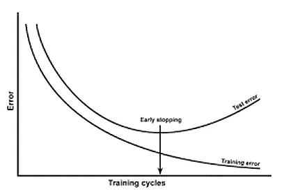
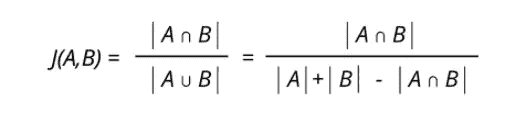
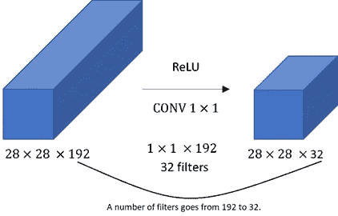
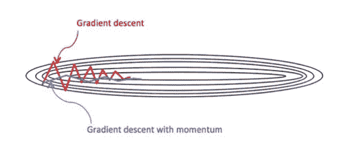
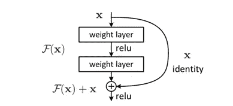

# 机器学习面试问题-2

> 原文：<https://pub.towardsai.net/16-interview-questions-that-test-your-machine-learning-skills-part-1-52cd58b64fbb?source=collection_archive---------2----------------------->

## [职业](https://towardsai.net/p/category/careers)，[机器学习](https://towardsai.net/p/category/machine-learning)

## 赢得机器学习面试

照片由[在](https://unsplash.com/@thisisengineering?utm_source=medium&utm_medium=referral) [Unsplash](https://unsplash.com?utm_source=medium&utm_medium=referral) 上绘制

## **1)什么是内部协变量转换，它的后果是什么？**

*   当输入数据的统计分布相对于其他输入数据发生剧烈变化时，就会发生内部协变量偏移。
*   当输入数据分布改变时，隐藏层试图学习适应新的分布。这减慢了训练过程，从而需要很长时间来收敛到全局最小值。

## 2)什么是深度学习中的提前停止？

*   早期停止是一种正则化技术。对数据集过度训练模型会导致过度拟合。
*   因此，当模型开始过度拟合时，需要停止训练。这个提前停止训练的过程叫做提前停止。在早期停止中，超参数可以是时期数、泛化误差、交叉验证、模型性能。

[https://www . kdnugges . com/2019/12/5-techniques-prevent-over fitting-neural-networks . html](https://www.kdnuggets.com/2019/12/5-techniques-prevent-overfitting-neural-networks.html)

## 3)为什么正则化有助于减少过拟合？

*   正则化侧重于限制模型权重。由于只要输入数据有微小的变化，权重就会受到限制，因此输出不会发生剧烈的变化。
*   尽管这一过程会增加偏差项，但模型的方差会减少，从而使整个模型一般化。

## 4)什么是 Jaccard 索引，它是如何用于对象检测的？

*   Jaccard 指数用于理解样本集之间的相似性。它被正式定义为交集的大小除以样本集并集的大小。为了检测对象，Jaccard 指数量化了实际对象和预测对象之间的相似性。

## 5)提供精确比回忆更重要的例子

*   精确不算什么，但是在所有被预测为有效的情况中，我们有多少次是正确的。如果你是预测但适合 18 岁以下的人，你可以拒绝几本书，但不能接受坏书。如果你预测超市里的小偷，我们需要更加精确。由于误报，在这种情况下，客户信任会降低。

## 6)你认为哪种 ML/DL 模型最具解释性，为什么？

*   决策树算法是人工智能中最易解释的算法。它也享有大多数数据科学家的“最白盒”地位。因为决策树是值(本例中为数据)的有序集合，所以当它执行真或假运算时，它的可视化能力是最高的。
*   此外，用于分裂的熵代表了现实世界中的无序。

## 7)为什么我们使用局部异常值因子？

*   局部异常因子(LOF)是一种基于密度的异常检测算法。LOF 在无人监督的情况下用于找出数据中的局部异常。
*   通常，全局异常可以很容易地通过其他技术发现。但是局部异常不能通过其他算法检测到，因为它们是成组出现的。
*   这正是基于密度的技术优于基于距离的技术的原因。

## 8)为什么词袋不适用于深度学习？

*   词袋(BoW)是一种不保持顺序的标记化方法。它生成一个被理解为文本而不是序列的令牌。此外，序列的结构也不会被保留。
*   它在进行特征工程时会产生问题。因此，BoW 通常用于传统的机器学习，而不用于深度学习。

## 9)使用 1x1 卷积滤波器的必要性是什么？

*   虽然汇集减少了高度和宽度，但没有有效的技术来减少深度。
*   可以通过使用具有填充的滤波器来减小深度，但是使用 3×3 或 5×5 滤波器在训练方面非常昂贵，因此为了有效地减小深度，引入了 1×1 卷积。

## 10)如何处理低质量的数据？

*   数据科学由数据驱动。低质量的数据是一种常见的情况，我们可以通过以下方法解决

> 1)数据清理:缺失值插补、异常值处理、通过采样平衡数据
> 
> 2)数据扩充:从现有和可用的数据中生成更多的数据。
> 
> 3)数据风险分析:我们应该确定数据的可靠性和涉及的风险

## 11)为什么带动量的 SGD 优于传统的 SGD 优化器？

*   SGD 的问题在于它在走向全局极小值的道路上剧烈震荡。因此，它可能会陷入局部极小值，或者可能需要一些时间来收敛。
*   在带动量的 SGD 中，我们添加了一个动量项，这样总梯度就同时取决于当前梯度和先前梯度。从而导致更快的收敛和振荡的减少。

## 12)什么是噪声注入？

*   噪声注入是一种正则化方法。它包括通过向训练数据添加噪声来间接惩罚复杂的模型。
*   添加的噪声是基于所选择的核来选择的，并且充当人工噪声，使得模型难以训练。通常，添加的噪声选自高斯分布，平均值和标准偏差充当超参数。

## 13)为什么 ResNets 不受网络深度的影响？

*   随着网络深度的增加，消失/爆炸梯度变得显著，并影响模型的准确性。
*   为了解决这个问题，ResNets 引入了剩余网络的概念。这里，我们使用跳过连接。
*   跳过连接的优点是，如果网络中有任何层损害了我们的模型性能，那么它将被正则化跳过。从而允许我们增加模型的深度，而不用担心准确性。

## 14)什么是转置卷积？

*   当我们需要增加输入的高度和宽度时，转置卷积用于神经网络中的上采样。
*   在变分自动编码器和生成敌对网络中，通常需要这种操作。
*   转置卷积层要求在执行卷积运算之前首先学习权重。因此，传统的插值技术更快，但其结果并不高效。

## 15)什么是 BLEU 评分？

*   BLEU 是双语评估替角的缩写。它用于根据参考句子评估使用 DNN 生成的句子。
*   范围从 0 到 1，其中 1 表示完全匹配，0 表示完全不匹配。
*   BLEU 评分易于计算和理解，与语言无关，与人类评价相关性高，被广泛采用。BLEU score 用例扩展到语言生成、图像标题生成、文本摘要和语音识别。

## 16)深度神经网络中正确初始化权重的条件是什么？

*   正确的权重初始化是必不可少的，因为它决定了模型的训练过程。错误的初始化可能需要长得多的时间来收敛，甚至根本不收敛。缓慢收敛的主要原因之一是爆炸/消失梯度。为避免这种情况，任何重量初始化都必须遵循以下规则:
*   网络各层的激活均值应该为零。
*   激活的变化应该在网络的每一层保持不变。

# 延伸阅读:

 [## 测试你机器学习技能的 16 个面试问题(下)

### 赢得机器学习面试

medium.com](https://medium.com/towards-artificial-intelligence/16-interview-questions-that-test-your-machine-learning-skills-part-2-386bf3ca0caf)  [## 用“如何”和“为什么”的问题赢得你的机器学习面试。

### 这都是关于如何和为什么？

medium.com](https://medium.com/towards-artificial-intelligence/ace-your-machine-learning-interview-with-how-and-why-questions-a0f028a8439e)  [## 每个机器学习爱好者都应该知道的 16 个面试问题

### 这都是关于如何和为什么？

medium.com](https://medium.com/towards-artificial-intelligence/16-interview-questions-every-machine-learning-enthusiast-should-know-a4142d5e00cc)