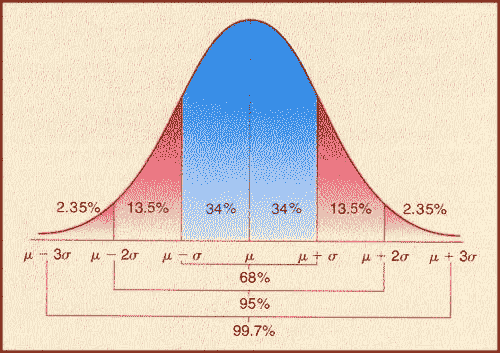
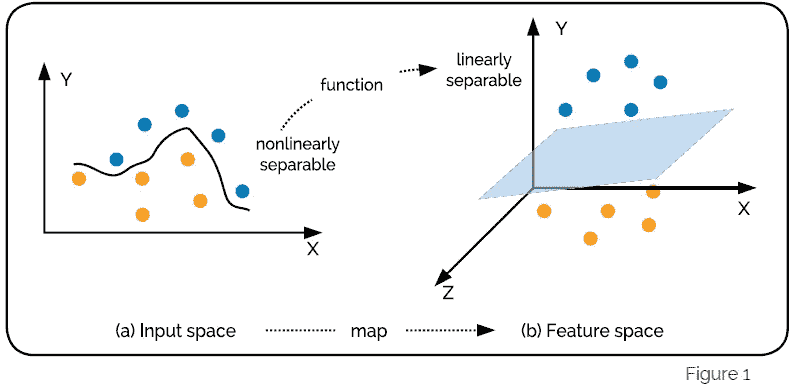
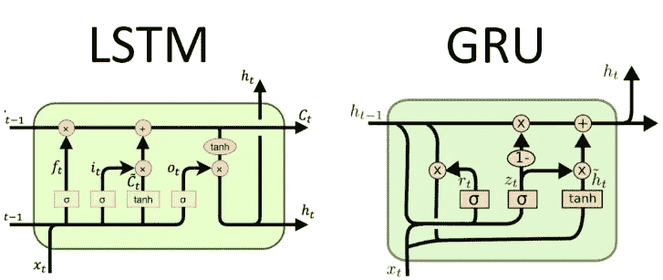

# 机器学习面试问题-3

> 原文：<https://pub.towardsai.net/16-interview-questions-that-test-your-machine-learning-skills-part-2-386bf3ca0caf?source=collection_archive---------1----------------------->

## [职业](https://towardsai.net/p/category/careers)，[机器学习](https://towardsai.net/p/category/machine-learning)

图片由[穆罕默德·哈桑](https://pixabay.com/users/mohamed_hassan-5229782/?utm_source=link-attribution&utm_medium=referral&utm_campaign=image&utm_content=4222728)拍摄，来自[皮克斯拜](https://pixabay.com/?utm_source=link-attribution&utm_medium=referral&utm_campaign=image&utm_content=4222728)

## **1。解释正态分布的**68–95–99 法则**？**

*   如下图所示。近 68%的数据在均值(μ)的 1 个标准差(σ)以内，近 95%的数据在均值(μ)的 2 个标准差(σ)以内，近 99.7%的数据在均值(μ)的 3 个标准差(σ)以内。

[https://www . research gate . net/figure/95-997-rule-source-http-wwwoxfordmathcentercom-dru-pal 7-node-290 _ fig 2 _ 266140117](https://www.researchgate.net/figure/95-997-rule-source-http-wwwoxfordmathcentercom-dru-pal7-node-290_fig2_266140117)

## **2)机器学习中的非参数模型有哪些？**

*   **非参数模型**是对从独立特征到相依特征的映射函数不做强假设的模型。例句:KNN。
*   这些模型假设数据分布不能根据有限的特征集来定义。
*   非参数学习没有训练阶段。他们利用相似性度量来进行预测。

## t-SNE 的意义是什么？

*   t-SNE 是机器学习中被低估的概念之一。它采用高维数据集，并将其简化为低维图。
*   得到的低维图保留了大量原始变量，这些变量只不过是数据中的变量。
*   它允许从业者绘制大型复杂数据集的图形。这里我们使用 t 分布，如果没有它，所有的聚类都会聚集在一起。它是降维在数据科学中的一个应用。

## **4)ResNets 如何解决消失渐变问题？**

*   ResNet 通过使用 skip 函数解决了渐变消失的问题。通过仅使用向量加法，ResNet 通过单位函数反向传播。
*   权重将被改变，直到输出变得等同于单位函数。渐变乘以 1，结果保持在以前的图层中。这里，单位函数保持渐变不消失。

## **5)为什么平均绝对误差优于均方根误差损失函数？**

*   在 MAE 中，每个差异将被赋予相等的权重，以处理计算中不必要的偏差。另一方面，RMSE 对较大的价值观是严格的，并加以惩罚。
*   在 MAE 中，我们间接地找到了中间值，但是在 RMSE，它是我们找到的中间值。因此，如果我们想要一个对异常值稳健的预测，我们应该使用 RMSE。

## **6)在 SVM 什么是内核戏法？**

*   SVM 因其核心技巧而成为最受欢迎的算法。核技巧只是高维特征空间中两个向量 x 和 y 的点积。因此，它们也被称为**“广义点积**”。
*   核心技巧避免了获得线性学习算法学习非线性决策边界所需的显式映射。可以考虑在内部应用特征转换。

[https://www . exl service . com/optimizing-health care-analytics-by-choose-the-right-predictive-model](https://www.exlservice.com/optimizing-healthcare-analytics-by-choosing-the-right-predictive-model)

## 7)为什么 Adam 认为在训练深度神经网络时最佳的优化器？

*   优化器用于改变神经网络中的权重和学习速率，以减少损失。有几种类型的优化算法，如梯度下降，阿达格拉德，阿达德尔塔，随机梯度下降，亚当…..
*   尽管 Adam 的计算量很大，但它会跟踪过去梯度的指数衰减平均值。此外，该算法收敛速度快，克服了学习率消失和方差过大的缺点。

## 8)更快 RCNN 里有哪些主播？

*   锚点是在最后一个卷积特征图上定义的固定大小的矩形，并被馈送到区域提议网络。对于每个锚，RPN 预测对象出现在其中的概率，并且锚的尺寸已经相应地调整。
*   锚的参数也被包括在损失函数中，并且在训练期间被更新。对于正锚，更新所有锚的参数，对于负锚，仅考虑分类损失。

## **9)卷积神经网络与标准的多层感知器有何不同？**

*   标准多层感知器(MLP)和卷积神经网络(CNN)的区别在于卷积层是一个隐藏层。CNN 也可以有非卷积层，但 CNN 的基础是卷积层。
*   与其他层一样，卷积层接收输入，对其进行转换，并将转换后的张量传递到下一层。这里这种变换就是卷积运算。卷积层检测图像中的图案。卷积图层具有检测模式的过滤器。

## 10)YOLO 的缺点是什么？

YOLO 的一些缺点如下

*   它们在探测小物体时精确度很低。
*   由于每个网格只提出了有限数量的边界框，它们很难检测到接近的物体。
*   高定位误差。
*   中等和大尺寸物体的低精度。

## 11)LSTM 和 GRU 哪个更快？解释一下。

*   通常，门控循环单位(GRU)比长短期记忆(LSTM)更快。
*   因为与 GRUs 相比，LSTM 架构有点复杂，因为它有额外的遗忘门作为存储单元。它保留了跨时间步长的信息。
*   然而，GRU 结合了输入门和遗忘门，形成了一个更新门。因此，GRU 不太复杂，因此速度更快。

[https://www . tutorial example . com/lstm-vs-gru-network-which-has-better-performance-deep-learning-tutorial/](https://www.tutorialexample.com/lstm-vs-gru-network-which-has-better-performance-deep-learning-tutorial/)

## 12)在用于异常检测的 autoencoder 中，如何计算阈值重建误差？

在异常情况下固定自动编码器的阈值是具有挑战性和棘手的。它高度依赖于业务问题和所需的 KPI。大致有两种方法可以找到阈值。

*   当我们标记了数据后，基于异常的百分比，我们固定阈值。
*   当我们没有标记的数据时，我们通过优化损失函数来找到它。

## 13)为什么特征工程在深度学习中不那么重要，不像传统的机器学习？

*   数据科学家执行要素工程来提高数据表示的质量。
*   特征被转换成新的表示。传统的最大似然算法的假设空间不够丰富，无法独立学习假设空间。
*   这使得数据科学家在将数据输入算法之前，必须自己执行特征工程。然而，深度学习模型在没有任何帮助的情况下学习复杂的模式。这个属性很大程度上解决了一个从业者的问题。

## 14)深度学习模型如何在时间序列分析上胜过传统模型？

DeepAR 等深度学习模型通过纳入以下因素，明显优于传统的时间序列模型。

1.考虑影响预测准确性的相关变量。例如价格

2.考虑元数据以处理季节性

3.处理没有历史数据的新项目。例如:如果阿迪达斯的鞋子是新的，它将考虑耐克鞋的数据(类似的数据可用)

## 15)为什么我们要给自动编码器网络增加误差？

*   自动编码器遵循非对称网络架构。它的对称性允许它按原样重建输入向量。
*   通常，自动编码器可以通过使用潜在表示将输入向量重构为相似的向量。这是相对琐碎的，我们不希望网络记忆，而是希望它学习模式。所以，我们增加错误来惩罚他们的记忆。

## MobileNet 的优势是什么？

*   MobileNet 自发布以来，已经席卷了移动深度学习行业。使用 MobileNet 的主要优势如下
*   它的参数数量很少。
*   它们是轻量级 dnn，可以用于嵌入式设备
*   它们速度更快、体积更小、延迟更低。
*   它们具有广泛的应用，包括物体检测、分类、识别和定位。

# 延伸阅读:

 [## 机器学习模型的最佳和最差情况—第一部分

### 用什么？

medium.com](https://medium.com/towards-artificial-intelligence/best-and-worst-cases-of-machine-learning-models-part-1-36cdb9296611)  [## 测试你机器学习技能的 16 个面试问题(第一部分)

### 赢得机器学习面试

medium.com](https://medium.com/towards-artificial-intelligence/16-interview-questions-that-test-your-machine-learning-skills-part-1-52cd58b64fbb)  [## 用“如何”和“为什么”的问题赢得你的机器学习面试。

### 这都是关于如何和为什么？

medium.com](https://medium.com/towards-artificial-intelligence/ace-your-machine-learning-interview-with-how-and-why-questions-a0f028a8439e)  [## 每个机器学习爱好者都应该知道的 16 个面试问题

### 这都是关于如何和为什么？

medium.com](https://medium.com/towards-artificial-intelligence/16-interview-questions-every-machine-learning-enthusiast-should-know-a4142d5e00cc)