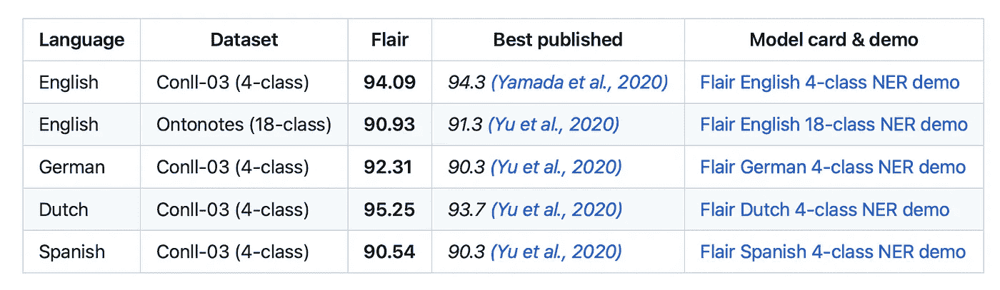
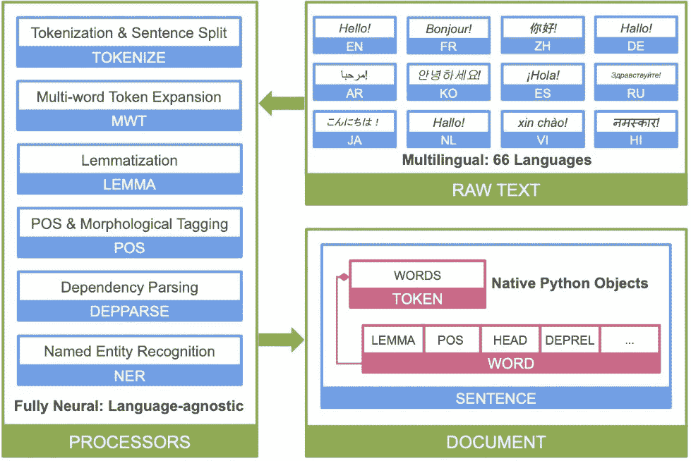

# 16 个用于情感分析的开源 NLP 模型；一个在顶端升起

> 原文：<https://pub.towardsai.net/16-open-source-nlp-models-for-sentiment-analysis-one-rises-on-top-b5867e247116?source=collection_archive---------0----------------------->

## 介绍 16 款车型并深入了解**风格**

来自佩克斯的安娜·施瓦茨

情感分析是对书面文本中表达的观点进行量化和分类的过程；多年来，我也听说它被称为观点挖掘、情感人工智能和文本分析。一般来说，情感分析结果可用于商业决策，例如推广哪些产品、如何改善客户服务或发布哪些内容。

# **我最喜欢的情感分析定义来自拥抱脸:**

> “情感分析是一种自然语言处理技术，可以识别给定文本的极性。”

Python 是情感分析的重要组成部分，因为它是一种通用语言，可用于各种任务，尤其是情感分析，而不仅仅是数据分析和机器学习。Python 之所以伟大，还因为它有一套丰富的库和框架，使得处理数据和构建模型变得容易(不过，一个主要的积极方面是 Python 相对容易学习，即使对于初学者来说也是如此)。

来自 Pexels 的 Andrea Piacquadio

# **这里有几个开源的情绪分析功能，可以和 Python 一起使用:**

1.NLTK 的 **TweetTokenizer** :这个 Tokenizer 是专门为社交媒体文本设计的，它能够处理标签、提及和表情符号。

2. **TextBlob** :这个库提供了一个简单的文本处理接口，包括词性标注、名词短语提取、情感分析、分类、翻译等等。由于 TextBlob 的整体速度和易用性，我过去使用它实现过许多用例。

3.**SpaCy**:Python 中自然语言处理的公认选择，包括对情感分析的内置支持。

4. **Pattern** :这个库提供了各种数据挖掘和机器学习的工具，包括对向量空间建模和情感分析的支持。

5.Gensim 面向主题建模，支持潜在语义分析，可用于情感分析。

6. **Vader** 是一个 Python 库，可以很容易地对文本数据进行情感分析。它建立在 NLTK 库的基础上，提供了一个比 NLTK 库更容易使用的接口。

7.是一个 Python 库，提供了对文本数据进行情感分析的功能。它提供了一个简单的界面，可以很容易地开始情感分析。

8. **Polyglot** 是一个 Python 库，它为广泛的自然语言处理任务提供支持。它提供了一个比 NLTK 库更容易使用的接口。

# 我使用最广泛的一个是**天赋**:

天赋结果:[https://github.com/flairNLP/flair](https://github.com/flairNLP/flair)

## **Flair:** 一个 Python 库，允许用户将最先进的自然语言处理(NLP)模型应用于文本，如情感分析。

# **关于 Flair，一个我亲身经历实现了很多次的:**

受解决神经语言建模和命名实体识别(NER)中的用例需求的启发，您可以将最先进的自然语言处理(NLP)模型应用于您的反馈(自由文本响应或评论)、NER、词性标注(PoS)、它们的“Flair 嵌入”、对各种嵌入的有效访问(例如 ELMo、GloVe)，同时 Flair 继续扩展到多种语言。

关于解决“再现性”的论文，(1)注意到在识别模型和只报告结果(但没有代码)的论文中再现性的一般无能，(2)注意到承诺发布但从未发布的代码，以及(3)注意到发布但“不可能”运行的代码，这是他们对再现性的“迫切需要”，以实现以下目标:

—快速设置(框架、数据集、模型)；
—模块化(易于理解什么做什么，易于更换组件，如用手套嵌入件替换 BERT 嵌入件)；
—适用于新的数据集/任务；和
—易于构建。

命名实体识别是一项任务，旨在定位非结构化文本中的命名实体并将其分类到预定义的类别中[2]，包括(但不限于取决于模型及其全面的深入研究)人名、位置或医疗代码。一般来说，NER 被视为单层序列标记问题[3]，其中每个标记都用一个标记来标记。

底线:它的基础反映出它提供了(1)易于复制的研究和(2)易于应用的研究。这些启发了开源 Flair 的开发，它是 PyTorch 生态系统的一部分。

来自 Pexels 的龟背竹

# 天赋有效的 9 种方式:

1.Flair 能够高精度地从文本中识别和提取关键信息。

2.Flair 可以进行微调，以针对特定的任务，如命名实体识别。

3.它具有强大的功能工程能力，帮助它学习有效的文本表示。

4.Flair 模型可以很容易地在小数据集上训练，并且仍然可以实现良好的性能。

5.训练和推理都是快速有效的。

6.Flair 可以部署在各种平台和设备上。

7.Flair 易于使用，并且具有一致的 API。

8.它对多语言 NLP 任务有很强的支持。

9.Flair 结果指标表明，在各种基准测试中，Flair 的性能优于其他一流的 NLP 模型。

一节的分解:[https://stanfordnlp.github.io/stanza/](https://stanfordnlp.github.io/stanza/)

# 在拥抱脸变形金刚系列的 NLP 模型中，有几个用于情绪分析的模型具有已知的跟踪记录:

1.  BERT:来自变压器的双向编码器表示。BERT 是一个预先训练好的语言模型，可以针对各种任务进行微调，包括情感分析。
2.  GPT:预先训练的语言模型，可以针对各种任务进行微调，包括情感分析。
3.  GPT2:预先训练的语言模型，可以针对各种任务进行微调，包括情感分析。
4.  Transformer-XL: Transformer-XL 是一个预先训练好的语言模型，可以针对各种任务进行微调，包括情感分析。
5.  XLNet:一个通用的自回归预训练语言模型。
6.  Roberta:BERT 的旋转不变版本。
7.  DistilBERT:一个更小、更快的 BERT 版本。

# **在社交媒体数据上使用 Python 的通用情感分析设置:**

让我们用 Python 来解析社交媒体分析。

Python 是一个多功能的工具，用于对社交媒体数据进行情感分析。我们将在这一部分回顾情感分析的基础以及如何实现它。

情感分析是识别文本中表达的观点的过程。例如，它可以用于识别文档的整体情绪或文本中表达的特定态度，如积极或消极情绪。有许多方法来执行情感分析，但是所有的方法都涉及某种形式的文本分类。

文本分类是一种受监督的机器学习任务，其中使用训练数据集来训练分类器。训练数据集通常是一组标记文档，其中每个文档被标记为具有特定的情感。一旦训练了分类器，就可以用它来标记新文档。

Python 是一种流行的情感分析语言，因为它有几个库，可以很容易地处理文本数据。例如，自然语言工具包(NLTK)是一个用于执行文本分类的流行库，包括几个预训练的分类器，可用于情感分析。此外，scikit-learn 库被广泛用于在 Python 中执行情感分析，并附带了几种用于执行文本分类的算法，包括支持向量机(SVM)和逻辑回归。

我们首先需要获得一些文本数据来执行基于这个用例的情感分析。有几种方法可以做到这一点，但我们将重点关注两种流行的方法:web 抓取和使用 API。Web 抓取是从网站提取数据的过程，可用于从没有 API 的网站提取文本数据。Python 有几个库可以很方便的抓取网站，比如美汤和 Scrapy。API 是一个应用程序编程接口，是一组允许程序相互交互的规则。例如，许多社交媒体平台都有允许开发者访问数据的 API。您可能需要注册一个 API 密钥来使用特定网站的 API。

一旦我们有了一些文本数据，我们就可以**对其进行预处理**以进行情感分析，这通常包括对文本进行标记和删除停用词。标记化是将文本分割成更小的单元，如单词或句子。停用词是通常在执行情感分析之前从文本中移除的常用词，因为它们对文本的意义没有太大贡献。停用词的例子包括“the”、“a”和“is”

**在预处理文本**之后，我们可以开始进行情感分析。如前所述，有几种方法可以做到这一点，我们将重点介绍两种流行的方法:使用预训练的分类器和从头开始训练分类器。使用预训练的分类器是执行情感分析的最简单的方式，因为我们可以简单地加载预训练的分类器，并使用它来标记我们的文本数据。从头开始训练一个分类器需要更多的工作，但是它有时可以给出更好的结果。为了开始完成情感分析设置，我们只需要将我们的文本数据分成一个训练集和一个测试集，其中训练集用于训练分类器。相反，测试集评估分类器的性能。

除了这篇关于自然语言处理的文章，我之前提到过**半监督学习**:

 [## 半监督学习指南；3 款车型拔得头筹

### 我揭示了半监督学习的挑战，最佳实践，9 项技术，16 个基本模型，以及如何 3…

medium.com](https://medium.com/@AnilTilbe/semi-supervised-learning-guide-3-models-rise-on-top-4b03f86cdd52) 

这里是我关于**无监督学习的帖子:**

 [## 无监督学习:14 种最重要的算法

### 14 种算法及其使用案例的细分。

pub.towardsai.net](/unsupervised-learning-14-of-the-most-important-algorithms-b3e9e07350c9) 

另外，我写过关于**监督学习:**

 [## 监督学习:31 个最重要的模型:5 是必须学习的

### 我概述了 31 个关键的监督学习模型，并揭示了必须学习的前 5 个模型。

pub.towardsai.net](/supervised-learning-31-of-the-most-important-models-5-are-a-must-learn-9c62444905fa) 

就这样了，伙计们。我不喜欢提供冗长的介绍或冗长的结论来占据不必要的空间。如果你对这个话题有任何问题或建议，请和我分享你的想法。

**来源:**

1.[https://www . geeks forgeeks . org/python-nltk-nltk-tweet tokenizer/](https://www.geeksforgeeks.org/python-nltk-nltk-tweettokenizer/)

2.[https://www.nltk.org/api/nltk.tokenize.html](https://www.nltk.org/api/nltk.tokenize.html)

3.https://stanfordnlp.github.io/stanza/

4.使用 beautiful soup-Medium 进行网页抓取。[https://medium . com/codex/web-scraping-with-beautiful soup-66 a3 a2 B3 b 60](https://medium.com/codex/web-scraping-with-beautifulsoup-66a3a2b3b60)

5.使用 NLTK NB 分类器的情感分析。[https://aa kash-ez . github . io/blog/n b-nltk-情操分析/](https://aakash-ez.github.io/blog/nb-nltk-sentiment-analysis/)

6.Github 上的一节:[https://github.com/stanfordnlp/stanza](https://github.com/stanfordnlp/stanza)

7.彭琪、张宇豪、张宇慧、杰森·波顿和克里斯托弗·曼宁。2020.Stanza:一个用于许多人类语言的 Python 自然语言处理工具包。在计算语言学协会(ACL)的系统演示中。2020.[ [pdf](https://nlp.stanford.edu/pubs/qi2020stanza.pdf) ][ [围兜](https://nlp.stanford.edu/pubs/qi2020stanza.bib)

8.抱脸和感情分析:[https://huggingface.co/blog/sentiment-analysis-python](https://huggingface.co/blog/sentiment-analysis-python)

9.https://textblob.readthedocs.io/en/dev/

10.Github 上的图案:[https://github.com/clips/pattern](https://github.com/clips/pattern)

11.gensim:[https://radimrehurek.com/gensim/](https://radimrehurek.com/gensim/)和 Github 上:[https://github.com/RaRe-Technologies/gensim](https://github.com/RaRe-Technologies/gensim)

12.天赋:【https://github.com/flairNLP/flair】T4

13.艾伦·阿克比克、塔尼亚·博格曼、邓肯·布莱思、卡希夫·拉苏尔、斯特凡·施韦特和罗兰·沃尔格拉夫。2019.FLAIR:一个易于使用的框架，用于最先进的 NLP。在*计算语言学协会北美分会 2019 年会议记录(演示)*，第 54-59 页，明尼苏达州明尼阿波利斯。计算语言学协会。

14.基于深度学习的文本分类。[https://hypi . io/2019/10/15/text-class ification-with-deep-learning/](https://hypi.io/2019/10/15/text-classification-with-deep-learning/)

15.什么是自然语言处理？的 NLP 定义和教程。[https://www . freecodecamp . org/news/what-is-natural-language-processing-an-NLP-definition-and-tutorial-for-初学者/](https://www.freecodecamp.org/news/what-is-natural-language-processing-an-nlp-definition-and-tutorial-for-beginners/)