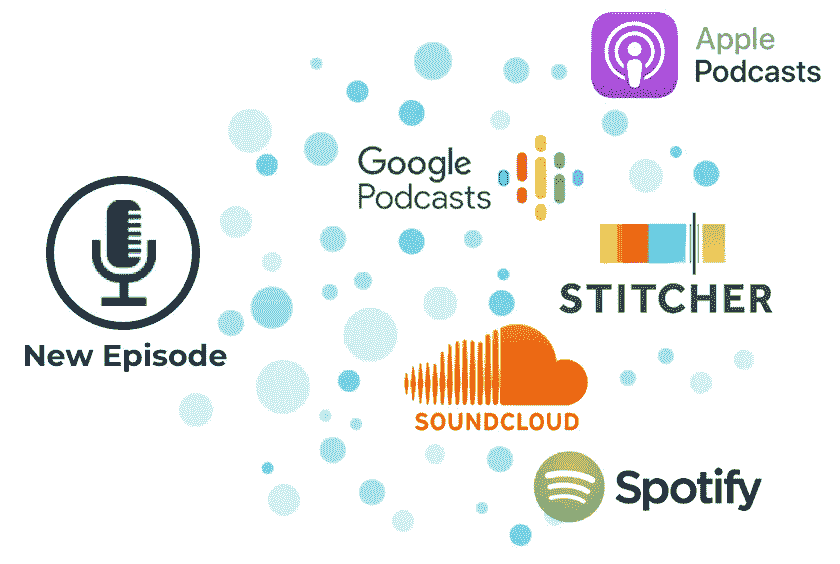

# SoundCloud、Apple Podcasts 和 Spotify 上的 18 个最佳数据科学播客

> 原文：<https://pub.towardsai.net/18-best-data-science-podcasts-on-soundcloud-apple-podcasts-and-spotify-eb68a94670bd?source=collection_archive---------4----------------------->

## [数据科学](https://towardsai.net/p/category/data-science)

图片由 MAZ 提供

每天，我去上班的路程大约需要一个小时(根据不同的日子，大约需要 15 分钟)。我很确定我听了很多播客。真实犯罪、NFL 梦幻足球、美国职业棒球大联盟和数据科学都是我听的话题。

这是我个人在 SoundCloud、Apple Podcasts 和 Spotify 上排名最高的数据科学播客。我发现每个播客的描述都非常准确地代表了我自己会写的东西，这就是为什么你不会在描述中找到很多我自己写的东西(为什么旋转轮子？).我选择不对同一个播客进行两次排名，因为大部分，但不是全部，在所有三个平台上都可以使用。

还有什么比听有趣的数据科学花絮更好的打发时间的方式呢？下面列出了 18 个最好的数据科学播客。

# **1。数据怀疑论者**

Data 怀疑论者提供了科学怀疑论者对统计、机器学习、大数据、人工智能和数据科学等问题的观点。我们的每月播客和博客提供故事和课程，帮助您更好地理解我们的数据驱动环境。

[第 277 集](https://open.spotify.com/show/1BZN7H3ikovSejhwQTzNm4)

# **2。数据科学伦理**

“讨论模特行为”是本期播客的主题。这个名字告诉你所有你需要知道的。您将了解当前和历史事件，以及如何成为道德数据科学家的提示。

[10 集](https://open.spotify.com/show/4Tke2zpLP1F8895QspuAjj)

# 3.家庭数据科学

本期播客的主持人弗朗切斯科·加达莱塔讨论了“技术、机器学习和算法”他会为你详细解释，让你觉得你在和他正常聊天。特邀嘉宾将以播客的形式参与节目，探索他们的专业领域。

[第 35 集](https://open.spotify.com/show/57AJ6GiMDPVBLGRqvjeoz6)

# 4.数据紧缩

“如果你想发现数据科学、人工智能、机器学习和深度学习如何被用来改善我们的环境，你就找到了正确的播客。我们与企业家和专业人士谈论他们实施新技术的方法，以及他们的成功、失败和结果。我们让这些复杂的话题能够被更多的人理解。”

[第 43 集](https://open.spotify.com/show/5Kqi6CV44DNi85N4c9Lv5P)

# 5.“意识决定存在”的理论

这个播客旨在告知听众关于人工智能和机器学习的训练数据。为什么高质量的训练数据对机器学习算法至关重要。它还解释了不同的图像，视频，音频注释方法。

[第 27 集](https://soundcloud.com/cogitotech)

# 6.超级数据科学

数据科学教练兼生活方式企业家基里尔·叶列缅科是超级数据科学的主持人。超级数据科学播客的目标是为您带来世界各地最鼓舞人心的数据科学家和分析师，帮助您发展成功的数据科学职业生涯。可用的数据量正以指数速度增长，从事分析工作的人的工资也是如此。这个播客将教你如何在你的分析职业中前进。

大数据可视化，预测建模，预测，分析，业务流程，统计，R，Python，SQL 编程，tableau，机器学习，Hadoop，数据库，数据科学 MBA，所有的分析工具和能力都可以帮助你更好地掌握如何在数据科学中粉碎它。"

[第 253 集](https://open.spotify.com/show/1n8P7ZSgfVLVJ3GegxPat1)

# 7.数据科学中的女性

“数据科学正在帮助改善各个领域的成果，包括医疗保健、地震、人权等。聆听数据科学领域的女性专家分享她们的智慧、职业亮点和经验教训。”

[第 10 集](https://podcasts.apple.com/us/podcast/women-in-data-science/id1440076586)

# 8.线性离题

“在每一集里，你的主持人都通过迷人的(通常也是极其奇怪的)应用来考察机器学习和数据科学。”

[第 238 集](https://podcasts.apple.com/us/podcast/linear-digressions/id941219323)

# 9.数据未来学

“在数据未来学中，来自世界各地的经验丰富的数据科学领导者分享他们的故事、困难以及在职业生涯中获得的经验。”

[第 61 集](https://podcasts.apple.com/us/podcast/data-futurology-data-science-ml-ai-top-industry/id1385051346)

# 10.生产中的数据科学

“生产中的数据科学是一个播客，旨在帮助数据科学家和机器学习工程师尽快将他们的模型投入生产。我们专注于机器学习的工具、方法和人员。”

[第 6 集](https://podcasts.apple.com/us/podcast/data-science-in-production/id1455613667)

# 11.Cyentia 播客

“该播客通过数据驱动和用户启发的研究深入探讨网络安全。加入主持人杰伊和韦德的行列，与那些寻求惊人见解、讲述惊人数据驱动的故事并准备与世界其他地方分享他们的工作的人一起探索主题。”

[第 16 集](https://podcasts.apple.com/us/podcast/cyentia-podcast/id1251232455)

# 12.本周在人工智能和机器学习(TWiML & AI)

本周在机器学习&人工智能是市场上最受欢迎的机器学习和人工智能播客。TWiML & AI 面向机器学习和人工智能爱好者的特定群体。数据科学家、开发人员、创始人、首席技术官、工程师、架构师、IT 和产品高管以及精通技术的商业领袖组成了这个群体。TWiML 被这些创始人、建设者、制造者和影响者视为机器学习和人工智能领域中所有令人着迷和必不可少的真实、可信和信息丰富的指南。机器学习、人工智能、深度学习、自然语言处理、神经网络、分析、深度学习和其他技术都有涉及。

[第 301 集](https://soundcloud.com/twiml)

# 13.人工智能播客

人工智能被称为“雷神之锤”和“新的电力”。“即使对那些最了解它的人来说，它也有点神秘。我们将与一些世界顶级的人工智能专家谈论它是如何工作的，它是如何变化的，以及它如何影响人类工作的方方面面。人工智能计算公司 NVIDIA 是这个播客的制作人。每个月都会出新一集。”

[90 集](https://soundcloud.com/theaipodcast)

# 14.奥赖利数据秀播客——奥赖利雷达

“我们的方法很简单:我们通过倾听他们感兴趣的东西，放大这些微弱的信号，并确定他们在创新生态系统中的位置，来挖掘我们中间的阿尔法极客的知识。当你加入我们研究团队的独特研究时，你就会对科技行业的想法有一个大致的了解。”

我想学 Python”迈克尔·肯尼迪为我主持每周播客谈 Python。该播客涵盖了广泛的 Python 相关主题以及许多其他主题(例如 MongoDB、AngularJS、DevOps)。这个概念是在轻松的环境下与行业领袖进行 30 分钟的聊天。”

[130 集](https://soundcloud.com/oreilly-radar/sets/the-oreilly-data-show-podcast)

# 15.数据科学骗子

“随着我们探索数据科学、分析、大数据和机器学习，你会对这些问题有更好的理解。加入我们的冒险吧。”

[第 50 集](https://podcasts.apple.com/us/podcast/data-science-imposters-podcast/id1249728040)

# 16.数据黑客电台

“DataHack Radio 是 Analytics Vidhya 的独家播客系列，其中 Kunal Jain 与数据科学和机器学习领域的行业专家和从业者进行了对话。”

[第 24 集](https://soundcloud.com/datahack-radio)