# 1 使用 TensorFlow 和 Keras 的周期学习率计划

> 原文：<https://pub.towardsai.net/1cycle-learning-rate-scheduling-with-tensorflow-and-keras-74ae7ce277c8?source=collection_archive---------1----------------------->

## [机器学习](https://towardsai.net/p/category/machine-learning)工程

## 设置深度学习中最重要超参数的实用方法

由[大卫·埃弗雷特·斯特里克勒](https://unsplash.com/@mktgmantra?utm_source=medium&utm_medium=referral)在 [Unsplash](https://unsplash.com?utm_source=medium&utm_medium=referral) 上拍摄的照片

# 问题陈述

训练深度神经网络可能是一项具有挑战性的任务。要拟合的大量参数会使这些模型特别容易过度拟合。根据模型的复杂性、可用的计算资源和要学习的任务，几天或几周的培训时间可能是常见的。如果可用资源有限，避免额外的计算和长时间的训练是重中之重。我将介绍一个你可以遵循的技巧，以确保你正确地初始化和调整你的学习速度。这将有助于实现出色的任务表现，避免不必要的培训时间。

# 介绍

**学习率**是控制训练期间应用的权重更新幅度的值。有一个好的学习率可能是一个差的和一个优秀的模型之间的区别。

在下面几节中，我将介绍一些基于梯度优化的背景材料，以便更好地理解这个超参数的重要性。然后，我将介绍一种在训练期间初始化和调整您的神经网络学习速率的方法，随后是实验结果和结论。

# 背景:成本函数、导数和梯度

## 损失和成本函数

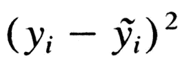

平方误差损失函数。这是预测值和实际值之间的平方差。

**训练**一个神经网络意味着找到一组权重**来优化**某个函数。实际上，这通常意味着最小化预测值和真实值之间的差异，或 ***误差*** 。使用**损失函数**计算该误差。损失函数的一个例子是平方误差损失函数。

均方误差代价函数的定义。来源:[https://www . freecodecamp . org/news/machine-learning-mean-squared-error-regression-line-c 7d de 9 a 26 b 93/](https://www.freecodecamp.org/news/machine-learning-mean-squared-error-regression-line-c7dde9a26b93/)

一个**成本函数**测量整个训练集的预测误差。例如，[均方差](https://en.wikipedia.org/wiki/Mean_squared_error)成本函数是我们的预测和真实值之间的均方差，是整个训练集的平均值。

## 导数和梯度

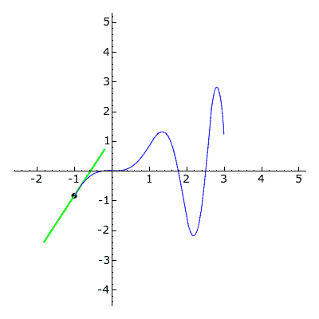

函数滑动导数的可视化。来源:[http://www . calc blog . com/calculating-derivatives-on-ti83-ti84-ti89-ti92-voyage-200/](http://www.calcblog.com/calculating-derivatives-on-ti83-ti84-ti89-ti92-voyage-200/)

一元函数 *f* 的[导数](https://en.wikipedia.org/wiki/Derivative)*f*’告诉我们在给定点 *x* 的**瞬时变化率**；它提供了测量 *f* 增加或减少多少的方法。

一个[梯度](https://en.wikipedia.org/wiki/Gradient)是导数对[多元函数](https://www.khanacademy.org/math/multivariable-calculus/thinking-about-multivariable-function/ways-to-represent-multivariable-functions/a/multivariable-functions)的推广；它是函数的**偏导数**的向量。一个函数的[偏导数](https://en.wikipedia.org/wiki/Partial_derivative)是相对于其变量中的 ***只有一个*** 的导数(瞬时变化率)，而将其他视为常数。函数的**梯度**是所有函数偏导数的**向量**。标量函数的梯度表示最大变化的**方向。**

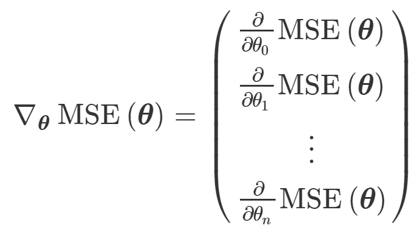

均方误差代价函数的梯度。它是所有偏导数的向量。

[**梯度下降**](https://en.wikipedia.org/wiki/Gradient_descent) 是一种强大的通用优化算法。它通过**迭代**调整成本函数最大变化方向(梯度)的模型参数来工作。因为我们对**最小化**成本函数感兴趣，我们在梯度的**相反方向**应用更新(换句话说，负梯度)。

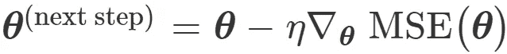

梯度下降执行的更新步骤。模型参数在负梯度的方向上更新。

> 注意:因为它只使用梯度(一阶导数)信息，梯度下降被称为一阶优化方法。其他方法使用 [Hessian](https://en.wikipedia.org/wiki/Hessian_matrix) (二阶导数)信息，可能收敛得更快(例如，[牛顿法](https://en.wikipedia.org/wiki/Newton%27s_method_in_optimization))。然而，计算黑森是极其昂贵的。这使得它们无法用于大型模型，如深度神经网络。

## 学习速度效应

梯度下降将[学习率](https://en.wikipedia.org/wiki/Learning_rate)作为比例项应用于负梯度。它控制权重更新的幅度。下图显示了使用不同学习率在 CIFAR10 数据集上训练的模型的训练损失。

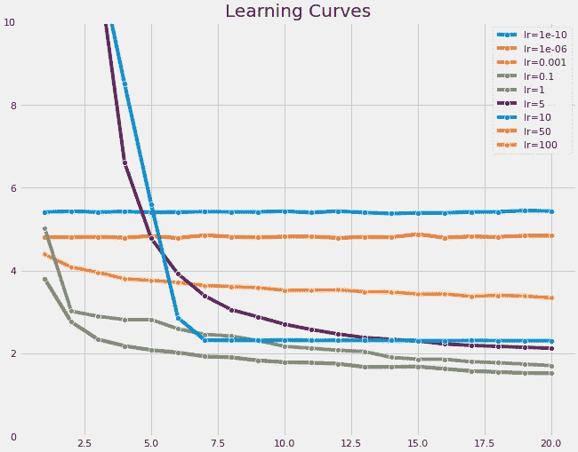

学习率直接影响训练期间模型的收敛(或发散)。良好的学习速度对于在合理的时间内找到好的解决方案至关重要。

使用非常大的学习率会导致很大的损失值。虽然这种损失会减少，但仍会明显高于使用更小、更充分的学习速率所获得的损失。在更极端的情况下，大的学习率会导致发散，到处乱射，永远不会稳定下来。相反，如果学习率太小，训练可能会非常慢。

> 在深度学习文献中，学习率通常用希腊字母 *η (* eta)表示。

# 学习率初始化和调度

正如我们在上一节中所看到的，学习率的选择会极大地影响解决方案的质量。在下面的章节中，我将介绍一个简单有效的**学习率初始化**技术。然后，我将介绍一个**学习率进度表**，用于在训练期间动态修改学习率，并实现更快的收敛。

> 注意:使用的代码改编自第 11 章“使用 Scikit-Learn、Keras 和 TensorFlow 进行机器学习”。在这里可以找到原来的笔记本[。](https://colab.research.google.com/github/ageron/handson-ml2/blob/master/11_training_deep_neural_networks.ipynb#scrollTo=txzRS4NNtU-u)

## 指数增量

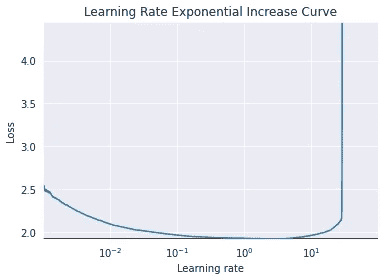

第一种技术是通过数百次迭代来训练您的模型，从非常小的学习速率(例如，1e-6)开始，逐渐以指数方式递增，直到一个大值(例如，10)。最佳学习率将比损失开始激增之前的点低大约 10 倍。指数增长技术的 Keras 实现可以在下面找到。

通过扩展回调类实现指数学习率技术。

使用上述方法找到的学习速率将被用作更有效技术的阈值，该技术用于在训练期间动态修改学习速率。

## 1 周期计划

我们可以在训练期间动态修改学习率，而不是使用恒定的学习率。如果使用得当，这种技术会带来好的解决方案和更快的收敛。**时间表**是用于修改学习率的策略。2018 年，Leslie Smith 提出了**1 周期时间表**，这是一个简单有效的时间表，学习率在训练的前半段增加，后半段减少。1 周期计划的工作方式如下:

1.  将 *η* 初始化为某个初始值 *η* 0
2.  线性增加 *η，*在训练中途达到最大值 *η* 1
3.  线性降低 *η，*下降到 *η* 0。最后一次迭代应该将 *η* 降低几个数量级

最大值 *η* 1 可以通过上述的指数增加法选择。初始学习率 *η* 0 可以设定为比 *η* 1 *低大约 10 倍。*

下面是 1 周期调度的 Keras 实现:

1 周期调度的 Keras 实现。

# 实验结果

下一节介绍我的实验结果。对于 CIFAR10 和时尚 MNIST 上的图像分类任务，我用以下架构训练了一个卷积神经网络:

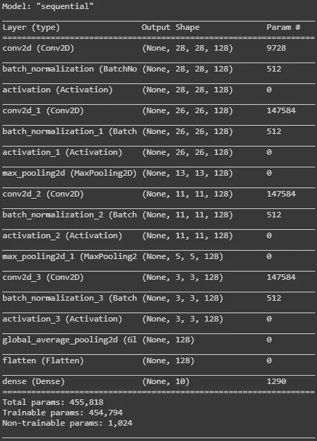

CNN 用于图像分类任务。

对于波士顿住房数据集，我使用以下体系结构训练了一个模型:

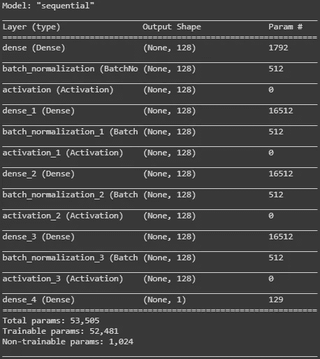

用于波士顿住房回归任务的全连接模型。

所有任务都使用 32 的批处理大小。

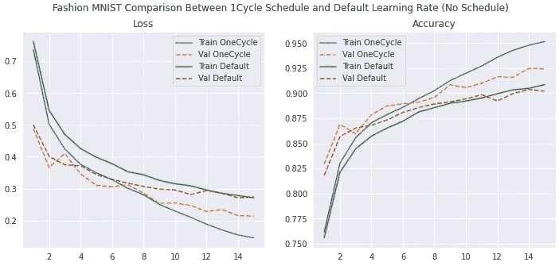

时尚 MNIST 结果。到第 9 世，与最佳基线验证精度相比，1 周期模型已经实现了更好的验证精度。这意味着训练周期减少了 66%。

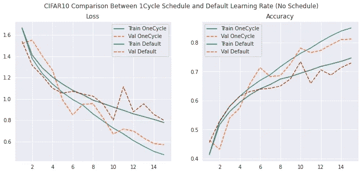

与基线模型 73.4%的验证准确性相比，1 周期变量实现了 81.2%的验证准确性。这相当于**精度提高了 10.6%** 。

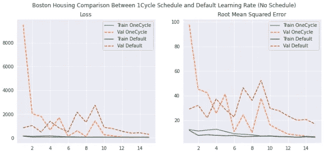

1 与基线模型的 17.1 相比，cycle 的 RMSE 达到了 6.27。这相当于 RMSE 提高了 **63.2%** 。

# 结论

在本文中，我介绍了**1 周期学习率时间表**。当适当调整时，这种技术产生了显著提高的任务性能，同时收敛更快。但是，需要进行一些调整。特别是，我发现批量大小、初始和最大学习速率需要仔细选择。然而，一旦找到合理的值，使用 1 周期调度的好处就显而易见了。

> **重要提示:**批量大小在这些实验中起到了**至关重要的**作用。32 的批量产生了相当好的结果，代价是训练时间稍短。然而，使用大批量(如 2048)会导致重量更新和`Nan`值激增。

最后，不要忘记缩放您的数据。一种常见且有效的缩放方法是[将](https://en.wikipedia.org/wiki/Standard_score)数据标准化为零均值和单位方差。对于在神经网络中保持方差的重要性的更深入的解释，[查看这篇文章](/solving-the-vanishing-gradient-problem-with-self-normalizing-neural-networks-using-keras-59a1398b779f)。

# 来源

*   [https://www . jmlr . org/papers/volume 13/bergstra 12a/bergstra 12a . pdf](https://www.jmlr.org/papers/volume13/bergstra12a/bergstra12a.pdf)
*   [https://en.wikipedia.org/wiki/Bayesian_optimization](https://en.wikipedia.org/wiki/Bayesian_optimization)
*   [https://ai . Google blog . com/2019/05/efficient net-improving-accuracy-and . html](https://ai.googleblog.com/2019/05/efficientnet-improving-accuracy-and.html)
*   [使用 Scikit-Learn、Keras 和 TensorFlow Ch1 进行机器实践学习](https://www.oreilly.com/library/view/hands-on-machine-learning/9781492032632/) 1
*   [神经网络超参数的训练方法:第 1 部分——学习速率、批量大小、动量和权重衰减](https://arxiv.org/pdf/1803.09820.pdf)
*   [https://en.wikipedia.org/wiki/Standard_score](https://en.wikipedia.org/wiki/Standard_score)
*   [https://pub . toward sai . net/solving-the-vanishing-gradient-problem-with-self-normalizing-neural-networks-using-keras-59a 1398 b779 f](/solving-the-vanishing-gradient-problem-with-self-normalizing-neural-networks-using-keras-59a1398b779f)