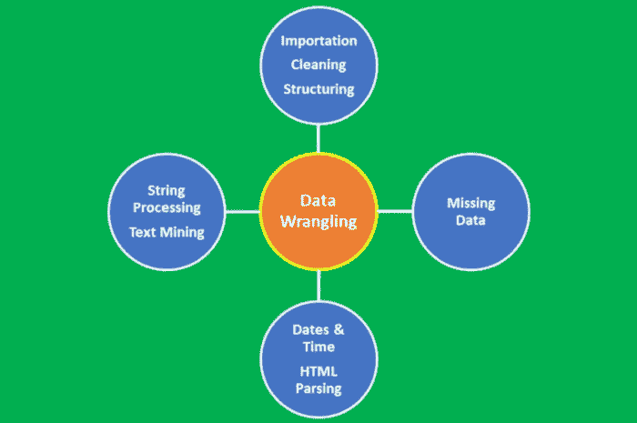
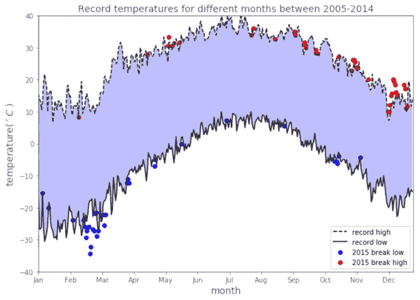
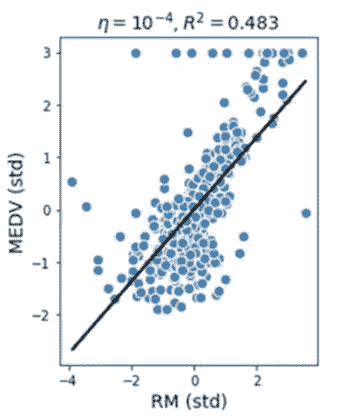
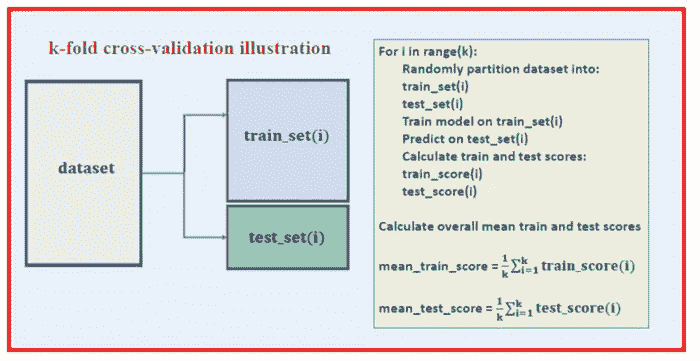
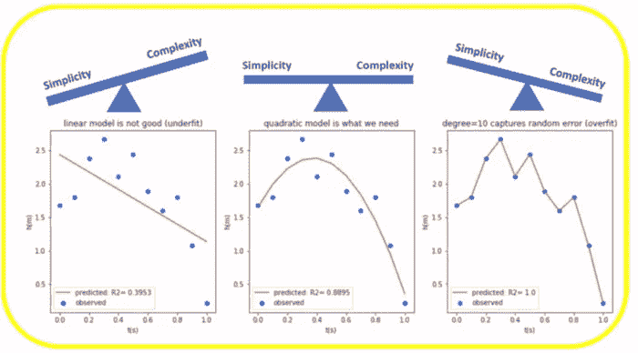
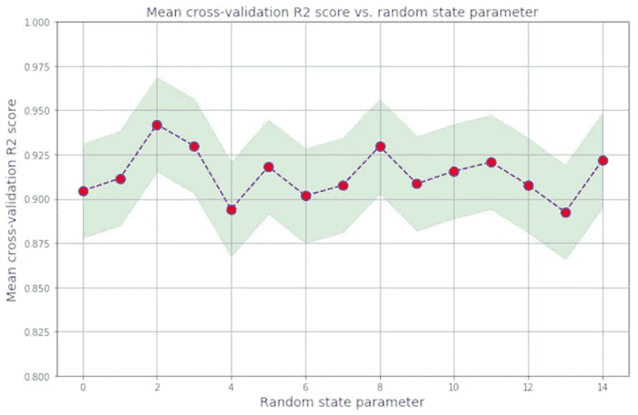

# 面向初学者的 20 个核心数据科学概念

> 原文：<https://pub.towardsai.net/20-core-data-science-concepts-for-beginners-f755c96662b8?source=collection_archive---------0----------------------->

## [数据科学](https://towardsai.net/p/category/data-science)

## 回顾这些基本概念，为工作面试做准备，或者更新你对基础知识的理解


由[王思然·哈德森](https://unsplash.com/@hudsoncrafted?utm_source=medium&utm_medium=referral)在 [Unsplash](https://unsplash.com?utm_source=medium&utm_medium=referral) 上拍摄的照片

在数据科学领域，有如此多的东西要学，有如此多的进步要跟随，有一组核心的基本概念仍然是必不可少的。这里重点介绍了其中的 20 个想法，它们是准备工作面试时回顾的关键，或者只是为了更新你对基础知识的理解。

# 1.资料组

顾名思义，数据科学是一门将科学方法应用于数据的科学，其目标是研究不同特征之间的关系，并根据这些关系得出有意义的结论。因此，数据是数据科学的关键组成部分。数据集是在任何给定时间用于分析或建模的特定数据实例。数据集有不同的类型，如数字数据、分类数据、文本数据、图像数据、语音数据和视频数据。数据集可以是静态的(不变)或动态的(随时间变化，例如股票价格)。此外，数据集也可能依赖于空间。例如，美国的温度数据与非洲的温度数据会有很大不同。对于刚开始的数据科学项目，最流行的数据集类型是包含数字数据的数据集，通常以逗号分隔值(CSV)文件格式存储。

# 2.数据争论

数据争论是将数据从其原始形式转换为便于分析的整洁形式的过程。数据争论是数据预处理中的一个重要步骤，包括几个过程，如数据导入、数据清理、数据结构化、字符串处理、HTML 解析、处理日期和时间、处理缺失数据和文本挖掘。



***图 1*** *:数据扯皮过程。Benjamin O. Tayo 拍摄的图片*

对于任何数据科学家来说，数据争论的过程都是至关重要的一步。在数据科学项目中，很少能够轻松访问数据进行分析。数据更可能存在于文件、数据库中，或者从网页、tweets 或 pdf 等文档中提取。知道如何争论和清理数据将使您能够从数据中获得关键的洞察力，否则这些洞察力将被隐藏。

使用大学城数据集的数据争论的例子可以在这里找到:[关于数据争论的教程](https://medium.com/towards-artificial-intelligence/tutorial-on-data-wrangling-college-towns-dataset-a0e8f8dfb6ae)

# 3.数据可视化

数据可视化是数据科学最重要的分支之一。它是用来分析和研究不同变量之间关系的主要工具之一。数据可视化(如散点图、折线图、条形图、直方图、QQ 图、平滑密度、箱线图、配对图、热图等。)可用于描述性分析。数据可视化还用于机器学习中的数据预处理和分析、特征选择、模型建立、模型测试和模型评估。在准备数据可视化时，请记住数据可视化更多的是一门**艺术**，而不是**科学**。为了产生良好的可视化效果，您需要将几段代码放在一起，以获得出色的最终结果。这里有一个关于数据可视化的教程:[使用天气数据集的数据可视化教程](https://medium.com/towards-artificial-intelligence/tutorial-on-data-visualization-weather-data-52efa1bef183)



***图 2*** *:气象数据可视化示例。Benjamin O. Tayo 拍摄的图片*

# 4.极端值

离群值是与数据集的其余部分非常不同的数据点。异常值通常只是坏数据，例如，由于传感器故障；受污染的实验；或者记录数据中的人为错误。有时，异常值可能表示真实的情况，例如系统中的故障。离群值非常常见，在大型数据集中是意料之中的。检测数据集中异常值的一种常用方法是使用箱线图。**图 3** 显示了一个包含大量异常值的数据集的简单回归模型。离群值会显著降低机器学习模型的预测能力。处理异常值的常见方法是简单地忽略数据点。然而，去除真实数据异常值可能过于乐观，导致模型不现实。处理异常值的高级方法包括 RANSAC 方法。



***图 3*** *:使用带有离群值的数据集的简单回归模型。图像由本杰明·欧·塔约*

# 5.数据插补

大多数数据集包含缺失值。处理缺失数据的最简单方法是简单地丢弃数据点。但是，删除样本或删除整个特性列是不可行的，因为我们可能会丢失太多有价值的数据。在这种情况下，我们可以使用不同的插值技术来估计数据集中其他训练样本的缺失值。最常见的插值技术之一是**均值插补**，我们只需用整个特征列的平均值替换缺失值。输入缺失值的其他选项有**中值**或**最频繁(模式)**，后者用最频繁的值替换缺失值。无论您在模型中采用何种插补方法，您都必须记住，插补只是一种近似值，因此可能会在最终模型中产生误差。如果提供的数据已经过预处理，那么您必须找出丢失值是如何被考虑的。原始数据被丢弃的百分比是多少？使用什么插补方法来估计缺失值？

# 6.数据缩放

缩放要素将有助于提高模型的质量和预测能力。例如，假设您希望构建一个模型，根据预测变量(如*收入*和*信用评分*)来预测目标变量*信用度*。因为信用评分范围从 0 到 850，而年收入范围可能从 25，000 美元到 500，000 美元，如果不缩放您的特征，该模型将偏向于*收入*特征。这意味着与*收入*参数相关的权重因子将非常小，这将导致预测模型仅基于*收入*参数来预测*信用度*。

为了使要素具有相同的比例，我们可以决定使用要素的规范化或标准化。大多数情况下，我们假设数据是正态分布的，并默认为标准化的，但事实并非总是如此。在决定是使用标准化还是规范化之前，首先要了解要素的统计分布情况，这一点很重要。如果特征趋向于均匀分布，那么我们可以使用归一化( *MinMaxScale* r)。如果特征是近似高斯的，那么我们可以使用标准化( *StandardScaler* )。同样，请注意，无论您采用标准化还是规范化，这些都是近似方法，必然会导致模型的总体误差。

# 7.主成分分析

包含数百或数千个要素的大型数据集通常会导致冗余，尤其是当要素相互关联时。在具有太多特征的高维数据集上训练模型有时会导致过度拟合(该模型捕获真实和随机影响)。此外，具有太多特征的过于复杂的模型可能很难解释。解决冗余问题的一种方法是通过特征选择和降维技术，如 PCA。主成分分析(PCA)是一种用于特征提取的统计方法。PCA 用于高维和相关数据。PCA 的基本思想是将原始特征空间转换到主成分空间。PCA 变换实现了以下目标:

**a)** 通过只关注占数据集中方差大部分的成分，减少最终模型中使用的特征数量。

**b)** 去除特征之间的相关性。

PCA 的实现可以在以下链接找到:[使用虹膜数据集的 PCA](https://github.com/bot13956/principal_component_analysis_iris_dataset)

# 8.线性判别分析(LDA)

PCA 和 LDA 是两种数据预处理线性变换技术，通常用于降维以选择可以在最终机器学习算法中使用的相关特征。PCA 是一种无监督算法，用于高维和相关数据中的特征提取。PCA 通过将特征转换为数据集中方差最大的正交分量轴来实现降维。LDA 的目标是找到优化类可分性和降维的特征子空间(见下图)。因此，LDA 是一种监督算法。关于 PCA 和 LDA 的深入描述可以在本书中找到:Sebastian Raschka 的 Python 机器学习，第 5 章。

LDA 的实现可以在以下链接找到:[使用虹膜数据集的 LDA](https://github.com/bot13956/linear-discriminant-analysis-iris-dataset)

# 9.数据划分

在机器学习中，数据集通常被划分为训练集和测试集。该模型在训练数据集上训练，然后在测试数据集上测试。因此，测试数据集充当看不见的数据集，可用于估计泛化误差(在部署模型后将模型应用于真实世界数据集时预期的误差)。在 scikit-learn 中，训练/测试分割估计器可用于分割数据集，如下所示:

```
X_train, X_test, y_train, y_test = train_test_split(X, y, test_size = 0.3)
```

这里，X 是特征矩阵，y 是目标变量。在这种情况下，测试数据集被设置为 30%。

# 10.监督学习

这些是机器学习算法，通过研究特征变量和已知目标变量之间的关系来执行学习。监督学习有两个子类别:

**a)连续目标变量**

预测连续目标变量的算法包括线性回归、KNeighbors 回归(KNR)和支持向量回归(SVR)。

线性和近邻回归教程在这里:[线性和近邻回归教程](https://medium.com/towards-artificial-intelligence/a-comparative-study-of-linear-and-knn-regression-a31955e6263d)

**b)离散目标变量**

预测离散目标变量的算法包括:

*   感知器分类器
*   逻辑回归分类器
*   支持向量机(SVM)
*   决策树分类器
*   k-最近分类器
*   朴素贝叶斯分类器

# 11.无监督学习

在无监督学习中，我们处理的是未标记的数据或结构未知的数据。使用无监督学习技术，我们能够探索我们的数据结构，以提取有意义的信息，而无需已知结果变量或奖励函数的指导。k-均值聚类是非监督学习算法的一个例子。

# 12.强化学习

在强化学习中，目标是开发一个基于与环境的交互来提高其性能的系统(代理)。由于关于环境当前状态的信息通常还包括所谓的奖励信号，我们可以将强化学习视为与监督学习相关的领域。然而，在强化学习中，这种反馈不是正确的基础事实标签或值，而是通过奖励函数来衡量行为的好坏。通过与环境的交互，智能体可以使用强化学习来学习一系列行为，从而最大化这种回报。

# 13.模型参数和超参数

在机器学习模型中，有两种类型的参数:

**a)模型参数:**这些是模型中必须使用训练数据集确定的参数。这些是拟合参数。例如，假设我们有一个模型，如*房价* = *a + b*(年龄)+ c*(面积)，*根据房屋的年龄及其面积(平方英尺)*，*来估算房屋的成本，那么 *a* ， *b* ， *c* 将是我们的模型或拟合参数。

**b)超参数:**这些是可调整的参数，必须进行调整以获得具有最佳性能的模型。这里显示了一个超参数的例子:

```
KNeighborsClassifier(n_neighbors = 5, p = 2, metric = 'minkowski')
```

在训练期间，调整超参数以获得具有最佳性能(具有最佳拟合参数)的模型是很重要的。

在这里可以找到关于模型参数和超参数的教程:[关于机器学习中的模型参数和超参数的教程](https://towardsdatascience.com/model-parameters-and-hyperparameters-in-machine-learning-what-is-the-difference-702d30970f6)

# 14.交叉验证

交叉验证是一种跨数据集的随机样本评估机器学习模型性能的方法。这确保了数据集中的任何偏差都被捕获。交叉验证可以帮助我们获得模型泛化误差的可靠估计值，即模型对未知数据的表现。

在 k-fold 交叉验证中，数据集被随机划分为训练集和测试集。该模型在训练集上被训练，并在测试集上被评估。该过程重复 k 次。然后，通过对 k 倍进行平均来计算平均训练和测试分数。

以下是 k 倍交叉验证伪代码:



***图 4*** *。k 倍交叉验证伪代码。本杰明·欧·塔约的图片*

交叉验证的实现可以在这里找到:[动手交叉验证教程](https://medium.com/towards-artificial-intelligence/hands-on-k-fold-cross-validation-for-machine-learning-model-evaluation-cruise-ship-dataset-27390d58776d)

# 15.偏差-方差权衡

在统计学和机器学习中，偏差-方差权衡是一组预测模型的属性，其中在参数估计中具有较低偏差的模型在样本间具有较高的参数估计方差，反之亦然。偏差-方差困境或问题是试图同时最小化这两个误差源的冲突，这两个误差源阻止监督学习算法推广到它们的训练集之外:

*   *偏差*是学习算法中错误假设的误差。高偏差(**过于简单**)会导致算法错过特征和目标输出之间的相关关系(**欠拟合**)。
*   *方差*是对训练集中微小波动的敏感性误差。高方差(**过于复杂**)会导致算法模拟训练数据中的随机噪声，而不是预期输出(**过拟合**)。

在模型的简单性和复杂性之间找到适当的平衡是很重要的。关于偏差-方差权衡的教程可以在这里找到:[关于偏差-方差权衡的教程](https://towardsdatascience.com/simplicity-vs-complexity-in-machine-learning-finding-the-right-balance-c9000d1726fb)



***图 5*** *。偏倚-方差权衡图解。Benjamin O. Tayo 的图片*

# 16.评估指标

在机器学习(预测分析)中，有几个指标可用于模型评估。例如，可以使用 R2 分数、均方误差(MSE)或平均绝对误差(MAE)等指标来评估监督学习(连续目标)模型。此外，监督学习(离散目标)模型，也称为分类模型，可以使用准确性、精确度、召回率、f1 分数和 ROC 曲线下面积(AUC)等指标进行评估。

# 17.不确定性量化

重要的是建立机器学习模型，该模型将在计算结果中产生不确定性的无偏估计。由于数据集和模型中固有的随机性，评估参数(如 R2 分数)是随机变量，因此估计模型中的不确定性程度非常重要。关于不确定性量化的例子，参见本文:[机器学习中的随机误差量化](https://medium.com/towards-artificial-intelligence/random-error-quantification-in-machine-learning-846f6e78e519)



***图 6*** *。R2 分数波动图解。Benjamin O. Tayo 拍摄的图片*

# 18.数学概念

***a)基础演算:*** 大多数机器学习模型都是用一个具有若干特征或预测器的数据集构建的。因此，熟悉多变量微积分对于建立机器学习模型极其重要。以下是您需要熟悉的主题:

*多变量函数；导数和梯度；阶跃函数、Sigmoid 函数、Logit 函数、ReLU(整流线性单位)函数；成本函数；功能绘图；函数的最小值和最大值*

***b)基础线性代数:*** 线性代数是机器学习中最重要的数学技能。数据集被表示为矩阵。线性代数用于数据预处理、数据转换、降维以及模型评估。以下是您需要熟悉的主题:

*载体；向量的范数；矩阵；矩阵转置；矩阵的逆矩阵；矩阵的行列式；矩阵的迹；点积；特征值；特征向量*

***c)优化方法:*** 大多数机器学习算法通过最小化一个目标函数来进行预测建模，从而学习必须应用于测试数据的权重，以便获得预测的标签。以下是您需要熟悉的主题:

*成本函数/目标函数；似然函数；误差函数；梯度下降算法及其变体(如随机梯度下降算法)*

# 19.统计和概率概念

统计和概率用于特征的可视化、数据预处理、特征转换、数据插补、降维、特征工程、模型评估等。以下是您需要熟悉的主题:

*均值、中位数、众数、标准差/方差、相关系数和协方差矩阵、概率分布(二项式、泊松、正态)、p 值、贝叶斯定理(精确度、召回率、阳性预测值、阴性预测值、混淆矩阵、ROC 曲线)、中心极限定理、R2 得分、均方误差(MSE)、A/B 检验、蒙特卡罗模拟*

以下是一些关于中心极限定理和贝叶斯定理的教育资源:

[使用蒙特卡罗模拟说明中心极限定理](https://towardsdatascience.com/proof-of-central-limit-theorem-using-monte-carlo-simulation-34925a7bc64a) [使用 Heights 数据集解释贝叶斯定理](https://medium.com/towards-artificial-intelligence/bayes-theorem-explained-66ebf8285fcc)

# 20.生产力工具

一个典型的数据分析项目可能包括几个部分，每个部分包括几个数据文件和不同的代码脚本。保持所有这些都有组织可能是一个挑战。生产力工具帮助您组织项目并维护已完成项目的记录。一些用于实践数据科学家的基本生产力工具包括 Unix/Linux、git 和 GitHub、RStudio 和 Jupyter Notebook 等工具。在这里找到更多关于生产力工具的信息:[机器学习中的生产力工具](https://medium.com/towards-artificial-intelligence/productivity-tools-for-large-scale-data-science-projects-64810dfbb971)

*原载于*[*https://www.kdnuggets.com*](https://www.kdnuggets.com/2020/12/20-core-data-science-concepts-beginners.html)*。*