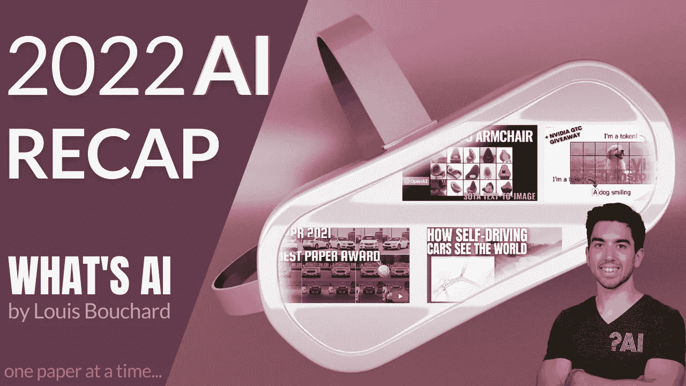

# 2022:充满惊人人工智能论文的一年——综述🚀

> 原文：<https://pub.towardsai.net/2022-a-year-full-of-amazing-ai-papers-a-review-5df00bcbf75a?source=collection_archive---------0----------------------->

## 按发布日期排列的人工智能最新突破的精选列表，带有清晰的视频解释、更深入文章的链接和代码。

虽然世界仍在复苏，但研究并没有放缓其疯狂的步伐，尤其是在人工智能领域。此外，今年还强调了许多重要方面，如道德方面、重要偏见、治理、透明度等等。人工智能和我们对人脑及其与人工智能的联系的理解正在不断发展，显示出在不久的将来改善我们生活质量的有前途的应用。然而，我们应该小心选择应用哪种技术。

> "科学不能告诉我们应该做什么，只能告诉我们能做什么。"——让-保罗·萨特《存在与虚无》

这里有一个按发布日期排列的人工智能和数据科学最新突破的精选列表，有清晰的视频解释，更深入的文章链接和代码(如果适用)。享受阅读吧！

**本文末尾列出了每篇论文的完整参考资料。**

订阅我的[时事通讯](http://eepurl.com/huGLT5)——AI 的最新更新每周都有解释。

*随时给我* [*发消息*](https://www.louisbouchard.ai/contact/) *我可能错过的任何有趣的论文都可以添加到这个列表中。*

*在* ***上给我贴标签****[*@ Whats _ AI*](https://twitter.com/Whats_AI)*或****LinkedIn****[*@ Louis(什么是 AI) Bouchard*](https://www.linkedin.com/in/whats-ai/) *如果分享名单！*来我们的[一起学 AI 不和谐社区](https://www.louisbouchard.ai/learn-ai-together/)和我们聊天吧！**

**👀**如果你愿意支持我的工作**，你可以查看我的[照片](https://www.patreon.com/whatsai)。你也可以支持我，关注我最喜欢的[每日人工智能简讯](https://www.syntheticmind.io/subscribe?ref=EFowuebnlZ)来获得这些新论文的频繁更新！**

# **在 8 分钟内观看完整的 2022 年倒带**

# **完整的列表**

*   **分辨率稳健的大掩模修复与傅里叶卷积[1]**
*   **及时缝合:基于 GAN 的真实视频面部编辑[2]**
*   **NeROIC:在线图像集合中对象的神经渲染[3]**
*   **SpeechPainter:文本条件下的语音修复[4]**
*   **使用生成性面部先验实现真实世界的盲面部恢复[5]**
*   **用于学习的多模态比对的 4D 网络[6]**
*   **具有多分辨率散列编码的即时神经图形图元[7]**
*   **带剪辑潜在时间的分层文本条件图像生成[8]**
*   **MyStyle:一个个性化的生成先验[9]**
*   **OPT:开放预先训练的 Transformer 语言模型[10]**
*   **BlobGAN:空间上不纠缠的场景表示[11]**
*   **多面手代理[12]**
*   **具有深度语言理解的真实感文本到图像扩散模型[13]**
*   **迷你 Dalle**
*   **不让一种语言掉队:扩展以人为中心的机器翻译[15]**
*   **双快门光学振动传感[16]**
*   **创建一个场景:基于场景的文本到图像的人类先验生成[17]**
*   **BANMo:从许多休闲视频中构建可动画化的 3D 神经模型[18]**
*   **使用潜在扩散模型的高分辨率图像合成[19]**
*   **全景场景图生成[20]**
*   **一幅图像抵得上一个词:使用文本反转个性化文本到图像的生成[21]**
*   **通用视频识别的扩展语言-图像预训练模型[22]**
*   **制作视频:无需文本-视频数据的文本-视频生成[23]**
*   **通过大规模弱监督实现稳健的语音识别[24]**
*   **DreamFusion:使用 2D 扩散将文本转换为 3D[25]**
*   **Imagic:基于文本的真实图像编辑与扩散模型[26]**
*   **eDiffi:文本到图像的扩散模型与专家降噪集成[27]**
*   **InfiniteNature-Zero:学习从单个图像生成自然场景的永久视图[28]**
*   **卡拉狄加:科学的大型语言模型[29]**
*   **通过音频-空间分解的实时神经辐射谈话肖像合成[30]**
*   **ChatGPT:优化对话的语言模型[31]**
*   **用于视觉效果的生产就绪面部再老化[32]**
*   **论文参考**

# **分辨率稳健的大掩模修复与傅里叶卷积[1]**

**你肯定经历过这种情况:你和你的朋友拍了一张很棒的照片，有人在你身后拍照，毁了你未来的 Instagram 帖子。那已经不是问题了。无论是一个人还是一个垃圾桶，你在自拍前忘记拿走，都破坏了你的照片。这个人工智能会自动删除图像中不需要的物体或人，并保存你的帖子。这就像一个专业的 photoshop 设计师在你的口袋里，并与一个简单的点击！**

**许多人工智能研究人员已经处理了很长时间的任务，即删除图像的一部分，并用它后面应该出现的内容来替换它。这被称为图像修复，非常具有挑战性…**

*   **短视频讲解:**

*   **简短阅读:[这个人工智能从你的图像中移除不想要的物体！](https://www.louisbouchard.ai/lama/)**
*   **论文:[分辨率稳健的大型蒙版修复与傅立叶卷积](https://arxiv.org/pdf/2109.07161.pdf)**
*   **[代号](https://github.com/saic-mdal/lama)**
*   **[Colab 演示](https://colab.research.google.com/github/saic-mdal/lama/blob/master/colab/LaMa_inpainting.ipynb)**
*   **[产品使用喇嘛](https://cleanup.pictures/)**

# **及时缝合:基于 GAN 的真实视频面部编辑[2]**

**你肯定看过像最近的《惊奇队长》或《双子杀手》这样的电影，在这些电影中，塞谬尔·杰克森和威尔·史密斯看起来要年轻得多。这需要专业人员花费数百甚至数千个小时来手工编辑他出现的场景。相反，你可以用一个简单的人工智能在几分钟内完成。事实上，许多技术允许你添加微笑，让你看起来更年轻或更老，所有这些都是自动使用基于人工智能的算法。它被称为视频中基于人工智能的人脸操作，这是 2022 年的最新技术水平！**

*   **短视频讲解:**

*   **短读:[真实视频的 AI 面部剪辑！及时缝合解释](https://www.louisbouchard.ai/stitch-it-in-time/)**
*   **论文:[及时拼接:基于 GAN 的真实视频面部编辑](https://arxiv.org/abs/2201.08361)**
*   **[代码](https://github.com/rotemtzaban/STIT)**

# **NeROIC:在线图像集合中对象的神经渲染[3]**

**神经渲染。神经渲染是从感兴趣的物体、人或场景的图片中生成空间中的照片真实感模型的能力，就像这个一样。在这种情况下，你会有一些这个雕塑的照片，并要求机器理解这些照片中的物体在太空中应该是什么样子。你基本上是在要求一台机器从图像中理解物理和形状。这对我们来说很容易，因为我们只知道真实世界及其深度，但对于一台只能看到像素的机器来说，这是一个完全不同的挑战。生成的模型看起来很准确，形状逼真，这很好，但是它如何融入新的场景呢？如果拍摄的照片中的光照条件不同，生成的模型看起来也不同，这取决于您查看它的角度，该怎么办？对我们来说，这自然会显得怪异和不切实际。这些是 Snapchat 和南加州大学在这项新研究中应对的挑战。**

*   **短视频讲解:**

*   **简短阅读:[用 AI 创建逼真的 3D 效果图！](https://www.louisbouchard.ai/neroic/)**
*   **论文: [NeROIC:来自在线图像集合的对象的神经渲染](https://arxiv.org/pdf/2201.02533.pdf)**
*   **[代号](https://github.com/snap-research/NeROIC)**

# **SpeechPainter:文本条件下的语音修复[4]**

**我们见过图像修复，目的是从图片中删除不需要的对象。基于机器学习的技术不仅仅是移除物体，它们还理解图片，并用背景应该看起来的样子来填充图像的缺失部分。最近的进步令人难以置信，就像结果一样，这项修复任务对许多应用程序非常有用，如广告或改善你未来的 Instagram 帖子。我们还讨论了一个更具挑战性的任务:视频修复，将相同的过程应用于视频以移除物体或人物。**

**视频的挑战在于保持帧与帧之间的一致性，没有任何瑕疵。但是现在，如果我们正确地从电影中删除一个人，而声音仍然在那里，没有变化，会发生什么？嗯，我们可能会听到鬼的声音，毁了我们所有的工作。**

**这就是我从未在我的频道上报道过的一项任务的由来:语音修复。你没听错，谷歌的研究人员刚刚发表了一篇旨在修复语音的论文，正如我们将看到的，结果令人印象深刻。好吧，我们可能更愿意听到而不是看到结果，但你明白了。它可以纠正你的语法和发音，甚至消除背景噪音。所有我肯定需要继续努力的事情，或者…简单地使用他们的新模型…听听我视频中的例子！**

*   **短视频讲解:**

*   **短读:[演讲用 AI 修复！](https://www.louisbouchard.ai/speech-inpainting-with-ai/)**
*   **Paper: [SpeechPainter:文本条件语音修复](https://arxiv.org/pdf/2202.07273.pdf)**
*   **[多听例子](https://google-research.github.io/seanet/speechpainter/examples/)**

# **使用生成性面部先验实现真实世界的盲面部恢复[5]**

**你是否也有你自己的旧照片，或者你或你父母在我们制作出高质量图像之前拍摄的老照片？是的，我觉得那些记忆被永远地破坏了。伙计，我错了！**

**这个全新的完全免费的 AI 模型可以在一瞬间修复你的大部分旧图片。即使输入质量很低或很高，它也能很好地工作，这通常是一个很大的挑战。**

**本周的论文名为“利用生成性面部先验实现真实世界的盲人面部恢复”，该论文解决了照片恢复任务，并取得了出色的结果。更酷的是，你可以自己尝试，用你喜欢的方式。他们已经开源了他们的代码，并创建了一个演示和在线应用程序供你现在尝试。如果你在上面看到的结果还不够有说服力，就看看视频，在评论里告诉我你的想法，我知道它会让你大吃一惊！**

*   **短视频讲解:**

*   **简短阅读:[AI 令人印象深刻的照片复原！](https://www.louisbouchard.ai/gfp-gan/)**
*   **论文:[面向现实世界的生成式人脸先验的盲人脸恢复](https://arxiv.org/pdf/2101.04061.pdf)**
*   **[代号](https://github.com/TencentARC/GFPGAN)**
*   **[Colab 演示](https://colab.research.google.com/drive/1sVsoBd9AjckIXThgtZhGrHRfFI6UUYOo)**
*   **[在线 app](https://huggingface.co/spaces/akhaliq/GFPGAN)**

# **用于学习的多模态比对的 4D 网络[6]**

**自动驾驶汽车怎么看？**

**你可能听说过他们使用的激光雷达传感器或其他奇怪的相机。但是他们是如何工作的，他们是如何看待这个世界的，与我们相比，他们到底看到了什么？如果我们想让它们上路，主要是如果我们在政府部门工作或制定下一个法规，了解它们是如何工作的是至关重要的。也是这些服务的客户。**

**我们之前报道了特斯拉 autopilot 是如何看待和工作的，但它们不同于传统的自动驾驶汽车。特斯拉只使用相机来了解世界，而大多数像 Waymo 一样，使用常规相机和 3D 激光雷达传感器。这些激光雷达传感器非常容易理解:它们不会像普通相机一样产生图像，而是 3D 点云。激光雷达相机测量物体之间的距离，计算脉冲激光投射到物体上的传播时间。**

**然而，我们如何有效地组合这些信息并让车辆理解它呢？这辆车最后看到了什么？只有到处分？在我们的道路上行驶足够了吗？我们将通过 Waymo 和 Google Research 的一篇新研究论文对此进行研究…**

*   **短视频讲解:**

*   **简短阅读:[结合激光雷达和相机进行 3D 物体检测— Waymo](https://www.louisbouchard.ai/waymo-lidar/)**
*   **论文:[用于学习的多模态比对的 4D 网络](https://openaccess.thecvf.com/content/ICCV2021/papers/Piergiovanni_4D-Net_for_Learned_Multi-Modal_Alignment_ICCV_2021_paper.pdf)**

# **具有多分辨率散列编码的即时神经图形图元[7]**

**好像拍一张照片还不是一个足够具有挑战性的技术能力，我们现在正在做相反的事情:从照片中模拟世界。我已经介绍了令人惊叹的基于人工智能的模型，这些模型可以拍摄图像并将其转化为高质量的场景。一项具有挑战性的任务包括在二维图片世界中拍摄一些图像，以创建物体或人在现实世界中的样子。**

**拍几张照片，立即有一个现实的模型插入到您的产品。多酷啊。！**

**结果比我在 2020 年报道的第一个模型 NeRF 有了显著的提高。这种改进不仅仅是关于结果的质量。NVIDIA 甚至做得更好。**

**不仅质量相当，甚至更好，而且在不到两年的研究时间内，速度提高了 1000 多倍。**

*   **短视频讲解:**

*   **简短阅读: [NVIDIA 在毫秒内将照片变成 3D 场景](https://www.louisbouchard.ai/nvidia-photos-into-3d-scenes/)**
*   **论文:[具有多分辨率哈希编码的即时神经图形图元](https://nvlabs.github.io/instant-ngp/assets/mueller2022instant.pdf)**
*   **[代号](https://github.com/NVlabs/instant-ngp)**

# **带剪辑潜在时间的分层文本条件图像生成[8]**

**去年我分享了 DALL E，这是 OpenAI 的一个神奇模型，能够从文本输入生成图像，效果令人难以置信。现在是他的大哥 DALL E 2 的时候了。你不会相信一年内的进步！DALL E 2 不仅更擅长从文本中生成照片般逼真的图像。结果是分辨率的四倍！**

**好像这还不够令人印象深刻，最近的模型学会了一项新技能；图像修复。**

**DALL E 可以从文本输入中生成图像。**

**DALL E 2 可以做得更好，但不止于此。它还可以编辑这些图像，使它们看起来更好！或者简单地添加一个你想要的特征，比如背景中的一些火烈鸟。**

**听起来很有趣？在视频中了解更多信息或在下面阅读更多信息！**

*   **短视频讲解:**

*   **短读: [OpenAI 的新款 DALL E 2 太惊艳了！](https://www.louisbouchard.ai/openais-new-model-dall-e-2-is-amazing/)**
*   **Paper: [带剪辑潜在时间的分层文本条件图像生成](https://cdn.openai.com/papers/dall-e-2.pdf)**

# **MyStyle:一个个性化的生成先验[9]**

**谷歌研究和特拉维夫大学的这个新模型令人难以置信。你可以把它看做是一个非常非常强大的深度赝品，它可以做任何事情。**

**给任何一个人拍一百张照片，你就可以对其角色进行编码，以修复、编辑或创建任何你想要的逼真照片。**

**如果你问我，这既令人惊讶又令人害怕，尤其是当你看到结果的时候。观看视频查看更多结果，了解模型的工作原理！**

*   **短视频讲解:**

*   **短读:[你的 AI 个人 Photoshop 专家！](https://www.louisbouchard.ai/mystyle/)**
*   **论文: [MyStyle:一个个性化的生成先验](https://arxiv.org/abs/2203.17272)**
*   **[代号(即将推出)](https://mystyle-personalized-prior.github.io/)**

# **OPT:开放预先训练的 Transformer 语言模型[10]**

**我们都听说过 GPT 3 号，对它的能力有一定的了解。您肯定已经看到了一些严格按照这种模式诞生的应用程序，其中一些我在之前关于这种模式的视频中提到过。GPT-3 是由 OpenAI 开发的一个模型，你可以通过一个付费的 API 访问它，但是不能访问模型本身。**

**让 GPT-3 如此强大的是它的结构和大小。它有 1750 亿个参数。我们大脑中神经元数量的两倍！这个巨大的网络几乎是在整个互联网上训练出来的，以理解我们如何书写、交换和理解文本。本周，Meta 为社区向前迈进了一大步。他们刚刚发布了一个同样强大的模型，而且完全开源。**

*   **短视频讲解:**

*   **简短阅读: [Meta 的新型号 OPT 是 GPT-3 最接近的竞争对手！(而且是开源的)](https://www.louisbouchard.ai/opt-meta/)**
*   **Paper: [OPT:打开预先训练好的 Transformer 语言模型](https://arxiv.org/pdf/2205.01068.pdf)**
*   **[代码](https://github.com/facebookresearch/metaseq)**

# **BlobGAN:空间上不纠缠的场景表示[11]**

**BlobGAN 允许对图像进行不真实的操作，非常容易控制简单的 blobs。所有这些小斑点代表一个物体，你可以四处移动它们或者让它们变大，变小，甚至移除它们，它会对它在图像中所代表的物体产生相同的效果。这太酷了。**

**正如作者在他们的结果中分享的那样，你甚至可以通过复制斑点来创建新颖的图像，在数据集[中创建看不见的图像，就像一个有两个吊扇的房间](https://youtu.be/mnEzjpiA_4E)！如果我错了，请纠正我，但我相信这是一篇论文，如果不是第一篇的话，让图像的修改像移动斑点一样简单，并允许在训练数据集中看不到的编辑。**

**和我们都知道的一些公司相比，你实际上可以玩这个！他们公开分享了他们的代码和一个你可以马上尝试的 Colab 演示。更令人兴奋的是 BlobGAN 的工作方式。在视频中了解更多信息！**

*   **短视频讲解:**

*   **短读:[这是甘斯的一大步！布洛根解释道](https://www.louisbouchard.ai/blobgan/)**
*   **论文:[布洛根:空间上解缠的场景表现](https://dave.ml/blobgan/)**
*   **[代号](https://github.com/dave-epstein/blobgan)**
*   **[Colab 演示](https://colab.research.google.com/drive/1clvh28Yds5CvKsYYENGLS3iIIrlZK4xO?usp=sharing#scrollTo=0QuVIyVplOKu)**

# **多面手代理[12]**

**DeepMind 的加托刚刚出版！它是一个单一的变压器，可以玩雅达利游戏，字幕图像，与人聊天，控制一个真正的机械臂，等等！事实上，它只需接受一次训练，并使用相同的重量来完成所有这些任务。根据 Deepmind 的说法，这不仅是一个变形人，也是一个代理人。这就是当你把变形金刚和多任务强化学习代理的进程混合在一起时会发生的事情。**

**加托是一个多模态代理人。这意味着它可以为图像创建标题，或者像聊天机器人一样回答问题。你会说 GPT-3 已经可以做到这一点，但加托可以做得更多……多模态来自于这样一个事实，即加托也可以在人类层面上玩雅达利游戏，甚至可以做真实世界的任务，如控制机械臂精确移动物体。它理解文字、图像，甚至物理…**

*   **短视频讲解:**

*   **短读: [Deepmind 的新模型加托太神奇了！](https://www.louisbouchard.ai/deepmind-gato/)**
*   **论文:[通才代理](https://storage.googleapis.com/deepmind-media/A%20Generalist%20Agent/Generalist%20Agent.pdf)**

# **具有深度语言理解的真实感文本到图像扩散模型[13]**

**如果你认为 Dall-e 2 有很好的效果，那就等着看谷歌大脑的这个新模型能做什么吧。**

**Dalle-e 令人惊叹，但往往缺乏真实感，这就是该团队通过名为 Imagen 的新模型所攻击的。**

**他们在他们的项目页面上分享了许多结果以及一个基准，他们引入该基准是为了比较文本到图像的模型，在这方面他们明显优于 Dall-E 2 和以前的图像生成方法。在视频中了解更多信息…**

*   **短视频讲解:**

*   **短读:[谷歌大脑对 Dalle-e 2 的回答:Imagen](https://www.louisbouchard.ai/google-brain-imagen/)**
*   **论文:[具有深度语言理解的真实感文本到图像扩散模型](https://imagen.research.google/paper.pdf)**
*   **[有结果的项目页面](https://imagen.research.google/)**

# **达勒和米尼[14]**

**Dalle mini 非常棒，你可以使用它！**

**我相信你在过去的几天里已经在你的推特上看到了类似的图片。如果你想知道它们是什么，它们是由一个叫 DALL E mini 的人工智能生成的图像。如果你从未看过这些，你需要看看这个视频，因为你错过了。如果你想知道这怎么可能，好吧，你在完美的视频上，不到五分钟就会知道答案。**

**Dalle mini 是一个免费的开源人工智能，可以从文本输入中生成令人惊叹的图像。**

*   **短视频讲解:**

*   **简短阅读:[dalle-mini 是如何工作的？](https://www.louisbouchard.ai/dalle-mini/)**
*   **[代码](https://github.com/borisdayma/dalle-mini)**
*   **[Huggingface 官方演示](https://huggingface.co/spaces/dalle-mini/dalle-mini)**

# **不让一种语言掉队:扩展以人为中心的机器翻译[15]**

**Meta AI 的最新模型名为“不让一种语言掉队”，它做到了这一点:它以最先进的质量翻译 200 种不同的语言。单个模型可以处理 200 种语言。多不可思议啊。**

**我们发现严格意义上的英语很难有很好的结果，而 Meta 正在用相同的模型处理 200 种不同的语言，以及一些最复杂和代表性较低的语言，甚至连 google translate 都难以应对…**

*   **短视频讲解:**

*   **简短阅读:[无语言遗留](https://www.louisbouchard.ai/no-language-left-behind/)**
*   **[代码](https://github.com/facebookresearch/fairseq/tree/nllb)**
*   **论文:[没有留下语言](https://ai.facebook.com/research/no-language-left-behind/)**

# **双快门光学振动传感[16]**

**他们使用相机和激光束在任何振动表面上重建声音，使他们能够隔离乐器，专注于特定的扬声器，消除环境噪音，以及许多令人惊叹的应用。**

*   **短视频讲解:**

*   **短读: [CVPR 2022 最佳论文荣誉奖:双快门光学振动感应](https://www.louisbouchard.ai/cvpr-2022-best-paper/)**
*   **[项目页面](https://imaging.cs.cmu.edu/vibration/)**
*   **论文:[双快门光学振动感应](https://www.marksheinin.com/_files/ugd/a41a28_7d370603fafd419da387de85d8ecb5b4.pdf?index=true)**

# **创建一个场景:基于场景的文本到图像的人类先验生成[17]**

**大闹不是“又一场闹剧”。这个新模型的目标不是像 dalle 那样允许用户根据文本提示生成随机图像——这真的很酷——而是限制了用户对图像生成的控制。**

**相反，Meta 希望推动创造性表达向前发展，将这种文本到图像的趋势与以前的草图到图像的模式相结合，导致“制作场景”:文本和草图条件下的图像生成之间的奇妙融合。**

*   **短视频讲解:**

*   **简短阅读:[用文字和草图创作出令人惊叹的艺术品！](https://www.louisbouchard.ai/make-a-scene/)**
*   **论文:[制作场景:具有人类先验的基于场景的文本到图像生成](https://arxiv.org/pdf/2203.13131.pdf)**

# **BANMo:从许多休闲视频中构建可动画化的 3D 神经模型[18]**

**使用 BANMo 从图片创建可变形的 3D 模型！**

*   **短视频讲解:**

*   **简短阅读:[用人工智能建立可动画的 3D 模型](https://www.louisbouchard.ai/banmo/)**
*   **论文: [BANMo:从许多休闲视频中构建可动画化的 3D 神经模型](https://banmo-www.github.io/banmo-cvpr.pdf)**
*   **[代码](https://github.com/facebookresearch/banmo)**

# **使用潜在扩散模型的高分辨率图像合成[19]**

**最近所有像 DALLE，Imagen，或 Midjourney 这样的超级强大的图像模型有什么共同点？除了它们高昂的计算成本、巨大的训练时间和共享的炒作之外，它们都基于同一个机制:扩散。扩散模型最近在大多数图像任务中取得了最先进的结果，包括使用 DALLE 的文本到图像，以及许多其他与图像生成相关的任务，如图像修补、样式转换或图像超分辨率。**

*   **短视频讲解:**

*   **简短阅读:[潜在扩散模型:稳定扩散背后的架构](https://www.louisbouchard.ai/latent-diffusion-models/)**
*   **论文:[用潜在扩散模型合成高分辨率图像](https://arxiv.org/pdf/2112.10752.pdf)**
*   **[代码](https://github.com/CompVis/latent-diffusion)**

**👀如果你愿意支持我的工作，你可以去[赞助](https://github.com/sponsors/louisfb01)这个库或者在 [Patreon](https://www.patreon.com/whatsai) 上支持我。**

# **全景场景图生成[20]**

**全景场景图生成(PSG)是一个新的问题任务，旨在基于全景分割而不是包围盒来生成图像或场景的更全面的图形表示。它可以用来理解图像，并生成描述正在发生的事情的句子。这可能是一个人工智能最具挑战性的任务！在下面了解更多信息…**

*   **短视频讲解:**

*   **简短阅读:[对 AI 来说最具挑战性的任务之一](https://www.louisbouchard.ai/psg/)**
*   **论文:[全景场景图生成](https://arxiv.org/abs/2207.11247)**
*   **[代码](https://github.com/Jingkang50/OpenPSG)**
*   **[数据集](https://psgdataset.org/)**

# **一幅图像抵得上一个词:使用文本反转个性化文本到图像的生成[21]**

**像 DALLE 或 stable diffusion 这样的文本到图像模型真的很酷，它允许我们通过简单的文本输入来生成精彩的图片。但是，给他们一张你的照片，然后让它变成一幅画，会不会更酷呢？想象一下，能够发送任何一个物体、人甚至你的猫的图片，并要求模型将其转换为另一种风格，比如将你自己变成一个电子人或变成你喜欢的艺术风格或添加到一个新的场景中。**

**基本上，如果有一个 DALLE 版本，我们可以用它来 photoshop 我们的图片，而不是随机生成，那该有多酷？拥有个性化的 DALLE，同时让控制代变得简单得多，因为“一个图像胜过千言万语”。这就像拥有一个像抖音算法一样个性化和令人上瘾的 DALLE 模型。**

**这是特拉维夫大学和英伟达的研究人员所做的工作。他们开发了一种调节文本到图像模型的方法，就像我上周提到的稳定扩散，用一些图像通过你将随图像一起发送的文字来代表任何物体或概念。将输入图像的对象转换成你想要的任何东西！**

*   **短视频讲解:**

*   **简短阅读:[用您的图像引导稳定扩散](https://www.louisbouchard.ai/imageworthoneword/)**
*   **论文:[一幅图像抵得上一个单词:使用文本反转个性化文本到图像的生成](https://arxiv.org/pdf/2208.01618v1.pdf)**
*   **[代码](https://github.com/rinongal/textual_inversion)**

# **通用视频识别的扩展语言-图像预训练模型[22]**

**我们已经看到 AI 生成文本，然后生成图像，最近甚至生成短视频，尽管它们仍然需要工作。当你想到没有人真正参与这些作品的创作过程时，结果是令人难以置信的，它只需训练一次，然后就像稳定扩散一样被成千上万的人使用。尽管如此，这些模型真的明白他们在做什么吗？他们知道他们刚刚制作的图片或视频真正代表了什么吗？当这样的模型看到这样的图片或者更复杂的视频时，它能理解什么？**

*   **短视频讲解:**

*   **简读:[用 AI 进行通用视频识别](https://www.louisbouchard.ai/general-video-recognition/)**
*   **论文:[扩展通用视频识别语言图像预处理模型](https://arxiv.org/abs/2208.02816)**
*   **[代码](https://github.com/microsoft/VideoX/tree/master/X-CLIP)**

# **制作视频:无需文本-视频数据的文本-视频生成[23]**

**Meta AI 的新模型 make-a-video 已经问世，只需一句话:它从文本中生成视频。它不仅能够生成视频，而且是新的最先进的方法，比以往任何时候都能够生成更高质量和更连贯的视频！**

*   **短视频讲解:**

*   **简短阅读:[制作视频:人工智能电影制作者！](https://www.louisbouchard.ai/make-a-video/)**
*   **纸张:[制作视频:无需文本-视频数据的文本-视频生成](https://makeavideo.studio/Make-A-Video.pdf)**
*   **[代码](https://github.com/lucidrains/make-a-video-pytorch)**

# **通过大规模弱监督实现稳健的语音识别[24]**

**你有没有梦想过一个好的转录工具，可以准确地理解你说的话并写下来？不像 YouTube 上的自动翻译工具…我的意思是，它们很好，但远非完美。只要尝试一下，打开视频的功能，你就会明白我在说什么了。**

**幸运的是，OpenAI 刚刚发布并开源了一个非常强大的人工智能模型:Whisper。**

**它能理解我甚至不能理解的东西，即使我不是英语母语者(听视频)，它也能用于语言翻译！**

*   **短视频讲解:**

*   **短读: [OpenAI 最新型号:Whisper(已解释)](https://www.louisbouchard.ai/whisper/)**
*   **论文:[通过大规模弱监督的鲁棒语音识别](https://cdn.openai.com/papers/whisper.pdf)**
*   **[代号](https://github.com/openai/whisper)**

# **DreamFusion:使用 2D 扩散将文本转换为 3D[25]**

**我们已经看到模型能够接受一个句子并生成图像。然后，通过学习像物体或特定样式这样的特定概念来操纵生成的图像的其他方法。**

**上周 Meta 发布了我提到的制作视频模型，它允许你从一个文本句子生成一个短视频。结果还不完美，但自去年以来我们在该领域取得的进展令人难以置信。**

**本周我们又向前迈进了一步。**

**这是 DreamFusion，一个新的谷歌研究模型，它可以理解一个句子，足以生成它的 3D 模型。你可以看到这是一个 DALLE 或稳定的扩散，但在三维。**

*   **短视频讲解:**

*   **简短阅读:[来自文字的 3D 模型！DreamFusion 解说](https://www.louisbouchard.ai/dreamfusion/)**
*   **论文: [DreamFusion:使用 2D 扩散将文本转换为 3D](https://arxiv.org/abs/2209.14988)**

# **Imagic:基于文本的真实图像编辑与扩散模型[26]**

**如果你认为最近的图像生成模型像 DALLE 或稳定扩散很酷，你就不会相信这是多么不可思议。“这一个”是形象的。Imagic 采用这种基于扩散的模型，能够从中提取文本并生成图像，并调整该模型以编辑图像。你可以生成一个图像，然后教模型按照你想要的方式编辑它。**

*   **短视频讲解:**

*   **短读: [AI 图片编辑自文字！Imagic 解释](https://www.louisbouchard.ai/imagic/)**
*   **论文: [Imagic:利用扩散模型进行基于文本的真实图像编辑](https://arxiv.org/abs/2210.09276)**
*   **[稳定扩散实现](https://github.com/justinpinkney/stable-diffusion/blob/main/notebooks/imagic.ipynb)**

# **eDiffi:文本到图像的扩散模型与专家降噪集成[27]**

**eDiffi 是 NVIDIA 的最新型号，与 DALLE 2 或 Stable Diffusion 等所有以前的方法相比，它可以生成更好看、更准确的图像。eDiffi 更好地理解你发送的文本，并且更加可定制，增加了一个我们在 NVIDIA 以前的论文中看到的功能:画师工具。**

*   **短视频讲解:**

*   **短读: [eDiffi 讲解:新 SOTA 图像合成模型！](https://www.louisbouchard.ai/ediffi/)**
*   **论文: [eDiffi:文本到图像的扩散模型与专家降噪集成](https://arxiv.org/abs/2211.01324)**

# **InfiniteNature-Zero:学习从单个图像生成自然场景的永久视图[28]**

**生成无限的新帧，就好像你正在飞向你的图像！**

*   **短视频讲解:**

*   **短读: [InfiniteNature-Zero:用 AI 飞入你的画面！](https://www.louisbouchard.ai/infinitenature-zero/)**
*   **论文: [InfiniteNature-Zero:学习从单幅图像生成自然场景的永久视图](https://infinite-nature-zero.github.io/static/pdfs/InfiniteNatureZero.pdf)**
*   **[代码](https://github.com/google-research/google-research/tree/master/infinite_nature_zero)**

# **卡拉狄加:科学的大型语言模型[29]**

**卡拉狄加是一个大型语言模型，大小与 GPT-3 相当，但专门研究科学知识。该模型可以编写白皮书、评论、维基百科页面和代码。它知道如何引用，如何写方程。这对人工智能和科学来说是一件大事。**

*   **短视频讲解:**

*   **简短阅读:[卡拉狄加:是什么，发生了什么？](https://www.louisbouchard.ai/galactica/)**
*   **论文:[卡拉狄加:科学的大型语言模型](https://galactica.org/static/paper.pdf)**

# **通过音频-空间分解的实时神经辐射谈话肖像合成[30]**

**从一个单独的视频中，他们可以以更好的质量实时合成人所说的几乎任何单词或句子。你可以让一个正在说话的头实时跟随任何音轨。**

*   **短视频讲解:**

*   **简短阅读:[从音频到人工智能实时对话头！RAD-NeRF 解释道](https://www.louisbouchard.ai/rad-nerf/)**
*   **论文:[通过音频-空间分解的实时神经辐射说话人像合成](https://arxiv.org/abs/2211.12368)**

# **ChatGPT:优化对话的语言模型[31]**

**由于 ChatGPT 的力量和它提供的迷因潜力，它已经接管了 Twitter 和几乎整个互联网。我们都知道创造迷因是征服互联网的最好方法，所以它成功了。**

**既然你已经看到了无数的例子，你可能已经知道 ChatGPT 是 OpenAI 最近向公众发布的一个你可以与之聊天的 AI。它也被称为聊天机器人，这意味着你可以与它交谈，模仿一对一的人类讨论。**

**你可能不知道它是什么和它是如何工作的…观看视频或阅读下面的文章或博客来了解更多！**

*   **短视频讲解:**

*   **短读:[什么是 ChatGPT？](https://www.louisbouchard.ai/chatgpt/)**
*   **博文: [ChatGPT:优化对话的语言模型](https://openai.com/blog/chatgpt/)**

# **用于视觉效果的生产就绪面部再老化[32]**

**无论是为了在 Snapchat 过滤器中寻找乐趣，还是为了看电影，甚至是为了解开几个谜语，我们都有一个能够在照片中改变我们年龄的实用程序。**

**这通常是由熟练的艺术家使用 Photoshop 或类似的工具来编辑你的图片。最糟糕的是，在一个视频中，他们必须对每一帧都进行这种人工编辑！想象一下为此需要做多少工作。好吧，这里有一个解决方案和这种情况下的新问题…👇**

*   **短视频讲解:**

*   **简读:[用 AI 自动再衰老！迪士尼弗兰模式讲解](https://www.louisbouchard.ai/disney-re-age/)**
*   **博客文章:[为了视觉效果而进行的面部再老化](https://studios.disneyresearch.com/2022/11/30/production-ready-face-re-aging-for-visual-effects/)**

> **如果你想阅读更多的论文并有更广阔的视野，这里有另一个涵盖 2021 年的伟大知识库: [2021:充满令人惊叹的人工智能论文的一年-综述](https://github.com/louisfb01/best_AI_papers_2021)，并随时订阅我的每周[简讯](http://eepurl.com/huGLT5)，了解 2022 年人工智能的最新出版物！**

***在 Twitter 上给我加标签*[*@ Whats _ AI*](https://twitter.com/Whats_AI)*或者 LinkedIn* [*@Louis(什么是 AI) Bouchard*](https://www.linkedin.com/in/whats-ai/) *如果分享名单！***

# **论文参考**

**[1]r .、Logacheva、e .、Mashikhin、a .、Remizova、a .、Ashukha、a .、Silvestrov、a .、Kong、n .、Goka、h .、Park、k .和 Lempitsky、v .，2022 年。基于傅里叶卷积的分辨率稳健的大掩模修复。IEEE/CVF 计算机视觉应用冬季会议论文集(第 2149-2159 页)。，[https://arxiv.org/pdf/2109.07161.pdf](https://arxiv.org/pdf/2109.07161.pdf)**

**[2] Tzaban，r .，Mokady，r .，Gal，r .，Bermano，A.H .和 Cohen-Or，d .，2022 年。实时拼接:基于 GAN 的真实视频面部编辑。[https://arxiv.org/abs/2201.08361](https://arxiv.org/abs/2201.08361)**

**[3] Kuang，z .，Olszewski，k .，Chai，m .，Huang，z .，Achlioptas，p .和 Tulyakov，s .，2022 年。NeROIC:来自在线图像集合的对象的神经渲染。https://arxiv.org/pdf/2201.02533.pdf**

**[4]z .博尔索斯、m .沙里菲和 m .塔利亚萨基，2022 年。语音修复:文本条件下的语音修复。【https://arxiv.org/pdf/2202.07273.pdf **

**[5]王等，李等，张等，山等，2021 .基于生成人脸先验的真实世界盲人脸恢复。《IEEE/CVF 计算机视觉和模式识别会议论文集》(第 9168-9178 页)，[https://arxiv.org/pdf/2101.04061.pdf](https://arxiv.org/pdf/2101.04061.pdf)**

**[6]皮尔乔瓦尼，A.J .，卡塞尔，v .，Ryoo，M.S .和安热洛娃，a .，2021 年。用于学习的多模态比对的 4d-net。在《IEEE/CVF 计算机视觉国际会议论文集》(第 15435–15445 页)中，[https://open access . the CVF . com/content/iccv 2021/papers/Piergiovanni _ 4D-Net _ for _ Learned _ Multi-Modal _ Alignment _ ICCV _ 2021 _ paper . pdf](https://openaccess.thecvf.com/content/ICCV2021/papers/Piergiovanni_4D-Net_for_Learned_Multi-Modal_Alignment_ICCV_2021_paper.pdf)。**

**[7]托马斯·穆勒、亚历克斯·埃文斯、克里斯托夫·席德和亚历山大·凯勒，2022，“具有多分辨率散列编码的即时神经图形原语”，[https://NV labs . github . io/Instant-ngp/assets/mueller 2022 Instant . pdf](https://nvlabs.github.io/instant-ngp/assets/mueller2022instant.pdf)**

**[8] A. Ramesh 等人，2022，“具有剪辑潜在性的分层文本条件图像生成”，[https://cdn.openai.com/papers/dall-e-2.pdf](https://cdn.openai.com/papers/dall-e-2.pdf)**

**[9] Nitzan，y .，Aberman，k .，He，q .，巴丽，o .，Yarom，m .，Gandelsman，y .，Mosseri，I .，Pritch，y .，Cohen-Or，d .，2022 年。我的风格:个性化的生成先验。arXiv 预印本 arXiv:2203.17272。**

**[10]张，苏珊等:“开放预训练转换语言模型”[https://arxiv.org/abs/2205.01068](https://arxiv.org/abs/2205.01068)**

**[11] Epstein，d .，Park，t .，Zhang，r .，Shechtman，e .和 Efros，A.A .，2022 年。BlobGAN:空间上不纠缠的场景表现。arXiv 预印本 arXiv:2205.02837。**

**[12] Reed S .等人，2022 年，Deemind:加托——多面手代理，[https://storage . Google APIs . com/deep mind-media/A % 20 general ist % 20 agent/general ist % 20 agent . pdf](https://storage.googleapis.com/deepmind-media/A%20Generalist%20Agent/Generalist%20Agent.pdf)**

**[13] Saharia 等人，2022，Google Brain，具有深度语言理解的真实感文本到图像扩散模型，【https://gweb-research-imagen.appspot.com/paper.pdf **

**[14] Dayma 等人，2021，DALL E Mini，doi:10.5281/zenodo.5146400**

**[15] NLLB 团队等，2022，没有语言落后:扩大以人为中心的机器翻译**

**[16] Sheinin，Mark and Chan，Dorian and O'Toole，Matthew and Narasimhan，Srinivasa G .，2022，双快门光学振动传感，Proc .IEEE CVPR。**

**[17] Gafni，o .，Polyak，a .，Ashual，o .，Sheynin，s .，Parikh，d .和 Taigman，y .，2022 年。有人类先验的基于场景的文本到图像生成。【https://arxiv.org/pdf/2203.13131.pdf **

**[18]杨(g)、沃(m)、内韦尔诺瓦(n)、拉马南(d)、韦达尔迪(a)和朱奥(h ), 2022 年。Banmo:从许多休闲视频中构建可动画化的 3d 神经模型。IEEE/CVF 计算机视觉和模式识别会议论文集(第 2863-2873 页)。**

**[19]罗姆巴赫、布拉特曼、洛伦茨、埃塞和奥默，2022 年。用潜在扩散模型合成高分辨率图像。《IEEE/CVF 计算机视觉和模式识别会议论文集》(第 10684–10695 页)，[https://arxiv.org/pdf/2112.10752.pdf](https://arxiv.org/pdf/2112.10752.pdf)**

**[20]杨军，杨玉珍，郭，周，张，张，刘，2022 .全景场景图生成。arXiv 预印本 arXiv:2207.11247。**

**[21] Gal，r .，Alaluf，y .，Atzmon，y .，Patashnik，o .，Bermano，A.H .，Chechik，g .和 Cohen-Or，d .，2022 年。一幅图像抵得上一个词:使用文本反转个性化文本到图像的生成。**

**[22]倪，b，彭，h，陈，m，张，s，孟，g，傅，j，向，s 和凌，h，2022。通用视频识别的扩展语言图像预处理模型。arXiv 预印本 arXiv:2208.02816。**

**[23]辛格等人(Meta AI)，2022，“制作视频:无文本-视频数据的文本-视频生成”，[https://makeavideo.studio/Make-A-Video.pdf](https://makeavideo.studio/Make-A-Video.pdf)**

**[24]，a .，Kim，J.W .，Xu，t .，Brockman，g .，McLeavey，c .和 Sutskever，I .，通过大规模弱监督的鲁棒语音识别。**

**[25]b .普尔、a .贾恩、J.T .巴伦和 b .米尔登霍尔，2022 年。DreamFusion:使用 2D 扩散将文本转换为 3D。arXiv 预印本 arXiv:2209.14988。**

**[26] Kawar，b .，Zada，s .，Lang，o .，Tov，o .，Chang，h .，Dekel，t .，Mosseri，I .，和伊拉尼，m .，2022 年。基于文本的真实图像编辑与扩散模型。arXiv 预印本 arXiv:2210.09276。**

**[27] Balaji，y .等人，2022，eDiffi:具有专家降噪器集合的文本到图像扩散模型，[https://arxiv.org/abs/2211.01324](https://arxiv.org/abs/2211.01324)**

**[28]李，z .，王，q .，斯内夫利，n .和金泽，a .，2022 年。从单幅图像中学习自然场景的永久视图生成。在欧洲计算机视觉会议上(第 515-534 页)。斯普林格，查姆，【https://arxiv.org/abs/2207.11148 **

**[29]泰勒等人，2022:卡拉狄加:科学的大型语言模型，【https://galactica.org/】T4**

**[30]唐军，王，周，陈，陈，何，胡，刘，曾，王，2022 .通过音频-空间分解的实时神经辐射说话人像合成。arXiv 预印本 arXiv:2211.12368。**

**[31] OpenAI，2022: ChatGPT:优化对话的语言模型，[https://openai.com/blog/chatgpt/](https://openai.com/blog/chatgpt/)**

**[32] Loss 等人，迪士尼研究，2022 年:FRAN，[https://studios . Disney research . com/2022/11/30/production-ready-face-re-aging-for-visual-effects/](https://studios.disneyresearch.com/2022/11/30/production-ready-face-re-aging-for-visual-effects/)**