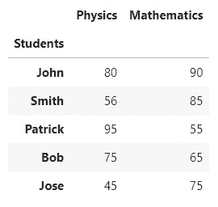
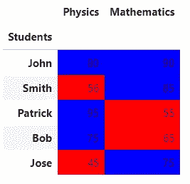

# 掌握熊猫:每个数据科学家都应该知道的 21 个熊猫小贴士

> 原文：<https://pub.towardsai.net/21-pandas-tips-every-data-scientist-should-know-97c930638e9c?source=collection_archive---------0----------------------->

## 最大限度地发挥你的熊猫技能:掌握数据操作的基本技巧和诀窍


[帕斯卡·米勒](https://unsplash.com/@millerthachiller?utm_source=medium&utm_medium=referral)在 [Unsplash](https://unsplash.com?utm_source=medium&utm_medium=referral) 上的照片

无论你是初学者还是有经验的数据分析师，本文中的 21 个技巧和窍门将帮助你轻松处理任何分析任务。从编写干净的代码到避免重新发明轮子，这些提示将帮助你更聪明地工作，而不是更努力。发现熊猫的隐藏宝石，并立即成为主用户。如果你有任何额外的建议分享，不要犹豫，留下评论。

大多数提示来自 [Khuyen Tran 的](https://medium.com/u/84a02493194a?source=post_page-----97c930638e9c--------------------------------) LinkedIn 帖子。

# 1:以易于降价的格式打印数据帧

Markdown 是一种轻量级标记语言，用于使用纯文本编辑器创建格式化文本。有时，您可能希望在 markdown 中包含一个表格，例如 GitHub README 或 Latex。

如果要以减价格式打印`DataFrame`，请使用`to_markdown()`功能。

```
|    |   a |   b |
|---:|----:|----:|
|  0 |   1 |   5 |
|  1 |   2 |   6 |
|  2 |   3 |   7 |
|  3 |   4 |   8 |
```

```
+----+-----+-----+
|    |   a |   b |
+====+=====+=====+
|  0 |   1 |   5 |
+----+-----+-----+
|  1 |   2 |   6 |
+----+-----+-----+
|  2 |   3 |   7 |
+----+-----+-----+
|  3 |   4 |   8 |
+----+-----+-----+
```

# 2:将行分组到列表中

常见的是使用`groupby`来获取同一组中各行的统计数据，如计数、均值、中位数等。如果您想将行分组到一个列表中，请使用“`lambda x: list(x)`”。

```
 col1    col3
col2              
a      1.5  [d, e]
b      3.5  [f, g]
c      3.0     [h]
```

# 3: DataFrame.explode()

当使用`DataFrame`时，如果你想将一个字符串转换成一个列表，然后将列表中的元素拆分成多行，使用`str.split()`和`explode()`的组合。

```
 a   b
0  [1, 2]  11
1  [4, 5]  13
```

```
 a   b
0  1  11
0  2  11
1  4  13
1  5  13
```

# 4: DataFrame.copy()

你有没有试过复制一个`DataFrame`用户`=`？你将不会得到一份拷贝，而是一份对原文的引用。因此，改变新的`DataFrame`也会改变原来的`DataFrame`。

制作副本的更好方法是使用`df.copy()`。现在，更改副本不会影响原件`DataFrame`。

```
 col1  col2
0     7     4
1     8     5
2     9     6
```

```
 col1  col2
0     1     4
1     2     5
2     3     6
```

# 5: Groupby()。count vs Groupby()。大小

*   如果您想获得熊猫`DataFrame`的一列中的元素计数，请使用`groupby`和`count`。
*   如果您想获得由 2 列或更多列组成的组的大小，请使用`groupby`和`size`来代替。

```
 col2
col1      
a        1
b        2
c        2
d        1
```

```
col1  col2
a     S       1
b     M       1
      S       1
c     L       2
d     L       1
dtype: int64
```

# 6:相关性

如果你想计算两个数据帧的行或列之间的相关性，使用`.corrwith()`。

```
a    0.94388
b    0.68313
dtype: float64
```

# 7:交叉制表

交叉制表允许您分析多个变量之间的关系。要将一只熊猫`DataFrame`变成交叉列表，使用`pandas.crosstab()`。

```
person2  Ben  Jone  Patrick  Smith  Warren
person1                                   
Ben        0     0        1      1       0
Jone       0     0        0      0       1
Patrick    1     0        0      1       0
Smith      1     0        1      0       1
Warren     0     1        0      1       0
```

# 8: DataFrame.query()

使用括号过滤熊猫`DataFrame`的列可能会很长。要缩短过滤语句，请使用`df.query()`代替。

```
 fruit  price
2  grape      6
3  grape      7
```

```
 fruit  price
2  grape      6
3  grape      7
```

# 9:取消透视数据帧

*   如果您想将`DataFrame`从宽格式转换为长格式，请使用`pandas.melt()`。
*   例如，您可以使用`pandas.melt()`将多个列(“Aldi”、“Walmart”、“Costco”)转换为一个列(“store”)的值。

```
 fruit  Aldi  Walmart  Costco
0   apple     4        6       1
1  orange     5        7       2
```

```
 fruit    store  value
0   apple     Aldi      4
1  orange     Aldi      5
2   apple  Walmart      6
3  orange  Walmart      7
4   apple   Costco      1
5  orange   Costco      2
```

# 10:重命名聚合列

默认情况下，聚合一个列将返回该列的名称。

如果您想为聚合分配一个新名称，请使用`name = (column, agg_method)`。

```
 price
size        
L     19.000
M     10.000
S     36.995
```

```
 mean_price
size            
L         19.000
M         10.000
S         36.995
```

# 11:标准化值计数

*   如果您想获得一列中某个值的计数，请使用`value_counts`。
*   但是，如果您想要获得某个列中某个值的百分比，请将`normalize=True`添加到`value_counts`。

```
S     4
M     2
L     1
XL    1
dtype: int64
```

```
S     0.500
M     0.250
L     0.125
XL    0.125
dtype: float64
```

# 12: df.transform()而不是 df.count()

*   为了根据类别的出现来过滤熊猫`DataFrame`，您可以尝试使用`df.groupby`和`df.count`。但是，由于 count 方法返回的序列比原来的`DataFrame`短，所以过滤时会出错。
*   不使用`count`，而使用`transform`。该方法将返回与原始`DataFrame`长度相同的序列。现在您可以进行过滤，而不会遇到任何错误。

```
 type  value
0    A      5
1    A      3
2    O      2
4    O      7
5    A      3
```

# 13:填写空值

*   如果您想用另一个`DataFrame`中相同位置的非空值填充一个`DataFrame`中的空值，使用`pandas.DataFrame.combine_first`。
*   在下面的代码中，`store1`第一行的值被更新为`store2`第一行的值。

```
 orange  apple
0    31.0    4.0
1     5.0   71.0
2     9.0   12.0
```

# 14:值计数缺失值

默认情况下，`pandas.value_counts()`忽略缺失值。传递`dropna=False`使其计算缺失值。

# 15:过滤数据框中的列

如果您想要根据名称中的字符过滤 pandas 数据框架的列，请使用 DataFrame.filter。如果您创建了虚拟变量，并且想要根据前缀选择列，这将非常方便。

```
 Temp  Degree
0   Hot      35
1  Cold       3
2  Warm      15
3  Cold       2
```

```
 Degree  Temp_Cold  Temp_Hot  Temp_Warm
0      35          0         1          0
1       3          1         0          0
2      15          0         0          1
3       2          1         0          0
```

```
 Temp_Cold  Temp_Hot  Temp_Warm
0          0         1          0
1          1         0          0
2          0         0          1
3          1         0          0
```

# 16:自动转换数据类型

如果您不知道数据帧中列的数据类型，您可以使用`convert_dtypes()`快速将列转换为最佳类型。

# 17:向数据帧分配新列

使用`Dataframe.assign()`方法给你的`DataFrame`分配新列，`Dataframe.assign()`返回一个新对象(副本)，新列添加到原来的列中。重新分配的现有列将被覆盖。

```
 text  text_len  word_count  weekend
0        saturday: weekend (not working day)        35           5     True
1          sunday: weekend (not working day)        33           5     True
2      monday: doctor appointment at 2:45pm.        37           5    False
3  tuesday: dentist appointment at 11:30 am.        41           6    False
4       wednesday: basketball game at 7:00pm        36           5    False
5           thursday: back home by 11:15 pm.        32           6    False
6        friday: take the train at 08:10 am.        35           7    False
```

# 18:读取 HTML 表格

`.read_html()`可用于快速合并来自不同网站的表格，而无需弄清楚如何抓取网站的 HTML。

```
 Year     Office    GOP    DFL Others
0  2020  President  45.3%  52.4%   2.3%
1  2020    Senator  43.5%  48.8%   7.7%
2  2018   Governor  42.4%  53.9%   3.7%
3  2018    Senator  36.2%  60.3%   3.4%
4  2018    Senator  42.4%  53.0%   4.6%
```

```
 Location July (°F) July (°C) January (°F) January (°C)
0  Minneapolis     83/64     28/18         23/7       −4/−13
1   Saint Paul     83/63     28/17         23/6       −5/−14
2    Rochester     82/63     28/17         23/3       −5/−16
3       Duluth     76/55     24/13         19/1       −7/−17
4    St. Cloud     81/58     27/14        18/−1       −7/−18
```

# 19:“n 最大”和“n 最小”

使用`.nlargest()`和`.nsmallest()`根据特定列对`DataFrame`中的列进行排序，而不是使用`.sort_values()`

数据链接: [IMDB 评级](https://raw.githubusercontent.com/fares-ds/data_analysis_in_python_with_pandas/master/pandas_basics/data/imdbratings.csv)

# 20:创建等级列

Pandas `DataFrame.rank()`方法返回一个序列中每个索引的等级。排序后根据位置返回排名。

在下面的示例中，创建了一个新的 Rank 列，该列根据分数对学生进行排名。

```
 Students  Marks
0     John     80
1    Smith     56
2  Patrick     95
3      Bob     75
4     Jose     45
```

```
 Students  Marks  Rank
0     John     80   2.0
1    Smith     56   4.0
2  Patrick     95   1.0
3      Bob     75   3.0
4     Jose     45   5.0
```

# 21:数据帧中的颜色值

颜色样式增加了最终用户的可读性。熊猫有 style 属性，跟随我们对数据帧应用不同的样式。



# 结论:

Pandas 是一个强大、灵活且易于使用的开源库，用于数据分析和操作，构建在 Python 编程的基础上。成为熊猫大师可以显著增强你的数据分析技能，了解最佳实践可以节省你相当多的时间和精力。凭借其快速的性能和直观的语法，Pandas 是全球数据科学家和分析师的首选。通过掌握 Pandas，您将能够轻松操纵、分析和可视化数据，在当今数据驱动的世界中给您带来显著优势。