# 关于神经网络的 26 个词，每个精通人工智能的领导者都必须知道

> 原文：<https://pub.towardsai.net/26-words-about-neural-networks-every-ai-neural-networks-1085bd972fd5?source=collection_archive---------4----------------------->

## 人工智能

## 你能解释这些吗？检验你的知识！

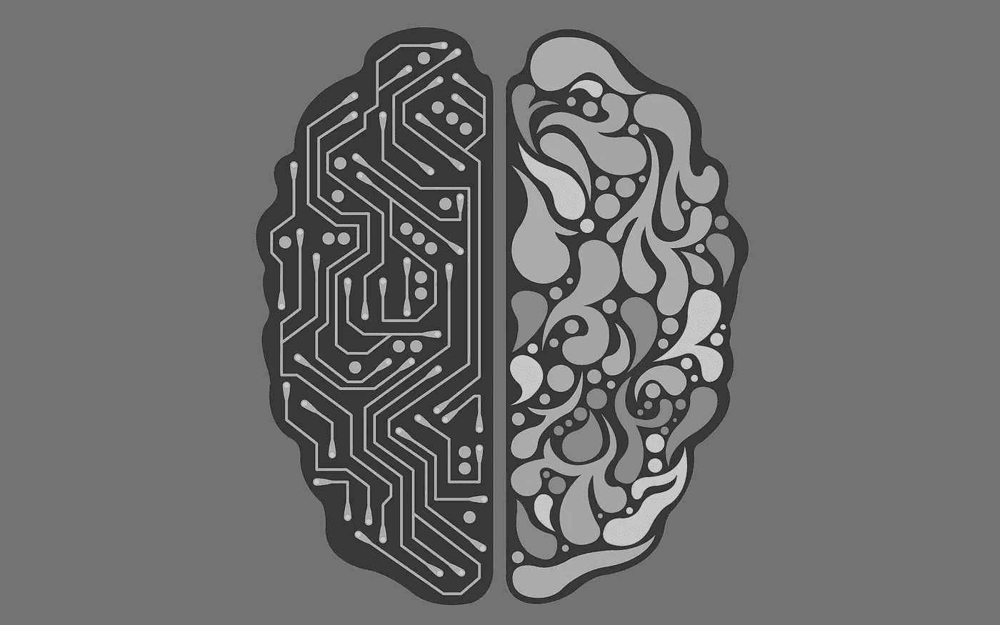

来源: [NeedPix](https://www.needpix.com/photo/915859/artificial-intelligence-ai-robot-android-droid-intelligence-health)

*【这是* ***系列*** *的第 6 部。在继续之前，请确保您阅读了关于* [*搜索*](https://medium.com/towards-artificial-intelligence/ai-search-e0cb610237f6)[*知识*](https://medium.com/towards-artificial-intelligence/ai-knowledge-1020a00eb45d)[*不确定性*](https://medium.com/towards-artificial-intelligence/ai-uncertainty-4ac6810899ac)*[*优化*](https://medium.com/towards-artificial-intelligence/ai-optimization-b8735dc09448) ，以及 [*机器学习*](https://medium.com/towards-artificial-intelligence/ai-learning-2eaea82ee6d) *。下一个题目是* [*语文*](https://medium.com/towards-artificial-intelligence/ai-language-1d266caa72c6) *。】**

**

*表现最好的 AI 应用有一个共同点:它们都是围绕 ***人工神经网络构建的。*** 这些人脑启发的计算模型催生了最近流行的 ***深度学习*** 技术。*

*这两个概念并不新鲜；事实上，它们已经存在了 70 多年*【更多信息，请查看*[*Jaspreet*](https://medium.com/u/f902dfcdf9c9?source=post_page-----1085bd972fd5--------------------------------)*的* [*神经网络简史*](https://towardsdatascience.com/a-concise-history-of-neural-networks-2070655d3fec)*。**

**只是从最近开始，我们才能够通过更好更便宜的计算能力有效地运行如此复杂的数学计算。**

****但是人类和人工神经网络到底有什么区别呢？**
**还有，我们能让计算机像我们一样思考吗？****

****

**为了帮助你回答这些问题，本文围绕 ***神经网络*** 领域，对*主要概念和术语进行了简要的定义和解释。***

# ***神经网络***

*****神经网络:**生物神经网络，由实际的生物神经元组成***

***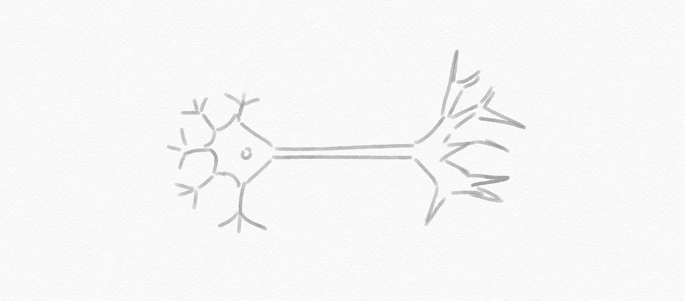***

***神经网络***

*****神经元:**通过专门的连接与其他细胞进行交流的神经细胞***

*****人工神经网络:**某种程度上受人类神经网络启发的计算系统，它“学习”执行任务，而无需使用特定于任务的规则进行编程，其中神经元的连接被建模为权重***

***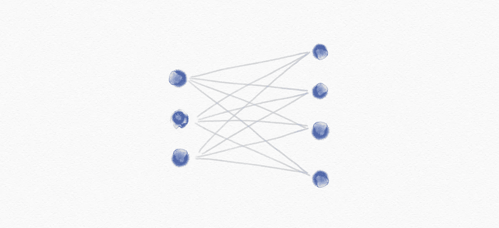***

***人工神经网络***

*****阶跃函数:**从一个常数值突然增加或减少到另一个常数值的函数，例如:***

```
***g(x) = 1 if x ≥ 0, else 0***
```

***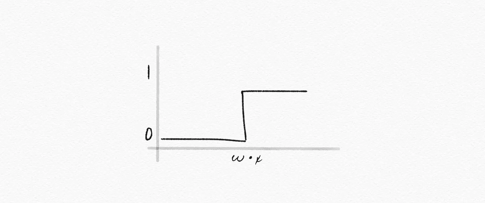***

***阶跃函数***

*****逻辑 sigmoid:** 具有特征“S”形曲线或 sigmoid 曲线的数学函数，例如:***

```
***g(x) = e[x] / (e[x] +1)***
```

***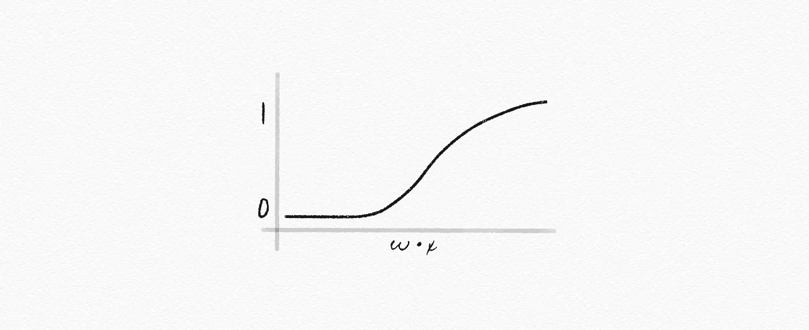***

***逻辑乙状结肠***

*****校正线性单元(ReLU):** 一种激活函数，常用于计算机视觉、语音识别&深度神经网络，例如:***

```
***g(x) = max(0, x)***
```

******

***整流线性装置***

****【更多详情请查看* [*丹青刘*](https://medium.com/u/ea644bb7cd3e?source=post_page-----1085bd972fd5--------------------------------) *的* [*实用指南 ReLU*](https://medium.com/@danqing/a-practical-guide-to-relu-b83ca804f1f7)***

*****梯度下降:**训练神经网络时最小化损失的算法***

*****随机梯度下降:**一种迭代方法，用于优化具有适当平滑特性的目标函数***

*****小批量梯度下降:**梯度下降算法的变体，将训练数据集分成小批量，以计算模型误差并更新模型系数***

*****感知器:**用于二进制分类器的监督学习的学习算法，或者:仅由输入值、权重和偏差、净和以及激活函数组成的单层神经网络***

*****多层神经网络:**具有输入层、输出层和至少一个隐藏层的人工神经网络***

***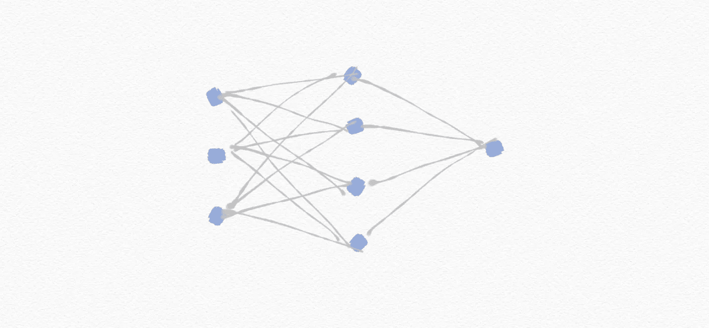***

***多层神经网络***

*****反向传播:**用于训练具有隐藏层的神经网络的算法***

*****深度神经网络:**具有多个隐藏层的神经网络***

***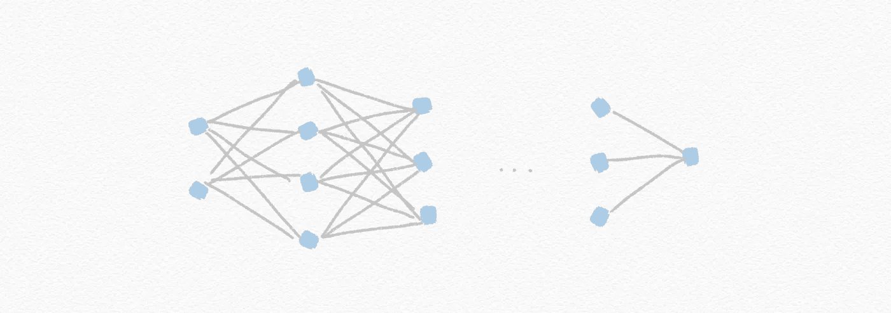***

***深度神经网络***

*****删除:**从神经网络中临时删除随机选择的单元，以防止过度依赖某些单元***

***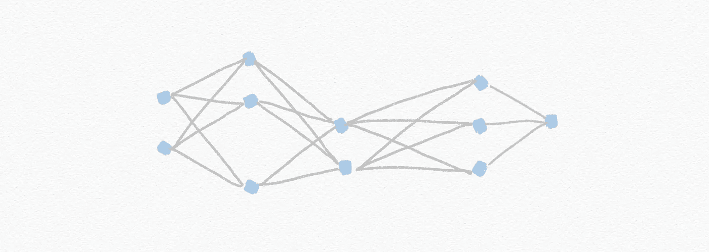***

***拒绝传统社会的人***

*****计算机视觉:**分析和理解数字图像的计算方法***

*****Tensorflow:** 谷歌的一个开源框架，用于运行机器学习、深度学习和分析任务***

****[*[*tensor flow*](https://medium.com/u/b1d410cb9700?source=post_page-----1085bd972fd5--------------------------------)*之前的媒体博客已经搬家，现在位于* [*这里*](https://blog.tensorflow.org/)*……】****

****图像卷积:**应用过滤器，将图像的每个像素值添加到其邻居，根据核矩阵进行加权**

****汇集:**通过从输入中的区域取样来减少输入的大小**

****最大汇集:**通过选择每个区域的最大值来汇集**

**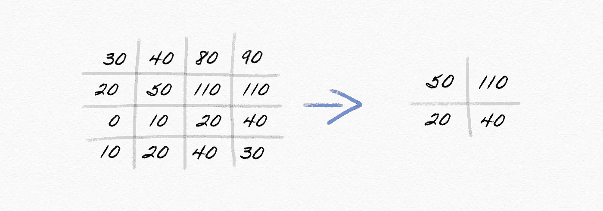**

**最大池化**

****卷积神经网络:**使用卷积的神经网络，通常用于分析图像**

**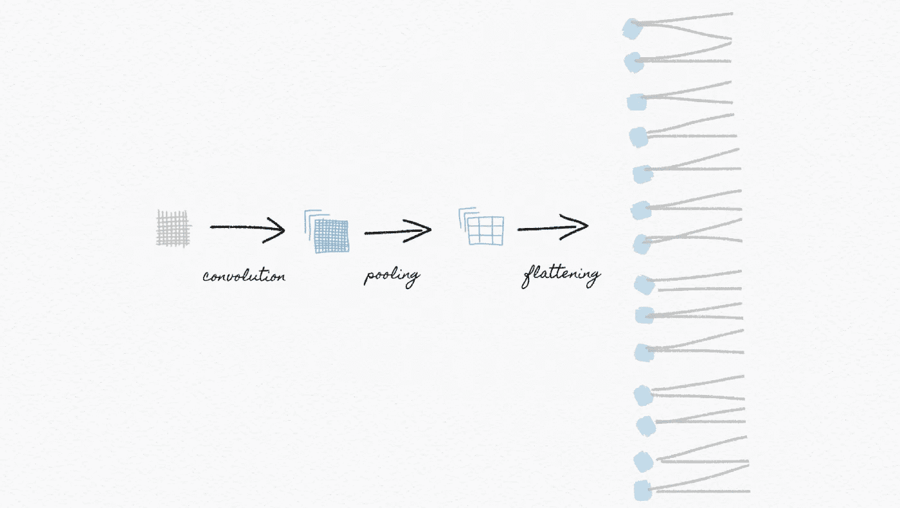**

**卷积神经网络**

****前馈神经网络:**仅在一个方向上有连接的神经网络**

****递归神经网络:**一种神经网络，它产生反馈到其自身输入的输出**

**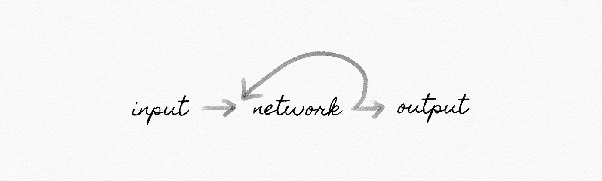**

**递归神经网络**

**既然你已经能够解释神经网络最基本的术语，你已经准备好进一步探索这个兔子洞了。**

**通过探索 ***其他剩余的关键主题*** ，包括 [*搜索*](https://medium.com/towards-artificial-intelligence/ai-search-e0cb610237f6) ， [*知识*](https://medium.com/towards-artificial-intelligence/ai-knowledge-1020a00eb45d) ， [*不确定性*](https://medium.com/towards-artificial-intelligence/ai-uncertainty-4ac6810899ac) *，* [*优化*](https://medium.com/towards-artificial-intelligence/ai-optimization-b8735dc09448) ， [*机器学习*](https://medium.com/towards-artificial-intelligence/ai-learning-2eaea82ee6d) 和[，完成您成为一名成熟的人工智能领导者的旅程](https://medium.com/towards-artificial-intelligence/ai-language-1d266caa72c6)**

****

*****喜欢读什么？*** ***渴望了解更多？*** *关注我上* [*中*](https://medium.com/@yannique) *或*[*LinkedIn*](https://www.linkedin.com/in/yannique/)*。***

*****关于作者:*** Yannique Hecht 作品在结合策略、客户洞察、数据、创新等领域。虽然他的职业生涯一直在航空、旅游、金融和技术行业，但他对管理充满热情。Yannique 专门开发 AI &机器学习产品商业化的策略。**