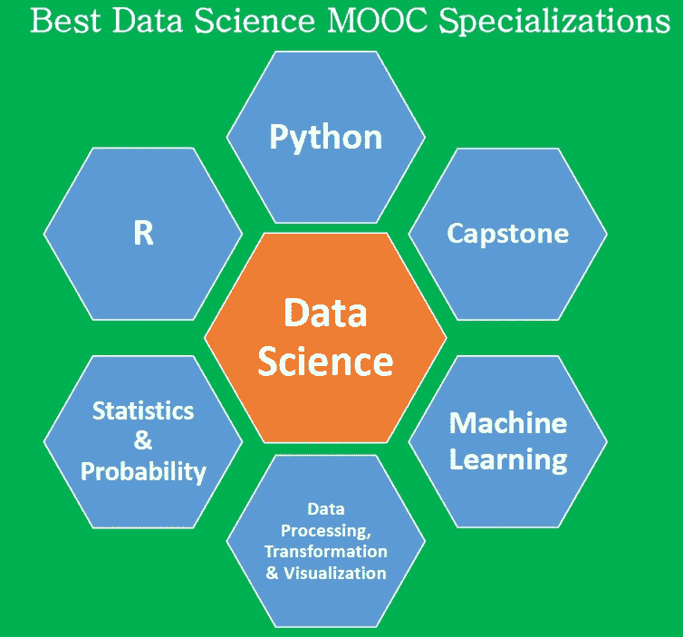

# 3 个最佳数据科学 MOOC 专业

> 原文：<https://pub.towardsai.net/3-best-data-science-mooc-specializations-d58da382f628?source=collection_archive---------1----------------------->

## [数据科学](https://towardsai.net/p/category/data-science)，[教育](https://towardsai.net/p/category/education)

## 为您带来 3 个理想的 MOOC 数据科学专业供您选择

本文讨论了 3 个重要的数据科学 MOOC(大规模开放在线课程)专业。每个试图学习数据科学基础的初学者都经常面临以下问题:

1.  我应该学习哪些数据科学课程，学习顺序是什么？
2.  应该从哪个平台上数据科学课程，edX，Coursera，Udemy，DataCamp 等？
3.  有哪些最好的数据科学 MOOC 专业？

大约一年前，我开始学习数据科学。从一开始就很有挑战性，因为我脑子里也有同样的问题。在参加了来自各种平台的 MOOC 数据科学课程后，我发现了 3 个我认为最好的重要专业。我将解释为什么我认为这 3 个专业是最好的。

在讨论 3 个最佳数据科学专业之前，让我指出，数据科学 **MOOC 专业**对于提供进入数据科学领域的初始启动极其有用。然而， **MOOC 专业化**本身不会让你成为数据科学家。要成为一名数据科学家，你需要比 MOOC 专业更高级的知识。您还需要大量的**实践**，将您的知识应用到现实世界的数据科学项目中。要了解成为数据科学家的更多步骤，请参见本文:**成为数据科学家的 5 个步骤** ( [成为数据科学家的 5 个步骤——Benjamin Obi Tayo——Medium](https://medium.com/@benjaminobi/five-steps-to-becoming-a-data-scientist-239bbc60a6e3))。

# 3 个最佳数据科学 MOOC 专业

以下是我列出的 3 个最佳数据科学 MOOC 专业:

## [**1。数据科学专业证书(HarvardX，通过 edX)**](https://www.edx.org/professional-certificate/harvardx-data-science)

包括以下课程，全部使用 R 教授(您可以免费旁听课程或购买认证证书):

1.  数据科学:R 基础；
2.  数据科学:可视化；
3.  数据科学:概率；
4.  数据科学:推理和建模；
5.  数据科学:生产力工具；
6.  数据科学:扯皮；
7.  数据科学:线性回归；
8.  数据科学:机器学习；
9.  数据科学:顶点

## [**2。分析:基本工具和方法(Georgia TechX，通过 edX)**](https://www.edx.org/micromasters/analytics-essential-tools-methods)

包括以下课程，全部使用 R、Python 和 SQL 讲授(您可以免费审计或购买经过验证的证书):

1.  分析建模导论；
2.  数据分析计算导论:
3.  商业数据分析。

[**3。Python 专业的应用数据科学(密歇根大学，通过 Coursera)**](https://www.coursera.org/specializations/data-science-python)

包括以下课程，全部使用 python 教授(您可以免费旁听大多数课程，有些课程需要购买认证证书):

1.  Python 中的数据科学导论；
2.  应用 Python 绘图、制图和数据表示；
3.  Python 中的应用机器学习；
4.  Python 中文本挖掘的应用:
5.  Python 中的应用社会网络分析。

# 为什么我认为这 3 个专业是最好的

1.  Python 和 R 被认为是大多数数据科学工作清单中提到的**前 2 大技术技能**(数据科学家最需要的[技能](http://bit.ly/2ZisSGV))。上面讨论的 3 个专业使用 Python 和 r 教授数据科学。这为您提供了能够使用这两种语言学习和实现数据科学任务的机会。
2.  这些专业化涵盖了相当深度的、以职业为导向的课程，这些课程将帮助您发展所需的技能，使您能够应对现实世界的数据科学挑战。您将学习 Python、R、统计和概率、数据处理、数据转换、数据工程、数据可视化、机器学习、模型构建、模型测试和评估以及应用方面的技能。
3.  这些专业由具有不同背景的数据科学领域的专家教授，如信息系统、生物统计学、计算科学和工程、系统和工业工程、计算机科学和商业分析。这为你提供了一个学习各种方法的好机会。比如数据科学的 **HarvardX 专业证书专精由 P **rof 教授。Rafael Irizarry** 是哈佛大学的生物统计学教授，所以他的课程非常丰富。与此同时，佐治亚理工学院的系统和工业工程教授 Joel Sokol 教授讲授佐治亚理工学院 TechX **分析:基本工具和方法**，因此他深入研究了数据科学在航空、医疗保健、体育、能源部门、人力资源管理等领域的大量应用。**

总之，我们已经讨论了 3 个重要的数据科学 MOOC 专业。根据个人背景的不同，成为数据科学家的旅程可能会有所不同，但我们在本文中讨论的 3 个数据科学专业将使任何数据科学领域的新手掌握基础知识。

感谢阅读！