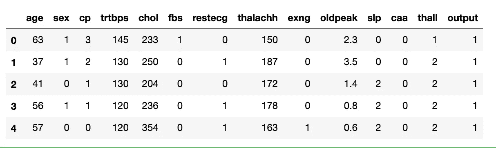

# 熊猫数据帧训练/测试分割的 3 种不同方法

> 原文：<https://pub.towardsai.net/3-different-approaches-for-train-test-splitting-of-a-pandas-dataframe-d5e544a5316?source=collection_archive---------0----------------------->

## [机器学习](https://towardsai.net/p/category/machine-learning)

## 关于如何通过 scikit-learn、pandas 或 NumPy 内置函数将数据集分割成训练集和测试集的简短教程


作者图片

**通常，训练/测试拆分过程是理所当然的机器学习任务之一**。事实上，数据科学家更关注数据预处理或功能工程，将数据集划分为一行代码的过程委托给其他人。

在这篇短文中，我描述了三种训练/测试分割技术，利用了三个不同的 Python 库:

*   sci kit-学习
*   熊猫
*   NumPy

在本教程中，我假设整个数据集以 CSV 文件的形式提供，该文件以 Pandas 数据帧的形式加载。我考虑一下`heart.csv`数据集，它有 303 行和 14 列:

```
import pandas as pddf = pd.read_csv('source/heart.csv')
```



作者图片

*输出*列对应目标列，所有剩余列对应输入特征:

```
Y_col = 'output'
X_cols = df.**loc**[:, df.columns != Y_col].columns
```

# 1 sci kit-学习

Scikit-learn 提供了一个名为`train_test_split()`的函数，该函数自动将数据集分割成训练集和测试集。作为函数的输入参数，可以传递列表或数据帧。

```
from sklearn.model_selection import train_test_splitX_train, X_test, y_train, y_test = **train_test_split**(df[X_cols], df[Y_col],test_size=0.2, random_state=42)
```

其他输入参数包括:

*   `test_size`:测试数据集中包含的数据集的比例。
*   `random_state`:要传递给随机操作的种子号，从而使实验可重复。

原始数据集包含 303 条记录，带有`test_size=0.20`的`train_test_split()`函数将 242 条记录分配给训练集，61 条分配给测试集。

# 两只熊猫

Pandas 提供了一个名为`sample()`的 Dataframe 函数，可以用来将一个数据帧分割成训练集和测试集。该函数接收`frac`参数作为输入，该参数对应于包含在结果中的数据集的比例。与 scikit-learn `train_test_split()`类似，`sample()`功能也提供了`random_state`输入参数。

`sample()`该函数可用于提取训练集:

```
df_train = df.**sample**(frac=0.8, random_state=1)
```

虽然可以通过从原始数据集中删除训练集来提取测试集:

```
df_test=df.**drop**(df_train.index)
```

可以通过从训练集和测试集中选择相关列来提取 X 和 Y 变量:

```
X_train = df_train[X_cols]
X_test = df_test[X_cols]y_train = df_train[Y_col]
y_test = df_test[Y_col]3 np.random.rand()
```

与`train_test_split()`函数类似，带有`frac=0.8`的 sample()函数将 242 条记录分配给训练集，将 61 条记录分配给测试集。显然，`sample()`产生的数据集中包含的记录与`train_test_split()`产生的不同。

# 3 元

在 Numpy 包中，我们可以利用`rand()`函数来生成 0 到 1 之间的随机元素列表。更准确地说，我们可以生成一个与数据帧长度相同的列表。然后，我们可以创建一个值为< 0.8 的掩码，然后使用该掩码构建训练集和测试集:

```
import numpy as npmask = np.random.rand(len(df)) < 0.8df_train = df[mask]
df_test = df[~mask]
```

与`train_test_split()`和`sample()`不同，这种策略不会为训练集和测试集生成固定数量的样本。在这个具体的例子中，训练集中的样本数是 256(而其他策略是 242)，测试集中的样本数是 47。

# 摘要

在这篇短文中，我展示了三种策略来将作为 Pandas 数据帧提供的数据集分割成训练集和测试集。

**最佳解决方案？**看你最熟悉哪个库了。

> 你呢？你知道执行训练/测试分割的其他库或技术吗？如果是这样，给我留言吧！

如果你已经走了这么远来阅读，对我来说今天已经很多了。谢谢！你可以在[这篇文章](https://alod83.medium.com/which-topics-would-you-like-to-read-c68314dc6813)里读到更多关于我的内容。

# 你愿意支持我的研究吗？

你可以每月订阅几美元，并解锁无限的文章。

# 额外奖金

在所有情况下，生成的数据集仍然是熊猫数据帧。因此，您可以将它们导出为 CSV 文件，只需利用熊猫提供的`to_csv()`功能:

```
X_train.to_csv('output/X_train.csv')
X_test.to_csv('output/X_test.csv')
y_train.to_csv('output/y_train.csv')
y_test.to_csv('output/y_test.csv')
```

本文中使用的所有代码都可以在我的 [Github 资源库](https://github.com/alod83/data-science/blob/master/DataAnalysis/TrainTest%20Split.ipynb)中找到。

# 相关文章

[](https://towardsdatascience.com/a-complete-data-analysis-workflow-in-python-pycaret-9a13c0fa51d4) [## Python PyCaret 中的完整数据分析工作流

### 这是一个现成的教程，利用了我用过的最好的机器学习库。

towardsdatascience.com](https://towardsdatascience.com/a-complete-data-analysis-workflow-in-python-pycaret-9a13c0fa51d4) [](https://towardsdatascience.com/how-to-check-if-a-classification-model-is-overfitted-using-scikit-learn-148b6b19af8b) [## 如何使用 scikit-learn 检查分类模型是否过度拟合

towardsdatascience.com](https://towardsdatascience.com/how-to-check-if-a-classification-model-is-overfitted-using-scikit-learn-148b6b19af8b) [](https://towardsdatascience.com/how-to-deal-with-imbalanced-multiclass-datasets-in-python-fe0bb3f2b669) [## 如何在 Python 中处理不平衡的多类数据集

towardsdatascience.com](https://towardsdatascience.com/how-to-deal-with-imbalanced-multiclass-datasets-in-python-fe0bb3f2b669)