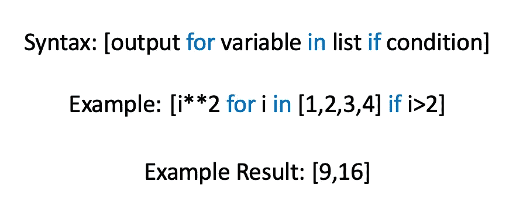

# 数据科学家在代码中经常犯的 3 个错误

> 原文：<https://pub.towardsai.net/3-frequent-mistakes-i-see-data-scientists-make-in-their-code-6ae778ce20c?source=collection_archive---------2----------------------->

这些是我遇到的一些最常见的错误。消除它们会让你写出更快的代码，更少的代码，以及具有清晰工作流程的代码。

# 不使用应用功能

无论您使用什么语言，如果您在数据框中迭代，您可能会做错一些事情。你的计算机可以同时处理多件事情，用 for 或 while 循环迭代意味着每件事情一次做一件。这里有两种方法可以将相同的函数应用于数据集。

```
def function_to_apply(x):
    y = x**2 + 5*x + 10
    return y
```

缓慢:

```
for row_number in df.index:
    df.iloc[row_number] = function_to_apply(df.iloc[row_number])
```

快速:

```
df = df.apply(function_to_apply)
```

apply 函数内置在 pandas 中，并将您编写的函数作为参数。这将应用于数据框中的所有行或列，具体取决于可选的轴参数。

# 不使用列表理解

这是一个类似于不使用 apply 函数的概念，但是在 python 中有一个特定于应用程序的列表。如果您确实在使用 python，那么遍历一个列表可能相对较慢或较快，这取决于您的选择。下面是一个简单的例子，将列表中的元素加倍。

缓慢:

```
for element in your_list:
    element *= 2
```

快速:

```
your_list = [element*2 for element in your_list]
```

在第一个代码块中，操作一次应用于一个元素。在这个块中，程序被告知对每个元素一次应用一个操作。当应用于元素 n 的函数依赖于对元素 n-1 所做的操作时，这是正确的做法。当没有一个元素相互影响时，这是缓慢的。在第二个代码块中，您已经明确地告诉您的程序，没有一个元素依赖于其他元素，因此您的程序可以安全地同时执行所有这些操作。第一次看的时候，语法可能有些混乱，但是它要快得多，并且只占用一行。当您正在处理的列表很小时，这是一个微不足道的区别，但在处理大型数据集时，这是一个节省时间的好方法。如果你需要更深入的教程，这里有一个很好的 [one](https://www.youtube.com/watch?v=5K08WcjGV6c) 。



# 不使用 Sklearn 管道

这并没有从技术上*改善你的工作，但是它确实让你的工作更具可读性和组织性。以下是 RedCarpet 创始人 Sandeep Srinivasa 对此的看法:*

当然，您可以在不使用 sklearn 管道的情况下创建一些复杂的模型，但是如果您没有这样做过，这表明您对数据科学有些陌生。这里有一个来自 [sklearn 文档](https://scikit-learn.org/stable/auto_examples/compose/plot_column_transformer_mixed_types.html)的例子。在本例中，管道用于拟合泰坦尼克号生存数据集的逻辑回归模型。

```
import numpy as npfrom sklearn.compose import ColumnTransformer
from sklearn.pipeline import Pipeline
from sklearn.impute import SimpleImputer
from sklearn.preprocessing import StandardScaler, OneHotEncoder
from sklearn.linear_model import LogisticRegression
from sklearn.model_selection import train_test_split
```

使用管道函数，我们将步骤作为元组数组输入。元组中的第一个值是作为字符串应用的转换的名称，第二个值是应用的函数。下面，为数字特征创建了一个管线。

```
numeric_features = ['age', 'fare']
numeric_transformer = Pipeline(steps=[
    ('imputer', SimpleImputer(strategy='median')),
    ('scaler', StandardScaler())])
```

现在，为分类特征创建了一个管道。

```
categorical_features = ['embarked', 'sex', 'pclass']
categorical_transformer = Pipeline(steps=[
    ('imputer', 
     SimpleImputer(strategy='constant', fill_value='missing')),
    ('onehot', OneHotEncoder(handle_unknown='ignore'))])
```

这两个管道一起用于创建一个称为预处理器的新函数，它进入最终的管道。

```
preprocessor = ColumnTransformer(
    transformers=[
        ('num', numeric_transformer, numeric_features),
        ('cat', categorical_transformer, categorical_features)])clf = Pipeline(steps=[('preprocessor', preprocessor),
                      ('classifier', LogisticRegression())])X_train, X_test, y_train, y_test = train_test_split(X, y, test_size=0.2)clf.fit(X_train, y_train)
```

利用这些管道不仅可以让您更好地记录工作，还可以让您更容易地编辑管道。向这些管道中的任何一个添加 step 都会很快。请利用以上所有！