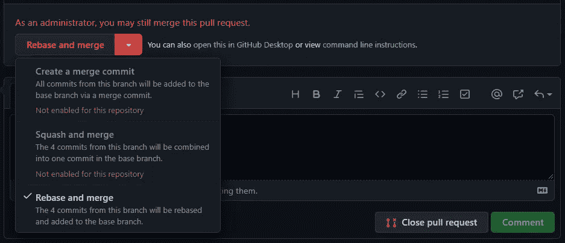

# 3 个 Git Hacks 来提高你的生产力

> 原文：<https://pub.towardsai.net/3-git-hacks-to-improve-your-productivity-60b482a3157?source=collection_archive---------2----------------------->

## [编程](https://towardsai.net/p/category/programming)

## 学习完 Git 基础知识后，你会发现你需要更多！


照片由[纳赫尔·阿卜杜勒·哈迪](https://unsplash.com/@nahelabdlhadi?utm_source=medium&utm_medium=referral)在 [Unsplash](https://unsplash.com?utm_source=medium&utm_medium=referral) 上拍摄

作为软件开发人员，必须学习 Git 技术。开始的时候你可能会觉得有点困惑，但是一步一步地，你会习惯的。应用 Git 基础会让你的生活变得更加快乐，直到你的项目和团队成长。更大的团队或项目会带来新的挑战。你没有那么多时间使用笨拙的解决方案来应对挑战。这是你需要变得更加专业的时候了。下面的 Git 技巧是我发现在我们的开发中有用的。希望它们也能帮助你。

在阅读了下面的 Git 技巧之后，我推荐你阅读下面的文章来更新关于 Git 的一切。

[](https://towardsdatascience.com/how-to-learn-git-in-simple-words-263618071dd8) [## 如何用简单的话学习 Git

### 保护你数据科学家职位的行动手册

towardsdatascience.com](https://towardsdatascience.com/how-to-learn-git-in-simple-words-263618071dd8) 

我们开始吧。

# —如何跨分支转移代码变更

**场景—** 您有几个开放的分支机构。您开发了数百行代码，并在*分支 X* 上提交。突然，你发现你应该在分支 Y 上开发那些代码。将您的更改复制并粘贴到另一个分支上的同一文件需要很长时间。另外，这是一种混乱的方式。**您希望有一种干净快捷的方法将您的更改应用到正确的分支。**

在这种情况下，您只需要检查目标分支，然后使用下面的代码和源提交的提交散列，将所有代码更改复制并粘贴到目标分支。

```
git cherry-pick <commit-hash>
```

要找到其他有帮助的场景，你可以阅读这篇文章。🍒

# —如何删除已删除的分支

**场景—** 你在一个大团队中工作。每个人在一周内创建几个分支。软件团队有一个组织分支的好策略。另外，它已经被设置为自动删除合并的分支。但是，在 Git 客户机(如 Sourcetree)上，您最终会有一个很大的删除分支列表。在早期，你手动一个接一个地删除它们，但是这种方法不能持续。**你希望有一种方法可以从你的本地 Git 客户端自动删除所有被删除的分支。**

你可以使用下面的代码。`git fetch`是相同的代码，您通常使用它来发现什么变更被添加到远程存储库中。使用`--prune`会导致从您的本地 Git 客户机中删除已删除的分支。✂️

```
git fetch origin --prune
```

# —如何确保每个拉取请求都是基于基础的

**场景—** 您的团队使用拉请求(也称为 PR)工作流将代码变更合并到主分支。每个人都知道，在提交 PR 之前，他们必须对他们的分支机构进行调整。然而，经常会发生这样的情况，在合并之前，一个 PR 必须被重新调整几次，以更新主分支上最近的变化。为什么？因为，在现实世界的项目中，队列中总是有几个 PRs。在每个 PR 合并后，其他的就过时了(它们必须重新建立基础)。*现在，假设一个过时的公关被错误地合并了！*在这种情况下，您可能会丢失主分支中的一些代码，这是开发团队最不希望看到的。你希望有一种方法可以在合并之前自动地改变分支的基础。

为了确保对应于一个拉请求的每个分支在被合并之前都被重置，您可以使用 GitHub 提供的选项。GitHub 上的合并按钮可以设置为 3 种不同的合并方式:(1)创建合并提交，(2)挤压并合并，(3)重置基础并合并。您应该使用第三个选项(Rebase and merge)来确保 PRs 在合并之前都被重新定基。



GitHub 上 pull request 页面上的 merge 按钮的 3 个选项。

请注意，Rebase 是一个复杂的命令。所以，你应该准备好在使用它的时候出现意外的错误。👽

# —最后的话

作为专业人士，学习 Git 技术有 3 个主要步骤:(1) Git 基础，(2) Git 工作流程，(3) Git 技巧。我写了两篇关于步骤 1 和 2 的文章:“[如何用简单的话学习 Git](https://towardsdatascience.com/how-to-learn-git-in-simple-words-263618071dd8)”和“ [Git-Flow 是生产力的源泉，而不是困惑](https://towardsdatascience.com/git-flow-is-the-source-of-productivity-not-confusion-8abda7c5fb30)”。当前的文章是关于 Git 黑客的。我将继续写更多关于 Git 的文章，因为不仅我发现它对我的团队有用，而且我的媒体观众也发现它有用。**请继续关注更多 Git 技巧。**快乐编码！🤖

## 感谢阅读！❤️

如果你喜欢这个帖子，想支持我…

*   *跟我上* [*中*](https://medium.com/@pedram-ataee) *！*
*   *在* [*亚马逊*](https://www.amazon.com/Pedram-Ataee/e/B08D6J3WNW) *上查看我的书！*
*   *成为会员上* [*中*](https://pedram-ataee.medium.com/membership) *！*
*   *连接上*[*Linkedin*](https://www.linkedin.com/in/pedrama/)*！*
*   *关注我* [*推特*](https://twitter.com/pedram_ataee) *！*

[](https://pedram-ataee.medium.com/membership) [## 通过我的推荐链接加入 Medium-Pedram Ataee 博士

### 作为一个媒体会员，你的会员费的一部分会给你阅读的作家，你可以完全接触到每一个故事…

pedram-ataee.medium.com](https://pedram-ataee.medium.com/membership)