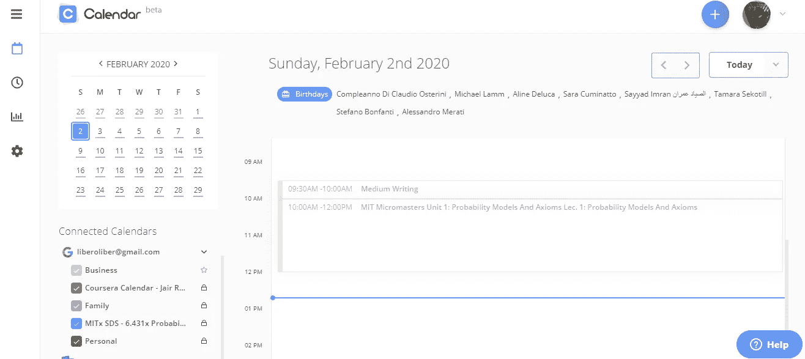
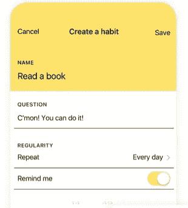
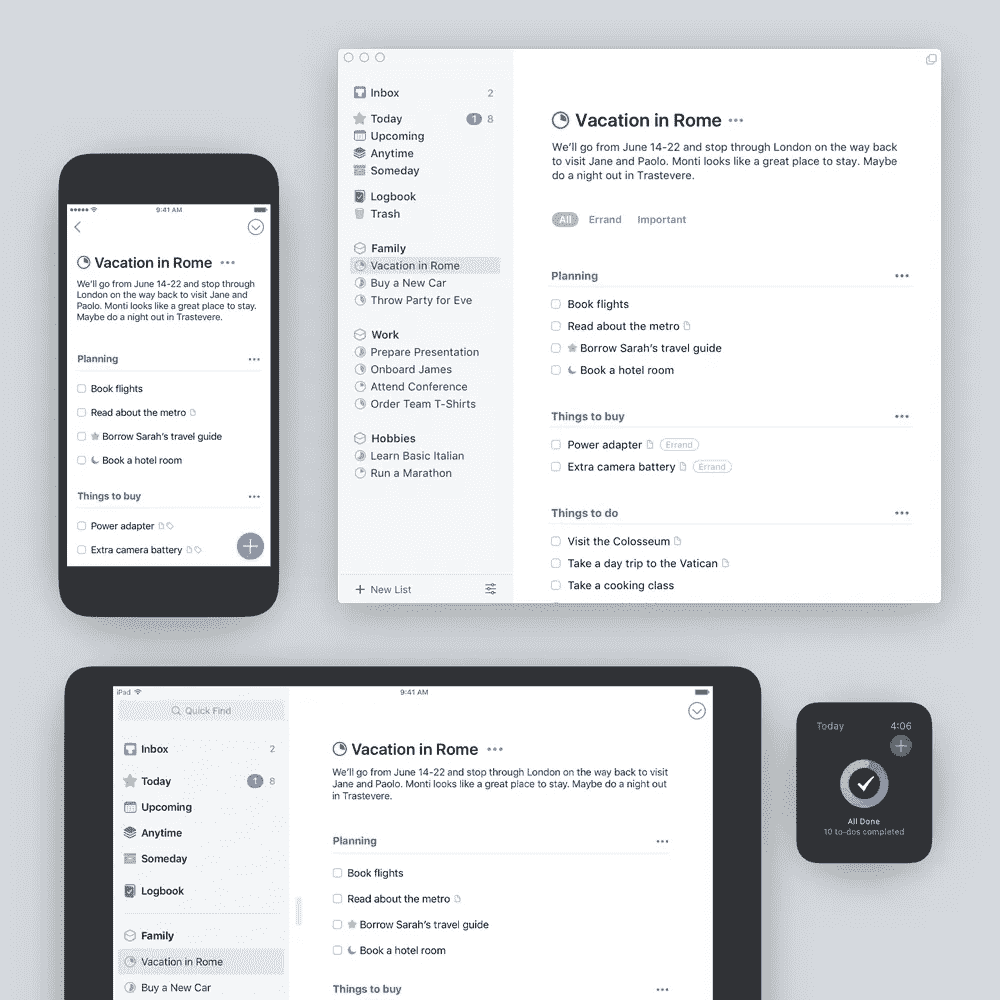
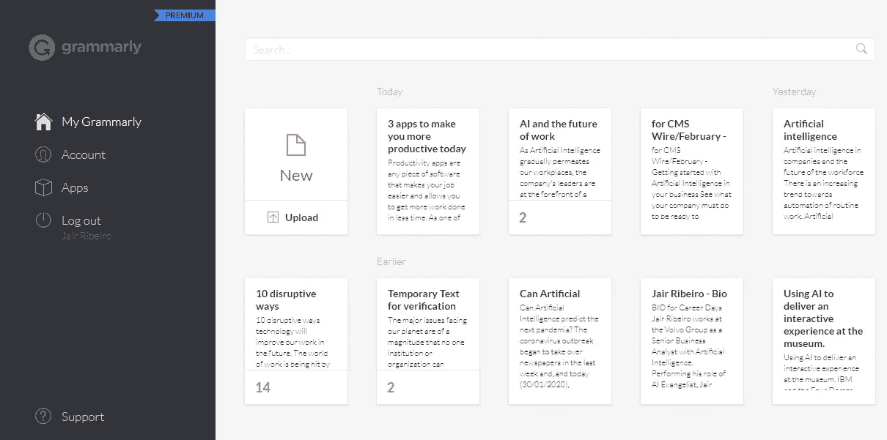

# 三款智能应用让您今天更有效率

> 原文：<https://pub.towardsai.net/3-intelligent-apps-that-make-you-more-productive-today-2e89d2e32707?source=collection_archive---------1----------------------->

## [技术](https://towardsai.net/p/category/technology)

## 这里有一个生产力应用的入门工具包，可以帮助你在更短的时间内完成更多的工作。

正如我以前在 IBM 的一位导师曾经说过的，“完成工作是一件事，但更重要的是你要按时保质完成工作，”对我来说，这曾经意味着:生产力。

我知道有成千上万的应用程序和工具可以帮助你变得更有效率。在谷歌范围内，可能有数百万篇关于生产力应用的文章。尽管如此，我还是想在这里分享这个，因为“凭经验”，我坚信它会帮助你更快更有效地完成工作。

在过去的几年里，我一直在制定一个非常密集的日常计划，试图平衡我作为三个女儿的父亲和一个相对活跃和多任务的企业专业人士的个人生活。

有一件事有助于保持我的生产力水平，那就是利用正确的技术来支持我完成每项任务。

带着这种心态，我开始使用几十个应用程序，主要是移动应用程序，它们帮助我更快更好地完成工作，让我一天中有更多的时间做我需要和喜欢做的事情。

此外，我一直遵循不同的生产哲学，总是认为我不应该做更多的事情。

毕竟，我得出的结论是，提高我的工作效率和个人生活效率的最好方法之一是从一开始就删掉那些不需要做的事情。

因此，总的来说，我的建议是不要仅仅因为应用程序和工具看起来花哨而选择它们，而是选择那些可以帮助你删除所有不必要的东西，让你专注于你最需要的东西。

首先，我从庞大的清单中挑选了三个最有用的生产力工具，给你一个快速的地址，告诉你如何提高你快速高效完成工作的能力:

# 1.日历

让我们从基础开始:如果你想节省更多的时间，更有效率，如果你想更好地集中注意力，你可能需要从智能日历应用程序开始。

我知道现在我们的智能手机上有数不清的日历，我们大多数人都对 Outlook 或谷歌日历感到满意，但这个应用程序是市场上最智能的工具之一。

日历是一个人工智能驱动的生产力应用程序，它不断从你的数据中学习，帮助你在规划你的一天、一周、一月甚至一年时节省时间和精力。作为人工智能驱动的，你使用它越多，它给你带来的价值就越多，因为它每次都会从你身上学习。

它也是协作性的，因为你可以允许任何人选择时间，并直接在应用程序中与你预订会议，让你不必担心超额预订，因为[日历](https://www.calendar.com/)会智能地保护你免受任何面板重叠的影响。

# 2.习惯——每日追踪

好的。现在你有了一个伟大而智能的日历应用程序；你可以开始创造和保持良好的生产习惯，以帮助你实现你的长期目标。

所以，下一步就是找一个日常习惯追踪 app。但是为什么它是必不可少的呢？

好吧，完美来自好习惯，有了这个应用，你可以为任何你想追踪的东西创造一个习惯。它背后的概念简单得可笑:如果你做过，就把它勾掉。

聪明地跟踪你的习惯可以改变你的生活，你会很快看到改善。

首先，你需要决定你需要跟踪的习惯，喜欢多读书或者开始每周下两次棋；也许你正在努力学习一门新的语言。

一旦你确定了想要跟踪的习惯，你甚至不需要打开应用程序就可以使用小工具来管理你的习惯。

你所要做的就是点击加号来添加一个习惯:给它一个名字，指定一个激励性的咒语来让你保持在正确的轨道上，然后设置规律性。如果你完成了，你需要向左滑动，看看你做了什么和没做什么，然后检查你做了什么。

界面是干净的和图形化的，没有令人分心的铃声和口哨声。

# 3.东西

我知道市场上有成千上万的待办应用程序，但是[的东西](https://culturedcode.com/things/)漂亮、快速、易用。

该应用程序已经完全重新构建，具有永恒的新设计、令人愉快的交互和强大的新功能。

使用[的事情](https://culturedcode.com/things/)是这样的:首先，你捕获收件箱中的任务。然后，你把你的作业分成适当的责任领域(家庭、工作、学校)或项目(重建甲板、论文)。

当它到期时，你标记是否有一个到期日和你打算什么时候完成它(一个具体的日期/任何时候/某一天)。

这利用了非常强大的今日观点。今天，您可以看到您标记为今天必需的所有任务。应该只有三个或四个，理想情况下，每天结束时，今天视图中的所有功能都标记为完成。

有些事情需要几个步骤才能完成，但不需要一个完整的项目。对于这些情况，我们现在有了清单，它可以帮助你分解待办事项的细节，并精确地列出完成它需要做的事情。

如果你想做更多的事情，你可以查看随时查看。如果你想知道接下来会发生什么，你可以选择即将发生。如果你打算做一些长期的有抱负的任务，你可以哪天去看看。

如果你想知道你已经完成了什么，你可以查看日志。当然，你可以随时检查每个责任领域或项目。

一旦你制定了早上的计划，今天的清单就是你所有日常活动的必去之地。日历事件现在与您的待办事项一起显示，给出了您的日程安排大纲。

当然，在[事物](https://culturedcode.com/things/)中的搜索和导航现在非常快，可以快速找到。你所需要做的就是在任何列表中向下滑动，并开始键入项目、待办事项或标签的名称，然后你就会立即被带到那里。

# 奖励应用程序:语法

如果你像我一样，写很多东西，可以是电子邮件、博客帖子、社交媒体帖子或任何写作，肯定你可以从我一直在使用的最令人兴奋的生产力应用程序之一中受益，该应用程序在语法上被称为。

我每天都在语法上大量使用。它会自动检测我写作中的语法、拼写、标点、用词和风格错误，并提供出色的建议来帮助我纠正错误。

[语法上](https://app.grammarly.com/)的浏览器扩展使它成为我可能使用的每个文本元素中的一个无处不在的实体，帮助我写电子邮件、博客帖子、评论等等。

该应用程序还增加了与 MS Word 和谷歌文档的集成。

# 结论

所以，就这样了！这是三个(外加奖励)顶级生产力应用程序，让你开始你的旅程。

如果你想在 2020 年变得更有生产力(谁不想呢？)，这些应用程序肯定会帮助你，就像它们帮助我用更少的时间做更多的事情一样。