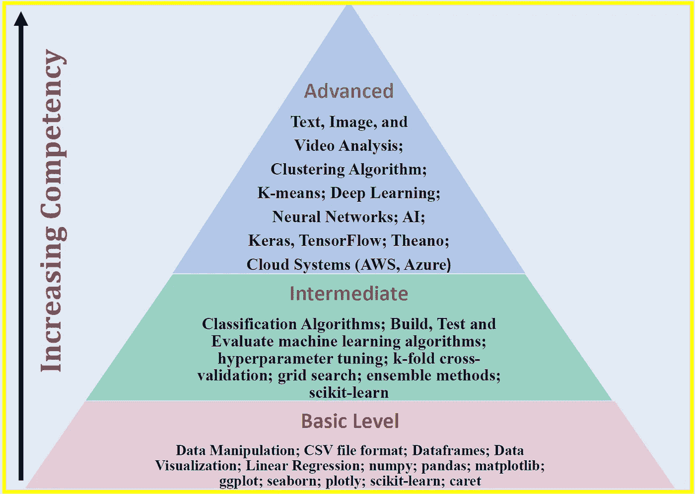

# 数据科学的 3 个层次

> 原文：<https://pub.towardsai.net/3-levels-of-data-science-5a5dbb99cfbb?source=collection_archive---------0----------------------->

Benjamin O. Tayo 的图片

## 数据科学

## 基本、中级和高级

本文将讨论我认为的数据科学能力的三个层次，即:**一级**(基础级)；**二级**(中级)；以及 l**level 3**(高级水平)。能力从 1 级提高到 3 级。我们将使用 Python 作为默认语言，尽管其他平台如 R、SAS 和 Matlab 也可以用作数据科学的编程语言。

***这里提供的观点是我的观点，基于我自己的数据科学之旅。***

# 1.基础水平

在第一级，数据科学的追求者应该能够处理通常以逗号分隔值(CSV)文件格式呈现的数据集。他们应该掌握数据基础知识；数据可视化；和线性回归。

## 1.1 数据基础

能够操作、清理、构建、缩放和设计数据。他们应该熟练使用熊猫和 NumPy 库。应具备以下能力:

*   知道如何导入和导出以 CSV 文件格式存储的数据
*   能够清理、辩论和组织数据，以便进一步分析或建模
*   能够处理数据集中缺失的值
*   理解并能够应用数据插补技术，如均值或中位数插补
*   能够处理分类数据
*   知道如何将数据集划分为训练集和测试集
*   能够使用标准化和规范化等缩放技术缩放数据
*   能够通过主成分分析(PC)等降维技术压缩数据

## 1.2.数据可视化

能够理解良好的数据可视化的基本组成部分。能够使用包括 Python 的 matplotlib 和 seaborn 包在内的数据可视化工具；以及 R 的 ggplot2 包。应该了解良好的数据可视化的基本组件:

*   **数据组件**:决定如何可视化数据的第一个重要步骤是了解数据的类型，如分类数据、离散数据、连续数据、时间序列数据等。
*   **几何组件:**您可以在这里决定哪种可视化适合您的数据，例如散点图、线形图、条形图、直方图、Q-Q 图、平滑密度、箱线图、配对图、热图等。
*   **映射组件:**这里，你需要决定用什么变量作为你的 *x 变量*，用什么变量作为你的 *y 变量*。这一点非常重要，尤其是当数据集是包含多个要素的多维数据集时。
*   **秤组件:**在这里，您可以决定使用哪种秤，例如线性秤、对数秤等。
*   **标签组件:**包括轴标签、标题、图例、使用的字体大小等。
*   **道德成分**:在这里，你要确保你的形象化讲述真实的故事。在清理、汇总、操作和生成数据可视化时，您需要意识到您的行为，并确保您没有使用您的可视化来误导或操纵您的受众。

## 1.3 监督学习(预测连续目标变量)

熟悉线性回归和其他高级回归方法。能够熟练使用 scikit-learn 和 caret 等软件包进行线性回归建模。具备以下能力:

*   能够使用 NumPy 或 Pylab 进行简单的回归分析
*   能够使用 scikit-learn 进行多元回归分析
*   了解正则化回归方法，如套索法、岭法和弹性网法
*   了解其他非参数回归方法，如 KNeighbors 回归(KNR)和支持向量回归(SVR)
*   了解评估回归模型的各种度量，如 MSE(均方误差)、MAE(平均绝对误差)和 R2 分数
*   能够比较不同的回归模型

# 2.中间能级

除了 I 级技能和能力外，还应具备以下能力:

## 2.1 监督学习(预测连续目标变量)

熟悉二进制分类算法，例如:

*   感知器分类器
*   逻辑回归分类器
*   支持向量机(SVM)
*   能够使用核 SVM 解决非线性分类问题
*   决策树分类器
*   k-最近分类器
*   朴素贝叶斯分类器
*   了解评估分类算法质量的几个指标，如准确度、精密度、灵敏度、特异性、召回率、f-l 分数、混淆矩阵、ROC 曲线。
*   能够使用 scikit-learn 建立模型

## 2.2 模型评估和超参数调整

*   能够在一个管道中结合变压器和估值器
*   能够使用 k-fold 交叉验证来评估模型性能
*   知道如何用学习和验证曲线调试分类算法
*   能够通过学习曲线诊断偏差和方差问题
*   能够解决验证曲线的过度拟合和欠拟合问题
*   知道如何通过网格搜索微调机器学习模型
*   了解如何通过网格搜索调整超参数
*   能够阅读和解释混淆矩阵
*   能够绘制和解释受试者工作特性(ROC)曲线

## 2.3 结合不同模型进行集成学习

*   能够使用不同分类器的集成方法
*   能够结合不同的算法进行分类
*   知道如何评估和调整集成分类器

# 3.优等

能够处理高级数据集，如文本、图像、语音和视频。除基本技能和中级技能外，还应具备以下能力:

*   聚类算法(无监督学习)
*   k 均值
*   深度学习
*   神经网络
*   克拉斯
*   张量流
*   Theano
*   云系统(AWS、Azure)

总之，我们已经讨论了数据科学的 3 个层次。**1 级**能力可以在 6 到 12 个月内达到。**2 级**能力可以在 7 到 18 个月内达到。**第 3 级**能力可以在 18 到 48 个月内达到。这完全取决于投入的努力量。

# 其他数据科学/机器学习资源

[数据科学最低要求:开始从事数据科学时你需要知道的 10 项基本技能](https://towardsdatascience.com/data-science-minimum-10-essential-skills-you-need-to-know-to-start-doing-data-science-e5a5a9be5991)

[数据科学课程](https://medium.com/towards-artificial-intelligence/data-science-curriculum-bf3bb6805576)

[机器学习的基本数学技能](https://medium.com/towards-artificial-intelligence/4-math-skills-for-machine-learning-12bfbc959c92)

[3 个最佳数据科学 MOOC 专业](https://medium.com/towards-artificial-intelligence/3-best-data-science-mooc-specializations-d58da382f628)

[进入数据科学的 5 个最佳学位](https://towardsdatascience.com/5-best-degrees-for-getting-into-data-science-c3eb067883b1)

[2020 年开始数据科学之旅的 5 个理由](https://towardsdatascience.com/5-reasons-why-you-should-begin-your-data-science-journey-in-2020-2b4a0a5e4239)

[数据科学的理论基础——我应该关心还是仅仅关注实践技能？](https://towardsdatascience.com/theoretical-foundations-of-data-science-should-i-care-or-simply-focus-on-hands-on-skills-c53fb0caba66)

[机器学习项目规划](https://towardsdatascience.com/machine-learning-project-planning-71bdb3a44349)

[如何组织你的数据科学项目](https://towardsdatascience.com/how-to-organize-your-data-science-project-dd6599cf000a)

[大型数据科学项目的生产力工具](https://medium.com/towards-artificial-intelligence/productivity-tools-for-large-scale-data-science-projects-64810dfbb971)

[数据科学作品集比简历更有价值](https://towardsdatascience.com/a-data-science-portfolio-is-more-valuable-than-a-resume-2d031d6ce518)

[数据科学 101 —包含 R 和 Python 代码的中型平台短期课程](https://medium.com/towards-artificial-intelligence/data-science-101-a-short-course-on-medium-platform-with-r-and-python-code-included-3cdc9d489c6d)

***如有疑问和询问，请发邮件给我***:benjaminobi@gmail.com