# 线性模型导致错误结论的 3 种方式

> 原文：<https://pub.towardsai.net/3-ways-linear-models-can-lead-to-erroneous-conclusions-842637fe122b?source=collection_archive---------0----------------------->

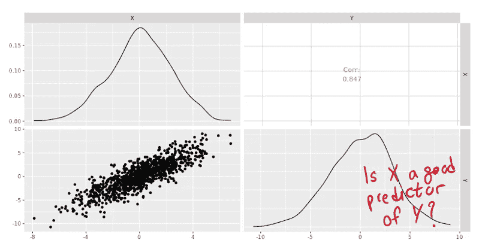

# 介绍

在本文中，我将分享线性模型导致错误结论的 3 种方式。重点是将线性模型与模拟数据进行拟合，并检查结果估计值是否与模拟值一致。

本文基于[1]的内容。

可以在这个[笔记本](https://github.com/hsm207/statrethinking-julia/blob/master/book/05_Multivariate_Linear_Models/confounding_variables.ipynb)中找到重现本文中描述的结果的代码。

# 概观

让 Y 成为我们想要建模的对象。假设我们知道 Y 由变量 X 的向量定义为 Y = β X，其中β是参数的向量，X 中的每个变量一个。

然后，我们期望线性模型能够正确估计β的值，因为 Y 和 x 之间存在线性关系。

我们将看 3 个由于混杂变量的存在而失败的例子。

# 案例 1

假设我们有 3 个随机变量 X、Y 和 Z，由以下关系定义:

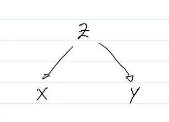

图 1: Z 是 X 和 Y 的共同原因

图 1 表示 Z 是 X 和 Y 的原因，并且 X 和 Y 是独立的。

图 1 中的数据集可能是这样的:

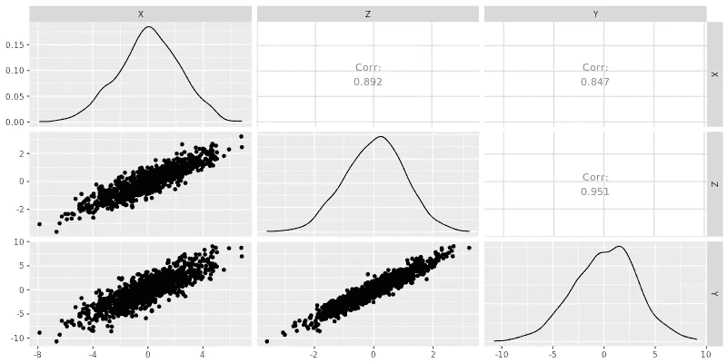

图 2:X 和 Y 实际上是独立的数据集

这是用于生成图 2 中数据集的代码:

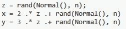

图 3:生成图 2 中数据集的代码

注意 Y = 3 Z(加上一些随机噪声)，而且根本不是 X 的函数。

试想一下，如果我们要考察影响 Y 的因素，而我们只有 X，这是用 X 回归 Y 的结果:

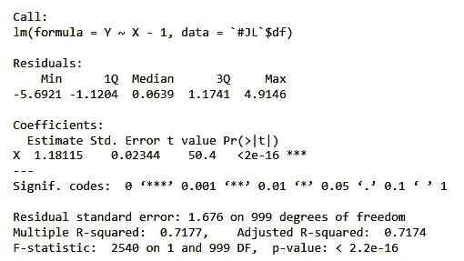

图 4:案例 1 中仅用 X 回归 Y

令人惊讶的是，我们得到了具有统计学意义的结果，并错误地得出 X 对 Y 有影响，Y = 1.18 X 的结论。

现在想象我们收集了更多的数据，也有 Z。在 X 和 Z 上回归 Y 得出:

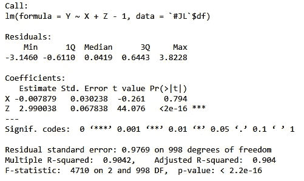

图 5:案例 1 中用 X 和 Z 回归 Y

结果与模拟数据一致，即 Y 和 X 之间没有关系，Y = 3 Z。

此示例可能表明，向线性回归模型添加更多变量总是有帮助的，因为如果存在真实变量，模型将能够识别真实关系。下一个案例将显示不同。

# 案例 2

这是一个数据集，其 X 和 Y 之间的关系为 Y = 5.5 + 4.0 X:

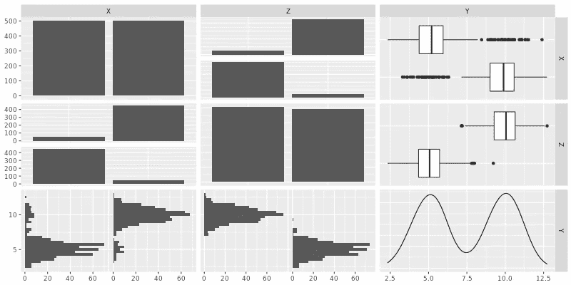

图 6:Y = 5.5+4.0 X 的数据集

注意，X 和 Z 是二进制变量(0 或 1)。

从图 6 中我们可以清楚地看到，X 和 Y 以及 Z 和 Y 之间有很强的关系。

如果我们不知道这三个变量之间的真实关系(这在现实世界中经常发生)，我们可能会试图将这两个变量包含到我们的模型中。下面是将会发生的情况:

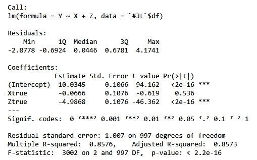

图 7:案例 2 中用 X 和 Z 回归 Y

图 7 显示 X 和 Y = 10–5z 之间没有关系。

但是如果我们用 X 回归 Y，我们会得到:

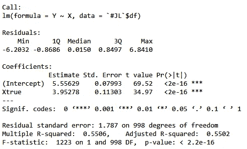

图 8:案例 2 中仅用 X 回归 Y

结果与用于模拟数据的参数相匹配！

因此，在第一种情况下，仅用 X 回归 Y 会给出不正确的结果，但在第二种情况下，它会给出正确的结果。为什么不同？

差异是由于 X、Y、z 之间的关系造成的。在情况 2 中，这三个变量之间的关系如下:

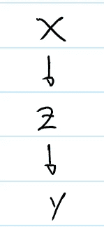

图 9:案例 2 中 X、Y 和 Z 之间的关系

图 9 显示 X 引起 Z，Z 引起 y，与图 1 相比，图 1 显示 Z 是 X 和 y 的共同原因。

先看第三种情况再下结论。

# 案例 3

考虑以下数据集:

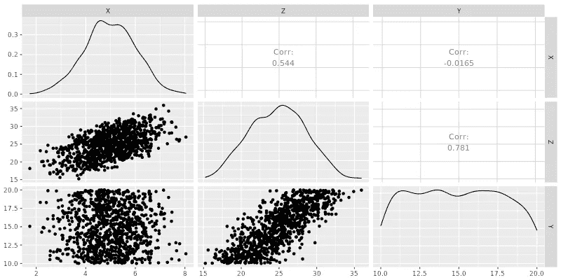

图 10:案例 3 的数据集

我们可以清楚地看到，X 和 Y 是不相关的。如果我们忽略了这个细节，继续用 X 和 Z 回归 Y，我们得到:

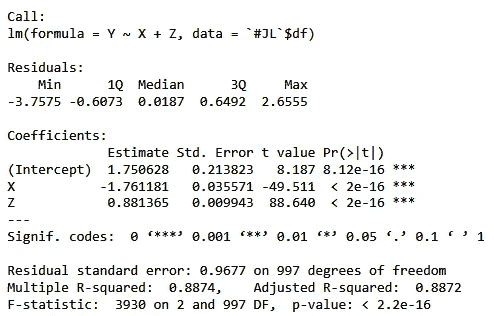

图 11:案例 3 中用 X 和 Z 回归 Y

我们会错误地得出 X 和 y 有关系的结论。

发生这种情况的原因是数据集在 X、Y 和 Z 之间具有以下关系:

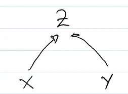

图 12:案例 3 中 X、Y 和 Z 之间的关系

图 12 表示 X 和 Y 导致 Z，特别是，在数据集中，Z 通过 Z = 2 X + Y 与 X 和 Y 相关。

所以，如果我们知道 X 和 Z，我们当然可以说一些关于 Y 的事情。但是在这种情况下，试图通过影响 X 来改变 Y 将是徒劳的。

# 经验教训

我从这些模拟中学到的是:

1.  如果你所关心的是做出准确的预测，那么只要把你能收集到的所有变量都放到你的模型中就可以了，前提是它们在推理时也是可用的。
2.  如果您计划基于模型的输出做出决策，那么您需要小心您放入模型的变量。例如，如果 X 是广告活动，Z 是网站流量，Y 是收入，假设 X 引起 Z，Z 引起 Y，用 X 和 Z 回归 Y 来评估广告活动是不正确的(见案例 2)。

那么我们如何选择正确的变量来模拟 X 和 Y 呢？

一种方法是向领域专家咨询其他变量影响 X 和 Y 的可能方式，并绘制图表来描述这些关系。然后，在该图上应用“后门路径标准”，以确定需要包含在模型中的最小变量集，从而获得 X 对 y 的影响的无偏估计。有关该方法的更多详细信息，请参考[2]。

# 结论

本文展示了线性模型给出不正确但仍具有统计意义的结果的三种方式。

值得一提的是，所讨论的 3 种关系可以组成更复杂的关系。这增加了无意中包含变量的可能性，这些变量将导致对 X 对 y 的影响的有偏估计。

我鼓励读者观看[1],它通过几个复杂而有趣的例子，用真实世界的数据证明了这个错误。

# 参考

[1] [统计学再思考 2019 冬季第 06 讲](https://www.youtube.com/watch?v=l_7yIUqWBmE&list=PLDcUM9US4XdNM4Edgs7weiyIguLSToZRI&index=6)。麦克尔瑞斯。最后访问时间是 2020 年 4 月 5 日。

[2] [借壳路径准则](https://www.coursera.org/learn/crash-course-in-causality/lecture/Af3e6/backdoor-path-criterion)。罗伊。最后访问时间是 2020 年 4 月 5 日。