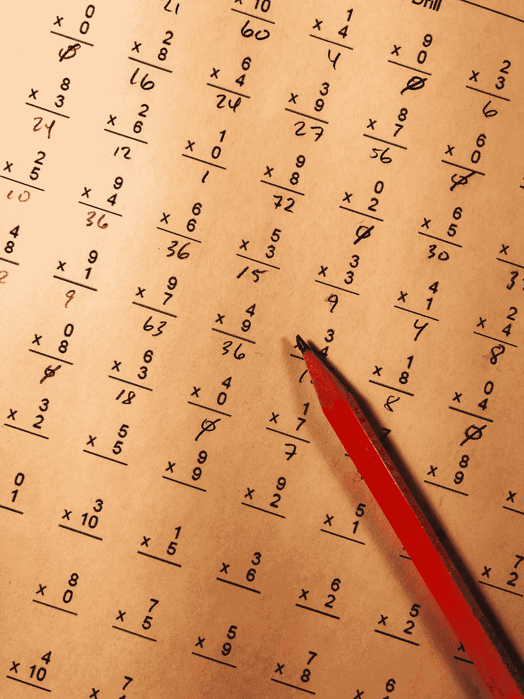

# 学习数学的三种方式让我成为更好的数据科学家

> 原文：<https://pub.towardsai.net/3-ways-studying-math-made-me-a-better-data-scientist-b82698ae116a?source=collection_archive---------1----------------------->

## [职业](https://towardsai.net/p/category/careers)、[数据科学、](https://towardsai.net/p/category/data-science)、[商业科学](https://medium.com/tag/business-science)

## 这让我对现实世界毫无准备


夏洛特·卡尔森在 [Unsplash](https://unsplash.com/s/photos/mountain-climb-woman?utm_source=unsplash&utm_medium=referral&utm_content=creditCopyText) 上的照片

顶尖的数据科学家来自各种各样的背景。有些人学习计算机科学，从第一天起就擅长编写优雅的模型来分析数据。其他人学习统计学，并利用他们使用数据的知识来回答一个结构良好的问题。当然，现在许多数据科学家实际上正在学习数据科学课程，并发展所有这些技能的交叉部分。然而，有些人和我一样，学了数学。

# 我的数据科学之旅

当我开始上大学时，我知道数学是适合我的学位课程。我一直很喜欢数学:它纯粹的逻辑和求解方程的满足感。另外，对我来说很容易。我的头脑总是很好地适应数学，我很好奇去探索更复杂的数学主题。


[罗马魔术师](https://unsplash.com/@roman_lazygeek?utm_source=medium&utm_medium=referral)在 [Unsplash](https://unsplash.com?utm_source=medium&utm_medium=referral) 上拍摄的照片

然而，我也知道，理论并不是我想要专注的职业。到了写我的硕士论文的时候，一个将数学应用于数据科学问题的机会出现了。我与一家名为 [Evo Pricing](https://evopricing.com/) 的公司合作，接受挑战，利用我的数学知识建立一个能够更准确预测销售的模型。我被迷住了，从那以后，我一直在 Evo 公司担任数据科学家。

学习数学让我获得了广泛的技能，帮助我迅速适应了作为数据科学家的实际工作，但也有一些深刻的差距，我必须努力工作才能取得成功。我对我的数据科学家职业充满热情，我认为我的数学背景为我每天所做的事情奠定了坚实的基础。然而，事后看来，关于我的大学经历，有几件事我会改变。有抱负的数据科学家可以从我的经历中学习，毕业后为现实世界做更好的准备。

# 1.我学会了如何思考问题

在我的大学里，数学专业有一门以理论为中心的课程。我们不仅仅学习计算；我们花了相当大一部分时间来研究定理的证明。这些证明听起来可能在学术界之外没有实际应用，但事实恰恰相反。

当你完成[一个证明](https://www.livescience.com/46254-proof-theorem-axiom.html)的时候，你在用[演绎推理](https://en.wikipedia.org/wiki/Deductive_reasoning)建立一个逻辑确定性。“合理预期”或较低的举证责任是不够的。相反，你必须证明你的陈述不只是在几个关键的例子中成立，而是在所有可能的情况下成立。

这个过程显然教会了你计算背后的概念，但更重要的是,[向你展示了如何通过一个问题进行推理。我可以将演绎推理的原则应用于任何一组数据，并找到一个合理的、有充分支持的解决方案。作为一名数据科学家，这种能力对成功至关重要。虽然许多数据科学家都很难看清数字的全貌，但数学专业的学生并没有被这一挑战吓倒。从我们的学术生涯开始，我们就是这样被训练的。](https://people.math.sc.edu/cooper/proofs.pdf)


照片由[Olav Ahrens rtne](https://unsplash.com/@olav_ahrens?utm_source=medium&utm_medium=referral)在 [Unsplash](https://unsplash.com?utm_source=medium&utm_medium=referral) 上拍摄

# …但是我并没有经常将这种技能应用到现实生活中的问题上

当然，正式的数学证明能教给你的东西是有限的。当我毕业的时候，我几乎可以在睡梦中背诵[2–√2 非理性证明](https://www.math.utah.edu/~pa/math/q1.html#:~:text=Specifically%2C%20the%20Greeks%20discovered%20that,root%20of%202%20is%20irrational!)。然而，我还没有做好充分的准备，将我的推理扩展到更具体的应用问题上。

当我刚开始作为数据科学家的职业生涯时，我有时会努力最有效地构建问题，并找出哪些数据最能为我提供对客户希望解决的问题的见解。我不得不一边走一边学习统计学和纯数学之间的微妙差异。事后看来，我希望我在大学时学了更多的统计学课程。我会更容易理解商业世界所需的推理——以及*如何开发一个旨在解决实际问题的模型，而不是一个理论方程。*

如今，我可能会从发现如何不用文字证明无理数定理的知识中受益，但我怀疑我能否这么快地复制数学。我能做的是巧妙地评估一个宽泛的问题，并创建一个数学模型来分析数据，找到一个最佳解决方案。作为一名数据科学家，这最终会更好地为我服务。

# 2.我成了数字专家

最重要的是，数学专业的学生学习完成极其复杂的计算。我们开始习惯使用完整的计算和函数。我仍然最喜欢面对一页数字，寻找模式，评估数据之间的关系。

在大学里，我们经常借助技术来做这件事，但作为一名数据科学家，我有更多的工具来帮助我钻研这些数字。作为一名数据科学家，无论你在什么样的公司工作，你都必须适应日复一日与数字打交道。学数学也是如此。一切都取决于数字[。那样的话，我的职业生涯从学生时代到现在也没有太大变化。](https://www.discovermagazine.com/the-sciences/everything-in-the-universe-is-made-of-math-including-you)



克里斯·利维拉尼在 [Unsplash](https://unsplash.com?utm_source=medium&utm_medium=referral) 上的照片

# …但我缺乏编程技能，无法将这些数字应用于各种情况

然而，数据科学不仅仅是数字。你需要了解如何创建算法来操纵它们，并分析数据中的模式。这需要编码。虽然我可能已经学习了算法背后的理论，并知道如何编写和编辑基本代码，但我从未深入研究过任何编码语言。

在我作为一名数据科学家的早期，这种知识差距是一场需要克服的斗争。如果我能回到过去，改变我现在的大学经历，我会增加更多的编程课程。如今，许多数学学位要求更多的编程课程作为课程的一部分，然而我认为这仍然是[经常不足](https://www.bls.gov/spotlight/2017/science-technology-engineering-and-mathematics-stem-occupations-past-present-and-future/home.htm)。如果你有兴趣成为一名数据科学家(或者在学习数学后从事学术以外的任何职业)，你必须致力于[学习如何编写好](https://www.theatlantic.com/technology/archive/2015/09/you-dont-have-to-be-good-at-math-to-learn-to-code/403342/)代码。

# 3.我学会了精确地分析

在数学中，精确是最重要的。在解方程的时候，没有“T8”和“T9”足够接近。一个逻辑上的瑕疵就能使你的整个证明无效，或者毁掉你的整个计算。我学会了在每次分析中尽可能精确，从不偷工减料。任何不足都会导致失败。

作为一名数据科学家，这种对精确性的渴望很适合我。我们从未停止为客户提供更准确、更易于应用的建议。虽然有些人可能满足于模型提供高于平均水平的准确性和显著的性能提升，但我的数学背景意味着我永远不会满足于“足够好”。我一直在努力达到更高的精确度。无论是改进我们收集和使用数据的方式，还是进行分析，我总是在寻找额外的准确性。


由[万花筒](https://unsplash.com/@kaleidico?utm_source=medium&utm_medium=referral)在 [Unsplash](https://unsplash.com?utm_source=medium&utm_medium=referral) 上拍摄的照片

# …但是商业分析需要不同于数学的思维方式

不幸的是，数据科学中的问题并不总能 100%确定地解决。虽然数学证明很优雅，最终有一个干净的解决方案，但作为一名数据科学家，你试图解决的问题很少有完全可靠的答案。

例如，我在 Evo 最早的工作是开发一个模型，在商店需要产品的准确时间获得产品的准确数量。我们开发了一个令人难以置信的精确模型——根据商店经理的输入，平均库存效率为 [94%,比传统补货系统增加了+25%](https://www.hbs.edu/faculty/pages/item.aspx?num=55823)——但它永远不会实现 100%预测准确率的完美分配。用现有的工具是不可能的。

*需要调整以证据为导向的心态，才能在* [*不完美的商业世界*](https://medium.com/datadriveninvestor/4-critical-data-science-skills-you-arent-learning-at-university-3c49797df948) 中变得更加自在。我的数学学位并没有让我为我们必须做出的那种推论做好准备，从而为我们的客户创造一个实用的建议。学习数学可能没有让我对现实世界中我们如何计算成功做好充分准备，但它确实很好地磨练了我的直觉。即使我们可能无法达到完美，我们也可以一直朝着完美的方向努力。

# 作为一名拥有数学学位的数据科学家，你也可以成就一番伟大的事业


布鲁斯·马尔斯在 [Unsplash](https://unsplash.com?utm_source=medium&utm_medium=referral) 上拍摄的照片

*如果你正在学习数学，你正在为成为一名成功的数据科学家打下坚实的基础*。在 Evo，我的很多队友都有数学背景，包括 Evo [的](https://www.linkedin.com/in/fabrizio-fantini/)[CEO Fabrizio Fantini](https://towardsdatascience.com/@fabrizioevo)，他的数学博士论文后来成为我们工作的[基础。学习数学让我成为了一名更好的数据科学家，我一秒都不后悔我的学位。](https://blogs.nvidia.com/blog/2020/02/17/evo-ai-fashion-forward/)

但是，你必须小心不要犯和我一样的错误。用编程、统计和我缺乏的理论课程来充实你的数学学位。当你在现实世界中申请数据科学工作时，你将处于领先地位，并开始在我们的领域中尽你所能。

**想从 Evo 阅读所有关于数据科学的内容吗？**

[](https://towardsdatascience.com/fashion-is-broken-science-is-fixing-it-b771b1ab5b59) [## 时尚被打破了。科学正在修复它

### 转变 5 个核心时尚流程

towardsdatascience.com](https://towardsdatascience.com/fashion-is-broken-science-is-fixing-it-b771b1ab5b59) [](https://towardsdatascience.com/expensive-data-science-mistakes-when-your-kpis-lie-ca3df94333dd) [## 代价高昂的数据科学错误:当你的 KPI 撒谎时

### 商业科学必须是自主的，而不仅仅是科学

towardsdatascience.com](https://towardsdatascience.com/expensive-data-science-mistakes-when-your-kpis-lie-ca3df94333dd) 

```
To get Business Science software, University-level learning (launching October 2020), and a monthly summary of insights:[Free registration](https://evouser.com/register)Any questions? Please follow Evo and reach out on [Linkedin](https://www.linkedin.com/company/evo-pricing)
```