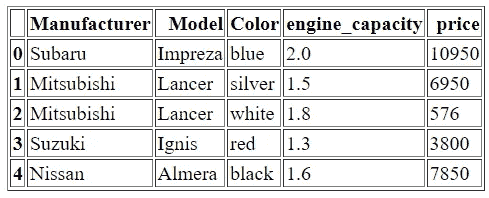
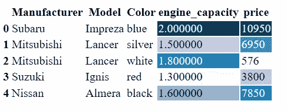
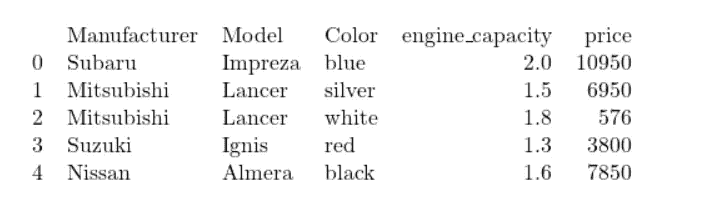

# 呈现熊猫数据帧的 3 种方法

> 原文：<https://pub.towardsai.net/3-ways-to-render-pandas-dataframes-88ecf4a5ad7f?source=collection_archive---------0----------------------->

## [数据科学](https://towardsai.net/p/category/data-science)

## 即时文档实用指南


照片由[思想目录](https://unsplash.com/@thoughtcatalog?utm_source=unsplash&utm_medium=referral&utm_content=creditCopyText)在 [Unsplash](https://unsplash.com/s/photos/read?utm_source=unsplash&utm_medium=referral&utm_content=creditCopyText) 上拍摄

系统读取文件，而人类读取文档。我们记录的故事越多，协作分析就越多。

数据框架是分析的关键结构。在解决问题的过程中，他们掌握着在几个阶段支持关键决策的关键数据。通常，决策涉及多个利益相关方，他们需要查看这些数据框中保存的数据。

作为一名优秀的数据科学家和程序员，我们不应该用调试环境的屏幕来轰炸决策面板。相反，我们应该以更直观的方式呈现关键数据，以便人们查看和理解。

> 这篇文章是写给有经验的数据科学家的，他们更喜欢把他们的分析解释成商业故事，而不是一连串的术语。

在构建应用程序的人机界面时，呈现与构建系统界面时的序列化一样重要。Pandas Dataframe 支持以下三种最流行的在线和离线文档语言。

*   超文本标记语言
*   乳胶和
*   降价

决策制定小组可以查看转换到其本地文档环境的数据框值，而无需任何环境转换。

让我们来看一个例子，看看如何将数据框呈现为每种格式，以及输出在各自的文档查看器中是什么样子。

## 初始化数据帧

导入熊猫并用示例值初始化数据框。

```
import pandas as pddf = pd.DataFrame({
"Manufacturer":['Subaru', 'Mitsubishi', 'Mitsubishi', 'Suzuki','Nissan'],
"Model": ['Impreza','Lancer','Lancer','Ignis','Almera'],
"Color": ['blue','silver','white','red','black'],
"engine_capacity": [2,1.5,1.8,1.3,1.6],
"price": [10950,6950,576,3800,7850]})
```

*【数据集引用:*[*https://www.kaggle.com/lepchenkov/usedcarscatalog*](https://www.kaggle.com/lepchenkov/usedcarscatalog)】

## 1.HTML 呈现

I)运行 Dataframe 的 *to_html()* 方法。

```
htmlCode = df.to_html()
```

ii)该方法生成以下 HTML 代码

```
<table border="1" class="dataframe">
  <thead>
    <tr style="text-align: right;">
      <th></th>
      <th>Manufacturer</th>
      <th>Model</th>
      <th>Color</th>
      <th>engine_capacity</th>
      <th>price</th>
    </tr>
  </thead>
  <tbody>
    <tr>
      <th>0</th>
      <td>Subaru</td>
      <td>Impreza</td>
      <td>blue</td>
      <td>2.0</td>
      <td>10950</td>
    </tr>
    <tr>
      <th>1</th>
      <td>Mitsubishi</td>
      <td>Lancer</td>
      <td>silver</td>
      <td>1.5</td>
      <td>6950</td>
    </tr>
    <tr>
      <th>2</th>
      <td>Mitsubishi</td>
      <td>Lancer</td>
      <td>white</td>
      <td>1.8</td>
      <td>576</td>
    </tr>
    <tr>
      <th>3</th>
      <td>Suzuki</td>
      <td>Ignis</td>
      <td>red</td>
      <td>1.3</td>
      <td>3800</td>
    </tr>
    <tr>
      <th>4</th>
      <td>Nissan</td>
      <td>Almera</td>
      <td>black</td>
      <td>1.6</td>
      <td>7850</td>
    </tr>
  </tbody>
</table>
```

iii)将此输出写入文件。

```
file = open("output/df.html","w")
file.write(htmlCode)
file.close()
```

iv)在 web 浏览器中打开 output/df.html 文件。



作者图片

v)为了让读者更直观，你可以进一步增加 HTML 表格的样式

```
styler = df.style
styler = styler.background_gradient()
htmlCodeWithStyle = styler.to_html()
```

vi)它生成 HTML 代码以及样式信息。

```
<style type="text/css">
#T_775bd_row0_col3, #T_775bd_row0_col4 {
  background-color: #023858;
  color: #f1f1f1;
}
....
</style>
<table id="T_775bd_">
  <thead>
    <tr>
      <th class="blank level0" >&nbsp;</th>
      <th class="col_heading level0 col0" >Manufacturer</th>
...
    </tr>
  </thead>
  <tbody>
...   
  </tbody>
</table>
```

vii)将这段 HTML 代码写入另一个文件

```
file = open("output/df2.html","w")
file.write(htmlCodeWithStyle)
file.close()
```

viii)您应该会在网络浏览器中看到下表



作者图片

## 2.乳胶渲染

I)运行 Dataframe 的 *to_latex(* )方法。

```
latexCode = df.to_latex()
```

ii)它生成以下 latex 代码。

```
\begin{tabular}{llllrr}
\toprule
{} & Manufacturer &    Model &   Color &  engine\_capacity &  price \\
\midrule
0 &       Subaru &  Impreza &    blue &              2.0 &  10950 \\
1 &   Mitsubishi &   Lancer &  silver &              1.5 &   6950 \\
2 &   Mitsubishi &   Lancer &   white &              1.8 &    576 \\
3 &       Suzuki &    Ignis &     red &              1.3 &   3800 \\
4 &       Nissan &   Almera &   black &              1.6 &   7850 \\
\bottomrule
\end{tabular}
```

iii)将此输出写入 latex 文件

```
file = open("output/df.tex","w")
file.write(latexCode)
file.close()
```

iv)在 LaTeX 浏览器中打开 *df.tex* 并查看输出图像。



作者图片

如果你目前没有本地浏览器，你可以使用一些在线浏览器，比如 https://quicklatex.com/的

## 3.降价渲染

I)运行 DataFrame 的 *to_markdown()* 方法

```
mdCode = df.to_markdown()
```

ii)它生成以下降价代码

```
|    | Manufacturer   | Model   | Color   |   engine_capacity |   price |
|---:|:---------------|:--------|:--------|------------------:|--------:|
|  0 | Subaru         | Impreza | blue    |               2   |   10950 |
|  1 | Mitsubishi     | Lancer  | silver  |               1.5 |    6950 |
|  2 | Mitsubishi     | Lancer  | white   |               1.8 |     576 |
|  3 | Suzuki         | Ignis   | red     |               1.3 |    3800 |
|  4 | Nissan         | Almera  | black   |               1.6 |    7850 |
```

iii)将此代码写入一个 md 文件。

```
file = open("output/df.md","w")
file.write(mdCode)
file.close()
```

iv)在您最喜欢的浏览器中打开这个降价文件。我用的是 Visual Studio 代码。


作者图片

## 结论

数据框架对于支持与分析过程相关的关键决策至关重要。渲染对于使这些决策在利益相关者之间更加协作非常重要。Pandas DataFrame 支持三种最流行的文档语言——HTML、LaTeX 和 Markdown。我们用一个例子做了一个渲染练习，涵盖了所有这些格式。就是这样！我们现在已经准备好向企业讲述关于我们的数据分析的即时、翔实和有趣的故事。我们结束了👏 👏。