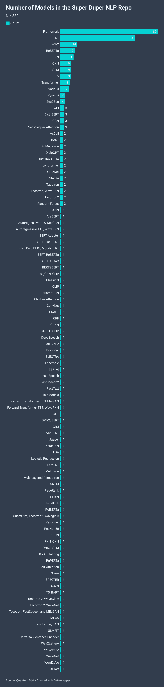
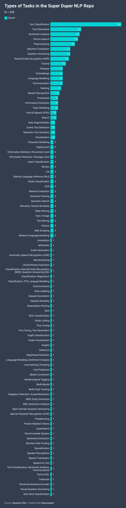

# 300 台 NLP 笔记本和自由

> 原文：<https://pub.towardsai.net/300-nlp-notebooks-and-freedom-26e2b9d5d29a?source=collection_archive---------0----------------------->

谁是德尼罗？ on [Unsplash](https://unsplash.com?utm_source=medium&utm_medium=referral)

## 超级 Duper NLP Repo 中 Colab 笔记本的状态

## 或者:我是如何学会不再担心并热爱代码的

嘿，欢迎回来！这可能是一个很好的时间带你进入兔子洞关于[超级骗子 NLP 回购](http://notebooks.quantumstat.com) (SDNR)的状态😎。

 [## 超级骗子 NLP 回购

### 适用于 NLP - Quantum Stat 中各种任务的 Colab 笔记本

notebooks.quantumstat.com](https://notebooks.quantumstat.com) 

如果这是您第一次听说 SDNR，它是一个方便的存储库，包含 300 多个专注于自然语言处理(NLP)的 Colab 笔记本(还在增加)。Colab 本质上是一个 Jupyter 笔记本，人们可以通过基于网络的内核来使用和共享。这些笔记本最好的部分是，你可以使用免费的 GPU，通常是 K80 或 T4 甚至 TPU(如果你觉得危险)来微调你的 NLP 模型。如果你正在寻找关于 Colab 的介绍，你可以在这里观看这个视频:

许多开发人员，不管他们是来自大型科技公司还是初创公司，都使用 Colab 笔记本来简要介绍他们的 GitHub 库，并让开发社区了解他们的软件。鉴于 NLP 在过去几年里已经膨胀到了一个巨大的高度，我开始给每个人的笔记本做索引，部分原因是我认为我是一个秘密忍者，但也是因为这使得在学习是什么在驱动 NLP 行业的同时更容易进行动态的 DNNs 实验。🐱‍👤

# 引擎盖下是什么📈

SDNR 收集的代码因 NLP 任务的不同而不同。可能令人惊讶的是，我们最常见的笔记本类型是关于框架的，通常涉及教程或对库的介绍，而不一定是关于生活在芝麻街上的单个 NLP 深度学习模型。

框架教程的范围可以从简单的开始，如使用 NLTK 的“[单词包](https://colab.research.google.com/github/practical-nlp/practical-nlp/blob/master/Ch3/02_Bag_of_Words.ipynb?authuser=1)”，到更高级的主题，如“ [TensorFlow 2.0 +深度学习研究人员的 Keras 概述](https://colab.research.google.com/drive/1UCJt8EYjlzCs1H1d1X0iDGYJsHKwu-NO)

在框架之后，模型列表由 NLP 中的常见嫌疑人以及新的初次登场者组成，例如剪辑和语音相关笔记本中的多模态模型。看看它的尾巴👇

# 任务

那么 SDNR 涵盖了什么样的 NLP 任务呢？负责发行的任务并不意外。分类、文本生成、质量保证和 NER 都在前 10 名，但是和往常一样，尾部是所有活动的地方。这是最新技术所在的地方，也是在野外最难找到的地方，例如零射击分类、语义解析和图形神经网络(GNNs)等任务。

看看我今天在写这篇文章时发现的这个笔记本。它是由句子变形金刚的创作者尼尔斯·雷默斯转发的。这是一个多语言的剪辑🤟🤟：

 [## 谷歌联合实验室

### 编辑描述

colab.research.google.com](https://colab.research.google.com/drive/1N6woBKL4dzYsHboDNqtv-8gjZglKOZcn?usp=sharing) 

反正现在你知道超级骗子 NLP 回购的来龙去脉了！我要感谢所有继续推动人工智能边界并帮助传播这一新兴技术福音的贡献者。如果你有一个目前在回购中找不到的 NLP 笔记本，你可以随时点击 SDNR 网页上的联系按钮，或者在 [Twitter](https://twitter.com/Quantum_Stat) 上，把你的笔记本发送给我们！

请务必在媒体上关注我们的每周简讯 **NLP Cypher** 每周日发送。您也可以在我们的[网站](https://quantumstat.com)注册，获得时事通讯电子邮件提醒。

在那之前，星期天和你谈😎。

—里基·科斯塔|埃尔·杰菲|量子统计