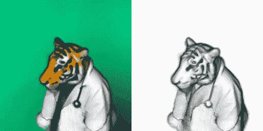
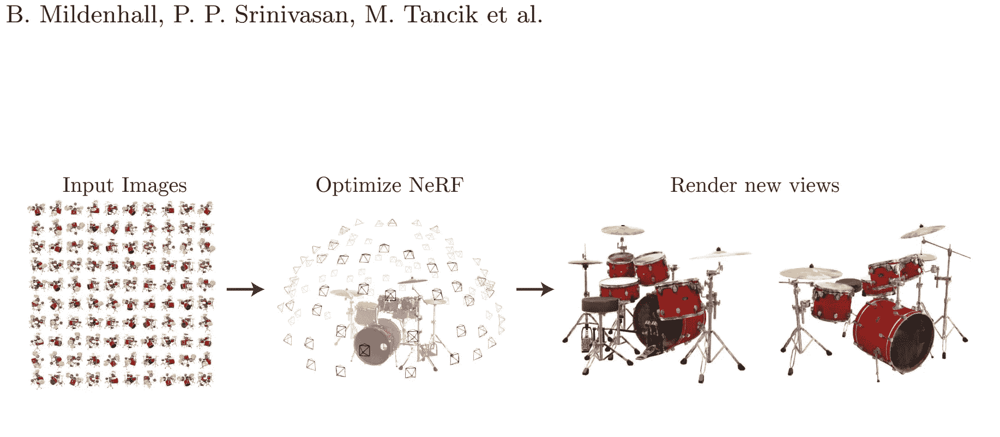
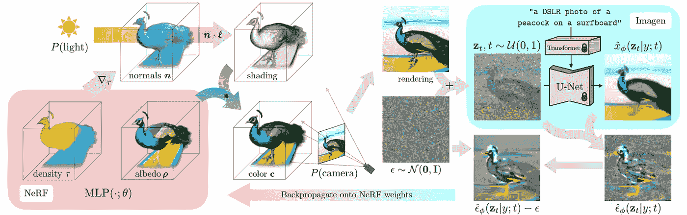
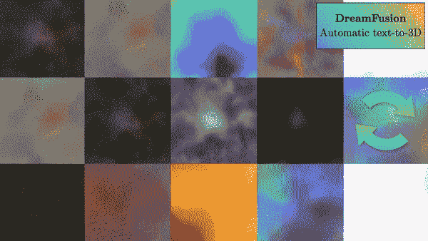

# 来自文本的 3D 模型！

> 原文：<https://pub.towardsai.net/3d-models-from-text-762673fa1fec?source=collection_archive---------2----------------------->

## DreamFusion 解释

> 最初发表于 [louisbouchard.ai](https://www.louisbouchard.ai/dreamfusion/) ，前两天在[我的博客上读到的！](https://www.louisbouchard.ai/dreamfusion/)

## 观看视频

我们已经看到模型能够接受一个句子，然后[生成图像](https://youtu.be/RGBNdD3Wn-g)。

然后，其他[方法通过学习特定的概念，如物体或特定的风格，来处理生成的图像](https://youtu.be/f3oXa7_SYek)。

上周 Meta 发布了我报道过的 [Make-A-Video model](https://youtu.be/MWwESVyHWto) ，它允许你从一个文本句子生成一个短视频。结果还不完美，但自去年以来我们在该领域取得的进展令人难以置信。

本周我们又向前迈进了一步。

这是 DreamFusion，一个新的谷歌研究模型，它可以理解一个句子，足以生成它的 3D 模型。

你可以将此视为一个 [DALLE](https://youtu.be/rdGVbPI42sA) 或[稳定扩散](https://youtu.be/RGBNdD3Wn-g)但在 3D 中。

多酷啊。！我们真的不能让它变得更酷。

但更令人着迷的是它是如何工作的。让我们深入研究一下。

[……]一只扮成医生的老虎。使用 DreamFusion 生成的 3D 模型。

如果你一直在关注我的工作，DreamFusion 相当简单。

它基本上使用了我已经介绍过的两个模型: [NeRFs](https://youtu.be/88Pl9zD1Z78) 和一个文本到图像模型。在他们的例子中，它是 [Imagen 模型](https://youtu.be/qhtYPhPWCsI)，但是任何模型都可以，比如稳定扩散。

如你所知，如果你是一个好学生，并且看过前面的视频，NeRFs 是一种用于渲染 3D 场景的模型，通过从一个或多个对象图像中生成神经辐射场。

NeRF 方法。图片来自 NeRF [论文](https://arxiv.org/pdf/2003.08934.pdf)。

但是，如果 NeRF 模型只适用于图像，那么如何从文本生成 3D 渲染呢？

嗯，我们使用 Imagen，另一个人工智能，从想要的文本中生成图像变体！

为什么我们要这样做，而不是直接从文本中生成 3D 模型？因为它需要巨大的 3D 数据集以及相关的标题来训练我们的模型，这是非常困难的。相反，我们使用一个预训练的文本到图像的模型，收集更简单的数据，并使其适应 3D！所以它不需要任何 3D 数据来训练，只需要一个预先存在的人工智能来生成图像！当我们以不同的方式解释问题时，我们可以为这样的新任务重用强大的技术，这真的很酷。

所以如果我们从头开始:我们有一个 NeRF 模型。

方法概述。图片来自 DreamFusion 论文。

正如我在以前的视频中解释的那样，这种类型的模型通过图像来预测每个新视图中的像素，通过从具有不同视点的同一对象的图像对中学习来创建 3D 模型。在我们的例子中，我们不直接从图像开始。我们从文本开始，对我们想要生成的随机视图方向进行采样。基本上，我们试图通过生成相机可以覆盖的所有可能角度的图像，环视物体，并猜测像素的颜色、密度、光反射等来创建 3D 模型。让它看起来真实所需的一切。

因此，我们从一个标题开始，并根据我们想要生成的随机摄像机视点对其进行小的调整。例如，我们可能想要生成一个前视图，以便将“前视图”附加到标题上。

另一方面，我们使用相同的角度和相机参数为我们的初始，未经训练，NeRF 模型来预测第一次渲染。

然后，我们使用 Imagen(我们预训练的文本到图像模型)根据我们的标题和初始渲染生成一个图像版本，如果你想知道它是如何做到的，我在我的 Imagen 视频中进一步解释了这一点。

因此，我们的 Imagen 模型将由文本输入以及添加了噪声的对象的当前渲染来指导。这里，我们添加噪声，因为这是 Imagen 模型可以接受的输入。它需要成为它所理解的噪声分布的一部分。然后，我们使用该模型生成更高质量的图像。添加用于生成它的图像，并删除我们手动添加的噪声，以使用该结果来指导和改进我们的 NeRF 模型，以进行下一步。

我们这样做是为了更好地理解 NeRF 模型应该将注意力集中在图像中的什么地方，以便在下一步中产生更好的结果。

我们重复这一切，直到三维模型足够令人满意！

然后，您可以将该模型导出到网格，并在您选择的场景中使用它！

在你们中的一些人问之前，不，你不必重新训练图像生成器模型——正如他们在论文中说得很好的那样:它只是充当预测图像空间编辑的冷冻评论家。

瞧！

这就是 DreamFusion 如何从文本输入生成 3D 渲染。如果你想对这种方法有更深入的了解，可以看看我关于 NeRFs 和 Imagen 的视频。我也邀请你阅读他们的论文，以获得更多关于这种特定方法的细节。

谢谢你看完整篇文章。我邀请您也观看文章顶部的视频，以查看更多示例！下周我会带着另一篇精彩的论文来看你！

## 参考

阅读全文:[https://www.louisbouchard.ai/dreamfusion/](https://www.louisbouchard.ai/dreamfusion/)T2【Poole，b .，Jain，a .，Barron，J.T .和 Mildenhall，b .，2022。DreamFusion:使用 2D 扩散将文本转换为 3D。arXiv 预印本 arXiv:2209.14988。
项目网站:【https://dreamfusion3d.github.io/】T4我的时事通讯(一个新的人工智能应用每周向你的电子邮件解释！):[https://www.louisbouchard.ai/newsletter/](https://www.louisbouchard.ai/newsletter/)