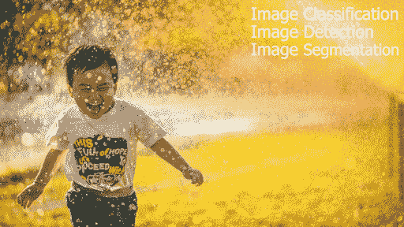
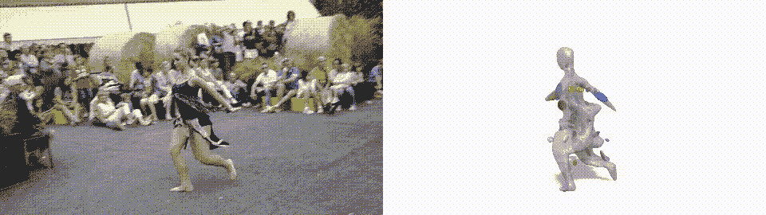
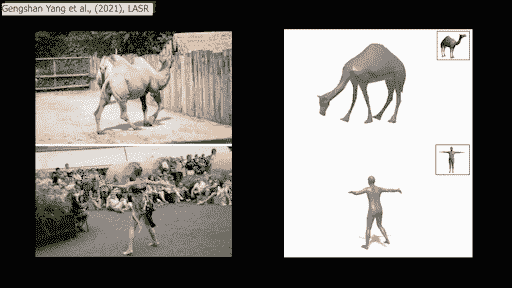
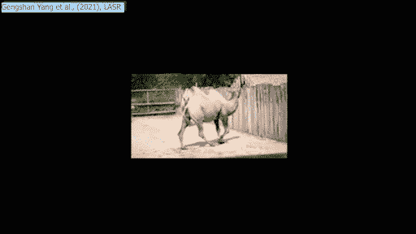
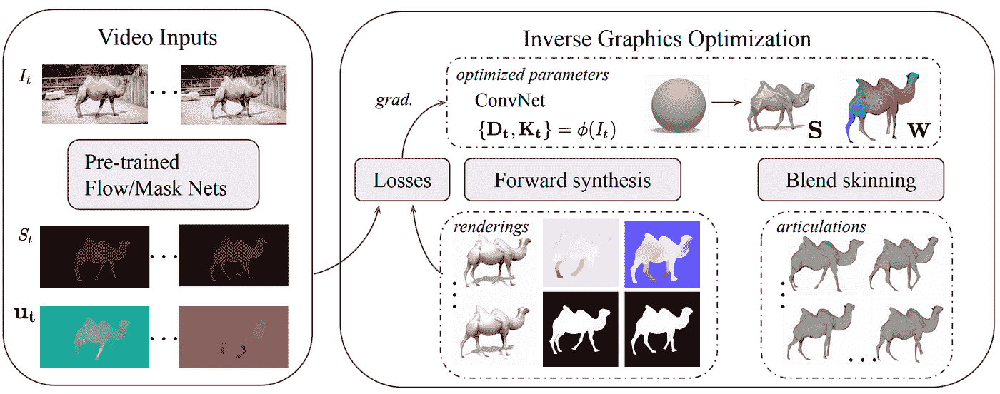
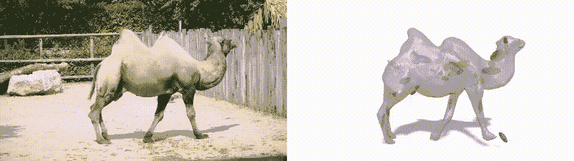

# 视频三维重建:LASR

> 原文：<https://pub.towardsai.net/3d-reconstruction-from-videos-lasr-c29459399aed?source=collection_archive---------2----------------------->

## [计算机视觉](https://towardsai.net/p/category/computer-vision)

## 仅通过短视频作为输入，生成人类或动物运动的 3D 模型。

> 原载于 [louisbouchard.ai](https://www.louisbouchard.ai/3d-reconstruction-from-videos) ，前两天在[我的博客](https://www.louisbouchard.ai/3d-reconstruction-from-videos)上看到的！

机器理解一幅图像有多难？研究人员在图像分类、图像检测和图像分割方面取得了很多进展。这三项任务不断加深我们对图像中发生的事情的理解。同样的顺序，分类告诉我们图像里有什么。检测告诉我们它大概在哪里，分割精确地告诉我们它在哪里。

现在，一个更复杂的步骤是在现实世界中表现这个图像。换句话说，它将把从图像或视频中获取的对象表示到 3D 表面中，就像 GANverse3D 可以对无生命的对象所做的那样，正如我在最近的一个视频中展示的那样。这表明了模型对图像或视频的深刻理解，代表了对象的完整形状，这就是为什么它是如此复杂的任务。

更具挑战性的是在非刚性形状上做同样的事情。或者说，在人类和动物身上，可以怪异造型甚至变形到一定程度的物体。

这种基于视频或图像生成 3D 模型的任务被称为 3D 重建，谷歌研究院和卡耐基梅隆大学刚刚发表了一篇名为 LASR:从单目视频中学习关节形状重建的论文。

3D 重建示例。[耿善阳等，(2021)](https://lasr-google.github.io/)

顾名思义，这是一种仅从短视频作为输入来生成人类或动物运动的 3D 模型的新方法。事实上，它知道这是一个奇怪的形状，它可以移动，但仍然需要保持连接，因为这仍然是一个“对象”，而不仅仅是许多对象在一起。

典型地，3D 建模技术需要预先的数据。在这种情况下，先前的数据是复杂物体的近似形状，看起来像这样…正如你所看到的，它必须与实际的人或动物非常相似，这不是很聪明。有了 LASR，你可以产生更好的结果。在没有任何先验的情况下，无论物体是什么，它都是从一个简单的球体开始重建的。你可以想象这对概化意味着什么，当你不需要明确地告诉网络对象是什么和它“典型地”是什么样子时，这将是多么强大。这是向前迈出的重要一步！

但是它是如何工作的呢？就像我说的，它只需要一个视频，但仍然有一些预处理步骤要做。别担心。这些步骤在计算机视觉中非常容易理解。您可能还记得，我在视频开头提到过图像分割。我们需要这种对象的分割，可以使用训练过的神经网络很容易地完成。

然后，我们需要每一帧的光流，这是视频连续帧之间的物体运动。这也很容易使用计算机视觉技术发现，并通过神经网络进行改进，就像我一年前在我的频道上报道的那样。

他们从一个球体开始渲染过程，假设它是一个刚性物体，因此是一个没有关节的物体。根据这一假设，他们在 20 个时期内反复优化模型的形状和相机视点理解。这里显示的刚性假设是骨骼的数量等于零，这意味着没有任何东西可以单独移动。然后，我们回到现实生活，在现实生活中，人是不僵化的。现在，目标是有一个精确的三维模型，可以逼真地移动。这是通过增加骨骼和顶点的数量来使模型越来越精确来实现的。这里的顶点是三维像素，是渲染对象的线条和体积连接的地方，骨骼基本上是骨骼。这些骨骼是在视频中平移或旋转的对象的所有部分。骨骼和顶点都在不断增加，直到我们到达阶段 3，在这个阶段，模型已经学会生成当前对象的非常精确的渲染。

LASR 模型。[耿善阳等，(2021)](https://lasr-google.github.io/)

在这里，他们还需要一个模型来渲染这个对象，这个模型被称为可区分渲染器。我不会深入探讨它是如何工作的，因为我在之前的视频中已经介绍过了，但基本上，它是一个能够创建一个对象的三维表示的模型。它具有可微的特殊性。这意味着您可以用类似于典型的反向传播神经网络的方式来训练这个模型。在这里，所有的东西都在一起训练，按照我们刚刚看到的四个阶段优化结果，在每个阶段改进渲染结果。

然后，该模型像任何其他机器学习模型一样使用梯度下降进行学习，并基于渲染输出和地面实况视频测量之间的差异更新模型的参数。所以它甚至不需要看到渲染对象的真实版本。它只需要视频、分割和光流结果，通过将渲染对象转换回分割图像及其光流并将其与输入进行比较来学习。

更好的是，所有这些都是在自我监督的学习过程中完成的。也就是说，你给模型视频，让它根据相应的分割和光流结果进行训练，它会在训练过程中反复学习渲染对象。完全不需要标注！

3D 重建示例。[耿善阳等，(2021)](https://lasr-google.github.io/)

瞧，您已经拥有了复杂的 3D 渲染器，不需要任何特殊培训或基础知识！如果梯度下降、历元、参数或自我监督学习对你来说仍然是不清楚的概念，我邀请你观看[我制作的解释机器学习基础知识的系列短视频](https://www.youtube.com/watch?v=M_M2YL8VpJM&list=PLO4GrDnQanVe6F6MRJg_KO7JEoH-ukFzY)。

感谢您的阅读。

# 观看视频中的更多示例

来我们的 [**Discord 社区与我们聊天:** **一起学习 AI**](https://discord.gg/learnaitogether)和*分享你的项目、论文、最佳课程、寻找 Kaggle 队友，以及更多！*

如果你喜欢我的工作，并想了解人工智能的最新动态，你一定要关注我的其他社交媒体账户( [LinkedIn](https://www.linkedin.com/in/whats-ai/) ， [Twitter](https://twitter.com/Whats_AI) )，并订阅我的每周人工智能 [**简讯**](http://eepurl.com/huGLT5) ！

# 支持我:

*   支持我的最好方式是成为这个网站的成员，或者如果你喜欢视频格式，在[**YouTube**](https://www.youtube.com/channel/UCUzGQrN-lyyc0BWTYoJM_Sg)**上订阅我的频道。**
*   **在经济上支持我在 [**和**](https://www.patreon.com/whatsai) 的工作**

## **参考**

**耿山阳等，(2021)，:从单目视频学习关节形状重建，，[，](https://lasr-google.github.io/)**