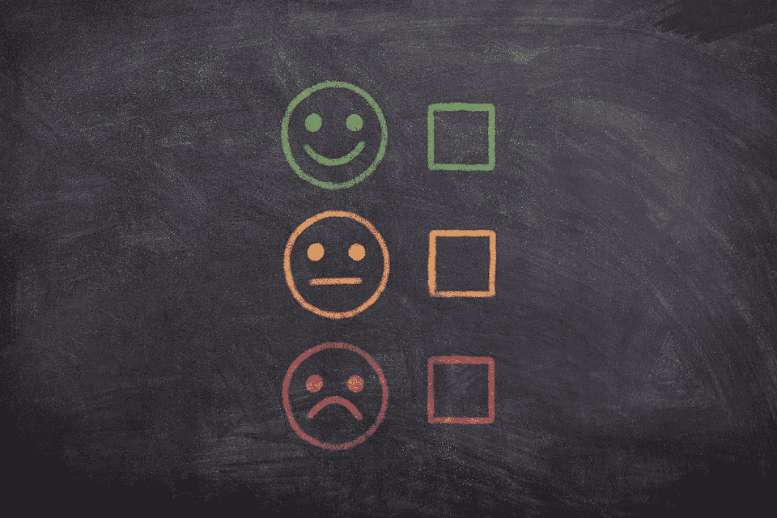
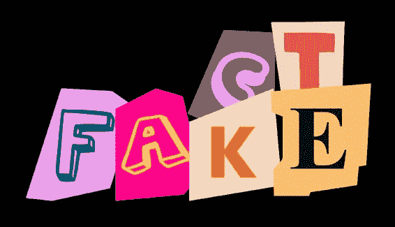
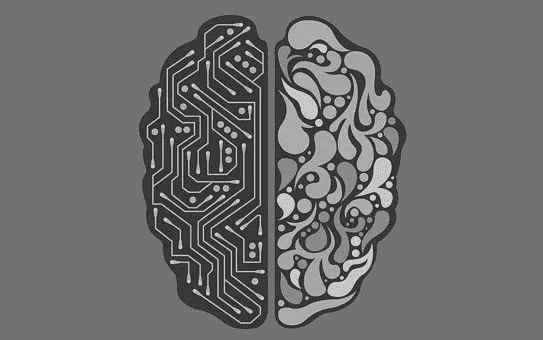

# 人工智能/人工智能系统中的 4 种认知偏差

> 原文：<https://pub.towardsai.net/4-cognitive-biases-in-ai-ml-systems-a208ac87177d?source=collection_archive---------3----------------------->

## 在理想世界中，机器是公正客观的。然而，设计这些机器的人类天生就有偏见。

[图片由 chenspec 通过 Pixabay 提供](https://pixabay.com/illustrations/brain-chip-neurons-machine-learning-6010961/)

随着先进技术的快速扩散，现在越来越多的系统配备了人工智能和机器学习算法。

> 然而，我们能客观地说这些系统是真正公平公正的吗？

在这篇文章中，我分享了 AI/ML 系统的 4 种认知偏差，以及机器为什么会充满偏差，因为建造它们的**工程师天生就不完美。**

# 选择偏差

[图片由奇莫诺通过 Pixabay 拍摄](https://pixabay.com/illustrations/cubes-choice-one-yellow-light-2492010/)

*   **选择偏差**是指对不代表整个群体的**训练/测试数据的选择。**
*   **示例:**一名工程师选择回复他邮件的**前 100 名志愿者**作为他的训练数据
*   **问题:****前 100 名受访者**可能比**后 100 名受访者**更热衷于某项产品或研究。通过明确选择前 100 名受访者，工程师**在他的数据收集方法中引入了不公平性。**
*   **解决方案:**从你的电子邮件回复者池中选择一个**随机样本**100 个用户，而不是前 100 个。

# 报道偏差

[图片由 athree233 通过 Pixabay](https://pixabay.com/photos/board-chalk-feedback-review-3699978/)

*   **报道偏差**是指人(有意识和无意识)**对自己报道的信息进行压制的倾向**。
*   **举例:**许多亚马逊产品**的 5 星和 1 星评价多于 2 星、3 星或 4 星评价**，因为**有极端经历(无论正面还是负面)的人比有中性经历的人更有可能发布评价**。
*   **问题:**一个使用在线评论作为主要数据源的工程师可能会创建一个人工智能模型，这个模型在检测极端情绪方面**很棒，但在检测更中性、更微妙的情绪方面却不太好。**
*   **解决方案:**考虑**扩大数据收集范围，以解决代表性不足的数据。**

# 隐性偏见

[由 Merio 通过 Pixabay 拍摄的图像](https://pixabay.com/illustrations/girl-woman-female-silhouette-young-4064552/)

*   **内隐偏见**指人们的**无意识倾向于做出假设或将刻板印象与他人联系起来。**
*   一位经常被狗咬伤的工程师认为狗比猫更具攻击性，尽管这种说法在科学上并不正确。
*   **问题:**工程师会认为**基本事实**是“狗=好斗”，因此**微调她的人工智能模型，给狗贴上比猫更好斗的标签。**
*   **解决方案:**由于隐性偏见对于个人来说是**无意识的，让**多名工程师编写 AI** 和**建立适当的同行评审程序**将**减少这种偏见的发生。****

# 框架偏差

*   **框架偏见**指的是人们的**倾向于受信息呈现方式的影响。**
*   **举例:**一个工程师看到某个产品的**阴暗沉闷的**网站，就认为该产品一定销量不佳，而忽略了该产品的实际正销量数字。
*   **问题:**在设计 AI 算法时，工程师可能会**考虑主观变量，**比如网站的颜色，**而不是关注客观指标。**
*   **解决方案:** **避免主观的**(通常是定性的)数据，而**优先考虑客观的、事实性的数据**。

# 总结和最佳实践

[图片由 Seanbatty 通过 Pixabay](https://pixabay.com/illustrations/artificial-intelligence-ai-robot-2228610/)

快速回顾人工智能/人工智能系统中的 4 种认知偏差

*   **选择偏倚(选择不代表整个群体的数据)**
*   **报告偏差(人们少报信息的倾向)**
*   **内隐偏见(人们无意识的倾向假设)**
*   **框架偏见(人们受信息呈现方式影响的倾向)**

提高人工智能/人工智能系统客观性的 5 个最佳实践

*   **始终选择一个随机样本(而不是第一个或最后一百个数据点)**
*   **通过与其他数据源的比较来验证您的数据源**
*   **指派更多(多样化的)工程师开发人工智能/人工智能系统**
*   **建立适当的同行审查程序，对逻辑和无意识偏见进行交叉审查**
*   将客观和事实数据置于主观(通常是定性)数据之上。

如你所见，人类的感知存在严重缺陷，我们的不完美可能会渗透到我们构建的系统中。通过**承认这些偏见，**然而，我们可以**优化我们构建的人工智能系统**并**使它们更加公平和客观。**

我希望你今天学到了新东西。如果你喜欢你正在阅读的东西，请鼓掌或关注！

我将在下一篇文章中介绍您。干杯！