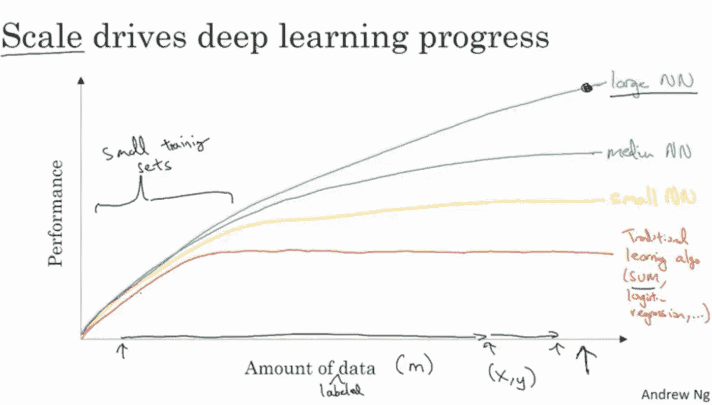

# 构建机器学习模型时的 4 个常见陷阱

> 原文：<https://pub.towardsai.net/4-common-pitfalls-when-building-machine-learning-model-826536c068b7?source=collection_archive---------1----------------------->

## 构建机器学习模型时最常见的问题


作者图片

```
**Contents****·** [**Introduction**](#eb9d)  ∘ [1\. Is your source up to date?](#3c28)
  ∘ [Solution](#02a4)
  ∘ [2\. Not Enough Data?](#6f6e)
  ∘ [Solution](#d07c)
  ∘ [3\. Is Aristotle right about quality?](#47e0)
  ∘ [Solution](#8241)
  ∘ [4\. Can your model be perfect?](#b985)
  ∘ [Solution](#6c32)
**·** [**Conclusion**](#0f66)
```

# 介绍

当为你的公司、你的投资组合或者为了娱乐而建立一个机器学习模型时，有一些步骤可以采取。还有一些其他的事情你应该避免，以提高你的模型的准确性。在本文中，我试图警告您在构建机器学习模型时的 4 个常见陷阱。尽管在应用机器学习模型时，你应该小心谨慎，但是当你避免做这些步骤时，你的模型就没问题了。

## 1.你的消息来源是最新的吗？


由[马库斯·温克勒](https://unsplash.com/@markuswinkler?utm_source=medium&utm_medium=referral)在 [Unsplash](https://unsplash.com?utm_source=medium&utm_medium=referral) 上拍摄

如今，当构建机器学习时，在网上找到来源是很常见的。

比如在 GitHub 页面或者课程资料里。

一般来说，这是一个自我进化的过程，但有时你必须小心谨慎。

有时，在线文档可以根据版本变化进行更新，但是如果您查看过时文档或 Github 页面中的代码，可能会导致您进行调试过程。

这意味着，函数名或参数可能会改变，有时甚至函数名也可以改变。

## **解决方案**

为了避免这些问题，我总是看我正在阅读的资料的日期。

之后，检查那篇文章中的库版本，并与当前版本进行比较。

例如，如果你正在用 Python 编程，并且你正在使用 Scikit Learn，那么在这里查看 Scikit-learn 发布历史[会很有帮助。](https://pypi.org/project/scikit-learn/#history)

## **2。数据不够？**


由 [Markus Spiske](https://unsplash.com/@markusspiske?utm_source=medium&utm_medium=referral) 在 [Unsplash](https://unsplash.com?utm_source=medium&utm_medium=referral) 上拍摄的照片

数据越多越好吗？

简单但重要。

大多数情况下，数据越多越好。

这不是提高机器学习模型性能的唯一方法。

## 解决办法

另一方面，研究表明，大多数时候数据越多越好。

有时，添加更多的数据可能会增加成本，另一方面，它也会提高您的模型的性能，如下图所示吴恩达的图表；



参考:深度学习 AI

## 3.**亚里士多德关于质量的观点正确吗？**


亚历克斯·舒特在 [Unsplash](https://unsplash.com?utm_source=medium&utm_medium=referral) 上的照片

> **“品质不是行为，而是习惯。”**
> 
> **亚里士多德**

事实上，我假设如果亚里士多德生活在那个时代，他将是一个伟大的数据科学家。

建立机器学习模型时，数据质量非常重要。

尤其是，如果您的模型用于生产。

然而，有时候，事情会超出你的控制。

尤其是当你的模型在生产的时候。

## 解决办法

如果你想养成这个习惯，你应该经常检查你的输入数据以避免错误的输入数据。

此外，对传入数据设置限制可以防止坏的传入数据，从而保护模型的效率。

## 4.你的模型可以完美吗？


照片由[维托达·克莱因](https://unsplash.com/@little_klein?utm_source=medium&utm_medium=referral)在 [Unsplash](https://unsplash.com?utm_source=medium&utm_medium=referral) 上拍摄

直说了吧，没有。

追求完美可能是一件伟大的事情，但不是在机器学习中。

在机器学习中，它可能是你的动机杀手，也会导致过度适应。

过度拟合是什么意思？

过度拟合意味着你的模型非常完美，所以好得不像真的。

> “完美是进步的敌人。”
> 
> 温斯顿·丘吉尔

## 解决办法

为了避免过度拟合，要做的一件事就是简化你的模型。

通过降维或特征工程，你可以很容易地简化你的模型并克服过度拟合。

# 结论


[Robynne Hu](https://unsplash.com/es/@robynnexy?utm_source=medium&utm_medium=referral) 在 [Unsplash](https://unsplash.com?utm_source=medium&utm_medium=referral) 上拍摄的照片

我们所处的时代真的很有意思。

每天的进步改变了人类的生活方式。

机器学习及其应用在这方面非常重要。

让我们快速看看现实生活中的机器学习应用；

*   **人脸识别-** 如今，就连我们的手机也在使用这项技术。
*   **语音识别-** Siri 就是一个著名的例子。
*   推荐系统- 在网飞家喻户晓，你可能也会喜欢这部电影。

机器学习几乎进入了每一个前沿商业领域；

*   **医疗保健** -检测肿瘤
*   **金融** -预测股票价格
*   **定律** -消费者分析

还有很多。

如此独立于你的商业空间，在我看来，要么你用机器学习跨越，要么你将在不久的将来又前进一步；

> “机器学习是人类需要做出的最后一项发明。”尼克·博斯特罗姆

感谢阅读我的文章。

为我订阅更多；

[](https://medium.com/subscribe/@geencay) [## 每当 Gencay I .发表文章时都收到电子邮件。

### 每当 Gencay I .发表文章时都收到电子邮件。注册后，如果您还没有，您将创建一个中型帐户…

medium.com](https://medium.com/subscribe/@geencay)