# 处理缺失数据的 4 种优雅方式

> 原文：<https://pub.towardsai.net/4-elegant-ways-to-deal-with-missing-data-68951629e2c8?source=collection_archive---------1----------------------->

## 用 4 种技术对缺失数据进行插补


艾米丽·莫特在 [Unsplash](https://unsplash.com?utm_source=medium&utm_medium=referral) 上的照片

如果你有一些现实世界数据分析或数据科学的经验，你会知道 **80%的工作是关于数据收集和数据准备**。**只有 20%是真实数据分析**和建模。即使你没有真实世界的经验，你也可能已经在别处读到过。数据准备的一个主要步骤是处理缺失值。

在数据分析领域，很难找到没有丢失值的数据库。如果您发现这些罕见的数据库之一，可能是因为其他人已经清理过数据并为您完成了工作，或者数据集很小，不复杂，易于处理并捕捉缺失条目的真实值。如果您的数据足够大，并且缺失值确实占了数据的很大一部分，您可以简单地删除不完整的观察值。但是，如果您的所有观察值都有价值，您需要应用缺失值插补技术。

现在让我们回到现实世界。您已经完成了所有的数据库查询、表合并和连接，以及一些表数据透视，并且您已经有了一个最终的表，其中包含了为分析而选择的数据。然而，你还没有准备好开始你的分析和建立你的机器学习模型，因为你仍然需要解决缺失的数据。

本文将讨论缺失值插补的四种技术，并提供 python 代码示例。我会使用你可以在 Kaggle 上轻松免费找到的数据集 [insurance.csv](https://www.kaggle.com/datasets/awaiskaggler/insurance-csv) 。如果你想了解这个例子，我建议你下载数据集并使用 Google Colab。

```
**#Import libraries:**
import pandas as pd
import numpy as np
import random**#Import and load dataset:** df = pd.read_csv('/content/insurance.csv')
df
```


显然，只有通过目视检查，我们的数据框才没有缺失值。我们可以通过键入以下命令来检查它:

```
**#Check for NAN values in dataframe:**
print(df.isnull().values.any(), df.isnull().sum().sum())
```

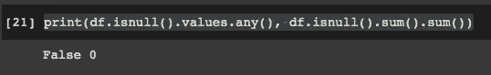

我们的数据框没有任何缺失值，因此我们需要人工插入一些值。我们将插入 10%的缺失值，同时确保没有任何行或线完全被 NAN 值填充。记住我们的数据框是一个代数矩阵，有 ***i*** 行和 ***j*** 列。我们将为矩阵中的行和列创建一个难以处理的变量:

```
**#Iteractions with i(rowns) and j(columns):**
ij = [(row, col) for row in range(df.shape[0]) for col in range(df.shape[1])]
```

现在在随机位置插入随机 NAN:

```
**#Insert NAN values:**
for row, col in random.sample(ij, int(round(.1*len(ij)))):
        df.iat[row, col] = np.nan
```

如果我们再次检查我们的数据框，我们现在会发现大约 10%的 NAN 值:

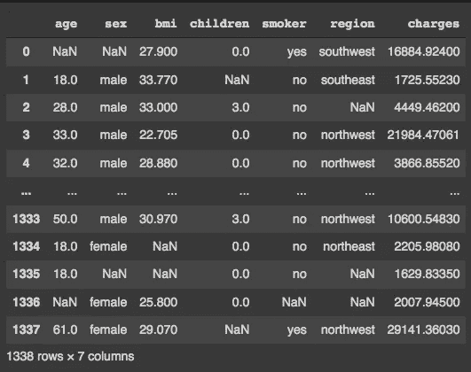

要检查整个数据集中的 NAN 值:

```
**#Check NAN in data frame:**
print(df.isnull().values.any(), df.isnull().sum().sum())
```

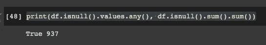

要检查特定列中的 NAN 值:

```
print('Age NAN: ', df['age'].isnull().sum())
print('Sex NAN: ', df['sex'].isnull().sum())
print('BMI NAN: ', df['bmi'].isnull().sum())
print('Children NAN: ', df['children'].isnull().sum())
print('Smoker NAN: ', df['smoker'].isnull().sum())
print('Region NAN: ', df['region'].isnull().sum())
print('Charges NAN: ', df['charges'].isnull().sum())
```

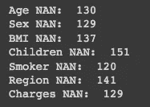

现在我们有了 NAN 值，我们准备开始用合适的值替换它们。

## 1.根据分析师知识和问题需求使用一些常数

输入缺失值的一个最简单的方法是根据研究者对所研究问题的了解使用一些常数。在本例中，我们将学习如何用 0 替换[' **children** ']列中所有缺失的值(NAN)。这并不一定反映问题知识，这是一个如何将这种技巧应用到日常实践中的例子。

```
**#Fill NAN with 0 in children column with pandas:**
df['DataFrame Column'] = df['DataFrame Column'].fillna(0)**#Fill NAN with 0 in children column with numpy:**
df['DataFrame Column'] = df['DataFrame Column'].replace(np.nan, 0)
```

你可以使用**熊猫**或 **numpy** 图书馆来完成任务。随便选一个。运行代码后，如果再次检查['children']列的 NAN 值，将得到以下结果:

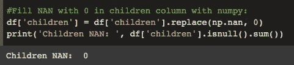

在提供的代码中，你可以用任何你想要的值来改变 0，只要它是一个常量。

## 2.估算平均值(数值变量)或众数(分类变量)

下一项技术是使用 mean 或 mode 来输入缺失值，这取决于我们有数值变量还是分类变量。在这个例子中，我将解释这两种情况。我们将为[' **bmi** '](数字)和[' **区域** '](分类)输入缺失值。

第一步是获取[' **bmi** ']列的平均值:

```
**#Get mean for column bmi:**
print('Mean BMI is: ', df["bmi"].mean())
```

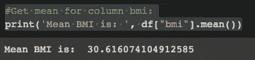

现在我们替换 NAN 值并再次检查 NAN:

```
**#Replace NAN values with mean:** df['bmi'] = df['bmi'].fillna(30.62)
print('BMI NAN: ', df['bmi'].isnull().sum())
```

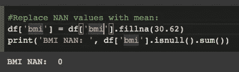

如果需要输入分类变量的缺失值，我们需要找到模式:

```
**#Get mode for column region:** print('Mode region is: ', df["region"].mode())
```

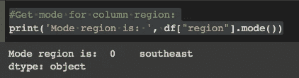

然后相应地填充 NAN 值:

```
**#Replace NAN values with mode:** df['region'] = df['region'].fillna('southeast')
print('Region NAN: ', df['region'].isnull().sum())
```

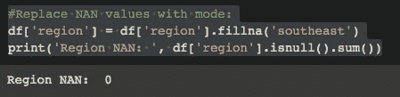

## 3.估算从观察到的分布中产生的随机值

我们可以从列分布中生成随机值，并将它们输入到 NAN 条目中。我们只需要小心我们的列分布是否正常，以便不影响分布。我将针对这两种场景给出两个例子:正态分布和非正态分布。我们将检查年龄变量是否正态分布:

```
import seaborn as sns**#Build and histogram:**
sns.distplot( a=df["age"], hist=True, kde=False, rug=False )
```

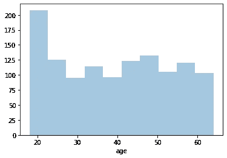

通过直方图，可以看出数据不是正态分布的。

> **非正态分布:**

分布不是正态的，所以我们不需要担心在我们的缺失值中，我们可以在观测值中生成从最小值到最大值的随机值。第一步是检查列的最大值和最小值:

```
**#Get maximum and minimum values:**
print('Min age: ', df["age"].min())
print('Max age: ', df["age"].max())
```

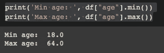

现在创建一个函数来生成 18 到 64 之间的值，并用 NAN 值替换它们:

```
**#Create a function to generate randon values and replace them in NAN:**def fill_missing(value):
    if np.isnan(value) == True:
        value = np.random.randint(18, 64)
    else:
        value = value
    return value
```

现在我们将该函数应用于我们的列:

```
**#Replace NAN values with random generated values:** df['age'] = df['age'].apply(fill_missing)
print('Age NAN: ', df['age'].isnull().sum())
```

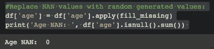

> **正态分布数据:**

如果您有正态分布的数据，过程是类似的，但是您需要对生成的值更加小心，并确保它们不会影响分布。我们需要得到平均值和标准差:

```
**#Get mean and st deviation:** mean = df['age'].mean()
std = df['age'].std()
print("Mean is: ", mean)
print("SD is: ", std)
```

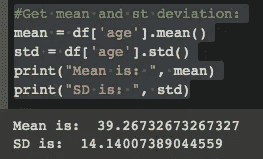

现在创建函数:

```
**#Create a function to generate randon values and replace them in NAN:**
def fill_missing_normal(value):
    if np.isnan(value) == True:
        value = np.random.normal(mean, std, 1)
    else:
        value = value
    return value
```

最后一步是应用函数:

```
**#Replace NAN values with random generated values:** df['age'] = df['age'].apply(fill_missing_normal)
print('Age NAN: ', df['age'].isnull().sum())
```

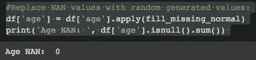

## 4.使用线性回归预测连续变量的缺失值

在下一步中，我们将学习如何用连续变量[' **电荷【T1]']的线性回归预测值替换缺失值。第一步是删除数据集中的 NAN 值，因为我们需要构建一个线性回归模型，它不接受 NAN 作为输入值。**

```
**#Drop NAN:**
df_lm = df.dropna()
```

现在创建一个线性回归模型:

```
from sklearn.linear_model import LinearRegression**#Define X and y and drop non-numerical variables:**
X = df_lm.drop(['charges', 'sex', 'region', 'smoker'], axis=1)
y = df_lm['charges']**#Model fit:**
lm = LinearRegression().fit(X, y)
```

现在，与我们在上一节中所做的类似，我们需要创建一个函数来替换丢失的值:

```
**#Define function:**
def fill_missing_lm(value):
    if np.isnan(value) == True:
        value = lm.predict()
   else:
        value = value
   return value
```

并将函数应用于数据:

```
**#Replace NAN values with generated values from linear model:** df[‘charges’] = df[‘charges’].apply(fill_missing_normal)
print(‘Charges NAN: ‘, df[‘charges’].isnull().sum())
```

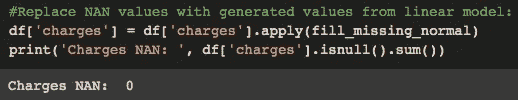

> 感谢您的阅读！如果你有建议要添加到这个列表中，请告诉我，不要忘记订阅以接收关于我未来出版物的通知。

**如果:**你喜欢这篇文章，别忘了关注我，这样你就能收到关于新出版物的所有更新。

**其他如果:**你想了解更多，你可以通过[我的推荐链接](https://cdanielaam.medium.com/membership)订阅媒体会员。它不会花你更多的钱，但会支付我一杯咖啡。

**其他:**谢谢！