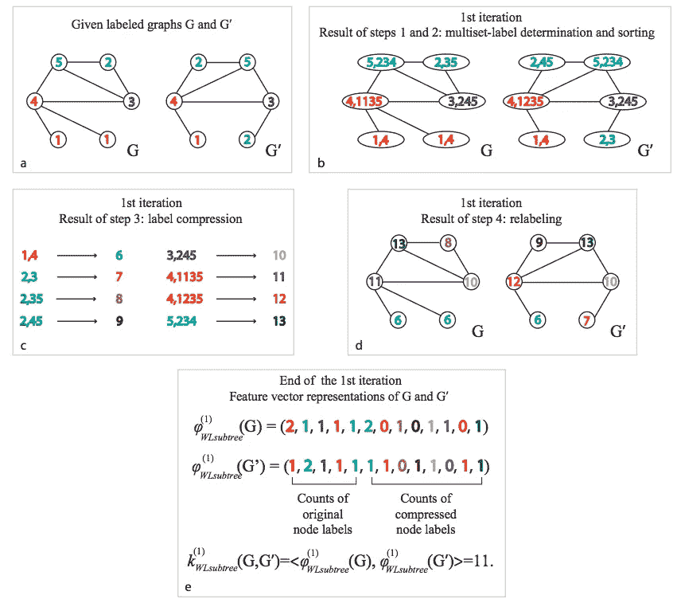
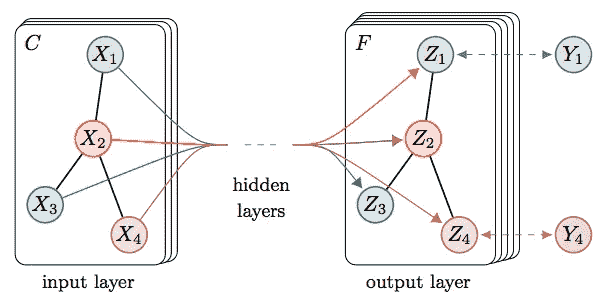
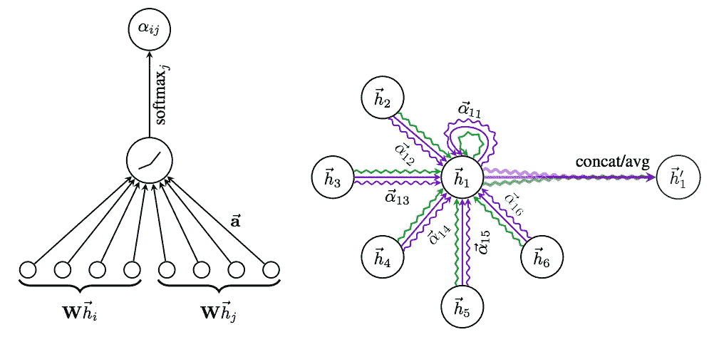
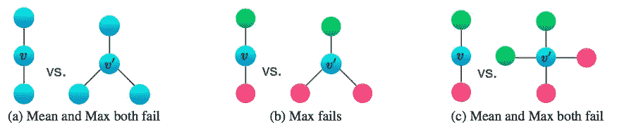

# 你需要知道的 4 个图形神经网络(WLG、GCN、加特、金)

> 原文：<https://pub.towardsai.net/4-graph-neural-networks-you-need-to-know-wlg-gcn-gat-gin-1bf10d29d836?source=collection_archive---------0----------------------->

[马志威](https://unsplash.com/@makcedward?utm_source=medium&utm_medium=referral)在 [Unsplash](https://unsplash.com/?utm_source=medium&utm_medium=referral) 上拍照

在之前的图神经网络故事中，我们经历了[知识图嵌入](https://medium.com/towards-artificial-intelligence/a-gentle-introduction-to-graph-embeddings-c7b3d1db0fa8)和[随机游走](https://medium.com/towards-artificial-intelligence/random-walk-in-node-embeddings-deepwalk-node2vec-line-and-graphsage-ca23df60e493)。知识图嵌入为下游任务训练实体嵌入。另一方面，一些神经网络模型应用随机游走理论来训练实体嵌入。

在这个故事中，我们将重点介绍 4 个图神经网络模型，它们是 Weisfeiler-Lehman 图核(Shervashidze 等人，2011 年)、图卷积网络(Kipf 和 Welling，2017 年)、图注意网络(velikovi 等人，2017 年)和图同构网络(徐等人，2019 年)

# 魏斯费勒-雷曼(WL)图核

Shervashidze 等人(2011)介绍了一种在图形神经网络上测量图形相似性的方法(WL 测试)。通过 WL 检验意味着要么图是同构的，要么不能证明图不是同构的。

在 WL 测试中，你可以定义图形的高度。高度意味着迭代次数。以下程序是 h=1 时的 WL 试验:

1.  每个节点的命名节点
2.  添加连接的节点号。以图 G 为例，当节点 4 连接到节点 1 (2 次)、节点 3 和节点 5 时，节点 4 更新为节点 4，1135。
3.  简单的节点名。例如，将节点 4，1135 转换为 11。(按顺序重新命名即可)
4.  重新标记新节点名
5.  检查原始节点标签和新生成标签的数量。如果两个节点的计数(特征向量)相同，则这两个图同构。

计算 WL 检验(h=1) (Shervashidze 等人，2011 年)

# 图形卷积网络(GCN)

Kipf 和 Welling 在 2017 年推出了图卷积网络(GCN)。GCN 的基本思想是聚集自身特征和邻居特征。

下图显示了 GCN 的整体架构。以 X2 节点为例，它吸收 X2 特征(自身)、X1、X3 和 X4(邻居)特征，并馈入神经网络训练模型。

图解图卷积网络(GCN) (Kipf 和 Welling，2016 年)

关于节点的特征，可以是随机初始化或数字特征。以论文引用为例，文档是节点，边是引用。节点特征(例如文档)可以是一个热编码的字数、出版年份、作者。再比如社交网络。一个人是一个节点，而边是关系(如友谊)。特征包括一个城市的诞生，朋友的数量。

# 图形注意网络

Velič ković等人受注意机制的启发，提出将其应用于图形神经网络。与 GCN (Kipf 和 Welling，2017 年)相同，图形注意力网络(GAT)(veli kovi 等人，2017 年)利用自身节点特征和邻居特征来训练模型。与自然语言处理(NLP)领域的 [BERT](https://towardsdatascience.com/how-bert-leverage-attention-mechanism-and-transformer-to-learn-word-contextual-relations-5bbee1b6dbdb) 相同，作者使用多头注意力来学习更多不同的注意力。

使用注意力有几个好处:

*   高计算效率，因为可以并行计算关注层
*   对重要邻居给予更多关注
*   更强大，因为它可以支持直接图和无向图。
*   这是归纳学习，所以它可以处理看不见的节点。

左图:注意力网络图。右图:不同颜色代表多头关注。(Velič ković et la。, 2017)

# 图形同构网络

拓扑相同可以是度量图的相似性的方法之一。传统上，我们可以让 WL 测试它。徐等人证明了杜松子酒的功效不亚于的试验:

1.  通过使用简单的架构(多层感知器)，图形神经网络(GNN)可以像 WL 测试一样强大。
2.  GCN (Kipf 和 Welling，2017 年)和 GraphSAGE (Hamilton et al .，2017 年)不能区分一些图结构。
3.  在区分图结构方面，和聚集优于均值和最大聚集。

平均值和最大值聚合无法区分两个图形。(徐等，2018)

# 拿走

*   如果你需要处理看不见的节点，GCN 可能不是你的选择，而 GAT 可以处理看不见的节点。
*   GIN 展示了一种更好地表示邻居聚合的方法。
*   您可以简单地使用 [PyTorch 几何](https://github.com/rusty1s/pytorch_geometric)来应用 GCN、GAT 和 GIN。

# 延伸阅读

*   [知识图嵌入](https://medium.com/towards-artificial-intelligence/a-gentle-introduction-to-graph-embeddings-c7b3d1db0fa8)
*   [图神经网络中的随机游走](https://medium.com/towards-artificial-intelligence/random-walk-in-node-embeddings-deepwalk-node2vec-line-and-graphsage-ca23df60e493)
*   [GCN 解释](https://towardsdatascience.com/how-to-do-deep-learning-on-graphs-with-graph-convolutional-networks-7d2250723780)
*   [GCN 代码](https://github.com/tkipf/pygcn)
*   [GAT 代码](https://github.com/PetarV-/GAT)
*   [轧花机代号](https://github.com/dmlc/dgl/tree/master/examples/pytorch/gin)

# 参考

*   名词（noun 的缩写）Shervashidze、P. Schweitzer、E. J. Leeuwen、K.Mehlhorn 和 K. M. Borgwardt。[魏斯费勒-雷曼图形内核](http://www.jmlr.org/papers/volume12/shervashidze11a/shervashidze11a.pdf)。2011
*   T.基普夫和 m .韦林。[基于图卷积网络的半监督分类](https://arxiv.org/pdf/1609.02907.pdf)。2017
*   页（page 的缩写）Velič ković、G. Cucurull、A. Casanova、A. Romero、P. Liò和 Y. Bengio。[图形注意网络](https://arxiv.org/pdf/1710.10903.pdf)。2017
*   K.徐、胡伟、j .莱斯科维奇和 s .杰格尔卡。[图形神经网络有多强大？](https://arxiv.org/pdf/1810.00826.pdf)。2018.