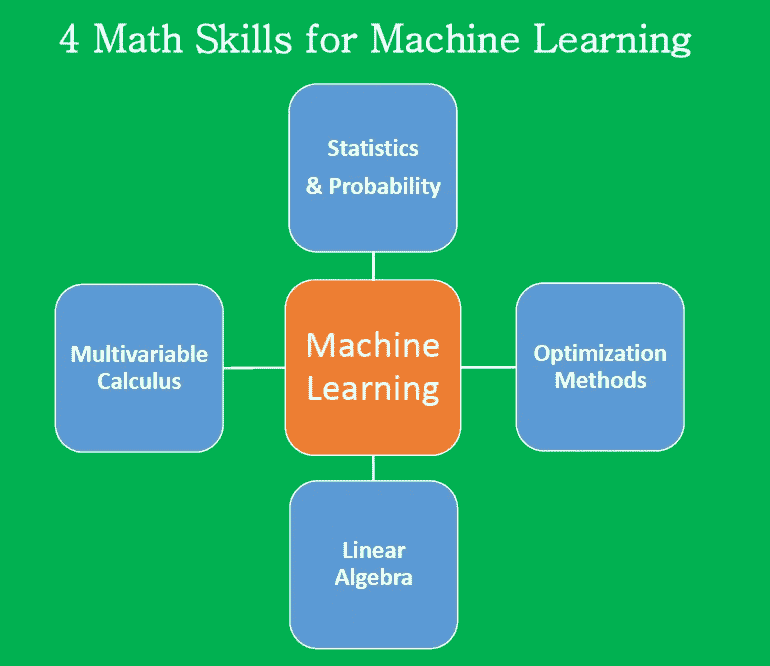

# 机器学习的基本数学技能

> 原文：<https://pub.towardsai.net/4-math-skills-for-machine-learning-12bfbc959c92?source=collection_archive---------0----------------------->

## [机器学习](https://towardsai.net/p/category/machine-learning)，[数学](https://towardsai.net/p/category/mathematics)

在讨论机器学习需要的 4 个数学技能之前，我们先来描述一下机器学习的过程。机器学习过程包括 4 个主要阶段:

**1。问题框架:这是您决定您试图解决哪种问题的地方，例如，将电子邮件分类为垃圾邮件或非垃圾邮件的模型，将肿瘤细胞分类为恶性或良性的模型，通过将呼叫路由到不同类别来改善客户体验的模型，以便呼叫可以由具有适当专业知识的人员接听的模型，预测贷款在贷款期限结束后是否会取消的模型，基于不同特征或预测因素预测房价的模型，等等。**

**2。数据分析:**这是您处理可用于构建模型的数据的地方。它包括特征的数据可视化、缺失数据的处理、分类数据的处理、分类标签的编码、特征的规范化和标准化、特征工程、降维、数据划分为训练集、验证集和测试集等。

**3。模型构建:**这是您选择您想要使用的模型的地方，例如线性回归、逻辑回归、KNN、SVM、K 均值、蒙特卡洛模拟、时间序列分析等。数据集必须分为训练集、验证集和测试集。超参数调整用于微调模型，以防止过度拟合。执行交叉验证是为了确保模型在验证集上表现良好。在微调模型参数之后，将模型应用于测试数据集。该模型在测试数据集上的性能大约等于该模型用于对未知数据进行预测时的预期性能。

**4。应用:**在这个阶段，最终的机器学习模型投入生产，以开始改善客户体验或提高生产率，或者决定银行是否应该批准向借款人提供信贷等。该模型在生产环境中进行评估，以评估其性能。这可以通过使用诸如 A/B 测试的方法将机器学习解决方案的性能与基线或控制解决方案进行比较来完成。从实验模型转换到生产线上的实际性能时遇到的任何错误都必须进行分析。然后，这可以用于微调原始模型。

你建立机器学习模型所需的大部分数学技能都用在第 2、3、4 阶段，也就是**数据分析、模型建立、**和**应用。**

# 机器学习的 4 种数学技能

# (一)统计和概率

统计和概率用于特征的可视化、数据预处理、特征转换、数据插补、降维、特征工程、模型评估等。以下是您需要熟悉的主题:

1.  平均
2.  中位数
3.  方式
4.  标准偏差/方差
5.  相关系数和协方差矩阵
6.  概率分布(二项式、泊松、正态)
7.  p 值
8.  Baye 定理(精确度、召回率、阳性预测值、阴性预测值、混淆矩阵、ROC 曲线)
9.  A/B 测试
10.  蒙特 卡罗模拟

# ㈡多变量微积分

大多数机器学习模型是用具有几个特征或预测器的数据集构建的。因此，熟悉多变量微积分对于建立机器学习模型极其重要。以下是您需要熟悉的主题:

1.  多元函数
2.  导数和梯度
3.  阶跃函数、Sigmoid 函数、Logit 函数、ReLU(校正线性单位)函数
4.  价值函数
5.  功能绘图
6.  函数的最小值和最大值

# ㈢线性代数

线性代数是机器学习中最重要的数学技能。数据集被表示为矩阵。线性代数用于数据预处理、数据转换和模型评估。以下是您需要熟悉的主题:

1.  向量
2.  矩阵
3.  矩阵的转置
4.  矩阵的逆矩阵
5.  矩阵的行列式
6.  点积
7.  本征值
8.  特征向量

# ㈣优化方法

大多数机器学习算法通过最小化目标函数来执行预测建模，从而学习为了获得预测标签而必须应用于测试数据的权重。以下是您需要熟悉的主题:

1.  成本函数/目标函数
2.  似然函数
3.  误差函数
4.  梯度下降算法及其变体(如随机梯度下降算法)

在这里了解更多关于梯度下降算法:[https://medium . com/@ Benjamin bi/machine-learning-how-the-gradient-descent-algorithm-works-61682d 8570 b 6](https://medium.com/@benjaminobi/machine-learning-how-the-gradient-descent-algorithm-works-61682d8570b6)

总之，我们已经讨论了构建机器学习模型所需的基本数学技能。有几个免费的在线课程将教你建立机器学习模型所需的必要数学技能。在这篇[文章](https://medium.com/@benjaminobi/five-steps-to-becoming-a-data-scientist-239bbc60a6e3)中找到更多关于这些课程的信息。

# 其他数据科学/机器学习资源

[数据科学课程](https://medium.com/towards-artificial-intelligence/data-science-curriculum-bf3bb6805576)

[机器学习的基本数学技能](https://medium.com/towards-artificial-intelligence/4-math-skills-for-machine-learning-12bfbc959c92)

[3 个最佳数据科学 MOOC 专业](https://medium.com/towards-artificial-intelligence/3-best-data-science-mooc-specializations-d58da382f628)

[进入数据科学的 5 个最佳学位](https://towardsdatascience.com/5-best-degrees-for-getting-into-data-science-c3eb067883b1)

[2020 年开始数据科学之旅的 5 个理由](https://towardsdatascience.com/5-reasons-why-you-should-begin-your-data-science-journey-in-2020-2b4a0a5e4239)

[数据科学的理论基础——我应该关心还是仅仅关注实践技能？](https://towardsdatascience.com/theoretical-foundations-of-data-science-should-i-care-or-simply-focus-on-hands-on-skills-c53fb0caba66)

[机器学习项目规划](https://towardsdatascience.com/machine-learning-project-planning-71bdb3a44349)

[如何组织你的数据科学项目](https://towardsdatascience.com/how-to-organize-your-data-science-project-dd6599cf000a)

[大型数据科学项目的生产力工具](https://medium.com/towards-artificial-intelligence/productivity-tools-for-large-scale-data-science-projects-64810dfbb971)

[数据科学作品集比简历更有价值](https://towardsdatascience.com/a-data-science-portfolio-is-more-valuable-than-a-resume-2d031d6ce518)

[使用协方差矩阵图进行特征选择和降维](https://medium.com/towards-artificial-intelligence/feature-selection-and-dimensionality-reduction-using-covariance-matrix-plot-b4c7498abd07)

[数据科学 101 —包含 R 和 Python 代码的中型平台短期课程](https://medium.com/towards-artificial-intelligence/data-science-101-a-short-course-on-medium-platform-with-r-and-python-code-included-3cdc9d489c6d)

***如有疑问和咨询，请发邮件给我***:benjaminobi@gmail.com