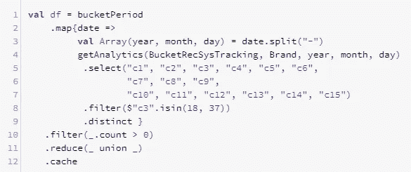
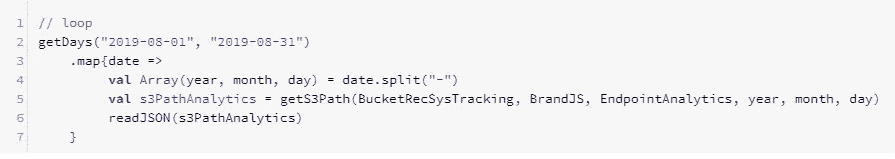
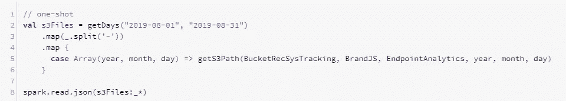
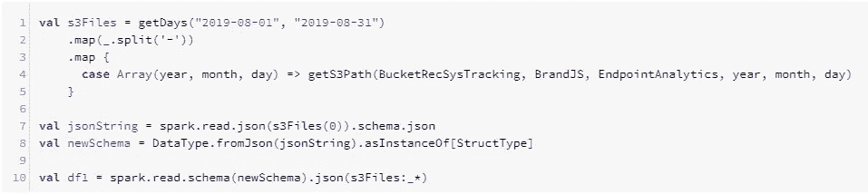
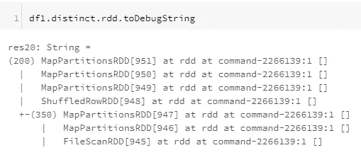
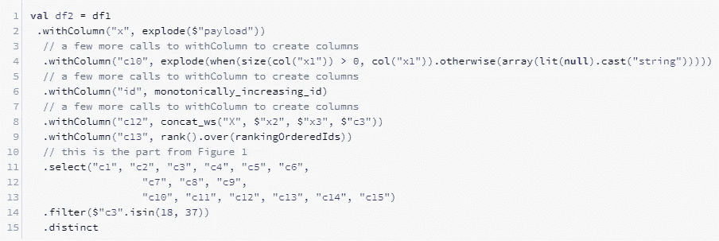
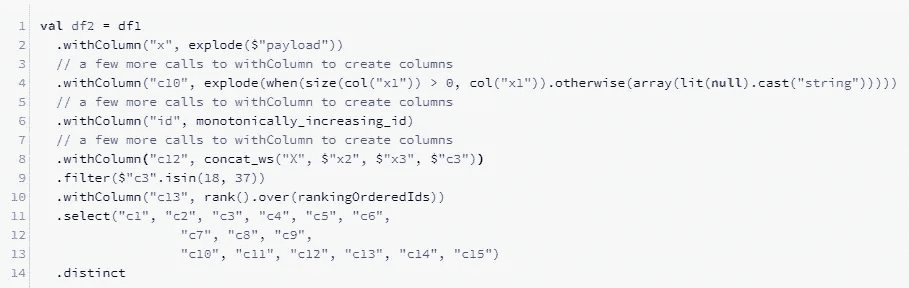
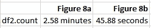
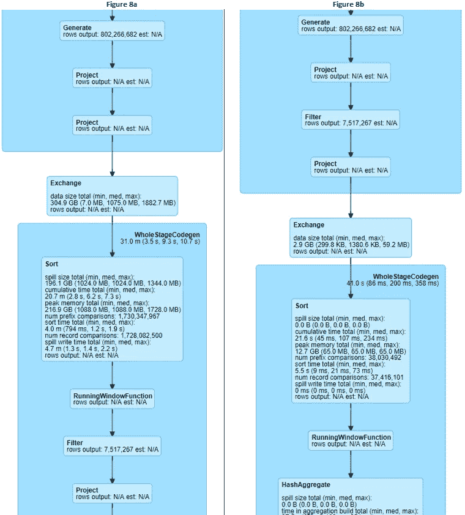

# 编写可伸缩 Apache Spark 代码的 4 个技巧

> 原文：<https://pub.towardsai.net/4-tips-to-write-scalable-apache-spark-code-1c736e4d698e?source=collection_archive---------0----------------------->

## [编程](https://towardsai.net/p/category/programming)

# 介绍

在本文中，我将分享一些关于如何编写可伸缩的 Apache Spark 代码的技巧。这里给出的例子实际上是基于我在现实世界中遇到的代码。因此，通过分享这些技巧，我希望我可以帮助新人编写高性能的 Spark 代码，而不会不必要地增加他们集群的资源。

# 集群设置

我在本文中用来运行代码的集群托管在 Databricks 上，配置如下:

*   集群模式:标准
*   Databricks 运行时版本:5.5 LTS ML(包括 Apache Spark 2.4.3 Scala 2.11)

有 8 个工作线程，工作线程和驱动程序都是 M4 . XL 大型实例(16.0 GB，4 个内核)。

# 背景

我最近继承了一个笔记本，用来跟踪我们的 AB 测试结果，以评估我们的推荐引擎的性能。从头到尾运行笔记本慢得令人难以忍受。这是执行时间最长的单元格:

图 1:非常糟糕的实现

在我们的 AB 测试实验中，用于跟踪数据的文件存储为换行符分隔的 JSON 文件，按照年、月和日划分到不同的文件夹中。每天可能有几百个 JSON 文件。如果我们给图 1 中的代码一个日期列表(`bucketPeriod`)，它将遍历这些日期，并在每个日期通过调用`getAnalytics`加载所有 JSON 文件。这将返回一个数据帧列表，在我们从列表中移除空数据帧(那些有 0 行的数据帧)后，我们将通过调用`union`将这些数据帧合并成一个数据帧。

执行图 1 中的代码来检索 3 天的数据需要 17.72 分钟，计算结果也就是`df.count`需要 26.71 分钟。让我们看看是否可以在不增加集群规模的情况下运行得更快。

在讨论技巧之前，这里是`getAnalytics`的实现，它基本上读取一个包含一堆换行符分隔的 JSON 文件的文件夹，并根据这些文件中有效载荷字段的内容添加一些特性:

图 2:另一个非常糟糕的实现

# 技巧 1:向 Spark 函数提供尽可能多的输入

图 1 中的代码本质上是一次对一个文件夹调用`spark.read.json`。考虑到`spark.read.json`可以接受一个文件名列表，这将允许驱动程序只调度任务一次，而不是多次，如果`spark.read.json`像在 for 循环中一样被重复调用。

因此，如果您需要读取分布在许多文件夹中的文件，而不是编写以下内容:

图 3:顺序读取文件

你应该这样写:

图 4:一次读取所有文件

图 4 中的代码比图 3 中的代码稍快(6.86 分钟对 7.30 分钟)。但是，日期范围越大，差异越大。

# 技巧 2:尽可能跳过模式推理

根据 `spark.read.json` [文档](http://spark.apache.org/docs/latest/api/scala/#org.apache.spark.sql.DataFrameReader):

> 这个函数遍历输入一次，以确定输入模式。如果您事先知道模式，请使用指定模式的版本来避免额外的扫描。

因此，图 4 中的代码可以重写如下:

图 5:跳过模式推断读取 JSON 文件

在图 5 中，我没有明确指定模式，而是决定只读取文件列表中的一个文件，根据这一个文件推断模式，并将相同的模式应用于其余的文件。这个代码单元只用了 29.82 秒就完成了。

# 技巧 3:构建数据框操作以最小化混乱

现在我们已经改进了文件 I/O，让我们看看是否可以改进如图 2 所示的`getAnalytics`中的转换。

图 2 中代码的问题是第一次调用 distinct 会导致洗牌。我们怎么知道这将会发生？通过调用 RDD 的`toDebugString`方法，定义一个数据帧操作，如下所示:

图 6:如何辨别不同的原因导致洗牌

`toDebugString`输出中的每一个缩进都表示当执行转换时将触发一次洗牌。回想一下`df1`只是在读取 JSON 文件，所以混乱的原因一定是对`distinct`的调用。使用同样的方法，我们也可以推断出对`rank().over(rankingOrderedIds)`(第 13 行)的调用将导致洗牌。

在这种情况下，在读取文件后立即触发 shuffle 并不是一个好主意，因为整个数据集非常庞大，而且实际上有很多我们分析不需要的无关列。因此，我们不必要地在集群中移动大文件。我们的目标是给定一个操作列表，我们希望执行这些操作来实现我们的最终目标，我们能否对它们重新排序，以便尽可能晚地进行洗牌，并使用尽可能少的数据？

幸运的是，这意味着将图 2 中的代码重写如下:

图 7:图 1 的优化版本

为了清楚起见，我将图 1 的相关部分合并到图 7 中，这样结果是相同的。注意，我们只需要调用它一次就可以获得相同的结果，而不是调用`distinct` 3 次(图 1 中一次，图 2 中两次)。当洗牌发生时(由于第 9 行中的调用)，物理计划显示只有在`select`调用中指定的列被移动，这很好，因为它只是原始数据集中所有列的一个小子集。

图 7 中的代码只需要 0.90 秒就可以执行，并且只需要 2.58 分钟。这个例子表明，认真思考您正在编写的查询以避免导致不必要的混乱的冗余操作是值得的。

# 技巧 4:手动执行明显的优化，而不是依赖 Catalyst 优化器

比较和对比以下两个片段:

图 8a:调用等级窗口函数后的过滤器(与图 7 相同)

图 8b:调用等级窗口函数之前的过滤

除了执行过滤的顺序不同(分别是第 14 行和第 9 行)，图 8a 和 8b 是相同的。但是两个片段给出了相同的结果，因为排名窗口函数不是列 c3 的函数，所以在排名之前或之后执行过滤并不重要。然而，`df2.count`的执行时间明显不同:

表 df2.count 的执行时间

这两个查询的物理计划解释了原因:

图 9:图 8a 和 8b 的物理平面图

图 9 显示了在调用秩窗口函数之前进行过滤的效果是将第一阶段的行数从 8.02 亿减少到仅仅 7 百万(图 8b 列)。因此，当发生洗牌时，总共只有 2.9 GB 的数据需要在群集中移动(图 8b 列中标有“Exchange”的框)。相比之下，在调用等级窗口函数之前不进行筛选会导致 304.9 GB 的数据在集群中移动。

这里的教训是，如果您的查询导致混乱，请尝试寻找机会对数据应用一些过滤器，以减少需要传输的数据量。此外，不要害怕研究您的查询的物理计划，寻找 Catalyst 优化器可能错过的任何优化机会。

# 结论

我们已经看到，编写 Spark 查询的方式会对其执行时间产生重大影响。我希望这些技巧能够帮助您编写更好的 Spark 代码，最大限度地利用您的集群资源。如果你有任何问题，请在评论中告诉我。