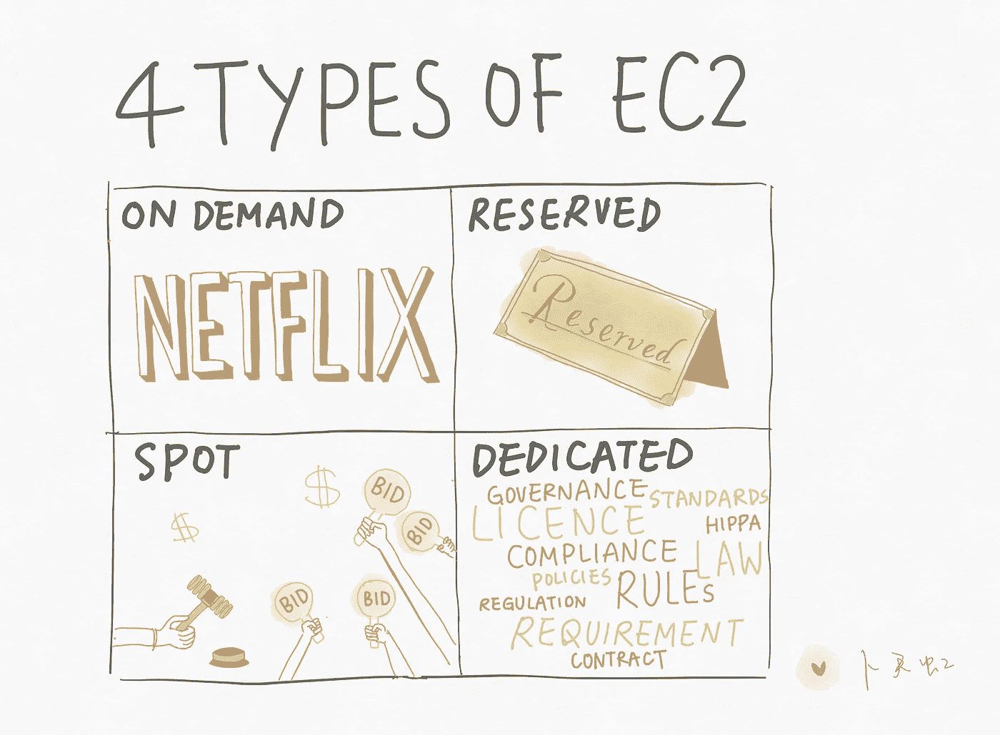

# 图示了 4 种类型的 EC2 实例

> 原文：<https://pub.towardsai.net/4-types-of-ec2-instances-illustrated-425e0882a3db?source=collection_archive---------2----------------------->

## 深入 AWS 的 EC2 实例| [走向 AI](https://towardsai.net)

4 种类型的 EC2 实例说明

## 按需实例

*   低成本、高灵活性的固定费率
*   无需预付
*   没有长期承诺
*   按秒收费(Linux)

## 保留实例

*   1/3 年的合同
*   预付款项，每小时价格打折
*   使用稳定且可预测的应用程序

## 定点实例

*   出价(支付你所出价的价格)
*   具有灵活开始和结束时间的应用程序
*   如果实例被 AWS 终止，则不收取部分小时费用

## 专用主机

*   专用于您的物理 EC2 服务器
*   不支持多租户虚拟化或云部署的法规要求或许可证

[aCloudGuru](https://acloud.guru) 课程笔记。作者配图。