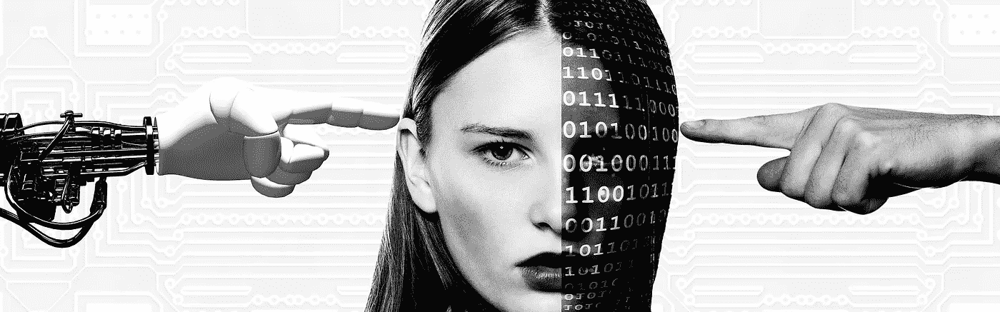
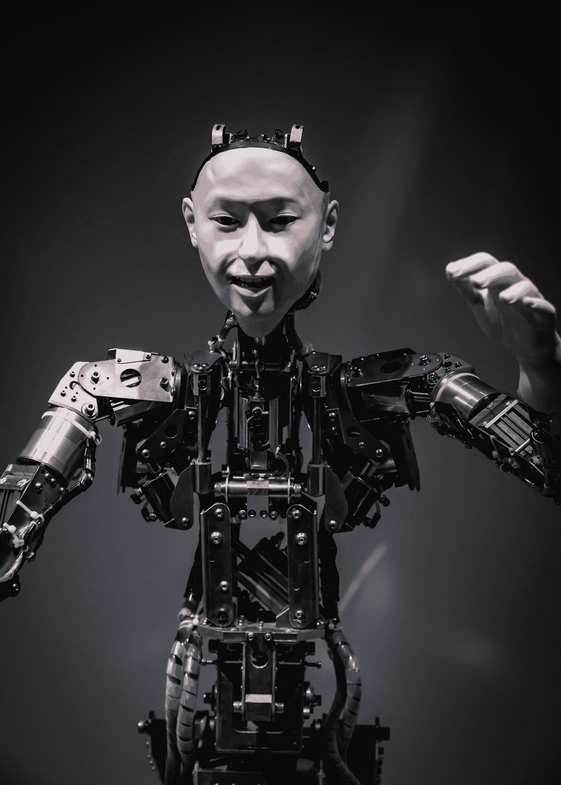

# 人工智能改变全球人力资源的 4 种方式

> 原文：<https://pub.towardsai.net/4-ways-artificial-intelligence-is-transforming-global-hr-strategic-capabilities-4603e7d00b18?source=collection_archive---------3----------------------->

## [人工智能](https://towardsai.net/p/category/artificial-intelligence)，[创新](https://towardsai.net/p/category/innovation)

*尽管人工智能(AI)在全球人力资源领域的出现还是最近的事情，但他们通过将人工智能和机器学习能力与他们广泛收集的员工数据和潜在候选人库相结合，快速转变了人力资源职能，从而提高了效率。*

关于谁主宰 HR 的斗争:人工智能还是人类？图片来源:Pixabay.com 的杰洛特([https://pixabay.com/users/geralt-9301/](https://pixabay.com/users/geralt-9301/))

根据美世*[*的数据，全球 88%的公司已经在其组织中采用了某种形式的人工智能(AI)。*](https://www.shrm.org/resourcesandtools/hr-topics/global-hr/pages/employers-embrace-artificial-intelligence-for-hr.aspx)*

83%的美国公司和 100%的中国组织已经依赖于某种程度的人工智能技术。

然而，人工智能在人力资源领域的应用仍处于起步阶段，远远赶不上它在销售和营销领域的进步。

当前基于人工智能的技术使人力资源从业者能够通过自动化重复和耗时的任务(如大规模候选人筛选)来更加专注于生产性工作。

这不仅节省了时间和金钱，还解决了重要的人力资源职能，例如通过聊天机器人提高候选人的参与度和体验，以及培训他们的员工。

人力资源正慢慢成为另一个具有全球战略重要性和发展竞争优势潜力的部门。

# **1。面向全球 HR 的 AI 跨文化培训**

文化差异对于参与跨国沟通的外籍人士和员工来说是一个重大挑战。这是国际迁移和部署失败的主要原因。

事实上，[*40%的全球任务失败*](http://hrnews.co.uk/avoiding-corporate-relocation-disaster-overseas-assignments-fail/) 并导致外派人员未完成目标回国。

文化适应新的社会规范和语言障碍是一个充满压力的过程，需要大量的经济支持。在英国，考虑到与飞行、住宿、工资、培训、医疗保健和家庭援助相关的成本，人均搬迁成本为 9 万英镑。

因此，全球人力资源部门必须有跨文化有效的外派人员执行全球任务，因为失败会导致巨大的经济损失。

据 90%的全球招聘人员称，语言和文化技能被认为是跨文化有效性的关键。他们使外派人员能够有效沟通，并最大限度地减少可能被视为不尊重的文化误解。然而，雇佣工人时却没有考虑这些技能。

Alelo 是一家世界领先的公司，专门从事基于 AI 头像的培训和教育。

他们与美国国防部合作，与一名基于**人工智能的虚拟教练开发了培训课程，该教练向美国军事人员教授文化意识和敏感性技能，以便进行国际部署。**

该课程结合了社交智能 AI 化身和文化相关背景下的人员之间的虚拟角色扮演模拟。它提供了一个在文化环境中练习互动、在环境中应用决策并获得即时反馈以进一步改进的机会。

该课程使美国人员习惯于他们将被派往的国家的文化规范，并学习如何相应地行事。这也使他们能够建立信任并与当地人合作，包括他们的武装部队。该项目强制美国军事人员部署到 86 个国家，每个课程都是为特定国家开发的。

使用这些课程使组织变得更具成本效益，因为它降低了培训成本，同时提高了员工效率。

安德鲁·巴特勒在 [Unsplash](https://unsplash.com?utm_source=medium&utm_medium=referral) 上拍摄的照片

# **2。人工智能在全球人力资源招聘和人才获取中的应用**

对于全球人力资源，开发了基于人工智能的解决方案，以提高招聘流程的效率和速度。

欧莱雅集团是一家拥有 82，600 名员工的全球化妆品公司，每年**在网上筛选 200 万名候选人，其中 5，000 人被录用**。负责筛选这些申请的团队由来自 150 个国家的 145 名招聘人员组成。

[*与 Seedlink Technology 合作，他们实现了一个名为 Mya 的聊天机器人。**聊天机器人允许组织以最低的成本被动地筛选和寻找人才。**他们充当虚拟助理，执行各种管理任务，如筛选候选人简历，收集包括候选人知识和经验在内的重要信息。*](https://www.peoplematters.in/article/technology/how-the-worlds-largest-cosmetic-company-transformed-its-hiring-practice-with-ai-19006)

*在机器学习和人工智能下，Mya 可以:*

*   *与候选人无缝交流。*
*   *问一些关于候选人适合性的开放式问题。*
*   *回答与公司和工作相关的问题。*

*这些问题有一个指标，旨在提供每个候选人的表现排名，并向招聘人员提供反馈。*

*Mya 的机器学习算法使她能够从招聘人员的决定中学习，她从招聘人员那里获得的信息越多，她对候选人适合性的理解就越精确。*

*结果是招聘过程加快了 10 倍，保留率提高了 25%,面试的申请人增加了 25%。它还更具包容性，因为它不考虑可能导致偏见的信息，如教育背景。*

**

*图片作者:来自 Pixabay.com 的尼克·韦兰([https://pixabay.com/users/niekverlaan-80788/](https://pixabay.com/users/niekverlaan-80788/))。*

# *3.机器人经理*

*尽管由于担心潜在的失业和网络安全风险，人工智能最初遇到了阻力。采用了人工智能技术的组织越来越开始热情地欢迎人工智能。*

*来自 10 个国家的 8370 名全球人力资源员工和领导者的一项 [*全球 2019 研究*](https://www.oracle.com/corporate/pressrelease/robots-at-work-101519.html) 表明，人与技术的关系已经发生了变化。*

*64%的员工比他们的经理更信任机器人，32%的员工更愿意向机器人寻求建议，而不是他们的经理。此外，82%的员工认为机器人比他们的经理更有能力提供:*

*   *无偏见的信息。*
*   *有组织的时间表。*
*   *解决问题。*
*   *预算管理。*

*然而，已报道的基于人工智能的技术的局限性包括:*

*   *无法理解员工的感受。*
*   *提供指导。*
*   *创造一种组织文化。*

*最近的*研究表明**增加对机器人技术的投资导致了管理和监督职位的减少**，因为减少了对工人活动进行管理监督以监控生产质量的需求。**

**管理人员不再需要确保员工准时上班或正在工作，因为机器人现在能够跟踪和记录每个员工的日常表现。**

**与普遍的看法相反，使用机器人的目的不是为了降低劳动力成本，而是为了提高产品或服务质量。人工劳动容易出错，这会造成服务或产品质量的差异，这意味着在所有产品或服务的生产过程中并不总是保持高质量。**

**最令人惊讶的发现是人工智能机器人对组织层级的破坏。实施人工智能机器人增加了低技能和高技能工作，但减少了中等技能工作。**

**这在组织中造成了巨大的差距，在那里很少有机会获得财政支持来教育和培训低技能员工，足以弥补差距成为高技能员工。否则，低技能员工将继续在入门级工作，几乎没有机会**

**研究人员建议，计划采用人工智能机器人的组织必须为中等技术工人制定再培训计划。**

**组织必须检查哪里的人力资本增值最大，最有效。比如中等技能的工人，可以负责管理维修、培训等机器人。**

****

**照片由[最大焦点](https://unsplash.com/@maximalfocus?utm_source=medium&utm_medium=referral)在[不飞溅](https://unsplash.com?utm_source=medium&utm_medium=referral)上拍摄**

# **4.工作中的心理健康和幸福**

**人工智能在全球人力资源领域的另一个主要挑战是管理工作中的压力和焦虑。**

**一项针对 11 个国家的 12000 名员工(包括雇员和人力资源总监)的研究表明，68%的人更喜欢与机器人谈论与工作相关的压力和焦虑。**

**受访者认为，重复性任务的自动化不仅减少了工作量，而且通过使他们专注于更重要的目标，减少了倦怠和压力。**

**由于减少了工作周和延长了假期，这也导致了更高的生产率和满意度。**

**有趣的是，77%的员工希望为他们的心理健康提供更多的技术支持，80%的人愿意让机器人成为工作场所的治疗师。**

**该研究还报告称，由于疫情，在家工作模糊了家庭和工作生活之间的界限，60%的年龄在 22 至 25 岁的 T2 人承担了最沉重的负担，他们每周加班五个多小时。**

**不出所料，这个年龄段中有 94%的人认为工作压力会导致健康状况恶化，比如睡眠不足，这会对他们的家庭关系产生负面影响。**

**人工智能可以以各种方式用于支持全球劳动力的心理健康和福祉。**

**然而，**心理健康目前并未被各组织列为优先考虑的重要问题**，也没有在人力资源部门的高管层面进行深入讨论**。因此，关于精神健康和幸福的讨论必须首先在国内解决，然后才能在国际上解决。****

****

**Nik Shuliahin 在 [Unsplash](https://unsplash.com?utm_source=medium&utm_medium=referral) 上拍摄的照片**

# **关键要点**

**随着组织接受人工智能给全球人力资源带来的竞争优势和战略重要性，我们开始看到这种超越跨越多个国家。我们看到使用:**

*   **跨文化训练中的 AI 头像。**
*   **全球招聘和人才获取中的机器学习。**
*   **取代管理能力的机器人。**
*   **改善精神健康和幸福的机器人。**

**人工智能在全球人力资源职能中的应用目前有限，但正在迅速扩展。利用创新的人工智能解决方案；未来的人力资源将是构建战略价值和竞争优势的另一个战场。**