# Python 中的 5 个出色的数据可视化库

> 原文：<https://pub.towardsai.net/5-awesome-data-visualization-libraries-in-python-a93e909de2d2?source=collection_archive---------0----------------------->

## [数据可视化](https://towardsai.net/p/category/data-visualization)

## 使用可视化库进行探索性数据分析


Firmbee.com 在 [Unsplash](https://unsplash.com?utm_source=medium&utm_medium=referral) 上[的照片](https://unsplash.com/@firmbee?utm_source=medium&utm_medium=referral)

数据可视化是探索性数据分析的一个非常重要的方面。它讲述了大量的数据，但没有深入到数字中。顾名思义，数据可视化将数据可视化，并讲述数据的一部分故事。

本文主要介绍了这五个数据可视化库的特点和优势。

> ***这 5 个可视化库分别是:***

```
1\. Matplotlib
2\. Seaborn
3\. Altair
4\. Missingno
5\. Folium
```

让我们开始吧。

> ***Matplotlib***

人们通常从 matplotlib 开始数据可视化。这是最基本的库，也是最重要的库。

## 特点:

*   它使用 Numpy 作为其基础。
*   这很像 MATLAB。
*   就美而言提供了最基本的情节。
*   安装和导入:

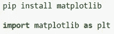

*   语法:

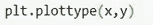

这是基本语法。matplotlib 支持多种类型的绘图。这些是线图、散点图、直方图、条形图等等。

*   它还具有支线剧情的功能，可以在一个画布上看到多个情节。

## 优势:

*   对图或图形的每个元素提供强大的控制
*   简单情节容易上手
*   支持标签和文本的定制
*   支持多格式输出
*   当所有的情节都需要在同一个画布上显示时，这是制作支线剧情的好方法
*   这对 MATLAB 用户来说非常方便
*   作为基础，对初学者来说是一个很好的开始

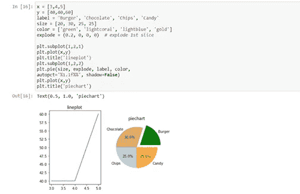

matplotlib 可视化。作者的照片

*这是一个非常有用的数据分析库。Matplotlib 被用作这个库的基础。它以美化图形和情节而闻名。*

## *特点:*

*   *它使用 distplot、joint plot、pairplot、boxplot 等图进行统计分析。*
*   *安装和导入:*

*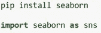*

*   *语法:*

**

*seaborn 使用不同的绘图类型，根据不同的类型，可以使用一个或两个列(x 或 x 和 y)进行绘图。*

*   *借助 set_style()可以使用不同的主题，进一步美化情节。*

## *优势:*

*   *它使统计分析清晰可见*
*   *借助箱线图和条形图等图表，帮助找到分类变量和定量变量之间的关系*
*   *在热图的帮助下，它使关联矩阵更容易跟踪。*
*   *提供易于定制的图，如 distplot，它既是密度图又是直方图。*

*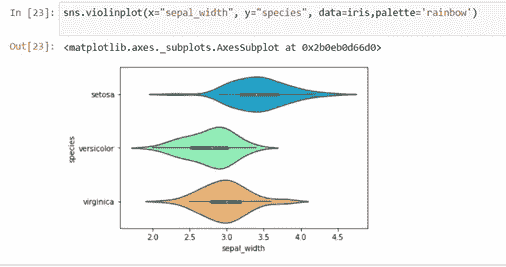*

*一个 seaborn 可视化。作者的照片*

> ****牛郎星****

*数据科学家可能用于统计可视化的另一个伟大的替代库是 Altair。*

*它使用织女星和织女星-建兴作为基地。*

## *特点:*

*   *数据帧是用于它的数据类型*
*   *安装和导入:*

*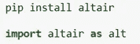*

*   *基本语法:*

*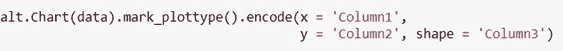*

*Chart(data)用于在绘图中输入数据，mark_plottype()提到了 plottype，encode()给出了有关列或/和形状的信息，其工作方式与上面讨论的 seaborn 库的 hue 相同。*

## *优势:*

*   *我们只需要给语法提供数据和列名。像轴名之类的东西都是它管的。因此，不需要额外的声明。*
*   *简单明了的语法*
*   *几乎相同的代码用于所有类型的地块，具有极大的灵活性。*
*   *借助 graticulate()函数，可以很好地处理地理数据。*
*   *可以很好地处理平均值的数据可视化，并借助内置的聚合语法，这对于其他库来说可能不那么容易。*

*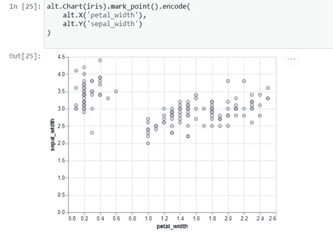*

*牛郎星的形象化。作者的照片*

*[](/latest-programming-languages-for-ai-5252d39e1c51) [## 最新的人工智能编程语言

### 人工智能未来娱乐它的语言

pub.towardsai.net](/latest-programming-languages-for-ai-5252d39e1c51) [](/become-a-data-scientist-in-2021-with-these-following-steps-5bf70a0fe0a1) [## 按照以下步骤，在 2021 年成为一名数据科学家

### 走上数据科学家之路需要具备的基本点

pub.towardsai.net](/become-a-data-scientist-in-2021-with-these-following-steps-5bf70a0fe0a1) 

> **号*失踪号*号**

顾名思义，该库用于可视化数据缺失的地方。

在数据科学领域工作的每个人都会遇到缺失值，这是最常见的数据问题。在机器学习算法上训练数据之前，处理缺失值是最重要的先决条件之一。

## 特点:

*   它通常用于查找缺失值
*   热图、条形图、矩阵图、散点图等图表有助于可视化数据中缺失的值。
*   安装和导入:

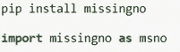

*   语法:


## 优势:

*   在探索性数据分析阶段非常方便
*   节省时间，因为人们通过数据可视化知道准确的缺失值浓度，因此处理变得更容易
*   非常简单的语法

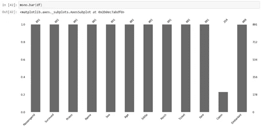

牛郎星的形象化。作者的照片

*它是少数几个致力于可视化地理空间数据的图书馆之一。地理空间数据是地图和位置形式的数据。这类数据大多是从 GPS、移动设备、卫星图像和其他资源中检索的。*

*对地理空间数据进行的分析称为地理空间分析。在天气预报、电信、城市规划等领域，这是相当多的。*

## *特点:*

*   *安装和导入*

*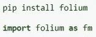*

*   *句法*

*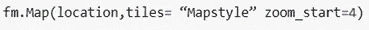*

*它需要位置的纬度和经度，并提供了地图样式所依赖的各种图块样式*

*   *标记功能:*

*库的标记功能有助于标记特定位置*

## *优势:*

*   *简单易懂的语法*
*   *标记等功能有助于进一步定制地图*
*   *使地理空间分析变得简单，因为它是地理空间分析的专用库*

*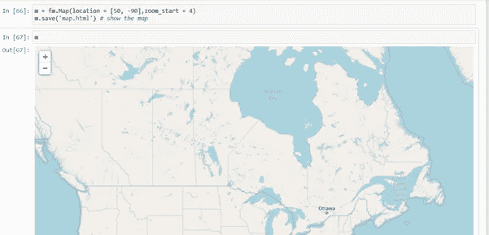*

*叶片可视化。作者的照片*

> ****结论****

*数据可视化是构建数据科学模型的最重要步骤之一。数据科学家的工作是借助数据讲述一个故事。在这个过程中使用了各种数据可视化。这是讲述一个普通人也能理解的故事的好方法。我试图在这里记下一些最有用的库，用于统计分析、缺失值和地理空间数据的数据可视化。从数据可视化开始，这是一个很好的库集。*

*我希望你喜欢这篇文章。通过我的 [LinkedIn](https://www.linkedin.com/in/data-scientist-95040a1ab/) 和 [twitter](https://twitter.com/amitprius) 联系我。*

# *推荐文章*

*1.[8 Python 的主动学习见解收集模块](/8-active-learning-insights-of-python-collection-module-6c9e0cc16f6b?source=friends_link&sk=4a5c9f9ad552005636ae720a658281b1)
2。 [NumPy:图像上的线性代数](/numpy-linear-algebra-on-images-ed3180978cdb?source=friends_link&sk=d9afa4a1206971f9b1f64862f6291ac0)3。[Python 中的异常处理概念](/exception-handling-concepts-in-python-4d5116decac3?source=friends_link&sk=a0ed49d9fdeaa67925eac34ecb55ea30)
4。[熊猫:处理分类数据](/pandas-dealing-with-categorical-data-7547305582ff?source=friends_link&sk=11c6809f6623dd4f6dd74d43727297cf)
5。[超参数:机器学习中的 RandomSeachCV 和 GridSearchCV](/hyper-parameters-randomseachcv-and-gridsearchcv-in-machine-learning-b7d091cf56f4?source=friends_link&sk=cab337083fb09601114a6e466ec59689)
6。[用 Python](https://medium.com/towards-artificial-intelligence/fully-explained-linear-regression-with-python-fe2b313f32f3?source=friends_link&sk=53c91a2a51347ec2d93f8222c0e06402)
7 全面讲解了线性回归。[用 Python](https://medium.com/towards-artificial-intelligence/fully-explained-logistic-regression-with-python-f4a16413ddcd?source=friends_link&sk=528181f15a44e48ea38fdd9579241a78)
充分解释了 Logistic 回归 8。[数据分发使用 Numpy 与 Python](/data-distribution-using-numpy-with-python-3b64aae6f9d6?source=friends_link&sk=809e75802cbd25ddceb5f0f6496c9803)
9。[机器学习中的决策树 vs 随机森林](/decision-trees-vs-random-forests-in-machine-learning-be56c093b0f?source=friends_link&sk=91377248a43b62fe7aeb89a69e590860)
10。[用 Python 实现数据预处理的标准化](/standardization-in-data-preprocessing-with-python-96ae89d2f658?source=friends_link&sk=f348435582e8fbb47407e9b359787e41)**