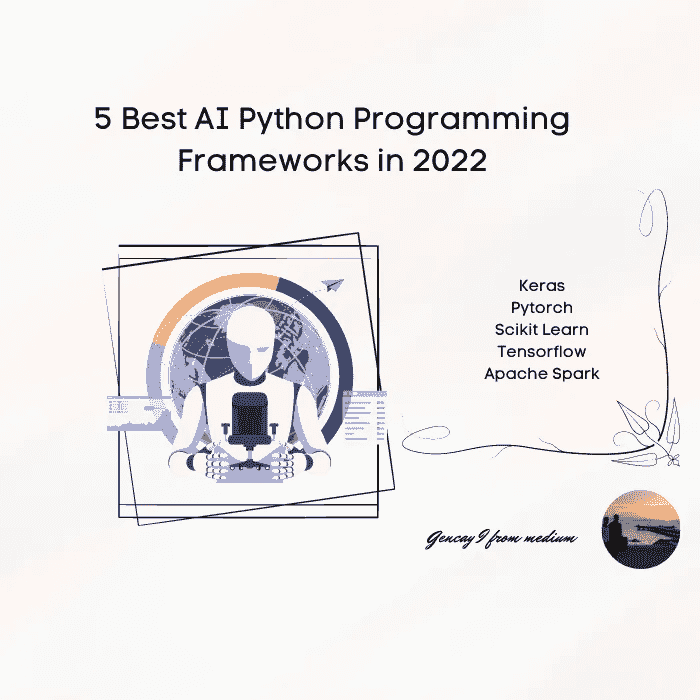
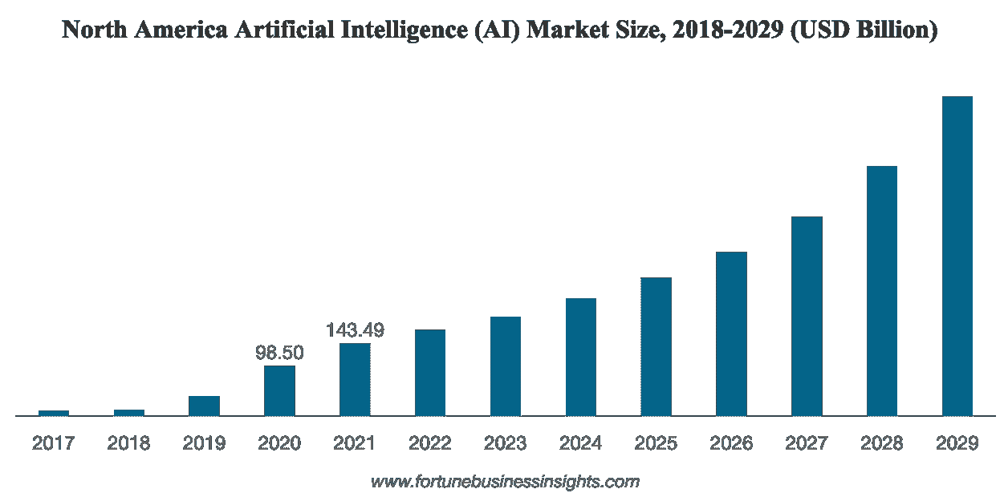
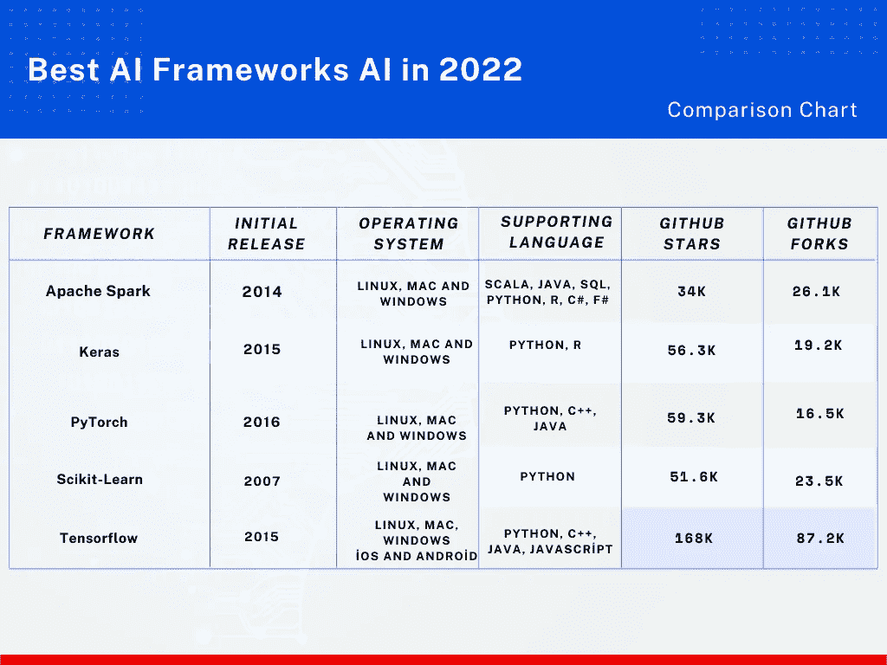
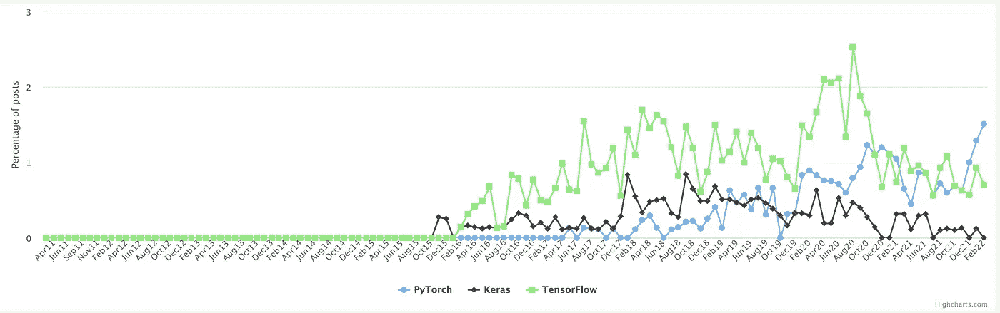
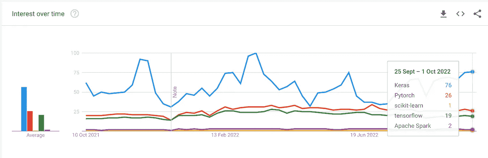

# 2022 年 5 个最佳人工智能 Python 编程框架

> 原文：<https://pub.towardsai.net/5-best-ai-python-programming-frameworks-in-2022-d94d33647e0b?source=collection_archive---------0----------------------->

## 深藏不露，相比较而言。



作者图片

# 介绍

你可能会在人工智能领域寻找职业机会。或者，你可以充满好奇，渴望学习 **AI** 。不管怎样，这篇文章正是为你而写的。像我的其他文章一样，我试图解释非常基本的概念。

> 如果你不能简单地解释它，*你理解得不够好*。
> 
> [人名]阿尔伯特·爱因斯坦(犹太裔理论物理学家)

如果你对这些概念完全陌生，不要担心这篇文章也会为你服务。

现在，让我们从**编程**语言开始。

市场上存在几种**编程**语言。

***Java，Python，R，Ruby，C，HTML。***

如果你的目标是研究 **AI** 或者打算编码，我建议你选择 Python。

你可能会问为什么？

[这里](https://medium.com/towards-artificial-intelligence/here-is-what-most-python-programmers-dont-do-f14ae321f5dc)是选择 **Python** 的主要原因。

在那些已经选择了 **Python** 的群体中，坚持和我在一起。此外，对于其他人来说，这些信息也可能是有帮助的。

如今，基于人工智能的技术频繁地进入我们的生活。

这里有一些使用 Python AI 框架发明的例子。

*   人脸识别。(脸书。)
*   语音识别。(Siri。)
*   建立推荐系统。(网飞)

但是在向您解释这些框架之前，让我向您介绍一下这些术语。

```
**Content Table**· [**Introduction**](#e529)
**·** [**What is AI?**](#ba6b) **·** [**Why AI?**](#2e01)
  ∘ [What is Python Framework?](#0613)
  ∘ [Why use these Frameworks?](#9458)
**·** [**1\. Keras**](#fd6f)
  ∘ [Features](#fb48)
**·** [**2\. Pytorch**](#5d8e)
  ∘ [Features](#b704)
**·** [**3\. Scikit-Learn**](#c989)
  ∘ [Features](#d29a)
**·** [**4\. Tensorflow**](#196f)
  ∘ [Applications](#ffd1)
  ∘ [Features](#2248)
**·** [**5\. Apache Spark**](#da0d)
  ∘ [Features](#3aec)
**·** [**Comparison Table**](#3c60) **·** [**Hiring Trends**](#47fb) **·** [**Google Trends**](#2209) **·** [**Conclusion**](#fe3b)
```

# AI 是什么？


照片由 [Hitesh Choudhary](https://unsplash.com/@hiteshchoudhary?utm_source=medium&utm_medium=referral) 在 [Unsplash](https://unsplash.com?utm_source=medium&utm_medium=referral) 上拍摄

人工智能是为复制人类智能而制造的。

有时候甚至算法的名字都来自人脑。(神经网络)

根本原因是防止重复性工作，使自动化。

使用它的框架使得基于人工智能的方法成为可能。

# 为什么是 AI？


照片由[拉兹万·苏驰](https://unsplash.com/@nullplus?utm_source=medium&utm_medium=referral)在 [Unsplash](https://unsplash.com?utm_source=medium&utm_medium=referral) 上拍摄

如今，基于人工智能的工具已经融入到行业中。

让我从《财富》商业洞察报告中给你举几个例子。

你可以点击这里的[找到他们的报告。](https://www.fortunebusinessinsights.com/industry-reports/artificial-intelligence-market-100114)

2021 年 AI 市场规模为***3283.4 亿美元。***

根据《财富》商业洞察，人工智能市场将在 2029 年达到 13943.0 亿美元*。*

*这意味着什么？*

*这意味着基于人工智能的求职者将会有很多机会。*

**

*人工智能市场规模增长— [参考](https://www.fortunebusinessinsights.com/industry-reports/artificial-intelligence-market-100114)*

## *什么是 Python 框架？*

*Python 框架是模块和函数的集合。*

*这将为用户提供一个机会，让他们可以立即使用这些功能。要做的就是导入库并使用函数。*

## *为什么要使用这些框架？*

*你可以一个一个从头开始写函数。但是有一种更简单的存在方式。这些框架将让你有机会调用预定义的函数。通过使用这些函数，您可以减少代码的长度。这样会更简单，效果更好。*

*我给你举个例子。*

*如果要[计算梯度下降](/machine-learning-checklist-cost-function-and-gradient-descent-c3fabbd0e00b)，需要 3 个函数。*

*   *价值函数*
*   *梯度函数*
*   *梯度下降函数。*

*它们中的每一个都至少包含 5-15 行代码。
另一方面，通过使用 Scikit-learn 框架，可以用 3 行代码计算梯度下降函数。*

*在人工智能领域寻找最佳 python 编程框架的呼声越来越高。在那篇文章中，5 个最好的人工智能编程框架将会呈现给你。*

*让我们跳进来。*

# *1.克拉斯*

*Keras 是 Python 中的深度学习框架。*

*它是由 Franç ois Chollet 在 2015 年开发的。*

*它可以在 Tensorflow、Theano、微软工具包等之上工作。*

*Keras 可以在 CPU 和 GPU 上运行。*

*根据 2022 [Stackoverflow 调查](https://survey.stackoverflow.co/2022/#section-most-loved-dreaded-and-wanted-web-frameworks-and-technologies)，63.55%的参与者喜欢这个框架。*

## *特征*

```
***Initial Release** : *2015***Operating Systems** : *Linux, Mac, Windows***Supporting Language :** *Python, R.***Github Statistics:** *56.3K Stars and 19.2K Forks*[**Official website**](https://keras.io/)[**Github Pages**](https://github.com/keras-team/keras)*
```

# *2.Pytorch*

*Pytorch 是脸书在 2016 年创建的一个人工智能框架。*

*它用于研究而不是生产。*

*根据 2022 [Stackoverflow 调查，](https://survey.stackoverflow.co/2022/#section-most-loved-dreaded-and-wanted-web-frameworks-and-technologies) %68.29 的与会者喜欢这个框架。*

## *特征*

```
***Initial Release :** *2016***Operating Systems :** *Linux, Mac, Windows***Supporting Language :** *Python, C++, Java***Github Statistics :***59.3K Stars and 16.5K Forks*[**Official Website**](https://pytorch.org/)[**Github Pages**](https://github.com/pytorch/pytorch)*
```

# *3.sci kit-学习*

*它是由 David Cournapeau 在 2007 年作为谷歌夏季项目开发的。*

*Scikit-learn 支持使用其他流行的框架。
(数字，科学)*

*根据 2022 [Stackoverflow 调查](https://survey.stackoverflow.co/2022/#section-most-loved-dreaded-and-wanted-web-frameworks-and-technologies)，65.53%的参与者喜欢这个框架。
它是名单上最古老的框架。*

## *特征*

```
***Initial Release :** *2007***Operating Systems :** *Linux, Mac, Windows***Supporting Language:** *Python***Github Statistics :** *51.6K Stars and 23.5K Forks***Official** [**Website**](https://scikit-learn.org/)[**Github**](https://github.com/scikit-learn/scikit-learn) **page.***
```

# *4.张量流*

*[Tensorflow](https://www.tensorflow.org/) 是谷歌在 2015 年开发的。它有非常广泛的社区。(最大，查看 [GitHub](https://github.com/tensorflow/tensorflow) 统计。)
支持多种操作系统。您甚至可以从移动设备访问 TensorFlow。*

*根据 2022 S [tackoverflow 调查](https://survey.stackoverflow.co/2022/#section-most-loved-dreaded-and-wanted-web-frameworks-and-technologies)，60.06%的与会者喜欢这个框架。
可以在 CPU 或者 GPU 上使用。意思是见效快。*

## *应用程序*

## *特征*

```
***Initial Release :** *2015***Operating System :** *Linux, Mac, Widows, Android and iOS.***Supporting Language :** *Python, C++, Java, Javascript***Github Stats :** *168K Stars and 87.2K Forks*[**Official Website**](https://www.tensorflow.org/)[**Github Pages**](https://github.com/tensorflow/tensorflow)*
```

# *5.阿帕奇火花*

*Apache Spark 是由加州大学伯克利分校在 2009 年开发的。*

*MLlib 是 Apache Spark 的可扩展机器学习库。*

*上映日期是 2014 年。*

*它受到各种编程语言的支持。
它可以与 Hadoop 工作流协同工作。*

*根据 2022 [Stackoverflow 调查](https://survey.stackoverflow.co/2022/#section-most-loved-dreaded-and-wanted-web-frameworks-and-technologies)，60.27%的参与者喜欢这个框架。*

## *特征*

```
***Initial Release *:*** *2014***Operating Systems*:*** *Linux, Mac, Widows,***Supporting Language*:*** *Scala, Java, SQL, Python, R, C#, F#***Github Statistics*:*** *34K Stars and 26.1K Forks*[**Official Website**](https://spark.apache.org/mllib/)[**Github Page**](https://github.com/apache/spark)*
```

# *对照表*

*我给了你关于框架的必要信息，但是，看到大的图片可能会帮助你。*

*为此，我设计了一个对照表。关于设计，我不是专业人士。所以对我手下留情。*

*你可以把所有的特征放在一起比较。*

**

*2022 年最佳人工智能框架——由 Canva Pro 设计*

# *招聘趋势*

*不幸的是，我在列表中找不到 Scikit-learn 或 spark。*

*所以我比较了 Pytorch，Keras 和 Tensorflow*

*这里是[网站。](https://www.hntrends.com/2022/march.html?compare=Keras&compare=TensorFlow&compare=PyTorch&compare=)*

*从 2016 年 2 月到 2021 年 11 月，Tensorflow 在三者中拥有最高评级的编程框架。*

*看起来，Pytorch 在 2021 年 11 月胜过了 TensorFlow。*

*在这些图书馆中，Keras 看起来是雇用率最低的。*

**

*深度学习图书馆 2022 年招聘趋势- [参考](https://www.hntrends.com/2022/march.html?compare=Keras&compare=TensorFlow&compare=PyTorch&compare=spark+mlib)*

# *谷歌趋势*

*另一个有用的比较工具是谷歌趋势。*

*   *蓝色是 Keras*
*   *红色是 Pytorch*
*   *黄色是 Scikit-learn*
*   *绿色是张量流*
*   *紫色是阿帕奇火花*

**

*作者图片*

# *结论*

*在本文中，我首先尝试描述这些概念。*

*然后是 5 个最好的人工智能编程框架。*

*我会给你提供所有的链接。所以你可以自己对比一下。*

*人工智能被告知它来自太空。这不是火箭科学。*

*学习人工智能可能比你想象的要容易。*

*如果你想从事人工智能领域的职业或者收集信息，就像这样。*

*你可以在这里订阅我[](https://gencay.ck.page/)**。***

**我会努力为你创造有用的材料。**

**比如项目的源代码或者备忘单。**

**感谢阅读我的文章。**

****如果你想要那篇文章的源代码，在这里** **订阅我的电子邮件列表** [**，我会通过电子邮件把那篇文章的 Jupyter 笔记本发给你。**](https://gencay.ck.page/billionaire)**

**我倾向于每周发送 1 到 2 封电子邮件，如果你也想要一份免费的电子邮件，这里有你的链接！**

*****如果你还不是中的一员，渴望通过阅读来学习，这里是我推荐的*** [***链接。***](https://medium.com/@geencay/membership)**

> **“机器学习是人类需要创造的最后一项发明。”尼克·博斯特罗姆**