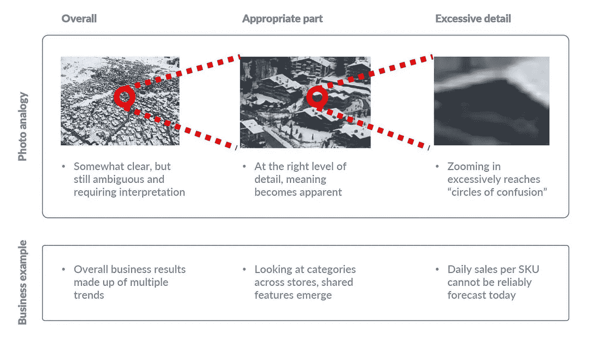
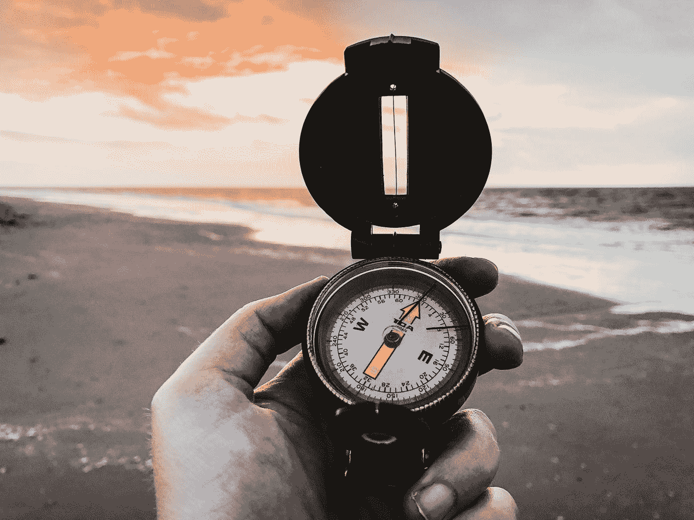
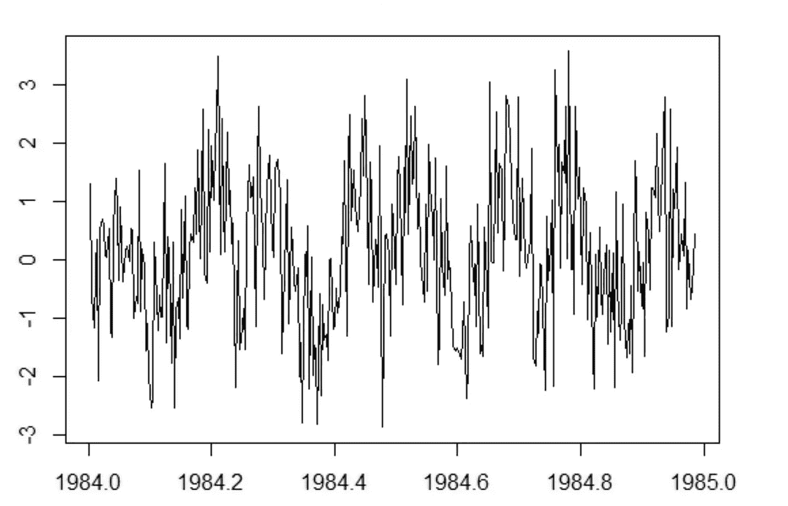
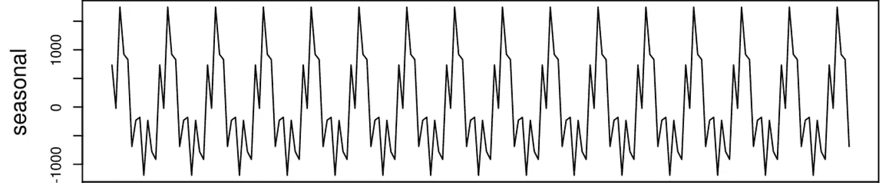
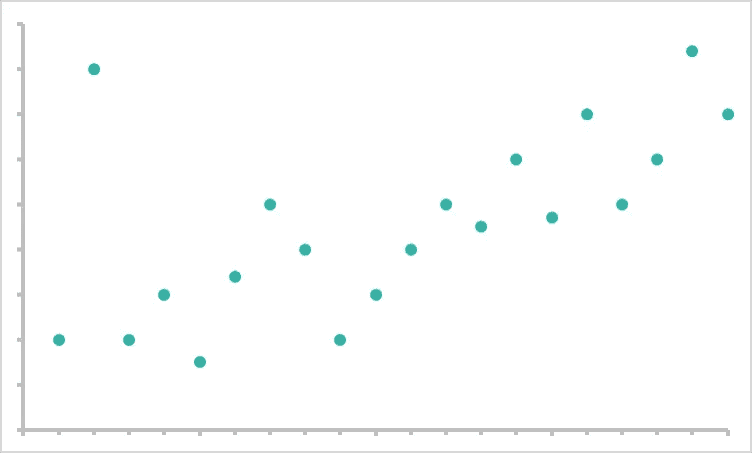
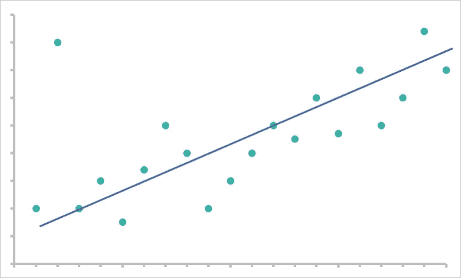
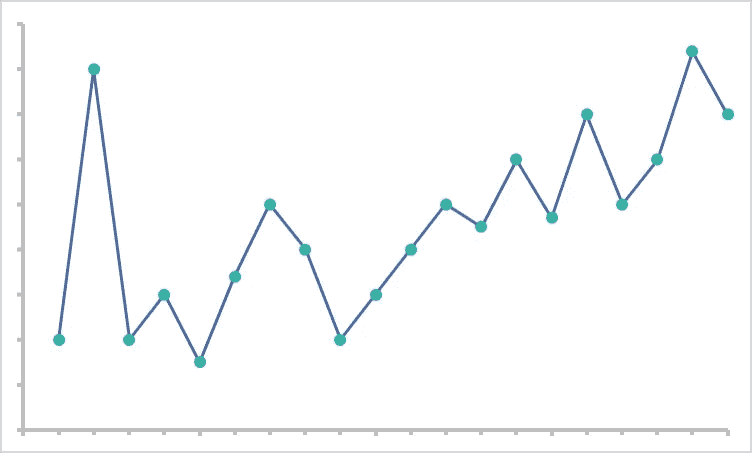
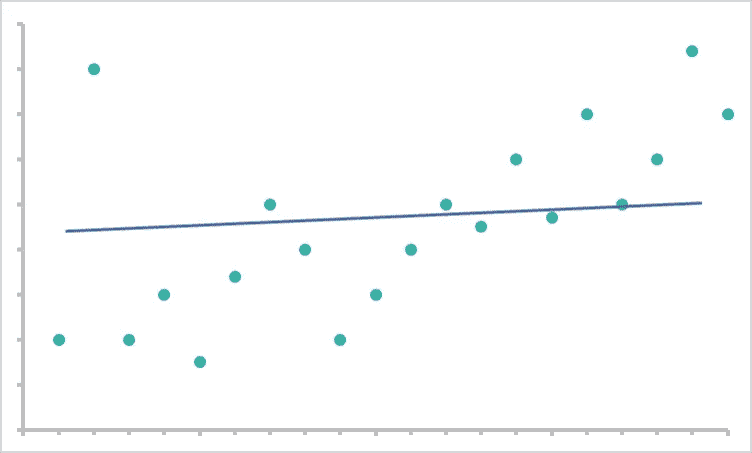
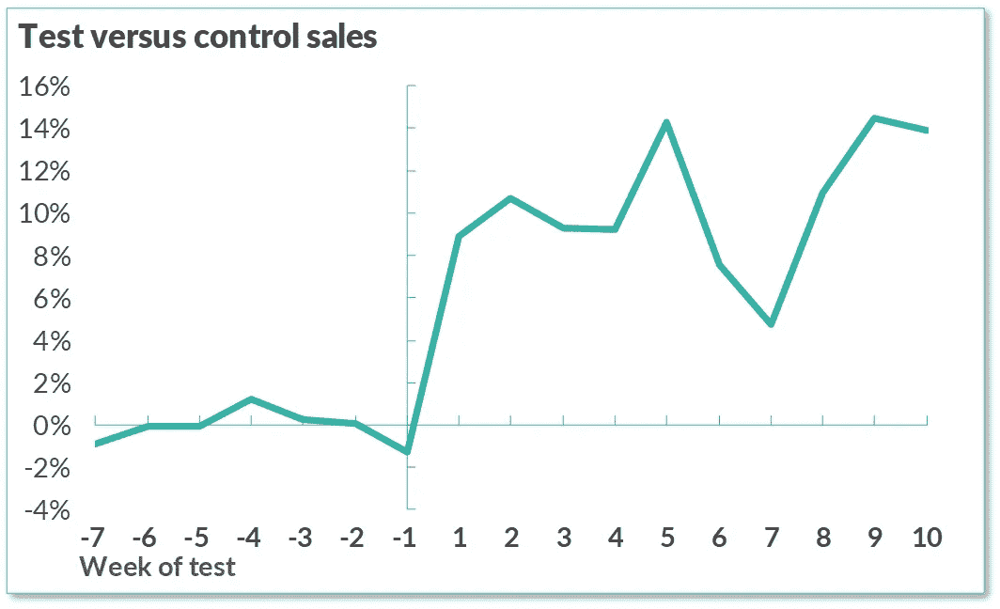
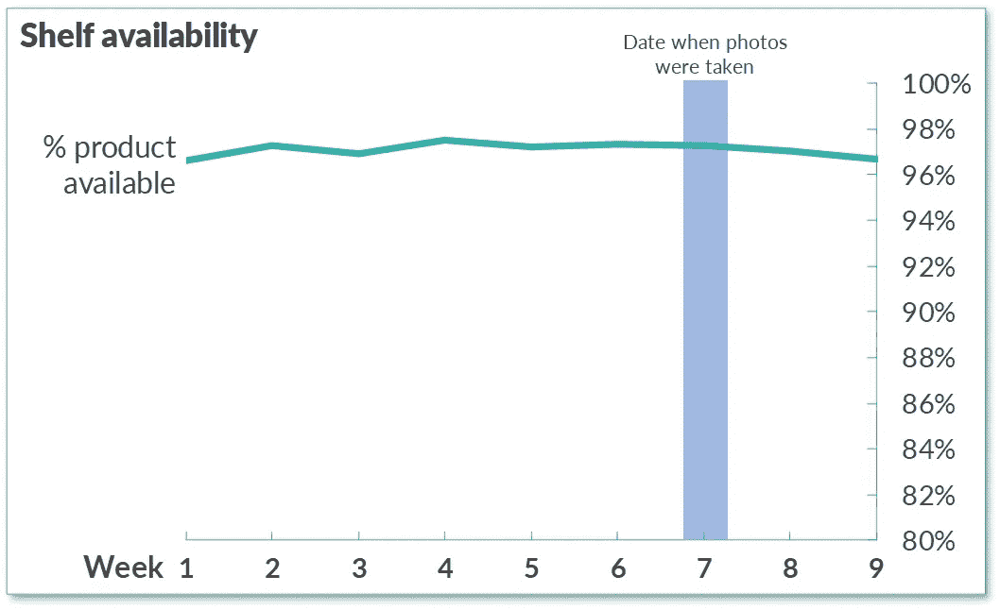

# 可能让您付出代价的 5 个数据粒度错误

> 原文：<https://pub.towardsai.net/5-data-granularity-mistakes-that-may-cost-you-df5f718ad88f?source=collection_archive---------2----------------------->

## [商业科学](https://medium.com/tag/business-science)，[数据科学](https://towardsai.net/p/category/data-science)

## 为了获得最大回报，您应该多仔细地查看您的数据？


照片由[山姆拍摄🐷](https://unsplash.com/@shambam?utm_source=medium&utm_medium=referral) on [Unsplash](https://unsplash.com?utm_source=medium&utm_medium=referral)

大数据时代，挑战不再是访问足够多的数据；**挑战在于找出正确的数据来使用**。在过去的一篇文章中，我关注了替代数据的价值，这是一项重要的商业资产。然而，即使有替代数据的好处，错误的数据粒度也会破坏数据驱动管理的 ROI。

> *“我们对数据如此着迷，以至于忘记了如何解读它”。— Danah Boyd，微软研究院首席研究员*

那么，你应该多仔细地观察你的数据呢？因为错误的数据粒度可能会让您付出超乎想象的代价。

# 了解数据粒度

简单来说，[数据粒度](https://www.techopedia.com/definition/31722/granular-data)是指我们数据的详细程度。数据越细，特定数据点包含的信息就越多。衡量一个国家中所有商店的年交易量的粒度很低，因为您对客户在何时何地购买这些商品知之甚少。另一方面，以秒为单位来衡量单个商店的交易会有非常高的粒度。

理想的数据粒度取决于您正在进行的[类型的分析](https://papers.ssrn.com/sol3/papers.cfm?abstract_id=3453170)。如果你正在寻找几十年来消费者行为的模式，低粒度可能是好的。然而，要实现商店补货的自动化，您需要更精细的数据。


Artem Beliaikin 在 [Unsplash](https://unsplash.com?utm_source=medium&utm_medium=referral) 拍摄的照片

当你为你的分析选择了错误的粒度，你最终会得到不太准确和[不太有用的情报](https://www.sisense.com/blog/7-data-modeling-mistakes-that-can-sink-your-analysis/)。想想看，仅基于年度全系统数据的每周商店补货会有多混乱！你会不断经历库存过剩和缺货，在这个过程中积累了巨大的成本和高水平的浪费。在任何分析中，错误的数据粒度都会对您的效率和底线产生类似的严重后果。

那么，您是否为您的商业智能使用了正确的数据粒度呢？以下是五个常见的代价高昂的数据粒度错误。

# 1.将多个业务趋势分组到一个模式中(当数据不够精细时)。

商业智能需要清晰、直截了当才能付诸行动，但有时为了实现简单性，人们没有足够深入地研究数据[。这很遗憾，因为你将错过有价值的见解。当数据粒度太低时，您只能看到浮出水面的大模式。您可能会错过关键数据。](https://www.isixsigma.com/tools-templates/measurement-systems-analysis-msa-gage-rr/proper-data-granularity-allows-stronger-analysis/)

在太多的情况下，没有仔细观察你的数据会导致把不同的趋势压缩成一个单一的结果。犯这种错误的企业最终会得到不均衡的结果。他们更有可能有不符合整体模式的不可预测的极端异常值——因为这种模式不能反映现实。

这是很多传统供应链预测系统的通病。他们无法处理预测单个商店的 SKU 级需求所需的粒度级别，这意味着一个商店可能会同时处理库存过剩和缺货。由人工智能驱动的自动化系统可以处理正确分割数据所需的复杂性，这是这些系统提高供应链效率的一个原因。足够的数据粒度对于更准确的商业智能至关重要。



作者提供的图片(抄送并注明出处)

# 2.迷失在没有焦点的数据中(当数据太细时)。

你有没有在网上不小心把地图放大得太远？太让人沮丧了！你看不出任何有用的信息，因为没有上下文。数据也是如此。

如果你的数据太细，你会迷失方向；你无法集中精力在所有无关的数据中找到有用的模式。当涉及到数据时，很容易觉得越多的细节越好，但是太多的细节会让你的数据变得毫无用处。面对如此多的数据，许多高管发现自己被[分析瘫痪](https://www.forbes.com/sites/forbestechcouncil/2020/01/15/dont-make-these-14-common-big-data-mistakes-at-your-business/#5d8ef0433ca8)所冻结。你最终得到的是不可靠的推荐、缺乏商业背景和不必要的混乱。



由[丹尼斯·简斯](https://unsplash.com/@dmjdenise?utm_source=medium&utm_medium=referral)在 [Unsplash](https://unsplash.com?utm_source=medium&utm_medium=referral) 上拍摄的照片

当涉及到人工智能预测时，过于精细的数据是一个代价特别高的错误。这些数据可能会欺骗算法，使其表明它有足够的数据来对未来做出假设，而这在今天的技术下是不可能的。例如，在我在 Evo 的供应链工作中，仍然不可能预测每个 SKU 的日销售额。你的误差幅度会太大而没有用。这种粒度级别破坏了目标，降低了投资回报率。

# 3.没有有目的地选择时间变量的粒度。

最常见的数据粒度错误与时间间隔有关，即每小时、每天、每周、每年等测量变量。基础。为了方便起见，经常会出现时间粒度错误。大多数公司都有报告时间变量的标准方法。感觉要改变他们需要太多的努力，所以他们没有。但是这很少是解决所分析问题的理想粒度。

当您权衡改变系统报告 KPI 的方式的成本与持续获得不充分的商业智能的成本时，[有目的地选择正确粒度寄存器的好处](https://hbr.org/2011/12/know-what-your-customers-want-before-they-do)。根据时间的粒度，你会从相同的数据中识别出非常不同的见解。以零售业的季节性趋势为例。查看一天的交易可能会使季节性趋势变得不可见，或者至少包含太多的数据，以至于模式只是白噪声，而月度数据共享一个你实际上可以使用的独特序列。如果标准 KPI 跳过月度报告，直接进入季度模式，您将失去使预测更加准确的宝贵见解。如果你想获得最好的情报，你不能从表面上看时间粒度。



每日季节性(来源:[http://r-tutorials . com/r-exercises-41-50-working-time-series-data/](http://r-tutorials.com/r-exercises-41-50-working-time-series-data/))



每年的季节性(来源:【https://commons.wikimedia.org/】T2

# 4.过度拟合或欠拟合你的模型，以至于你看到的模式毫无意义。

人工智能模型需要从现有和未来的数据中进行很好的归纳，以提供任何有用的建议。本质上，一个好的模型可以查看这些数据:



作者提供的图片(抄送并注明出处)

假设这是一个基于信息的工作模型:



作者提供的图片(抄送并注明出处)

该模式可能无法完美地代表数据，但它在预测典型行为方面做得很好，而且不会牺牲太多智能。

但是，如果没有正确的数据粒度，最终可能会得到错误的模型。正如我们之前所讨论的，过度粒度化的数据可能会产生噪音，从而难以找到模式。如果您的算法始终以这种嘈杂的细节水平进行训练，它将依次传递噪声。你最终得到的模型是这样的:



作者提供的图片(抄送并注明出处)

我们称之为过度适应你的模型。每一个数据点都有巨大的影响，以至于该模型不再能有效地概括。最初由高粒度引起的问题被放大，并成为模型中的永久问题。

过低的数据粒度也会对您的模型造成长期损害。一个算法必须有足够的数据来发现模式。使用没有足够粒度的数据训练的算法将错过关键模式。一旦算法超越了训练阶段，它将继续无法识别相似的模式。你最终得到的模型是这样的:



作者提供的图片(抄送并注明出处)

这是对模型的欠拟合。该算法接近做出正确的预测，但它们永远不会像它们本来可以做到的那样准确。和过拟合一样，它是初始粒度问题的放大。

当您为您的分析创建一个模型时，适当的粒度变得比您拥有一个稳定的算法时更加重要。为此，许多公司选择将这部分流程外包给专家。这是一个太微妙和昂贵的错误阶段。

# 5.完全调整不正确数据的粒度。

也许最昂贵的数据粒度错误仅仅是过于关注优化您当前度量的 KPI 的粒度，以至于您没有意识到它们完全是错误的 KPI。我们的目标是实现正确的数据粒度，而不是优化任何特定的 KPI 性能，而是识别数据中的模式，从而提供可操作的、有价值的见解。例如，如果你想增加收入，你可能会因为只关注价格模式而破坏你的成功。还涉及到其他因素。

举个我同事的例子[。一个新的 Evo 客户想要增加销售额，应用我们的供应链工具进行的初步测试显示，在不到两周的时间内，销售额提高了 10%。我们的](https://towardsdatascience.com/expensive-data-science-mistakes-when-your-kpis-lie-ca3df94333dd)[首席执行官](https://fab-evo.medium.com/)对这些前所未有的结果兴奋不已，但令他惊讶的是，供应链经理并没有被打动。他的主要 KPI 是产品可用性，根据内部数据，这一点从未改变。他专注于改进特定的 KPI，但却牺牲了从其他数据中获得有价值的见解。



测试新的供应链系统(图片由[法布里吉奥·范蒂尼](https://fab-evo.medium.com/)拍摄)



测试后的产品可用性(图片由 [Fabrizio Fantini](https://fab-evo.medium.com/) 提供，CC 注明出处)

不管 KPI 是否被准确地衡量，完全专注于改变其绩效会阻碍这位经理看到新方法的价值。他是一个真诚行事的聪明人，但数据误导了他——这是一个极其常见但代价高昂的错误。正确的数据粒度至关重要，但它本身并不是目标。你必须着眼于更大的图景，以最大化你从人工智能中获得的回报。如果您一开始就没有正确的数据，那么您如何仔细查看您的数据就没有任何意义。

> *“数据驱动管理的一个常见谬误是使用错误的数据来回答正确的问题”。Evo 的创始人兼首席执行官 Fabrizio Fantini*

# 正确的数据粒度的好处

谈到数据粒度，没有灵丹妙药。你必须小心谨慎地选择它，以避免这些和其他不太常见的错误。从数据中获得最大回报的唯一方法是批判性地看待数据，通常是在数据专家的帮助下。您可能不会在第一次尝试时就获得正确的粒度，所以您需要测试和调整，直到它完美为止。

不过，这是值得努力的。仔细观察，但不要太仔细，您的数据可以确保最佳的商业智能。经过正确的分段和分析，数据将转化为您可以信赖的竞争优势。

非常感谢 Kaitlin Goodrich。

**想阅读 Evo 的所有商业科学知识吗？**

[](https://towardsdatascience.com/learn-the-secret-psychology-of-price-5d4885695fda) [## 了解价格的秘密心理

### 设计最佳价位和促销的 5 个战略问题

towardsdatascience.com](https://towardsdatascience.com/learn-the-secret-psychology-of-price-5d4885695fda) [](https://towardsdatascience.com/fashion-is-broken-science-is-fixing-it-b771b1ab5b59) [## 时尚被打破了。科学正在修复它

### 转变 5 个核心时尚流程

towardsdatascience.com](https://towardsdatascience.com/fashion-is-broken-science-is-fixing-it-b771b1ab5b59) 

```
Monthly summary of Business Science, plus free software and University-level learning launching October 2020:[Free access to the Evo Business Science platform](https://evouser.com/register)Any questions? Please follow Evo and reach out on [Linkedin](https://www.linkedin.com/company/evo-pricing)
```