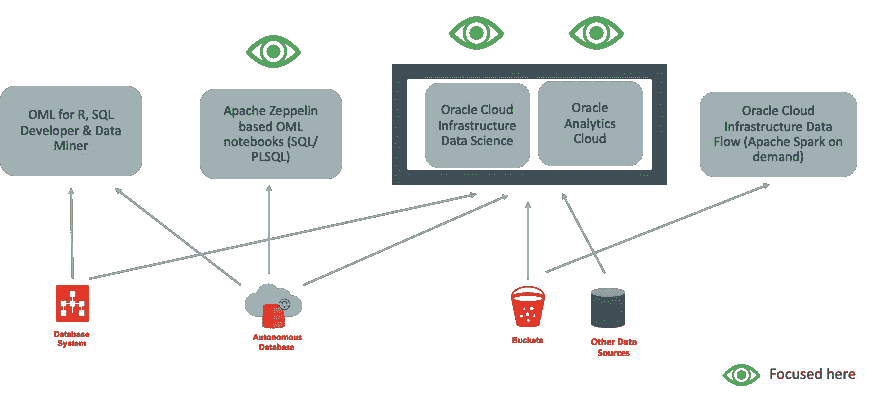
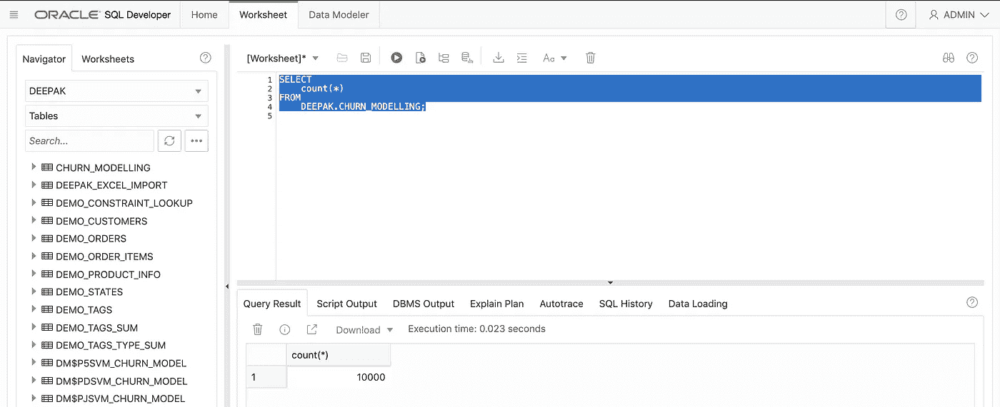

# 构建 ML 模型的 5 种不同方法！

> 原文：<https://pub.towardsai.net/5-different-ways-to-build-ml-models-138bf611245f?source=collection_archive---------4----------------------->

我们遇到了面向拥有 Python/ R/ Matlab 的专家受众的数据科学平台和 ML 产品..etc 技能和谁了解算法/内核..等等。

但是，如果非常了解数据但不具备专业技能的人也需要探索 AI/ ML 世界，该怎么办？

在 Oracle 世界中构建 ML 模型的 5 种方法是

*   甲骨文云基础设施数据流—[https://www.oracle.com/big-data/data-flow/](https://www.oracle.com/big-data/data-flow/)
*   甲骨文分析云(OAC)—[https://www . Oracle . com/au/business-Analytics/Analytics-Cloud . html](https://www.oracle.com/au/business-analytics/analytics-cloud.html)
*   甲骨文机器学习(OML)-[https://www . Oracle . com/database/technologies/data warehouse-big data/Machine-Learning . html](https://www.oracle.com/database/technologies/datawarehouse-bigdata/machine-learning.html)
*   Oracle 自治数据库—[https://www.oracle.com/au/database/autonomous-database.html](https://www.oracle.com/au/database/autonomous-database.html)
*   甲骨文云基础设施数据科学—[https://www . Oracle . com/Data-Science/Cloud-infra structure-Data-Science-product . html](https://www.oracle.com/data-science/cloud-infrastructure-data-science-product.html)

在本文中，我们将看到如何使用相同的数据源以 3 种不同的方式构建一个二元分类模型。基于兴趣(中等掌声)，我将扩展这篇文章，以包括其他 2 种方式

## ***数据源— Oracle 自治数据库***

## ***二元分类 ML 模型使用:***

1.  在 Oracle 数据库中使用 SQL/ PLSQL(在数据库中构建并在数据库中执行—移动代码而不是数据)
2.  使用 Oracle 分析云(构建分析和可视化数据的环境— BI/ Viz)
3.  使用 Oracle 云基础架构数据科学(在专用数据科学环境中构建)

**使用 Apache Zeppelin 笔记本在 Oracle 自治数据库中使用 SQL/PLSQL**

**使用 Oracle 分析云**

**使用 Oracle 云基础设施数据科学**

我在下面的文章中提到了这一点

 [## 数据科学中三件重要的事情——什么？怎么会？为什么？

### 在我之前的文章中…

medium.com](https://medium.com/@deepaksekar_67405/three-things-that-matter-in-data-science-what-how-why-614bdccdfd8a) 

欢迎来到数据科学的世界！

如果你喜欢这篇文章，请不要忘记鼓掌

所表达的观点仅代表作者的观点，不一定代表甲骨文的观点。联系方式[迪帕克·塞卡尔](https://medium.com/u/73b0ba580367?source=post_page-----9b17dd554bf3----------------------)

## **附加参考**

[https://www . Oracle . com/database/technologies/data warehouse-big data/machine-learning . html](https://www.oracle.com/database/technologies/datawarehouse-bigdata/machine-learning.html)

[https://www . Oracle . com/database/technologies/advanced-analytics/ODM-techniques-algorithms . html](https://www.oracle.com/database/technologies/advanced-analytics/odm-techniques-algorithms.html)

[https://docs . cloud . Oracle . com/en-us/iaas/data-science/using/data-science . htm](https://docs.cloud.oracle.com/en-us/iaas/data-science/using/data-science.htm)

[https://www . Oracle . com/data-science/cloud-infra structure-data-science-product . html](https://www.oracle.com/data-science/cloud-infrastructure-data-science-product.html)

[https://docs . cloud . Oracle . com/en-us/iaas/tools/ads-SDK/latest/user _ guide/overview/overview . html](https://docs.cloud.oracle.com/en-us/iaas/tools/ads-sdk/latest/user_guide/overview/overview.html)