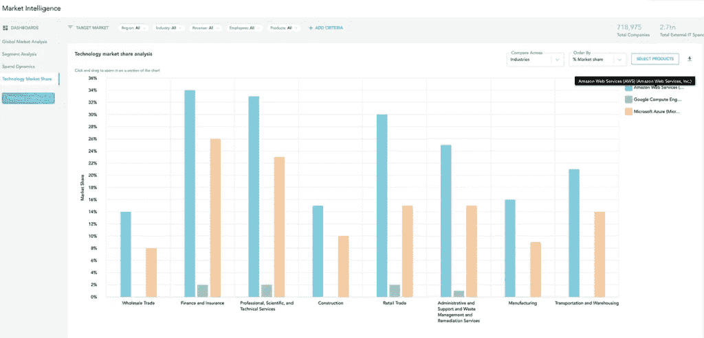
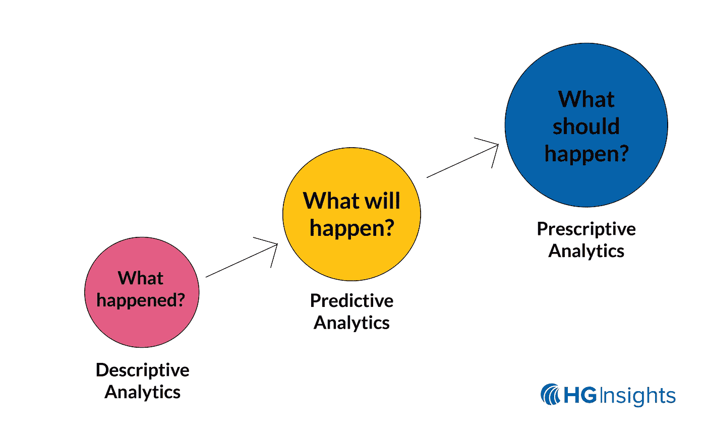

# 来自数据科学前沿的 5 种见解

> 原文：<https://pub.towardsai.net/5-insights-from-the-cutting-edge-of-data-science-c5d105c256e?source=collection_archive---------5----------------------->

## [数据科学](https://towardsai.net/p/category/data-science)

在接下来的两年里，观察形势如何发展将是一件有趣的事情。钟摆会摆多远，接下来会摆在哪里？

在我 25 年的商业[软件和工程经验](https://www.linkedin.com/in/robertjfox/)中，我领导过行业领先组织的团队，比如 [MuleSoft](http://mulesoft.com) (现在的 [Salesforce](http://salesforce.com) )和 Liaison Technologies(现在的 [OpenText](https://www.opentext.com/) )。

我看到这个行业取得了巨大的进步。

现在，作为 HG Insights 的 [CTO，我开始在数据科学的前沿工作。我想分享我在最近一次关于数据和见解的采访](http://hginsights.com)中的见解[,以及在独特的技术上申请专利是如何确保在未来几年继续主导智能领域的。](https://hginsights.com/technology-ensures-credibility-and-market-dominance/)

## 1.Rob，在 2021 年，我们的数据多得不知道该如何处理。99.5%的[收集数据仍未使用](https://www.oracle.com/webfolder/s/assets/infographics/build-data-lakes/index.html) —这意味着 0.5%的数据是可操作的见解。数据如何变成洞察，又是什么让洞察变得可操作？

对于大多数企业来说，将数据转化为可操作的见解是不可能的，因为他们缺乏基础设施、专业知识、关注点，并且无法将正确的数据转化为可操作的见解。这样想一想:

# 我们都需要燃料来开动汽车，但我们通常不会自己制造燃料。洞察力是企业的燃料。

我们工作的独特之处在于我们收集的数据量和我们实际丢弃的数据量。我们的流程每月会清理、[重复数据删除、](https://docs.microsoft.com/en-us/windows-server/storage/data-deduplication/overview)并准备数十亿份文档，我们还会收集更多的数字内容，以便在挖掘之前找出哪些内容可能具有可操作的见解。还原过程与采矿和提炼一样重要。

我们洞察力的质量也是独一无二的。虽然我们每月挖掘数十亿个客户可消费的数据点，但并不是所有数据都符合标准。我们对这些经验数据点的质量有很高的要求——我们数据的精确度达到 90%或更高。归根结底，只有当它为我们的客户带来投资回报时，它才是真知灼见。如果质量低，那么我们就不能推动客户价值。这就是为什么我们关注洞察力的质量而不是数量。

我们通过积累大量数据，将数据转化为见解，对其进行提炼，并以一种客户可以通过我们的产品和服务轻松消费的方式进行转换。我们的见解旨在推动客户价值，让他们尽可能轻松地实现投资回报最大化。

## 我们帮助客户筛选[数据的巨大噪音，聚焦于正确的信号](https://www.linkedin.com/pulse/big-data-retrospective-prospective-hg-datas-cto-robert-fox/)。

## 2.作为首席技术官，您如何不断创新 HG Insights 的解决方案，以跟上客户的新需求和行业的发展步伐？

我首先会问这样的问题:“*你的公司为什么存在？*”或者，“*你希望自己有什么问题的答案，能让你的企业获得巨大成功？*“这给了我思考如何帮助顾客满足个人需求的动力。

事实是，客户和他们部署的解决方案变得越来越复杂。当 HG Insights 成立时，我们专注于为客户提供公司使用的技术的详细信息。这是我们“荒谬的不公平优势”，我们帮助公司推动更有效的销售和营销计划，以增加转化率。我们是大规模提供这种洞察力的先驱，现在仍然如此，因为我们坚持不懈地寻找新的方法，为客户提供日益复杂的问题的答案。

在更大的层面上，我们投资创新。几年前，[首席执行官伊丽莎白·乔罗斯基](https://www.linkedin.com/in/elizabethcholawskyphd)和我启动了一个新项目“CoreIP”，对创新进行再投资。我们的明确目标是改善我们的数据和见解，并为市场带来新的见解。作为该计划的一部分，我们启动了一项专利计划来帮助培养创新理念，我们已经申请了四项专利，还有几项正在申请中。

我们相信我们有责任在这个领域继续创新和领先，同时保持我们的质量承诺。

HG 对市场趋势和竞争对手的深刻见解使您能够确认对您产品的需求，并确定您 GTM 机会的大小。

## 3.你能告诉我们更多关于专利计划、已经申请的四项专利，以及它们如何定位你在技术情报领域的地位吗？

我们引入了发明计划，作为在整个公司培养协作环境的一种方式。我们鼓励团队参与我们所有的产品，并给我们提供如何改进和扩展它们的想法——或者提出一些全新的东西。

除此之外，我们已经申请了四项新专利。最近一项专利的一个例子是一种新的和新颖的方法，在文本中进行命名实体解析，以帮助我们更好地消除歧义和辨别含义。这里有一个例子:假设你有一个提到“Google”这个词的文档。现在我们剩下的问题是:这份文件是指整个公司的谷歌，还是只是一个特定的产品？它是谷歌云平台(GCP)的简称吗？还是指 Google Workspace(原 G Suite)？在我们的世界里，背景意味着一切。

像这样的工具提高了我们数据的精确度和整体覆盖率，从而提高了我们客户的投资回报率。这只是我们利用无与伦比的数据的许多新专利和计划之一。

> "我总是说商业预测在产生结果之前是没有价值的."

## 4.有哪些我们可能不知道的潜在数据应用/用例？其他行业会从你的数据中受益吗？

我们坐拥丰富的信息。由于我们拥有来自数百万家企业的数千种技术的数据和见解，我们经常将这些数据和见解结合起来，创造出新的东西。例如，我们将已经挖掘的见解与新的数据点或实验分析相匹配，以创建新的、可操作的见解。

从总体上看，这导致了两种发明:

*   挖掘数据的新技术或新机器:例如，[的一项新技术的专利命名实体解析](https://nlp.cs.nyu.edu/sekine/papers/li07.pdf)
*   来自挖掘数据的新颖见解:例如，预测技术购买行为的机器学习模型的专利

我们不断尝试我们洞察力的各种新应用——从尝试确定技术采用情况，一直到部门和位置级别，将意图数据置于背景中，分析经销商/顾问对特定供应商或技术的忠诚度，到识别新兴/突破性技术供应商和产品。

这意味着帮助客户从大量数据中筛选出合适的信号。尽管我们主要关注 B2B 供应商领域的技术，但我们构建的一切都足够通用，可以应用于金融服务、医疗保健等其他行业。

## 5.最后，“预测”是数据/大数据领域经常使用的一个词，您在预测分析领域的地位如何？

如果没有人相信你的预测或者理解为什么会做出这样的预测，那你就有问题了。

这就是认知 AI 背后的思维。我是认知人工智能的大力支持者，不仅在做出预测方面，而且在向客户展示为什么会做出预测方面。为了说明我的观点:

我们通常为客户做的事情之一是创建一个[基于技术的倾向模型](https://hginsights.com/master-class-recap-how-propensity-modeling-can-accelerate-revenue-growth/)或[理想客户档案](https://hginsights.com/resources/discover-your-true-ideal-customer-profile-icp/)。这是 HG Insights 独特价值的一部分。但我们不只是告诉他们应该瞄准哪些客户，我们还告诉他们为什么。当你向客户展示为什么做出预测时，你就建立了可信度。有太多的黑箱疲劳。将人脑与人工智能预测联系起来是认知人工智能的核心。

在我的下一篇文章中，我将写关于规定性分析，以及如何让它们为你工作！

# *感谢阅读！*

# 关于我

我有超过 25 年的商业软件和工程经验，强大的分析技能，以及广泛的一般工业和商业知识。我曾在 MuleSoft(现在的 Salesforce)和 Liaison Technologies(现在的 OpenText)等行业领先的组织中领导过工程团队。

我专门研究所有与数据相关的东西，包括分析、数据科学、集成、管理、安全、API 管理以及 B2B、EAI、云和大数据等领域的专业知识。